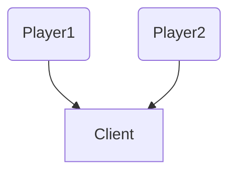
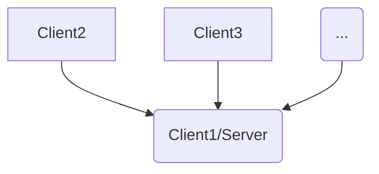
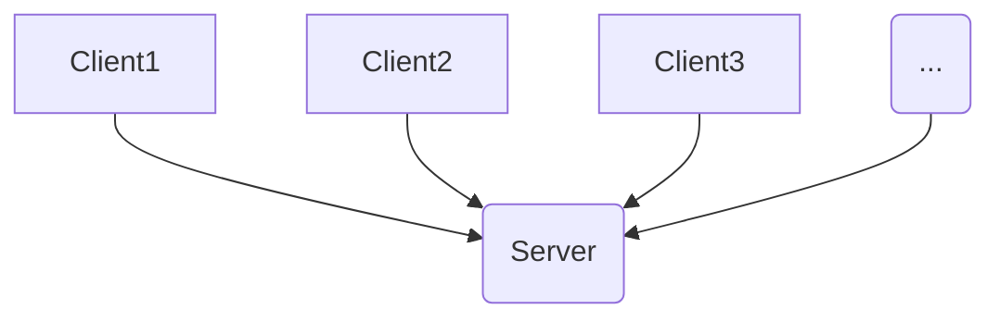
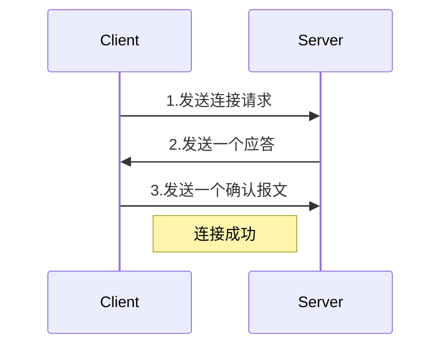
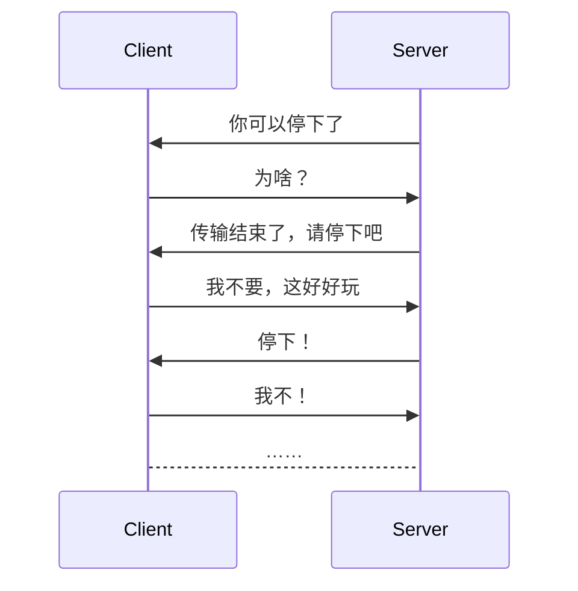

> Mirror是uMMORPG、vival和Cubica的开发人员为MMO规模的网络而构建和测试的。
>
> Mirror使联网变得容易，简洁和可维护。使用少于6000行代码即可实现uMMORPG。我们只需要一个网络库来启动我们的游戏就可以了。

## 多人游戏入门

在开始之前，必须先大致了解多人游戏和网络通信的原理，这样才能更方便我们理解后续的代码行为。

### 多人游戏模式的演变

#### 单机双人游戏

最原始的多人游戏从双人游戏开始，叫上隔壁邻居和小伙伴到自家客厅，排队轮流游戏。



这种方式的优点在于**无延迟**，道理很简单，因为游戏客户端只有一个，代码只在一个客户端运行，所有的游戏行为是完全同步的。

而缺点也显而易见，那就是**地域要求高**，我们必须在同一屋檐下才能s进行游戏，甚至必须在同一个房间内。

直到后来出现了局域网游戏。


#### 局域网游戏

局域网游戏很大程度解放了对于玩家的地域要求。



游戏的方式就是让某个玩家创建一个游戏房间，这台客户端也就成为了**服务端**，只要处于同一IP地址的客户端都可以连接到这服务器，在多台设备中进行多人游戏。因此主要的优点在于**可参与玩家数量的增加**，以及和临近小伙伴游戏**更便捷**。

这种方式的缺点有两点：

- 第一是**存在延迟**，由于多台设备通过网络通信，网络数据包的传输就存在时间差，但由于这种方式要求客所有户端都拥有同一IP地址，这就要求设备所处地理位置要比较接近，可能是同一栋楼、或是同一条街道等。在如此近的距离下产生的延迟几乎可以忽略不计，这点并不是主要缺陷。
- 第二是**地域位置依然局限**，就像第一点说的，我们必须在相对近的地理位置，并且处于同一IP，可能我们只隔了一条街，但如果IP不一样还是无法联机的，还不如多走几步到对方家里。


那么有没有办法彻底解决地域位置的缺陷呢？答案是有的，就是现在大部分多人游戏选择的服务器游戏方式。

#### 服务器游戏

服务器游戏完全解放了对于客户端地域的要求。某游戏开发商提供内置的服务器端口向互联网开放，玩家启动游戏客户端后自动连接到这台服务器，实现全网互联。



优点显而易见，**很大程度上解决了玩家之间的地域要求**（排除特殊因素）

而传统多人游戏方式的优点也就成为了现在的缺点，**客户端之间存在一定程度的延迟**，这取决于玩家到服务器的距离，以及跨区域的传输时间等因素。

<br>

服务器游戏是现在比较主流的解决方案，基于这种方式，我们需要了解不同的网络传输方式以及对应的应用场景。

### 网络传输协议

#### TCP/IP协议

> TCP在传递数据之前，会有三次握手来建立连接，就像打电话一样，电话机之间需要事先拨号建立连接，**一切传输都建立在已连接的前提下**。数据传递时，有确认、窗口、重传、拥塞控制机制，在数据传完后，还会断开连接用来节约系统资源。
>
> TCP在传递数据之前要建立连接，这会消耗时间，而且在数据传递时，确认机制、重传机制、拥塞控制机制等都会消耗大量的时间，而且要在每台设备上维护所有的传输连接，事实上，每个连接都会占用系统的CPU、内存等硬件资源。而且，因为TCP有确认机制、三次握手机制，这些也导致TCP容易被人利用，实现DOS、DDOS、CC等攻击。




综上：

- TCP传输协议的特点是：**可靠，稳定，并且按顺序传输数据**

- 相反，缺点就是**慢，效率低，占用资源高，易被攻击**。
- TCP通常应用在对网络通信质量有要求，需要数据准确无误传输给对方时，如浏览器使用的HTTP、HTTPS协议，文件传输使用的FTP协议，以及QQ的文件传输等。


#### UDP协议

> UDP没有TCP的握手、确认、窗口、重传、拥塞控制等机制，是一个**无状态的传输协议**，所以它在传递数据时非常快。没有TCP的这些机制，UDP较TCP被攻击者利用的漏洞就要少一些。
>
> 因为UDP没有TCP那些可靠的机制，在数据传递时，如果网络质量不好，就会很容易丢包。



综上：

- UDP传输协议的特点是：**快，比TCP协议稍安全**

- UDP的缺点是**不可靠，不稳定**
- UDP通常应用在对网络通讯质量要求不高的时候，要求网络通讯速度能尽量的快，如QQ语音、QQ视频、TFTP等


#### KCP协议

TCP保证数据准确交付，UDP保证数据快速到达，而KCP则是**两种协议的一个折中**。

> KCP是一个快速可靠协议，能以**比TCP浪费10%-20%的带宽的代价，换取平均延迟降低30%-40%，且最大延迟降低三倍的传输效果。**纯算法实现，并不负责底层协议（如UDP）的收发，需要使用者自己定义下层数据的发送方式，以`callback`的方式提供给KCP。连时钟都需要外部传递进来，内部不会有任何一次系统调用。
> TCP是为流量设计的（每秒内可以传输多少KB的数据），讲究的是充分利用带宽。而KCP是为流速设计的（单个数据从一端发送到一端需要多少时间），以10%-20%带宽浪费的代价换取了比TCP快30%-40%的传输速度。

综上：

- KCP力求在保证可靠性的情况下提高传输速度。

- KCP没有规定下层传输协议，但通常使用UDP来实现，具体的原因内容较多，这里不详细展开。

而这里的主角Mirror正是基于KCP协议。

好了，现在我们对多人游戏的基本原理有了大致的概念，这会有利于后面更准确理解Mirror方法的使用方式。


### 准备工作

1. 在Unity Assets Store内下载[Mirror](https://assetstore.unity.com/packages/tools/network/mirror-129321)，导入后重启Unity。
2. 确保游戏版本基于`.NET Framework 4.x`以上。 
3. 手上捏一份[官方API文档](https://mirror-networking.com/docs/api/Mirror.html)。
4. 下载一份[ParrelSync](https://github.com/VeriorPies/ParrelSync)，这玩意儿会把你的游戏项目实时复制一份，这样就能够分别调试服务端和客户端等多端口的情况。


## 基本网络环境的建立

在游戏场景内添加空物体，名为`Network Manager`，挂载以下脚本

- `Network Manager` - 游戏网络管理组件
  - `Network Info`
    - `Network Address`：服务器的ip地址，主机上的运行默认为`localhost`。
    - `Max Connections`：连接到服务器的最大客户端数量，即最大玩家数。
  - `Spawn Info`
    - `Player Prefab`：作为玩家代表的角色产生的预制体
    - `Auto Create Player`：玩家进入游戏场景时是否自动产生预制角色
    - `Registered Spawnable Prefabs`：可生成的预制体列表。在游戏场景中临时产生的物体，如子弹等模型，都需要作为预制体注册进这个列表
- `Network Manager HUD`- 网络调试基础面板
  - `LAN Host`：**作为服务器，同时作为客户端**登陆游戏场景。就像局域网房间一样。
  - `LAN Client IP`：**仅作为客户端**连接到指定IP地址的游戏场景。
  - `LAN Server Only`：**仅作为服务器**创建场景，不产生玩家。


### 创建一个简单服务器

一个多人游戏是如何构成的呢？多人游戏就是多个玩家在同一个游戏世界里，每个玩家都有自己的客户端进入这个世界。

那么首先就需要一个提供多个客户端数据传输的载体，也就是服务器。玩家通过客户端对服务器发起请求，最终在同一个游戏世界相遇。

#### 关联服务端与游戏对象

作为入门的部分，我们以最简单的方式表达玩家。创建一个`Cube`，对其挂载一个简单的移动脚本，让它产生时在X，Y轴上在(4,4)到(-4,-4)之间取随机位置。

```c#
void Start(){
	transform.position += new Vector3(
		Radom.Range(-4f,4f),
		Radom.Range(-4f,4f),
		0f);
}
```

接着把挂载完成的游戏对象保存为预制体(`Prefabs`)

将预制体赋予Network Manager脚本中的`Player Prefab`属性，并勾选`Auto Create Player`选项。

> **脚本需要做的更改：**
>
> - `using Mirror;`
> - 脚本继承类改为`NetworkBehaviour`（继承自`MonoBehaviour`）

**在服务器存在的游戏预制体**内需要的脚本：

- `NetworkIdentity`：网络标识组件

  - > 该组件是网络的核心，这个id是一个无字符的整数，在客户端和服务器之间传递消息时使用。因此为了能找到服务器内指定的对象，必须在会产生的每个预制体上都放置网络标识组件。
    >
    > 由服务器Spwan(生成)的物体都必须具备，该组件在对象生成的时候会自动分配`Asset ID`和权限。
    
  - `ServerOnly`勾选后的对象只在服务器中产生。

  - `Local Player Authority`勾选后在将赋予客户端权限，使客户端可以对其进行操作。

  > 赋予权限的几种方式：
  >
  > 1. 使用`NetworkServer.AddPlayerForConnection(conn, player);`来生成一个角色对象。这种方式生成的角色会自动获得权限。
  > 2. 对于已经存在的角色对象，使用`NetworkServer.Spawn(obj, connectionToClient);`来创建角色与客户端的关联。
  > 3. 直接使用`NetworkIdentity.AssignClientAuthority(conn);`的方式将角色的权限移交到客户端上。如果我们想要剥夺客户端的权限，使用`NetworkIdentity.RemoveClientAuthority();`删除客户端权限。
  > 4. 如果想要替换权限对应的角色，使用`NetworkIdentity.ReplacePlayerForConnection(conn, player);`替换权限对象。


### 运行游戏

在编辑器内尝试运行游戏，会看到`HUD`的UI界面

点击`LAN Host`，场景内就会出现一个立方体，代表一个`Player`创建并加s入了自己的服务器

#### 模拟多客户端效果

在引擎菜单选择`ParrelSync`，克隆当前的游戏项目，两个编辑器同时运行游戏，相当于两个客户端在同时运行。此时两个游戏端口都出现了两个立方体，若关闭作为服务器的端口，玩家们被踢出，游戏场景会被清空。


## 服务器内玩家的移动

多人游戏中的游戏物体只需要一个脚本即可同步位置信息。

将预制物体挂载`Network Transform`组件

- `Compress Rotation`用于控制服务器对于物体旋转的字节压缩，也可以选择无旋转
- `Network Sync Mode`用于控制服务器同步模式，默认是`Observes`观察者，每个人都将在网络中获得同步；或者选择`Owner`所有者，只有拥有玩家的端口获得网络同步。
- `Client Authority`：客户端玩家是否获得服务器授权。若要**在客户端控制角色并同步到服务器**，需勾选此项。
- `Network Sync Interval`：用于控制服务器的同步间隔


## 用Mirror实现与服务器同步

### 基本的回调函数

在服务端可以使用的回调函数：

|                      类别                       |        函数名        |             描述             |
| :---------------------------------------------: | :------------------: | :--------------------------: |
|     <span style="color:green">Start</span>      |    OnStartServer     |       服务器启动时调用       |
|                                                 | OnServerSceneChanged |     服务器场景改变时调用     |
| <span style="color:green">Client Connect</span> |   OnServerConnect    |   服务器与客户端连接时调用   |
|                                                 |    OnServerReady     |     服务器连接就绪时调用     |
|                                                 |  OnServerAddPlayer   |    服务器中加入玩家时调用    |
| <span style="color:red">ClientDisconnect</span> |  OnServerDisconnect  | 服务器与客户端断开连接时调用 |
|       <span style="color:red">Stop</span>       |     OnStopServer     |       服务器关闭时调用       |

在客户端可以使用的回调函数：

|                  类别                  |        函数名        |             描述             |
| :------------------------------------: | :------------------: | :--------------------------: |
| <span style="color:green">Start</span> |    OnStartClient     |       客户端启动时调用       |
|                                        |    OnClientConect    |   客户端与服务器连接时调用   |
|                                        | OnClientChangeScene  |     客户端切换场景时调用     |
|                                        | OnClientSceneChanged |     客户端切换场景后调用     |
|  <span style="color:red">Stop</span>   |     OnStopClient     |       客户端关闭时调用       |
|                                        |  OnClientDisconnect  | 客户端与服务器断开连接时调用 |
|                                        |                      |                              |

对于网络行为的回调函数：

|        函数名        |           描述           |
| :------------------: | :----------------------: |
| OnStartLocalPlayer() |   客户端玩家生成时回调   |
| OnStopLocalPlayer()  |   客户端玩家销毁时回调   |
|  OnStartAuthority()  |   客户端玩家授权时回调   |
|  OnStopAuthority()   | 客户端玩家解除授权时回调 |


### 使用Mirror的函数标签

前面提到了不同终端之间的通信方式，那么如何做到同步每个端的游戏场景呢？这里就要用到Mirror的函数标签

#### [Server/Client]

这类标签表示当前终端类型执行对应的回调函数。

- **[Server]**
  - 表示只有服务端执行
- **[Client]**
  - 表示只有当前客户端执行

- 🌰：

```c#
[Server]
void ServerCallback()
{
	Debug.Log("服务器运行该回调");    
}

[Client]
void ClientCallback()
{
	Debug.Log("当前客户端运行该回调");    
}
```


#### [Command]

这个标签的用途非常大，作为客户端向服务端发起请求的主要方式

- 函数名以`Cmd`开头（官方要求）
- 表示客户端调用在服务端的方法，这类方法**只能在客户端调用，但在服务端执行**。
- [Command]标记的方法**无法在服务端调用**，因为这类方法只在服务器上运行。这些方法是 从客户端中的角色对象 发送到 服务端中的角色对象。
- 比如客户端角色通过`[Command]`发射子弹，则发射子弹的方法发送到服务器，服务端执行这个方法。
- 只支持传递以下类型的参数（w/译为with）
  - Primitive (byte, int, float, string, etc. )
  - Built-in Unity math (Vector3, Quaternion, etc. )
  - Arrays of primitive types
  - Structs w/ these types
  - NetworkIdentity
  - Game0bject w/ NetworkIdentity
- `[Command(ignoreAuthority = true)]`可以忽略客户端的权限运行回调


#### [ClientRpc/TargetRpc]

这类标签是[Command]的相反操作，是服务端向客户端发起请求的主要方式（`Rpc-Remote Procedure Call` - 远程过程调用）

- [ClientRpc]函数名以`Rpc`开头
  - 表示服务端在客户端调用方法，这类方法**在服务端调用，但在客户端运行**
  - 比如物体碰撞产生的声音，服务端向客户端发送播放碰撞声音的命令，所有客户端都播放声音。

- [TargetRpc]函数名以`Target`开头
  - 表示**服务端向符合条件的指定客户端调用方法**，在服务端调用，在指定的客户端执行。
  - 通过传递`NetworkConnection`参数来指定客户端，如`void TargetCallback(NetworkConnection conn)`
   - 比如玩家的得分条件，玩家击杀敌人，服务器会执行得分方法，在指定客户端执行。


#### [SyncVar]

此标签用来同步每个客户端的指定变量，标记在变量定义前；

```c#
[SyncVar] int hp;
```

- 用于从服务器同步到客户端的属性标识。
- 用于标识序列化变量，实现同步数据（例: 把hp标识，就可以实现同步减血）
- 使用`[SyncVar(hook = nameof(FuncName))] voidFuncName(T old, T new){}`来监听同步变量的改变
 - 这种特性的数据的修改**只能从服务端修改**，客户端是没有权限修改的，只能读取。要通过有[ServerCallBack]，[Server]的方法修改。


#### [ServerCallback]

- 表示服务器执行的**回调函数，在服务端做判断**。
- 只影响服务端。
- 比如子弹中的碰撞：`OnTriggerEnter()`，在前面加一个`[ServerCallBack]`的特性，这个判定则在服务端判定，相当于告诉服务器，要是撞到了就调用这个方法。


#### [ClientCallBack]

- 表示客户端执行的**回调函数，在客户端做判断**。
- 只影响客户端。

### 举些🌰

这些案例不代表这些标签的标准用法，**最终的逻辑要以实际情况而定**。

#### 角色外观

在服务器中，每个玩家都有自己独特的外观，为了实现不同玩家不同颜色，通常会想到随机的材质颜色。

```c#
using UnityEngine;

public class PlayerColor : MonoBehavior
{
    void Start()
    {
        Color color = new Color(Random.Range(0, 255) / 255f, Random.Range(0, 255) / 255f, Random.Range(0, 255) / 255f);
        GetComponent<Renderer>().material.SetColor("_Color", color);
    }
}
```

但在服务器上，每个端口看到的随机颜色都是不一样的，这是因为随机的数据只在本机上计算，颜色数据与服务器没有产生关联。

改造一下脚本，将颜色定义为同步变量，在加入服务器时进行随机：

```c#
using UnityEngine;
using Mirror;

public class PlayerColor : NetworkBehavior
{
    ///<summary> 定义同步变量，挂载SetColor函数，默认值为黑色 </summary>
    [SuncVar(hook = nameof(SetColor))]
    Color PlayerColor = Color.black;
    
    override void OnStartServer()
    {
        base.OnStartServer();
        PlayerColor = new Color(Random.Range(0, 255) / 255f, Random.Range(0, 255) / 255f, Random.Range(0, 255) / 255f);
    }
    
    ///<summary> 同步变量挂载函数，执行将颜色赋予角色部分的代码 </summary>
    void SetColor(Color newColor)
    {
        GetComponent<Renderer>().material.SetColor("_Color", newColor);
    }
}
```


#### 发射子弹

```c#
using UnityEngine;
using Mirror;

///<summary> 子弹预制体，同样需要注册在Network Manager中 </summary>
public GameObject Bullet;

public class PlayerBullet : NetworkBehavior
{
    
    public override void OnStartServer()
    {
        base.OnStartServer();
    }
    
    void Update()
    {
        transform.Translate(new Vector3(Input.GetAxis("Horizontal"), 0, 0));
        if(Input.GetKeyDown(KeyCode.Space))
        {
            CmdFire();
        }
    }
    
    ///<summary> 同步函数，发射子弹 </summary>
    [Command]
    void CmdFire()
    {
        GameObject bullet = Instantitate(Bullet, transform.position + new Vector(0, 1, 0), transform.rotation);
        
        //这一句必写，服务器同步产生此对象
        NetworkServer.Spawn(bullet);
    }
}
```


#### 多人游戏中玩家的移动控制

以下脚本实现了双人乒乓球的球拍移动，并同步至服务器

```c#
using Mirror;

//复写NetworkManager类
public class NetworkManagerOverride : NetworkManager
{
    //从NetworkManager继承到playerPrefab属性
	Gameobject player;
    Gameobject ball;
    
    ///<summary> 玩家加入服务器时触发的事件 <summary>
    public override void OnServerAddPlayer(NetworkConnection conn)
    {
        //判断玩家个数，第一个玩家在左侧生成挡板，第二个玩家在右侧生成挡板
        if (numPlayers == 0)
        {
            player = Instantitate(playerPrefab, new Vector3(-10, 0, 0), transform.rotation);
        }
        else if (numPlayers == 1)
        {
            player = Instantitate(playerPrefab, new Vector3(10, 0, 0), transform.rotation);
        }
        
        NetworkServer.AddPlayerForConnection(conn, player);
        
        if (numPlayers == 2)
        {
            ball = Instantitate(spawnPrefabs.Find(prefab))
        }
    }
    
    ///<summary> 玩家离开服务器时触发的事件 </summary>
    public override void OnServerDisconnect(NetworkConnection conn)
    {
        if (ball != null)
        {
            NetworkServer.Destroy(ball);
        }
        
        base.ConServerDisconnect(conn);
    }
}
```


## 搭建服务器

### 生成服务器框架

服务器框架可以通过编辑器产生，这里直接使用在GayHub上找的轮子。

修改路径参数，放在`Assets/Scripts/Editor`下。然后在编辑器菜单找到`Build`，选择服务端的平台。运行后会在你的项目地下生成一个`Builds`文件夹，里面包含你选择的平台的服务端文件。

- `BuildScript.cs`

```c#
using System;
using UnityEditor;

public class BuildScript
{
    //Scene Path
    const string scenePath = "Assets/Scenes/PlayScene.unity";

    [MenuItem("Build/Build All")]
    public static void BuildAll()
    {
        BuildWindowsServer();
        BuildLinuxServer();
        BuildWindowsClient();
    }

    [MenuItem("Build/Build Server (Windows)")]
    public static void BuildWindowsServer()
    {
        BuildPlayerOptions buildPlayerOptions = new BuildPlayerOptions()
        {
            scenes = new[] { scenePath },
            locationPathName = "Builds/Windows/Server/Server.exe",
            target = BuildTarget.StandaloneWindows64,
            options = BuildOptions.CompressWithLz4HC | BuildOptions.EnableHeadlessMode
        };

        Console.WriteLine("Building Server (Windows)...");
        BuildPipeline.BuildPlayer(buildPlayerOptions);
        Console.WriteLine("Built Server (Windows).");
    }

    [MenuItem("Build/Build Server (Linux)")]
    public static void BuildLinuxServer()
    {
        BuildPlayerOptions buildPlayerOptions = new BuildPlayerOptions()
        {
            scenes = new[] { scenePath },
            locationPathName = "Builds/Linux/Server/Server.x86_64",
            target = BuildTarget.StandaloneLinux64,
            options = BuildOptions.CompressWithLz4HC | BuildOptions.EnableHeadlessMode
        };

        Console.WriteLine("Building Server (Linux)...");
        BuildPipeline.BuildPlayer(buildPlayerOptions);
        Console.WriteLine("Built Server (Linux).");
    }


    [MenuItem("Build/Build Client (Windows)")]
    public static void BuildWindowsClient()
    {
        BuildPlayerOptions buildPlayerOptions = new BuildPlayerOptions()
        {
            scenes = new[] { scenePath },
            locationPathName = "Builds/Windows/Client/Client.exe",
            target = BuildTarget.StandaloneWindows64,
            options = BuildOptions.CompressWithLz4HC
        };

        Console.WriteLine("Building Client (Windows)...");
        BuildPipeline.BuildPlayer(buildPlayerOptions);
        Console.WriteLine("Built Client (Windows).");
    }
}
```

### 通过Git链接到服务器

#### Linux平台

租赁服务器后获得 公网IP 和 用户名

- 使用git获取默认密钥，下载到指定位置：

```bash
$ ssh -i ~/保存路径/sshKeyPair.pem 用户名-user@公网IP
```

这一步结束会弹出`Linux`的服务器终端。

- 接着用git上传我们生成好的服务器文件（先压缩成zip）：

```bash
$ scp -i ~/保存路径/sshKeyPair.pem Builds/文件路径/Server.zip 用户名-user@公网IP
```

- 此时来到服务器终端输入`ls`，会输出上传的`Server.zip`文件
- 下一步我们需要解压文件

```bash
$ unzip Server.zip
```

- 确认解压后的文件

```bash
$ cd Server/
$ ls
```

其中`Server.x86_64`就是将要作为服务器运行的内容

- 回到网页服务器的控制台，开放一个端口（可以是任意没使用过的端口，这里用7777）
- 再回到`Linux`终端，创建`Server.x86_64`的可执行文件

```bash
$ chmod +x ./Server.x86_64
```

- 运行服务器执行文件

```bash
$ ./Server.x86_64
```

若一切顺利，后台将弹出运行端口（7777）信息

此时启动unity多人游戏，将连接从`localhost`IP改成`公网IP:7777，即可连接上多人游戏。