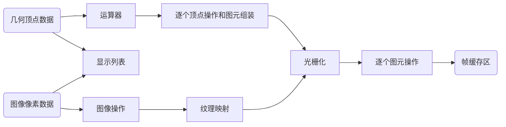

## 认识Shader

### Shader的种类

OpenGL的渲染流程：

### Shader的开发语言

- **HLSL：**主要用于Direct3D。
  - 平台：windows。

- **GLSL：**主要用于OpenGL。 
  - 平台：移动平台（iOS，安卓），MAC(only use when you target Mac OS X or OpenGL ES 2.0)

- **CG：**与DirectX 9.0以上以及OpenGL 完全兼容。
  - 运行时或事先编译成GPU汇编代码。
  - CG比HLSL、GLSL支持更多的平台，Unity Shader采用CG/HLSL作为开发语言。