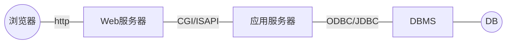

## 数据库系统概念
- 数据（Data）
  
  - 数据是数据库存储的基本对象。是描述现实世界中各种具体事物或抽象概念的、可存储，并具有明确意义的符号记录。
- 数据库（DataBase，简称为DB）
  
  - 简单的说，数据库就是相互关联的数据集合。严格的说，数据库是长期存储在计算机内、有组织的、可共享的大量**数据的集合**。数据库中的数据按一定的数据模型组织、描述和存储，具有较小的冗余度、较高的数据独立性和易扩展性。
- 数据库管理系统（DBMS）
  它的主要功能包括以下几个方面：
  1. 数据定义功能：
     
  > DBMS提供**数据定义语言（DDL）**，用户通过它可以方便地在数据库中定义数据对象（包括表、视图、索引、存储过程等）和数据的完整性约束等。

  2. 数据操纵功能：

  > DBMS提供**数据操纵语言（DML）**，用户可以通过它对数据库的数据进行增加、删除、修改和查询操作，简称为“增、删、改、查询”，对应于SQL语言的4个命令，即INSERT、DELETE、UPDATE和SELECT。 

  3. 数据控制功能：
  
  > DBMS提供了**数据控制语言（DCL）**，用户可以通过它完成对用户访问数据权限的授予和撤消，即安全性控制；解决多用户对数据库的并发使用所产生的事务处理问题，即并发控制；数据库的转储、恢复功能；数据库的性能监视、分析等功能。

  4. 数据库系统（DBS）：
     
  > 数据库系统是指在计算机系统中引入数据库后的系统，一般由数据库（DB）、数据库管理系统（DBMS）、应用系统和数据库管理员（DBA）构成。

  5. 数据库应用系统（DBAS）：
     
  > 数据库应用系统主要是指实现业务逻辑的应用程序。

------

- 数据库系统的用户
  - 数据库管理员（DBA）
    DBA的具体职责包括：
    1. 参与数据库的设计
    2. 定义数据的安全性要求和完整性约束条件
    3. 日常维护：定期备份数据 、监视数据库的运行 、确保正常运转时所需的空余磁盘空间，并且在需要时升级磁盘空间。 
    4. 数据库的改进和重组、重构

  - 数据库用户
    1. 最终用户
       最终用户是现实系统中的业务人员，是数据库系统的主要用户。 
    2. 专业用户
       专业用户包括工程师、科学家、经济学家等具有较高科学技术背景的人员。 
    3. 系统分析员和数据库设计人员
    4. 应用程序员

## 数据模型
### 数据库设计
数据抽象的过程即是数据库设计的过程，具体的步骤如下
> 第1步：根据用户需求，设计数据库的*概念模型*，这是一个“综合”的过程。
>
> 第2步：根据转换规则，把概念模型转换成数据库的*逻辑模型*，这是一个“转换”的过程。
>
> 第3步：根据用户的业务特点，设计不同的*外部模型*，给应用程序使用。也就是说，应用程序使用的是数据库外部模型中的各个视图。
>
> 第4步：数据库实现时，要根据逻辑模型设计其*内部模型*。

#### 概念模型

概念模型在这4种模型中抽象级别最高。

其特点如下：
1. 概念模型表达了数据库的整体逻辑结构，它是企业管理人员对整个企业组织的全面概述。
2. 概念模型是从用户需求的观点出发，对数据建模。
3. 概念模型独立于硬件和软件。
4. 概念模型是数据库设计人员与用户之间进行交流的工具。

现在采用的概念模型主要是实体-联系模型，即**E-R模型**。E-R模型主要用E-R图来表示。

实体是现实世界或客观世界中可以相互区别的对象，这种对象可以是具体的，也可以是抽象的。 

 

联系是两个或多个实体间的关联。两个实体之间的联系可以分为三种：
- 一对一联系（1：1）
- 一对多联系（1：n）
- 多对多联系（m：n）

#### 逻辑模型
逻辑模型具有下列特点：
1. 逻辑模型表达了数据库的整体逻辑结构，但它是设计人员对整个企业组织数据库的全面概述。
2. 逻辑模型是从数据库实现的观点出发，对数据建模。
3. 逻辑模型硬件独立，但软件依赖。
4. 逻辑模型是数据库设计人员与应用程序员之间进行交流的工具。

逻辑模型有**层次模型、网状模型和关系模型**3种。现在使用的关系型数据库管理系统（RDBMS）均采用关系数据模型。 

#### 外部模型
外部模型具有如下特点：
1. 外部模型是逻辑模型的一个逻辑子集。
2. 硬件独立，软件依赖。
3. 外部模型反映了用户使用数据库的观点。

从整个系统考察，外部模型具有下列特点：
1. 简化了用户的观点。
2. 有助于数据库的安全性保护。
3. 外部模型是对概念模型的支持。

#### 内部模型

内部模型又称为物理模型，是数据库最底层的抽象，它描述数据在磁盘上存储方式、存取设备和存取方法。内部模型是与硬件和软件紧密相连的。

可以不必考虑内部级的设计细节，由系统自动实现。

### 关系模型
${\color{red}※}$数据模型的三要素
- 数据结构
   - 数据结构是所描述的对象类型的集合。现在常用的是关系数据模型。
   - 数据结构是对系统静态特性的描述。
- 数据操作
   - 数据操作是指对数据库表中记录的值允许执行的操作集合，数据库对数据的操作主要有增、删、改、查询4种操作。
   - 数据操作是对系统动态特性的描述。
- 数据的完整性约束条件
   - 数据的完整性约束条件是一组完整性规则。用以保证数据的正确、有效、相容。

#### 数据结构
1. 关系（Relation）：一个关系就是一张规范的二维表 。
2. 元组（Tuple）：表中的一行即为一个元组。 
3. 属性（Attribute）：表中的一列即为一个属性，每个属性都有一个属性名。 
4. 码或键（Key）：也称为关键码或关键字。表中的某个属性或者属性的组合，能唯一的确定一个元组。
5. 关系模式：
   - 对关系的描述，一般表示为：
   - 关系名（属性1，属性2，属性3，……，属性n）

#### 操作与完整性约束
关系的完整性约束条件包括三大类：
- 实体完整性
- 参照完整性
- 用户定义的完整性 

## 数据库体系结构

### 三级结构
1. 用户级数据库
> 用户级对应于外模式，是最接近用户的一级，是用户看到和使用的数据库，又称为用户视图。

2. 概念级数据库
> 概念级数据库对应于概念模式，介于用户级和物理级之间，是数据库管理员看到和使用的数据库，又称DBA视图。

3. 物理级数据库
> 物理级数据库对应于内模式，是数据库的底层表示，它描述数据的实际存储组织，是最接近于物理存储的级，又称内部视图。

### 三级模式
1. 概念模式
> 概念模式又称为模式或逻辑模式，是数据库中全体数据的逻辑结构和特征的描述，是所有用户的公共数据视图。一个数据库只能有一个概念模式。

2. 外模式
> 外模式又称为子模式或用户模式，是数据库用户（包括程序员和最终用户）能够看到和使用的局部数据的逻辑结构和特征的描述，是数据库用户的数据视图，是与某一应用有关的数据的逻辑表示。一个数据库可以有多个外模式。

3. 内模式
> 内模式又称为存储模式或物理模式，是数据物理结构和存储方式的描述，是数据在数据库内部的表示方式。一个数据库只能有一个内模式。

### 二级映射与数据独立性
- 数据库系统的二级映射
  - 数据库系统的二级映射是：外模式/模式映射和模式/内模式映射。
- 数据独立性
   - 物理独立性
   物理独立性是指用户的应用程序与存储在磁盘上的数据库中的数据是独立的。物理独立性是通过模式/内模式映射来实现的。 

   - 逻辑独立性
   逻辑独立性是指用户的应用程序与逻辑结构是相互独立的。逻辑独立性是通过外模式/模式映射来实现的。

### 数据库应用系统的开发架构
- C/S模式
     客户/服务器(Client/Server)，C/S模式是一种流行的解决分布式问题的架构模式。C/S模式通过网络环境，将应用划分为前台和后台两个部分。 
   1. 两层C/S模式
   2. 三层C/S模式
- B/S模式（浏览器/服务器模式）

## 高级数据库系统
- 分布式数据库系统
- 面向对象数据库系统
- 并行数据库系统
- 多媒体数据库系统

## 数据仓库技术与数据挖掘技术
- 数据仓库
  
  > 数据仓库（Data Warehouse，DW）是一个面向主题的、集成的、稳定的、随时间不断变化的数据集合，它用于支持经营管理中的决策制定过程。
- 联机分析处理
  
  > OLAP可以对大量的多给数据进行动态合并和分析，是决策支持领域的一部分。 
- 数据挖掘
  
  > 数据挖掘（Date Mining）是从大量数据中提取隐含在其中的、人们事先不知道的但又可能有用的信息和知识的过程。

## 非关系型数据库NoSQL
> **NoSQL概述：**
> 
> NoSQL是非关系型数据存储的广义定义。它打破了长久以来关系型数据库与事务ACID理论大一统的局面。NoSQL数据存储不需要固定的表结构，通常也不存在连接操作。在大数据存取上具备关系型数据库无法比拟的性能优势。
> 
> **NoSQL相关理论：**
> 
> CAP理论是NoSQL数据库的基石。CAP理论指的是在一个分布式系统中，Consistency（一致性）、 Availability（可用性）、Partition tolerance（分区容忍性），三者不可兼得。
> 
> 一个分布式系统无法同时满足一致性、可用性、分区容忍性三个特点，最多只能实现其中两点。而由于当前的网络硬件肯定会出现延迟丢包等问题，所以分区容忍性是我们必须需要实现的。所以我们只能在一致性和可用性之间进行权衡，没有NoSQL系统能同时保证这三点。
> 
> BASE是Basically Available（基本可用）、Soft state（软状态）和Eventually consistent（最终一致性）三个短语的简写，BASE是对CAP中一致性和可用性权衡的结果，其核心思想是即使无法做到强一致性，但每个应用都可以根据自身的业务特点，采用适当的方式使系统达到最终一致性。

- NoSQL数据库模型
   1. `Key-Value`存储模型
   2. 文档存储模型
   3. 图存储模型
   4. `BigTable`存储模型

## 关系代数

> 1. 传统的集合运算，包括并、交、差。
> 2. 专门的关系运算，包括对关系进行
>    - 垂直分割（投影）
>    - 水平分割（选择）
>    - 关系的结合（连接、自然连接）等

### 基本操作

#### 并（Union）

设关系R和S具有相同的关系模式，R和S的并是由属于R或属于S的所有元组构成的集合，记为R∪S。

形式定义如下：
$$
R∪S=\{t|t\in R \lor t\in S\}
$$

关系的并操作对应于关系的插入或添加记录的操作，俗称“+”操作，是关系代数的基本操作。

例：

|       |   R   |       |      |       |   S   |       |      |       |  R∪S  |       |
| :---: | :---: | :---: | :--: | :---: | :---: | :---: | :--: | :---: | :---: | :---: |
| **X** | **Y** | **Z** |      | **X** | **Y** | **Z** |      | **X** | **Y** | **Z** |
|  x1   |  y1   |  z1   |      |  x1   |  y1   |  z2   |      |  x1   |  y1   |  z1   |
|  x1   |  y3   |  z2   |      |  x1   |  y3   |  z2   |      |  x1   |  y3   |  z2   |
|  x2   |  y3   |  z3   |      |  x2   |  y3   |  z3   |      |  x1   |  y1   |  z2   |
|       |       |       |      |       |       |       |      |  x2   |  y3   |  z3   |

#### 差（Difference）

设关系R和S具有相同的关系模式，R和S的差是由属于R但不属于S的元组构成的集合，记为R-S。

形式定义如下：
$$
R-S=\{t|t \in R \land t \in S \}
$$
关系的差操作对应于关系的删除记录的操作，俗称“-”操作，是关系代数的基本操作。

例：

|       |   R   |       |      |       |   S   |       |      |       |  R-S  |       |
| :---: | :---: | :---: | :--: | :---: | :---: | :---: | :--: | :---: | :---: | :---: |
| **X** | **Y** | **Z** |      | **X** | **Y** | **Z** |      | **X** | **Y** | **Z** |
|  x1   |  y1   |  z1   |      |  x1   |  y1   |  z2   |      |  x1   |  y1   |  z1   |
|  x1   |  y3   |  z2   |      |  x1   |  y3   |  z2   |      |       |       |       |
|  x2   |  y3   |  z3   |      |  x2   |  y3   |  z3   |      |       |       |       |

#### 笛卡尔积（Extended Cartesian Product）

设关系R和S的属性个数（即列数）分别为r和s，R和S的笛卡儿积是一个（r+s）列的元组集合，每个元组的前r个列来自R的一个元组，后s个列来自S的一个元组，记为R×S。形式定义如下：
$$
\begin{split}
R{\color{red}×}S=\{\hat{t_rt_s}|t \in R \land t \in S\}
\end{split}
$$

关系的广义笛卡尔积操作对应于两个关系记录横向合并的操作，俗称“×”操作，是关系代数的基本操作。

|       |   R   |       |      |       |   S   |       |      |         |         |   R×S   |         |         |         |
| :---: | :---: | :---: | :--: | :---: | :---: | :---: | :--: | :-----: | :-----: | :-----: | :-----: | :-----: | :-----: |
| **X** | **Y** | **Z** |      | **X** | **Y** | **Z** |      | **R.X** | **R.Y** | **R.Z** | **S.X** | **S.Y** | **S.Z** |
|  x1   |  y1   |  z1   |      |  x1   |  y1   |  z2   |      |   x1    |   y1    |   z1    |   x1    |   y1    |   z2    |
|  x1   |  y3   |  z2   |      |  x1   |  y3   |  z2   |      |   x1    |   y1    |   z1    |   x1    |   y3    |   z2    |
|  x2   |  y3   |  z3   |      |  x2   |  y3   |  z3   |      |   x1    |   y1    |   z1    |   x2    |   y3    |   z3    |
|       |       |       |      |       |       |       |      |   x1    |   y3    |   z2    |   x1    |   y1    |   z2    |
|       |       |       |      |       |       |       |      |   x1    |   y3    |   z2    |   x1    |   y3    |   z2    |
|       |       |       |      |       |       |       |      |   x1    |   y3    |   z2    |   x2    |   y3    |   z3    |
|       |       |       |      |       |       |       |      |   x2    |   y3    |   z3    |   x1    |   y1    |   z2    |
|       |       |       |      |       |       |       |      |   x2    |   y3    |   z3    |   x1    |   y3    |   z2    |
|       |       |       |      |       |       |       |      |   x2    |   y3    |   z3    |   x2    |   y3    |   z3    |

#### 投影（Projection）

关系R上的投影是从R中选择出若干属性列组成新的关系。

形式定义如下：

$$
\Pi_A(R) = \{t[A]|t \in R\}
$$

其中A为R中的属性列。是关系代数的基本操作。

例：对S关系，计算$\Pi_{3,1}(S)$

|       |   S   |       |      | **$\Pi_{3,1}(S)$** |       |
| :---: | :---: | :---: | :--: | :----------------: | :---: |
| **A** | **B** | **C** |      |       **C**        | **A** |
|   2   |   5   |   7   |      |         7          |   2   |
|   4   |   6   |   8   |      |         8          |   4   |
|   3   |   5   |   9   |      |         9          |   3   |

#### 选择（Selection）

关系R上的选择操作是从R中选择符合条件的元组。

形式定义如下:
$$
\sigma_F(R)=\{t|t \in R \land F(t)=true\}
$$

其中：

- F表示选择条件，它是一个逻辑表达式，取逻辑值“真”或“假”。
- 逻辑表达式F的基本形式为：$XθY[φX \space θY…]$
- θ表示**比较运算符**：$、、、、、≥、≤、>、<、=、≠$
- φ表示**逻辑运算符**：﹁(非)、∧(与)、∨(或)
- X、Y是属性名，属性名也可用它的序号代替(如1、2……)。

是关系代数的基本操作。

例：

|       |   R   |       |      |       | $\eth_{C>'6'}(R)$ |       |
| :---: | :---: | :---: | :--: | ----: | :---------------: | :---- |
| **A** | **B** | **C** |      | **A** |       **B**       | **C** |
|   2   |   4   |   6   |      |     3 |         5         | 7     |
|   3   |   5   |   7   |      |     4 |         6         | 8     |
|   4   |   6   |   8   |      |       |                   |       |

### 组合操作

#### 交（Intersection）

设关系R和S具有相同的关系模式，R和S的交是由属于R又属于S的元组构成的集合，记为R∩S。
形式定义如下：
$$
R \cap S=\{t|t\in R \land t \in S\}
$$

关系的交可以用差来表示，即$R \cap S=R-(R-S)$。
关系的交操作对应于寻找两关系共有记录的操作，是一种关系查询操作。

例：

|       |   R   |       |      |       |   S   |       |      |       | $R \cap S$ |       |
| :---: | :---: | :---: | :--: | :---: | :---: | :---: | :--: | :---: | :--------: | :---: |
| **X** | **Y** | **Z** |      | **X** | **Y** | **Z** |      | **X** |   **Y**    | **Z** |
|  x1   |  y1   |  z1   |      |  x1   |  y1   |  z2   |      |  x1   |     y3     |  z2   |
|  x1   |  y3   |  z2   |      |  x1   |  y3   |  z2   |      |  x2   |     y3     |  z3   |
|  x2   |  y3   |  z3   |      |  x2   |  y3   |  z3   |      |       |            |       |

#### 连接（Join）

连接也称为θ连接。它是从两个关系的笛卡尔积中选取属性间满足一定条件的元组。

记作：
$$
R {_{A \theta B}^{\space\space\Join}} S=\{\hat{t_rt_s}|t_r\in R∧t_s\in S\land t_r[A]\space θ\space t_s[B]\}
$$
连接运算从R和S的笛卡尔积R×S中选取（R关系）在A属性组上的值与（S关系）在B属性组上值满足比较关系θ的元组。

因此：
$$
R {_{A \theta B}^{\space\space\Join}} S=\sigma _{A \theta B}(R×S)
$$

##### 等值连接

等值连接是θ为”＝”的连接运算。它是从关系R与S的笛卡尔积中，选取A、B**属性值相等**的那些元组。
等值连接表示为：
$$
R {_{A=B}^{\space\space\Join}} S=\{\hat{t_rt_s}|t_r\in R∧t_s\in S∧t_r[A]=t_s[B]\}
$$

$$
为此：R {_{A=B}^{\space\space\Join}} S=\sigma_{A=B}(R×S)
$$

##### 自然连接

自然连接是一种特殊的等值连接，它要求**两个关系中进行比较的分量必须是相同的属性组**，并且要在结果中**把重复的属性去掉**。
即若R和S具有相同的属性组B，则自然连接可记作：
$$
R\Join S=\{\hat{t_rt_s}[\bar{B}]|t_r\in R∧t_s\in S∧t_r[A]=t_s[B]\}
$$

$$
为此：R\Join S=\Pi_{\bar{B}}(\sigma_{R.B=S.B}(R×S))
$$

 

**例：**

|       | 关系R |       |      | 关系S |       |
| ----: | :---: | ----- | ---- | :---: | ----- |
| **A** | **B** | **C** |      | **B** | **E** |
|    a1 |  b1   | 5     |      |  b1   | 3     |
|    a1 |  b2   | 6     |      |  b2   | 7     |
|    a2 |  b3   | 8     |      |  b3   | 10    |
|    a2 |  b4   | 12    |      |  b4   | 2     |
|       |       |       |      |  b5   | 2     |

|      |      | $R {_{C<E}^{\space\space\Join}} S$ |      |      |
| :--: | :--: | :--------------------------------: | :--: | :--: |
|  A   | R.B  |                 C                  | S.B  |  E   |
|  a1  |  b1  |                 5                  |  b2  |  7   |
|  a1  |  b1  |                 5                  |  b3  |  10  |
|  a1  |  b2  |                 6                  |  b2  |  7   |
|  a1  |  b2  |                 6                  |  b3  |  10  |
|  a2  |  b3  |                 8                  |  b3  |  10  |

等值连接：

|       |         | $R {_{R.B=S.B}^{\space\space\space\space\Join}} S$ |         |       |
| :---: | :-----: | :------------------------------------------------: | :-----: | :---: |
| **A** | **R.B** |                       **C**                        | **S.B** | **E** |
|  a1   |   b1    |                         5                          |   b1    |   3   |
|  a1   |   b2    |                         6                          |   b2    |   7   |
|  a2   |   b3    |                         8                          |   b3    |  10   |
|  a2   |   b4    |                         12                         |   b4    |   2   |

自然连接：

|       |      | $R\Join S$ |       |      |
| ----: | ---: | :--------: | :---- | :--- |
| **A** |    B |            | **C** | E    |
|    a1 |   b1 |            | 5     | 3    |
|    a1 |   b2 |            | 6     | 7    |
|    a2 |   b3 |            | 8     | 10   |
|    a2 |   b3 |            | 8     | 2    |

### 除(Division)



> **分量：**设关系模式为$R(A_1, A_2, …, A_n)$。它的一个关系设为R。
>
> $t\in R$表示t是R的一个元组。$t[A_i$]则表示元组t中相应于**属性$A_i$的一个分量**。
>
> **象集：**给定一个关系R(X，Z)，X和Z为属性组。
>
> 可以定义，当$t[X]=x$时，x在R中的象集为：$Z_x=\{t[Z]|t∈R,t[X]=x\}$
>
> 它表示R中属性组X上值为x的诸元组在Z上分量的集合。



**计算$R÷S$的操作步骤为：**

1. 将关系R和关系S的属性进行划分，即$、R(X,Y)、S(Y,Z)$;
2. 若X的某个值x的像集$Y_x$包含S表中所有元组，则将x放入结果集中。

**说明：**
     除操作是同时从行和列角度进行运算。除操作适合于**包含“对于所有的/全部的”语句**的查询操作。

**例：**

|                   |         R         |                   |      |                  |        S         |       |      |  R÷S  |
| :---------------: | :---------------: | :---------------: | ---- | :--------------: | :--------------: | :---: | ---- | :---: |
|       **A**       |  $\color{red}B$   |  $\color{red}C$   |      |  $\color{red}B$  |  $\color{red}C$  | **D** |      | **A** |
| $\color{blue}a1$  | $\color{blue}b1$  | $\color{blue}c2$  |      | $\color{blue}b1$ | $\color{blue}c2$ |  d1   |      |  a1   |
| $\color{green}a2$ | $\color{green}b3$ | $\color{green}c5$ |      | $\color{blue}b2$ | $\color{blue}c1$ |  d1   |      |       |
|        a3         |        b4         |        c4         |      | $\color{blue}b2$ | $\color{blue}c3$ |  d2   |      |       |
| $\color{blue}a1$  | $\color{blue}b2$  | $\color{blue}c3$  |      |                  |                  |       |      |       |
|        a4         |        b6         |        c4         |      |                  |                  |       |      |       |
| $\color{green}a2$ | $\color{green}b2$ | $\color{green}c3$ |      |                  |                  |       |      |       |
| $\color{blue}a1$  | $\color{blue}b2$  | $\color{blue}c1$  |      |                  |                  |       |      |       |

在关系R中，A可以取四个值$\{a1, a2, a3, a4\}$

- a1的象集为$\{(b1,c2), (b2,c3), (b2,c1)\}$
- a2的象集为$\{(b3,c5), (b2,c3)\}$
- a3的象集为$\{(b4,c4)\}$
- a4的象集为$\{(b6,c4)\}$
- S在(B,C)上的投影为\{(b1,c2), (b2,c3), (b2,c1)\}
- 显然只有a1的象集$(B,C)_{a1}$包含S在$(B,C)$属性组上的投影，所以$R÷S=\{a1\}$