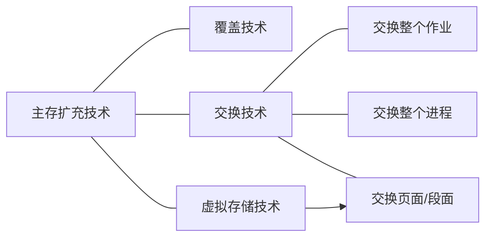
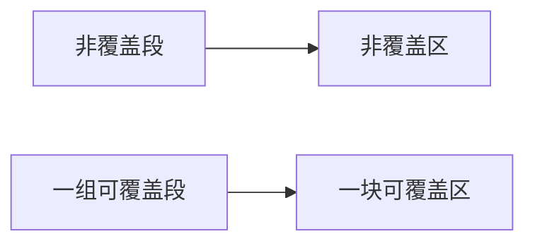
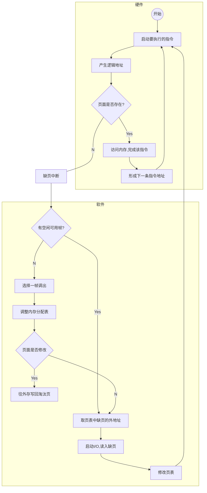

## 作业调度的时间计算

###  批处理作业调度算法

> **先来先服务（FCFS - First Come First Served）调度算法**
>
> 选择*最先进入后备队列的*作业装入内存。
>
> 优点：比较容易实现。
>
> 缺点：不区分作业长短，对短小作业十分不利；不顾及轻重缓急；对时间要求紧迫的作业不能做到急事急办。

<br/>


> **最短作业优先（SJF - Shortest Job First）调度算法**
>
> 从后备作业中选择*运行时间最短的*作业装入内存。
>
> 优点：照顾短作业用户的利益，提高系统吞吐量，降低此作业的平均周转时间。
>
> 缺点：推迟长作业运行，可能出现饥饿现象。估计运行时间本身有可能不太准确。

<br/>


> **最高响应比优先（HRF - Highest Response First）**调度算法
>
> 定义：作业的响应比 $ R={t_w+t_s \over t_s}={t_w \over t_s}+1\approx{t_w \over t_s} $
>
> $ t_w $ - 作业的等待时间， $ t_s $ - 作业的估计运行时间 
>
> 优点：折衷考虑到作业进入系统的先后次序，又顾及到作业的运行长度。
>
> 缺点：每次调度都要计算每个作业的响应比，开销大。

<br/>


> **最高优先级优先（HPF - Highest Priority First）**调度算法
>
> 该算法每次总是选择后备作业中优先级最高的作业装入内存。
>
> 当一个作业进入系统，系统根据用户级别、用户租金、作业类别、作业运行时间要求等为作业赋予一个优先级。
>
> HPF是一种比较灵活的调度算法，优先级可以根据需要灵活确定。
>
> HPF经常作为基于作业运行紧迫性的一种调度方案。

<br/>


> **均衡调度算法（理想型算法）**
>
> 根据内存容量的限制，选择一组资源互补型的作业装入。
>
> 目的：在作业运行期间，尽可能提高CPU和各种设备之间的并行度。

<br/>

### 作业调度性能的衡量标准

- 系统吞吐量高
  - 单位时间内系统完成的工作量称吞吐量。这是作业调度追求的第一目标。
  - 吞吐量Q 与 作业的平均周转时间T 的关系：平均周转时间T越小，系统吞吐量Q就越大

- 对短作业优惠
  - 这一准则主要为了吸引中小用户使用计算机。
  - 为了描述系统对短小作业的优惠程度，可使用作业的*平均带权周转时间W*作为评价参数。

- 其他指标
  - 处理机利用率高
  - 响应时间有保证
  - 优先权有保证
  - 截止时间有保证
  - 资源均衡利用

<br/>

### 作业调度时间算法

> $n$ - 单位时间内的作业数量
>
> $t_{bi}$ - 第i个作业提交的时间
>
> $t_{fi}$ - 第i个作业的完成时间
>
> $t_{si}$ - 第i个作业的运行（占用CPU）时间
>
> **作业周转时间**
>
> $T_i＝t_{fi}-t_{bi}$
>
> **作业的平均周转时间**
>
> $T={1 \over n}\displaystyle\sum_{i=1}^n(t_{fi}-t_{bi})$
>
> **作业的平均带权周转时间**
>
> $W={1 \over n}\displaystyle\sum_{i=1}^n(t_{fi}-t_{bi})/t_{si}$
>
> $响应比＝{等待时间＋运行时间\over运行时间}$

------

<br/>

### 算法案例

> 两个程序，其中A请求系统服务时间5s，B请求系统服务时间为100s，设第0到第5秒前，CPU运行C进程。在第1秒时B进入系统内存，第2秒时A进入内存。当CPU空闲，需要调度进程时根据不同的算法选择A或B。
>
> **问：分别计算FCFS算法下和SJF算法下，A和B的周转时间、带权周转时间。**

1. FCFS：先进先运行

| Job  | 进入时间 | 运行时间 | 开始时刻 | 完成时刻 | 周转时间  | 带权周转时间 |
| :--: | :------: | :------: | :------: | :------: | :-------: | :----------: |
|  A   |  **2**   |    5     |   105    | **110**  | 100-2=108 |  108/5=21.6  |
|  B   |  **1**   |   100    |    5     | **105**  | 105-1=104 | 104/100=1.04 |

- 根据上表信息
  - $\begin{split}周转时间&=(104+108)/2\\\\&=106\end{split}$​
  - $\begin{split}带权周转时间&=(21.6+1.04)/2\\\\&=11.32\end{split}$​

2. SJF：最短作业优先

| Job  | 进入时间 | 运行时间 | 开始时刻 | 完成时刻 | 周转时间  | 带权周转时间 |
| :--: | :------: | :------: | :------: | :------: | :-------: | :----------: |
|  A   |  **2**   |    5     |    5     |  **10**  |  10-2=8   |   8/5=1.6    |
|  B   |  **1**   |   100    |    10    | **110**  | 110-1=109 | 109/100=1.09 |

- 根据上表信息
  - $\begin{split}周转时间&=(8+109)/2\\\\&=58.5\end{split}$
  - $\begin{split}带权周转时间&=(1.6+1.09)/2\\\\=1.345\end{split}$

## 进程管理与调度

### 分清作业、进程与程序的区别

> **作业：**用户提交给系统的一个计算任务。
>
> 批作业=程序+数据+作业控制说明书
>
> 交互作业=程序+数据+交互命令
>
> 作业是用于人机之间交互的一个概念。
>
> **程序：**完成一件事情的代码序列。
>
> **进程：**是一个程序的一次动态执行过程。
>
> 程序是静态的；进程是动态的。
>
> 程序只包含代码：进程包括要运行的代码、代码要处理的数据、运行过程中的状态参数等。

<br/>

### 进程与进程管理模块

#### 进程的特征

1. 动态特征：生命周期
2. 并发特征：在一个时间段内都处在宏观的运行状态
3. 独立特征：独立占有资源、独立参与CPU调度
4. 异步特征：运行推进速度不可预知
5. 结构特征：PCB（进程控制块）+进程体

------

#### 进程控制块PCB



- 进程控制块PCB的数据内容包括：

  - 进程标识：系统识别进程的标志

  - 外部标识（也称作进程的外部名）：是进程的创建者提供的进程名字，通常由字符串组成

  - 内部标识（也称作进程的内部名，简记为Pid）：是系统为进程命名的一个代码，通常是一个整型数

  - 进程调度信息：系统调度选择进程的依据

    - 进程优先数，描述进程紧迫性的信息
    - 进程状态信息，描述进程当前处于何种状态
    - 其它调度信息。

    > 如：进程在系统中等待的时间、已在CPU上运行的时间、剩余的运行时间有等。

  - 处理机信息（进程上下文）

    - 通用寄存器的内容：包括数据寄存器、段寄存器等
    - 程序状态字PSW（ Program Status Word）的值
    - 程序计数器PC（ Program Count）的值
    - 进程的堆栈指针等

    > 进程被中断时，该进程的CPU现场信息可以保存在它自己的PCB内，以便该进程重新获得CPU时可以从此处恢复现场信息，继续运行。

  - 进程控制信息：系统对进程实施控制的依据

    - 程序代码和数据集所在的内存地址
    - 资源清单，记载进程请求资源和已经占有资源的情况
    - 同步与通信信息
    - 外存地址
    - 家族信息
    - 链接指针

------

#### 进程的状态转换

##### 两状态进程模型




- 进程的三种基本状态

  - 运行状态(Running)：进程获得CPU并投入运行的一种状态

  > 在单CPU系统中，每个瞬间最多只能有一个进程在运行。

  - 就绪状态(Ready)：进程尚未获得CPU使用权的一种状态

  > 进程已经拥有除CPU外其它全部所需资源
  >
  > 
  >
  > “万事俱备、只欠东风”

  - 阻塞状态(Blocked)：进程因某种要求得不到满足，只好等待，称之为运行“受阻”

  > 处于阻塞状态的进程是无权获得CPU的。

------

##### 三状态进程模型



------

##### 两种扩展的挂起状态

- 挂起阻塞(S-Blocked)状态
- 挂起就绪(S-Ready)状态

> 挂起某些暂时不能运行的进程，目的是腾出内存装入更多进程，使CPU忙碌起来。



#### 进程的创建与撤销

> **原语：**机器指令构成的一种实现特定功能的小程序，它的运行具有不可分割性。
>
> - 特点：
>   - 贴近底层
>   - 运行过程具有原子性（不可中断）
>   - 系统小程序
>   - 最重要的
>
> **进程控制用的原语：**实现进程管理和状态切换
>
> 如：进程创建原语、进程撤销原语、阻塞原语、唤醒原语、进程挂起原语、进程激活原语、进程调度原语等。

##### 进程创建原语

何时调用创建原语：

- 批作业调度。
- 交互作业提交。
- 系统提供服务。
- 用户程序创建子进程。

##### 进程撤销原语

何时调用撤销原语：

- 进程自行终止。
- 用户或父进程的原因使进程终止。
- 运行超时而终止。
- 运行出错而终止。

------

##### 进程阻塞原语`Block()`

何时调用阻塞原语：

- 当正在运行的进程需要等待某一事件而发生运行受阻时，它通过中断请求系统服务。
- 系统按照进程的需求进行适当处理后，启动“进程阻塞原语”将该进程阻塞起来。

引起进程阻塞（运行受阻）的原因：

- 等待I/O请求
- 资源得不到满足
- 进程同步约束
- 服务进程无事可做


```c
j:GetInternalname();
Remove(runQueue,j); //从运行队列上摘下PCBj
PCBj(进程上下文):=CPU现场信息； 
PCBj(状态):="Blocked";
Insert(BlockQueue, j); //将PCB插入阻塞队列上
Scheduler(); //运行调度程序
//结束
```

##### 唤醒原语`Wake_up()`

何时调用唤醒原语：当系统发生某一个事件时，正在等待该事件的进程需要立即被唤醒，由“阻塞”状态转为“就绪”状态。

流程：

- 将当前进程的上下文保存到系统栈中。
- 从阻塞队列上查找等待该事件的进程PCB将PCB从阻塞队列上摘下来。
- 将其状态置为“就绪”，将PCB挂入就绪队列。
- 弹出系统栈中的进程上下文，置入CPU，让被中断的进程恢复运行。
- 结束。

------

##### 挂起原语 `Suspend()`

何时调用挂起原语：

- 当前内存空间紧缺，
- 部分进程优先运行应用户的要求，将用户进程挂起
- 应父进程要求，将其子进程挂起

流程：

- 找到被挂起进程的PCB，获得其内存地址将内存空间归还给存储管理模块。
- 进程状态阻塞转为“挂起阻塞”，或者就绪转为为“挂起就绪”，将PCB从原队列转入相应队列。
- 申请外存交换区空间，换出进程，地址写入PCB。
- 结束。

##### 激活原语`Active()`

何时调用激活原语：

- 有进程运行完毕，当前内存空间并不紧张
- 应用户要求，将其进程激活
- 应父进程的要求，将其子进程激活
- 或者进程自身设定的挂起周期已完成

流程：

- 扫描“挂起就绪队列”找到被激活进程的PCB。
- 将PCB从所在队列上摘下来。
- 按PCB登记的空间需求，申请内存，加载到内存中。
- 归还外存交换区空间将进程状态置为“就绪”，插入就绪队列。
- 结束。

<br/>

### 进程调度方式

> 从处于就绪状态的进程中，按照某种调度策略，选择个进程切换给CPU，使其状态从就绪转为运行，即为进程调度。

#### 非抢占式调度

当前进程主动放弃处理机控制权，可能的情况有：

- 进程运行完毕退出；
- 运行受阻
- 运行出错，非正常终止
- 遇到不可挽回的故障

#### 抢占式调度

也称作剥夺式调度，一般用于有实时需求的系统

- 主要指在系统正常运转期间，如果某种事件出现，系统将迫使正在运行的进程停下来，将CPU控制权交给其它进程。
- 其思想源自对高紧迫度作业的响应。

<br/>

### 进程调度算法

> **批处理作业调度算法回顾：**
>
> FCFS（ First come first serve）算法，先进入就绪队列的进程先调度
>
> SPF（ Shortest process first）算法，最短进程优先调度。
>
> HPF（ Highest Priority First）算法，最高优先级调度。
>
> HRF（ Highest Response First）算法，最高响应比优先调度。

#### 时间片轮转RR（ Round robin）算法

>应用于**分时系统**，目标是提高响应及时性
>
>**基本思想：**将CPU的处理时间划分成一个个的时间片，就绪队列中的进程轮流运行一个时间片。当时间片结束时，就强迫进程让出CPU，该进程进入就绪队列，等待下一次调度，同时，进程调度又去选择就绪队列中的一个进程，分配给它一个时间片，以投入运行。
>
>进程失去CPU不是自愿的，而是被系统剥夺的

- 轮转算法的启动时机
  - 一个时间片运行结束；
  - 当前进程运行结束；
  - 或者正在运行的进程因运行受阻主动放弃了CPU控制权。

- 时间片的选取/确定通常有下面几个原则：
  - 进程的道数较多时，q就选得小一些；反之可选得大些。
  - 系统要求的响应时间比较苛刻的时候，q就选得小一些；反之，可选得大些

#### 多队列调度算法

>设置多个就绪队；
>
>就绪队优先级不同，优先级高的队列优先调度；
>
>优先级高的队列为空时，再调度低优先级队列。

#### 多级队列反馈调度算法

> 多就绪队列组织形式
>
> 设置n个队列$Q_1，Q_2，……，Q_n$
>
> 记$Q_i$的优先级为P，有$P1>P2……>P$
>
> 记$Q_i$的时间片为$q_i$，有$q_1>q_2<……<q_n$
>
> 新建进程进入$Q_1$队。
>
> 只有$Q_i$为空时，才调度$Q_{i+1}$中的进程。
>
> 进程p在$Q_i$中被调度执行，若时间片q；已到但尚未结束，则进程p转为就绪状态进入$Q_{i+1}$队；进程p在$Q_n$中被调度执行，若时间片已到但尚未结束，则进程转为就绪状态仍入$Q_n$队。

- 这样的管理方式带来的结果：
  - 终端型用户满意：终端型作业都是交互型的，比较短，进入第1队列后优先调度，一般只要一个小时间片就可完成。
  - 短的批处理作业用户满意：短的批处理作业开始时首先进入第1个队列，能及时被响应。若轮转一周不能完成的话，通常只需在第2乃至第3队列上各执行一个时间片就可能完成，作业的周转时间仍比较短。
  - 长的批处理作业用户满意：个长的批处理作业进入系统后，将依此在第1，2，…，n-1队列中各运行一个时间片，最后进入第n队列进行轮转运行，一般不必担心“受冷落”现象发生。一旦进入后面的就绪队，获得的时间片比较长，系统调度开销比较少

<br/>

### 实时任务调度

> 实时任务是一类对时间要求较为严格的进程支持这类任务运行的系统称为实时处理系统。
>
> 硬实时系统：有严格的时间控制
>
> 软实时系统：有时间需求，但没有严格的deadline，尽快完成即可

#### 非周期实时任务的分类及其调度方法

- 紧迫型实时任务调度

> 紧迫性强的任务多见于一些专用的、响应时间要求特别苛刻的数据采集和控制系统中，所要求的响应时间很短，一般是微秒量级的。

解决的方法是采用**立即抢占的最高优先级(HPF)调度算法**。

> 进程调度每次将处理机分配给具有最高优先级的就绪进程。
>
> 最高优先级算法可与不同的CPU方式结合形成可抢占式最高优先级算法和不可抢占式最高优先级算法



- 普通型的实时任务调度

> 目前，大多数自动控制系统对响应时间的要求都不是太高，一般是毫秒量级的。由于它允许的响应时间长度与时钟中断的周期基本吻合。

采用“基于时钟中断抢占的高优先级调度”算法。




- 宽松型的实时任务调度

  - 非抢占的HPF调度算法



  - RR算法



- 特殊的—周期性实时任务

> 信号检测和过程控制系统中呈现周期性运行规律的任务。

周期任务A第次运行前的剩余时间$F_A(i)$是


$$
F_A(i)=i·T_A-T_{sA}-t
$$

$T_A$为任务A的周期长度；$T_{sA}$为任务A的每次执行时间长度； $t$为系统的当前时间。

周期性任务可采用**SRT（最小剩余时间）调度算法**

<br/>

### 线程的引入

> 线程是现代操作系统引入的一种执行实体
>
> **线程称“轻型进程”**，是进程的组成部分
>
> 进程是资源占有单位，线程只是CPU调度单位

一个进程运行过程中可创建多个线程，线程共享所属进程的资源，自己只有TCB和很少的栈区

线程分**内核级线程KLT**和**应用级线程ULT**



#### 进程与线程的区别

> 进程是个独立的实体单位：
>
> - 独立占有资源：进程拥有对资源的控制权或所有权。
> - 独立参与调度/执行：进程是一个可被操作系统调度和分派的单位。
>
> 线程仅是分派（调度运行）的单位：
>
> - 线程不是单独占有资源的单位。
> - 线程共享其所属进程的资源。

<br/>

### 处理机的调度层次

调度的主要目标—一选择哪个实体进入内存、选择哪个实体占用CPU。

调度的主要层次

- 作业调度

- 中级调度

- 进程调度

- 线程调度

#### 典型的三级调度

作业从进入系统成为后备作业开始，直到运行结束退出系统为止，需经历不同级别的调度。

> 高级调度：又称作业调度、长程调度。从处于后备状态的作业中选择一道或者几道，装入内存。
>
> 中级调度：又称中程调度。优先从处于挂起就绪状态的进程中选择一个或者几个，将之激活。
>
> 低级调度：又称进程调度、短程调度。从处于就绪状态的进程中选择一个，切换给CPU执行。

根据不同系统的情况：

- 有的系统三级调度都有
- 有的系统有高级调度和低级调度
- 有的系统有中级调度和低级调度
- 有的系统只有低级调度
- 有的系统加了一级**线程调度**

#### 线程调度

> 线程称“轻型进程”，是进程的组成部分
>
> 进程是资源占有单位，线程是CPU调度单位
>
> 线程共享所属进程的资源
>
> 线程分为用户级线程和内核级线程，调度方式不同

##### 用户级线程的调度

- 操作系统进行进程调度
- 用户进程自己进行线程调度
- 内核级线程：操作系统直接进行线程调度

#### 线程调度与子进程调度的区别

图示以用户级线程调度为例



采用线程调度：CPU切换时开销较少

## 进程的并发控制

### 互斥、同步与并发的区别

#### 互斥

> 只要不同时使用即可，谁先用谁后用没有约束——此之谓“互斥”
>
> 互斥体现进程间**竞争关系**

#### 同步

> 不但不能同时用，谁先用谁后用也有严格约束——此之谓“同步”
>
> 同步—体现进程间协作关系

<br/>

### 并发(Concurrency)

#### 并发的基本概念

- 单处理器多道程序设计系统中，多个进程交替执行
- 多个并发进程在一个时间段内都处于运行状态
- 共享系统资源
- 每个进程都“走走停停”
- 并发带来异步性

#### 并发带来的问题

- 并发进程的相对执行速度是不可预测的，取决于其他进程的活动、操作系统处理中断的方式以及操作系统的调度策略。
- 有可能发生各种与时间有关的错误。

#### 与并发相关的关键术语

- 临界资源(Critical resources)
  - 也叫**互斥资源**
  - 一种**一次只能为一个进程服务**的共享资源
  - 如“存款额”、 Buffer块
- 临界区(Critical Section)
  - 进程体中使用临界资源的代码段
  - 使用同一临界资源的不同的代码段叫做相关临界区
  - 当一个进程已经在临界区中运行时，也就是已经在使用临界资源了，其它进程不能进入相关临界区
- 互斥(Mutual Exclusion)
  - 当一个进程在临界区访问临界资源时，其他进程不能进入相关临界区访问该资源
  - 临界资源一个时刻只允许一个进程使用
  - 进程使用该临界资源的顺序没有约束
  - 体现竞争关系
- 同步(Synchronization)
  - 不但不能同时使用临界资源，还得有严格的使用的先后顺序
  - 体现协作关系
- 死锁(Dead lock)
  - 两个或两个以上的进程，因其中的每个进程都在等待其他进程做完某些事情而不能继续执行，所有进程都阻塞等待，而且永远阻塞等待
- 活锁(Live lock)
  - 两个或两个以上进程为了响应其他进程中的变化而持续改变自己的状态，但不做有用的工作
- 饥饿(Starvation)
  - 一个可运行的进程被调度程序无限期地忽略，不能被调度执行的情形。
- 原子操作(Primitive)
  - 保证指令序列要么作为一个组来执行，要么都不执行

------

操作系统在管理和控制资源分配与使用方面，应当保证进程对临界资源的访问满足以下3点：

1. 互斥访问要求。
2. 不致于产生“死锁”
3. 不能有“饥饿”进程

<br/>

### 解决进程同步和互斥的方法

> **互斥管理准则：**
>
> 空闲让进、忙则等待、有限等待、让权等待

#### 软件方法

软件方法解决互斥问题失败的原因：

1. 临界区前后所加代码越多，执行过程随时被打断的情况越多
2. 所加代码中的turn、Fag[1]、Flag[2]本身也是临界资源
3. 没有考虑让权等待

#### 硬件方法

#### 信号量机制

>**基本原理：**
>
>- 两个或多个进程通过简单的信号进行合作。
>
>- 任何复杂的合作需求都可以通过适当的信号结构得到满足。
>
>实现要素：
>
>- 信号量（Semaphore类型，内含一个阻塞队列）
>- P操作原语（wait）
>- V操作原语（signal）

一个记录型信号量包含两个分量：

信号量的值、信号量的等待队列指针

| P(s)                                                         | V(s)                                                         |
| ------------------------------------------------------------ | ------------------------------------------------------------ |
| s.value = s.value -1;<br/>if s.value < 0<br/>then block(s.L); | s.value = s.value +1;<br/>if s.value <= 0<br/>then wakeup(s.L); |

> 用于进临界区之前检查资源
>
> 当临界资源被其他进程占用时，就将自己阻塞
>
> 具有“阻塞”功能

|                         解决互斥问题                         |                         解决同步问题                         |
| :----------------------------------------------------------: | :----------------------------------------------------------: |
| 一种CR设一个信号量<br/>信号量的初值设置为系统初始状态CR的可用量<br/>P操作用于临界区前，相当于进入CS之前申请CR<br/>V操作用于临界区后，相当于出临界区后释放CR<br/>P、V操作必须成对匹配 | 一种同步信号设一个信号量<br/>信号量的初值设置为系统初始状态下信号的有无<br/>P操作用于临界区前，相当于检査同步信号<br/>V操作用于临界区后，相当于发出同步信号<br/>P、V操作不成对匹配 |

互斥、同步解决方法的异同分析：

- 信号量的设置
- 信号量的初值
- P操作的含义
- V操作的含义
- P、V操作是否匹配

记录型信号量机制解决问题的步骤：

- 分析问题中的进程、资源；分析进程间关系；
- 分别设置互斥、同步信号量；
- 写出并发进程体，找出相关CS(临界区)；
- 分别加PV操作并分析结果。


#### 管程机制

(暂无)


### 生产者-消费者问题

> **经典生产者消费者问题：**
>
> 系统里有若干个合作的进程互斥使用由$r（r>0）$个缓冲块组成的缓冲块环，其中n（n>0）个生产者进程，$m（m>0）$个消费者进程。
> 任何一个生产者进程都可以将自己的产品存入环内的一个缓冲块中；任何一个消费者可以将环内的一个产品取出。生产者源源不断生产并存入产品：消费者周而复始地从环内取出产品并消费掉。
>
> **假定使用的约束条件是：**
>
> 当环中有空闲缓冲块时，允许任一生产者进程把它的产品存入。
> 当环中无空闲缓冲块时，则试图将产品存入缓冲区环的任何生产者进程必须阻塞等待。
> 当环中尚有未取出的产品时，允许任一个消费者进程把其中的一个产品取出。
> 当环中没有未取出的产品时，试图从该环内取出产品的任何消费者进程必须阻塞等待。



环上设有存入指针和读取指针，都按顺时针方向移动。

*当同步问题的临界区和互斥问题的临界区重合时，应该做到**同步在外、互斥在内**：消费者先判断buffer环是否可取，在可取的情况下再竞争buffer环的使用权；消费完后先释放buffer环，再向生产者发出可放入信号。

#### 例1

> 三个进程：输入、计算、输出
>
> 进程关系分析：P1与P2同步，P2与P3同步



> $B_1$可放入——Sin1，初值1
>
> $B_1$可取——Sout1，初值0
>
> $B_2$可放入——Sin2，初值1
>
> $B_2$可取——Sout2，初值0
>
> **进程体$P_1$：**
>
> 准备初始数据——发出同步信号P(Sin1)——将初始数据放入$B_1$——发出同步信号V(Sout1)
>
> **进程体$P_2$：**
>
> 发出同步信号P(Sout1)——从$B_1$中取出初始数据——发出同步信号V(Sin)——计算——发出同步信号P(Sin2)——将结果放入$B_2$——发出同步信号V(Sout2)
>
> **进程体$P_3$：**
>
> 发出同步信号P(Sout2)——从$B_2$中取出结果——发出同步信号V(Sin2)——输出


#### 例2

> 三组进程`Producer`、`ConsumerOdd`、`ConsumerEven`**互斥使用**一个包含N个单元的缓冲区。生产组每次用`produce()`生成一个正整数，并用`put()`送入缓冲区某一空单元中；奇数消费组每次用`geode()`从该缓冲区中**取出一个奇数**，并用`counted()`统计奇数个数；偶数消费组每次用`geteven()`从该缓冲区中**取出一个偶数**，并用`counteven()`统计偶数个数。
>
> 请用信号量机制实现这三组进程的同步与互斥活动，要求用伪代码描述，并说明所定义信号量的含义。
>
> （研究生入学统考真题）

分析：

1. 题目中显然有三组进程，这三组进程互斥使用一个`buffer`环，关键在于实现互斥；根据互斥原则，*有几种互斥资源，就设几个互斥信号*。这里的互斥资源就是*包含N个单元的缓冲区*，因此互斥信号量设置一个即可。
2. 初值按照该缓冲区里边缓冲块的个数N来设置
3. 题目中存在1组生产者，2组消费者，因此存在同步关系

```PASCAL
Parbegin
	Process producer_i(i=1,2,…)
		Begin Repeat
			Produce(x):
			P(	);
			Put(x);
			If(x是奇数) Then V();
			Else V(	);
		Until false;
	End;
	
	Process Consumerodd_j(j=1,2,…)
    	Begin Repeat
    		P(	);
    		Getodd();
    		V(	);
    		V(	);
			Countodd();
		Until false;
	End;
	
	Process ConsumerEven_k(k=1,2,…)
		Begin Repeat
			P(	);
			P(	);
			Geteven();
			V(	);
			Counteven()
		Until false; 
	End;
Parend
```

#### 总结

- 记录型信号量机制解决问题之步骤总结
  - 分析问题中的进程、资源
  - 分析进程间关系
  - 分别设置互斥、同步信号量
  - 写出并发进程体，找出相关CS
  - 分别加PV操作并分析

### 读者-写者问题

> **问题描述：**有一个数据块被多个用户共享，其中一部分用户是读者，另一部分是写者。
>
> **规定：**读者对数据块是只读的，而且允许多个读者同时读；写者对数据块是只写的，当一个写者正在向数据块写信息的时候，不允许其他用户使用，无论读还是写。

#### 分析

1. 谁是进程：读者、写者——两组进程
2. 谁是资源：数据块——临界资源

进程之间的关系：

- 写者

  - 写者跟任何一个其它的进程都互斥

    为数据块设互斥信号量`mutex`



- 读者
  - 读者与读者不互斥
  - 读者组跟写者互斥
  - 第一个来的读者申请资源
  - 最后一个走的读者释放资源



加一个读者计数的变量`counter`，成为读者们互斥的资源，为counter设置一个互斥信号量`Rmutex`

#### 总结

- `mutex`是为数据块设置的互斥信号量，用于：
  - 写者跟任何一个其它的进程都互斥
  - 读者组与写者互斥

- `Rmutex`是为`counter`设置的互斥信号量，用于：
  - 读者间互斥使用`counter`

```pascal
var mutex,Rmutex:semaphore:=1,1;
var counter:integer:=0;
Parbegin
	Writer_i();
	Reader_j();
Parend
```

### 理发师问题

> **问题描述：**
>
> 有一位理发师，一把理发椅和n把供等候理发的顾客坐的等候椅。如果没有顾客，理发师便在理发椅子上睡觉；当一个顾客到来时，唤醒理发师进行理发。如果理发师正在理发时又有新顾客到来，有空椅子可坐，他就坐下来等，如果没有空椅子，就立即离开。
>
> **规定：**要求为理发师和顾客各编一段并发程序描述他们的行为，解决其中的同步互斥问题。

#### 分析

1. 进程——理发师、顾客
2. 资源——理发椅、等候椅
3. 围绕理发椅——理发师与顾客：同步
4. 围绕等候椅——顾客与顾客：互斥

- 设置同步信号量



- 设置同步信号量
  - 考虑设一变量`chairs`，记录等候椅剩余数量。顾客来了检查`chairs`，若为0，则离开（结束进程）；若 $chairs>0，chairs=chairs-1$，坐下等
  - 变量`chairs`是临界资源，顾客进程之间互斥使用`chair`
    - 为`chairs`设一互斥信号量`mutex`初值为1

#### 总结

- 需要设计两个进程体：顾客进程`Customer()`、理发师进程`Barber()`
- 定义四个同步信号量`coming`、`calling`、`cutting`和`finished`实现理发师与顾客之间的同步
- 定义信号量`mutex`实现顾客间对`chairs`的互斥

### 哲学家就餐问题

>  **问题描述：**
>
>  5位哲学家围桌而坐，每人面前盘面，两人中间各放一根筷子哲学家生活方式单调：思考一饥饿一用餐-再思考
>
>  已知每个人必须左右手各拿到根筷子才可以开始进餐。

#### 分析

1. 进程——5个哲学家
2. 资源
   - 桌子——可同时共享
   - 面条——独占，不需共享
   - 椅子——独占，不需共享
   - 筷子——互斥共享（临界资源）
3. 围绕理发椅——理发师与顾客：同步
4. 围绕等候椅——顾客与顾客：互斥

```pascal
Var mutex[0..4]:semaphore:=1,1,1,1,1;//5个互斥信号量对应5根筷子
//第i位哲学家的行为过程可描述为下面的形式
Process Philosopher_i()  i=0,1,2,3,4
Begin
	While(true)
		Begin
		Thinking();
		P(mutex[i]);//请求左筷子
		P(mutex{i+1 mod 5);//请求右筷子
		Eating();//用餐过程
		V(mutex[i]);∥释放左筷子
		V(mutex[i+1 mod 5]);∥释放右筷子
		End
End
```


#### 算法存在的问题

> 若5位哲学家恰好都饿了，一起去拿筷子，恰好都先拿起了自己左边的那根筷子。
>
> 每位哲学家都拿不到右边的筷子，而阻塞等待，而且永远等待下去，这就叫“死锁”。

让哲学家互斥使用筷子，但不发生死锁

- 解决方法1：限制最多4个人同时吃面。
  - 实现方法：加一个临界资源——吃面名额
- 解决方法2：将椅子统一编号，让奇数号椅子上的哲学家饥饿时先拿左筷子，偶数号椅子上的先拿右筷子。
- 解决方法3：哲学家饥饿要吃面时，要么两根筷子起拿，要么一根也不拿。
  - 需要设计一种新的信号量机制——信号量集机制
    - 用一个P操作，可以同时申请到两个或多个临界资源
    - 用一个V操作，可以释放两个或多个临界资源

### 管程机制解决生产者-消费者问题

#### 管程(Monitor)

> 管程是由局部数据结构、多个处理过程和一套初始化代码组成的模块
>
> 这是一种具有面向对象程序设计思想的同步机制。
>
> 它提供了与信号量机制相同的功能。

- 管程特征
  - 管程内的数据结构只能被管程内的过程访问，任何外部访问都是不允许的
  - 进程可通过调用管程的一个过程进入管程
  - 任何时间只允许一个进程进入管程，其他要求进入管程的进程统统被阻塞到等待管程的队列上
- 管程机制的要素
  - 条件变量c(Condition类型)：关联一个阻塞队列
  - P(c)：当遇到同步约束，将执行P(c)操作的进程阻塞在条件变量c关联的阻塞队列上。
  - V(c)：从条件变量c关联的阻塞队列上唤醒一个进程，让它恢复运行。若队列上没有进程在等待，就什么也不做。

#### 管程设计与应用示例

- 设计一个管程：解决生产者-消费者问题

  - 定义为一个数组`buffer`：表示用于传递产品的缓冲区环。
  - 定义局部变量`in`,`out`：表示在缓冲区环中生产者放的位置、消费者取的位置。
  - 定义变量`counter`：记录缓冲区环中产品的数量。

- 设计条件变量

  - 定义`full`：生产者的条件变量。

    当一个试图存放产品的生产者发现缓冲区环已满时，执行`P(full)`将之阻塞到`full`关联队列上。

  - 定义`empty`：消费者的条件变量。
    当一个试图取产品的消费者发现缓冲区环已空时，将执行`P(empty)`将该消费者阻塞到 `empty`的关联队列上

- 设计管程的过程

  - `PUT()`：实现产品的存入。

    > Porcedure PUT(item:char)

  - `GET()`：实现产品的取出。

    > Porcedure Get(item:char)


### 死锁的发生与描述

#### 死锁的危害

- 陷入死锁圈的进程无限期阻塞等待
- 陷入死锁圈的资源被浪费
- 更多进程卷入死锁
- 甚至系统死机

#### 分析

- 产生死锁的原因
  - 动态资源分配策略
  - 资源可用数量少于需求数量
  - 进程并发过程的偶然因素
  - 因有偶然性，所以无法给出死锁产生的充分条件

- 死锁产生的4个必要条件

  1. 互斥条件：进程请求的资源属于临界资源，每一瞬间只能由一个进程使用，其它申请该资源的进程等待。

  2. 不可剥夺条件：进程获得某资源后，便一直占有它，直到用完为止才可以释放，其它进程不可以剥夺。

  3. 请求和保持条件：允许一个进程在保持已有资源不放弃的情况下，进一步请求新资源，被阻塞时也不会释放已占有的资源。

  4. 环路等待条件：组进程{$P_1,…,P_n$}的占有资源情况与请求资源情况构成了一个环型链，比如$P_1$等待$P_2$的资源，$P_2$等待$P_3$的资源，$P_n$等待P1的资源。

#### 死锁的解决方法

- 事前处理：针对性采取措施，让死锁没有机会发生
- 事后处理：及时检测、及时解除

#### 死锁预防与死锁避免的区别

- 死锁预防
  - 在资源分配策略上做限制，让死锁根本没有机会发生。

- 死锁避免
  - 在每个进程的每次提出动态资源申请时，加设“银行家算法”
    以决定是否满足该请求

##### 死锁的预防

目的：采取预防措施，让死锁没有机会发生

从死锁产生的原因入手：

- 因为死锁产生有偶然性因素——方案不可行

- 从死锁产生的4个必要条件入手，破坏其中的一个或几个必要条件——方案可行

###### 能否破坏 死锁产生的4个必要条件

1. 互斥条件：互斥共享资源不能改成同时共享，破坏该条件行不通

2. 不可剥夺条件：互斥共享资源被剥夺以后，进程需要重新执行，破坏该条件行不通

3. 请求和保持条件：进程运行整个过程中所需资源要申请就一次性全部申请，要不就不申请

  - 静态资源分配策略

  - 动态资源分配策略：

    - 需要时动态申请
    - 使用完动态释放

    > 优点：进程一定不会发生死锁
    > 缺点：资源有效利用率会降低进程并发推进的速度会降低

4. 环路等待条件：给资源排一个序号，按照从小到大或从大到小的顺序申请资源

- 按序资源分配策略
- 采用按序资源分配策略，资源使用效率会高于静态资源分配策略。
- 但是**不适用于开放性系统**

> **静态资源分配策略 与 按序资源分配策略 的共同点：**
>
> - 在资源分配策略上做限制，让死锁根本没有机会发生
> - 在资源利用率上都有所牺牲

------


##### 死锁的避免

前提：采用动态资源分配策略

措施：对每个进程的每次动态资源请求，加设“银行家算法”以决定是否满足该请求

> **银行家的基本思路**
>
> - 银行家拥有一笔周转资金，客户申请贷款
>
> - 检查客户信用，了解客户投资前景，判断有无出现呆账坏账的危险
>
> - 确无危险，才贷出
>
> **银行家与操作系统类比**
>
> - 操作系统（银行家）
>
> - 操作系统管理的资源（周转资金）
>
> - 进程（要求贷款的客户）
>
> **操作系统的思路**
>
> - 前提 采用动态资源分配策略
> - 银行家算法每个进程提出资源申请时，加上一道检查


<p style="text-align:center;">主要思想：动态检测资源分配，以确保系统一直处于安全状态</p>


结论：

- 安全状态不是死锁状态
- 安全状态是没有死锁危险的状态
- 死锁状态是不安全状态
- 不是所有不安全状态都是死锁状态

## 存储管理

### 概述

- 存储管理的管理目标

  - 内存的合理分配使用
  - 提高内存利用率
  - 程序、数据在内存中顺利读写
  - 小内存运行大程序

- 内存管理主要功能

  1. 内存的分配和回收
     - 合理分配 及时回收
     - 实现技术：数据结构 主存分配算法 主存分配算法

  2. 地址重定位（地址转换）
     - 实现目标：将逻辑地址转换成物理地址
       - 物理地址 存储单元的实际物理单元地址。
       - 逻辑地址 用户空间中使用的相对地址。

     - 静态重定位
       - 地址转换工作在进程执行前一次完成。
       - 无须硬件支持，易于实现，但不允许程序在执行过程中移动。
     - 动态重定位
       - 地址转换推迟到最后的可能时刻，即进程执行时才成
       - 允许程序在主存中移动，便于主存共存，主存利用率高。

   3. 地址共享和保护：多道程序环境中，多个用户作业均使用内存空间，为提高内存利用率，应该对内存空间实现共享。

   > **共享：**
   >
   > - 共享内存储器资源，让多个进程同时进入内存区域，共享同一个存储器；
   >
   > - 共享内存储器的某些区域，即允许两个或多个进程访问内存中的同一段程序或数据。
   >
   >  **地址保护：**
   >
   >  - 用户进程不能访问或修改系统区
   >  - 用户进程不能访间或修改其他进程的用户区

    4. 地址扩充
       - 内存容量是有限的，当内存资源不能满足用户作业需求时，就需要对内存进行扩充
       - 内存扩充不是硬件上的扩充，而是用存储管理软件来实现
         - 覆盖技术
         - 对换技术
         - 虚拟存储技术

#### 存储管理方法

##### 连续存储管理

- 单一连续区方式

> 内存用户区的全部空间只存放一个进程。

- 多分区方式

> - 内存被分为多个分区，每个分区存放一个进程。
>   - 固定多分区
>   - 动态多分区

##### 非连续存储管理

- 分页方式
  - 内存被划分为多个等长的存储块，每个进程占用其中的若干块，整个内存允许有多个进程同时驻留。

- 多段方式
  - 对分段结构的应用程序，按照段长度分别为之分配内存空间。

- 段页方式
  - 在分段式管理的基础上加上分页式管理可形成段页式管理。

### 地址重定位（地址转换）

实现目标：将逻辑地址转换成物理地址

物理地址：存储单元的实际物理单元地址

逻辑地址：用户空间中使用的一种地址

#### 程序的编译、链接、装载和执行



### 数据结构与主存分配算法

#### 常用的数据结构

##### 主存分配表MAT(Memory Allocation Table)

- 分区号：每个分区都有一个编号，用以区别不同分区。
- 起始地址：分区的起始地址，即首地址。
- 长度：分区的总长，一般以KB为单位。
- 占用标志：记录分区的使用状态。若占用标志为0，表明该分区为空闲，可以进行分配。

例表：

| 分区号 | 起始地址 | 长度 | 占用标志 |
| :----: | :------: | :--: | :------: |
|   0    |   4KB    | 6KB  |   未分   |
|   1    |   10KB   | 2KB  |   已分   |
|   2    |   12KB   | 15KB |   已分   |
|   3    |   27KB   | 34KB |   未分   |
|   …    |    …     |  …   |    …     |

此表若很长，则需要很大的时间开销

##### 空闲区表/链

> 是MAT表的一类子表
>
> 记录内存**空闲区状况**的数据结构

有空闲区链中各空闲区可按地址顺序来排列，也可按尺寸大小来组织。

- 当系统进行内存时，进行的处理是：
  - 通过空闲区链，快速搜索内存的空闲区
  - 从中找出最合适的分区分配出去
  - 将该结点从链上删除

- 当需要某块被释放的区域时，系统处理过程为
  - 按其地址或者大小在链中找到合适的位置
  - 插入一个新结点
  - 若存在相邻的空闲区，则需要的话可将相邻空闲区合并

#### 主存分配算法

##### 首次适应算法(First_Fit)

> 首次适应算法也称为最早适应算法。系统将内存分区按地址递增顺序登记到内存分配表（或其它数据结构）中。每次进行内存分配时，系统根据进程申请空间的大小，从头到尾顺序扫描内存分配表（或空闲分区表），从中找到的第1块能够满足要求的空闲区，就立即分配出去

##### 循环首次适应算法(Circle_First_Fit)

>  该算法的思想是，每次存储分配总是从上次分配的位置开始，向尾部查找。查到的第1块可满足用户需求的空闲空间，分配给用户。当查到MAT（或空闲链表）的尾部仍然没有合适的，转到头部继续。

##### 最佳适应算法(Best_Fit)

> 在内存分配时，从空闲区表中找到一块满足进程需求白最小空闲区分配给它。这种做法减少了将大空闲区进行多次分割造成的空间浪费。但容易形成一些很小的碎片无法使用，同样不能提高内存利用率。另外，每次分配时，都要对整个内存区进行从头到尾的搜索，系统开销较大。

##### 最坏适应算法(Worst_Fit)

> 在进行内存分配时，从空闲区表中找到一个满足长度求的最大空闲区进行分配。这种算法部分地缓解了由外碎片引起的浪费，适合于中小作业的运行，但对大作业的运行是不利的。与最佳适应算法一样，每次分配需要搜索一遍内存，效率会受到定影响。

### 连续分区存储管理

> 单分区存储管理、固定多分区存储管理、动态多分区存储管理（可变分区），都属于连续分区存储管理。

#### 单分区存储管理

**基本原理：**把内存的用户区视为一个独立的连续存储区，任何时刻只将它分配给一个作业使用。

这种存储管理非常简单，适用于单用户单任务系统（如，MS-DOS操作系统的早期版本）。

缺点：

- CPU的利用率不高、外设利用率较低：因为任何时刻最多只有一个程序独占内存，无论在该程序执行过程中，还是CPU等待IO时都不能让其他用户使用。
- 内存空间浪费严重：进入系统运行的作业所要求的存储空间较小时，剩余较大的空白区未被利用，只能白白浪费。

#### 固定多分区存储管理

> **基本原理：**将内存用户区划分成多个大小相等或不等的固定分区，每一个分区可以装入一个进程。这样，内存中可同时容纳若干个进程。
>
> MAT表可以用静态数组实现

固定分区方案可能出现的问题：

- 分区大小可以相等，也可以不等

- 每个分区的越始地址和长度是固定的

- 大的进程无法装入

- 小进程装入大分区出现**内碎片**

> 内碎片：指的是进程获得的空间大于需求的空间时，多出来的空闲区。
>
> 内碎片的产生降低了内存的有效利用率
>
> **如何减少内碎片现象：**
>
> - 采用Best_Fit算法
> - 采用静态重定位
> - 地址保护：采用合适的寄存器

固定分区方案的缺陷：

- 分区的数目在系统生成阶段已经确定，限制了系统中活动进程的数目
- 分区大小在系统生成阶段事先设置，大作业有可能无法装入，小作业不能有效地利用分区空间。
- “内碎片”现象降低了内存有效利用率。

#### 动态多分区存储管理

> **基本原理：**系统不预先划分固定分区，而是在装入进程时，根据进程的实际需求量划分出一个分区给它使用。
>
> MAT表需要用动态数组实现

- 动态分区分配算法的描述
  1. 从头到尾扫描内存分配表，找到一个能满足需求的空闲分区$MAT_i$
  2. 若$MAT_i$（长度）=L，则：$MAT_i$（占用标志）“已分”，转（4）
  3. 若$MAT_i$（长度）>L，则：
     1. $L_0$=$MAT_i$（长度）-L
     2. $MAT_i$（长度）=L；$MAT_i$（占用标志）=“已分"
     3. 在内存分配表的下一个位置插入新行$MAT_{i+1}$
     4. $MAT_{i+1}$（起始地址）=$MAT_i$（起始地址）+L
     5. $MAT_i$（长度）=$L_0$
     6. $MAT_{i+1}$（占用标志）=“未分”
  4. 结束。

##### 动态分区分配示例




> **外碎片：**指的是在使用动态多分区管理方法时，形成的的、因为太小不容易被分配利用的小的空闲区
>
> **如何消除外碎片：**
>
> - 除了Best_Fit算法，另外三种算法都有使用价值
> - 主存分配过程中，通过程序浮动将不相邻的空闲区移为相邻的进行合并。
> - 回收过程中，相邻空闲区进行合并。


### 基本分页存储管理

> **基本原理**
>
> - 内存被划分成大小固定相等的块（ Frame帧、页框、主存块），且块相对比较小。
> - 每个进程装入时被分成同样大小的页（Page），一页装入一帧
> - 整个进程被离散装入到多个不连续的帧

#### 页面长度

页面的尺寸（页面长度）由计算机系统的硬件决定。

> 对于某台具体的机器来说，只能规定一种尺

<br/>

目前流行的页面尺寸是1KB到4KB之间，但也有一些机器不在此范围内

> 比如，小型机 IBM AS400的页面尺寸为512个字节

#### 记录内存使用情况的数据结构

>  位示图：整个系统一张，记录内存使用情况
>
>  0表示空闲，1表示被占用

| $_i\backslash ^j$ | 第<br/>0<br/>位 | 第<br/>1<br/>位 | 第<br/>2<br/>位 | 第<br/>3<br/>位 | 第<br/>4<br/>位 | 第<br/>5<br/>位 | 第<br/>6<br/>位 | 第<br/>7<br/>位 |
| :---------------: | :-------------: | :-------------: | :-------------: | :-------------: | :-------------: | :-------------: | :-------------: | :-------------: |
|      第0个字      |        0        |        0        |        0        |        1        |        1        |        1        |        1        |        0        |
|      第1个字      |        0        |        1        |        1        |        0        |        0        |        0        |        1        |        0        |
|      第2个字      |        1        |        0        |        0        |        1        |        1        |        0        |        1        |        1        |
|        ……         |        …        |        …        |        …        |        …        |        …        |        …        |        …        |        …        |
|      第n个字      |        0        |        0        |        0        |        0        |        0        |        0        |        0        |        0        |

设字号$i$、位号$j$、帧号$k$取值均从0开始，字长记为L

分配时，查位示图，找空闲帧：$k=i*L+j$

回收时，$i=(k/L) $//整除

$j= k\space MOD\space L$ //取余

由帧号可知位示图中字号和位号

#### 页面分配算法

1. 计算请求者需要的总帧数N
2. 查位图，若找不到足够的空闲帧，编制“分配失败”报告返回
3. 索取一个空闲页表PT
4. 从位图中找出N个为0位，计算出对应的帧号，填入PT
5. 位示图中将这些位改为1
6. 将PT起始地址填入进程的PCB中
7. 结束

#### 地址划分

进程装入之前，逻辑地址是**一维**的

进程装入之后，逻辑地址分为**二维**

高端地址部分：作为页号

低端地址部分：作为页内的偏移量（即页内地址）

<br/>

例：若机器的地址码是16位，页面长度是1KB

则地址划分结果：低10位是页内地址，高6位是页号

| 6位  |   10位   |
| :--: | :------: |
| 页号 | 页内地址 |

> 这样的地址结构，允许一个进程的页面总数达$2^6=64$页


#### 地址重定位



#### 地址保护



#### 总结

- 离散存储，利于大进程装入
- 只有**很少的页内碎片**，提高内存利用率
- Ds：位示图、页表；动态地址重定位
- 页面共享不易实现定位页面共享不易实现

### 基本分段存储管理

> **基本原理**
>
> - 进程的程序和其相关的数据按逻辑分段
> - 段有一个最大长度限制，但不要求所有程序的所有段的长度都相等
> - 一段占用一块连续存储区
> - 各段占用不连续分区

> “段”是一个逻辑单位，是进程的一个组成部分如主程序段、子程序段、数据段等
>
> 在结构程序设计中，进程自然分段。
>
> 用户源程序使用的符号地址是二维的：<段名，变量名>
>
> 编译之后的逻辑地址是二维的：<段号，段内偏移>

#### 进程按逻辑分段

> 在分段机制中，一个进程的地址空间可以包含以下不同的段：
>
> - 代码段（ Code segment）
> - 数据段（ Data segment）
> - 堆栈段（ Stack Segment）
> - 内存共享段（ Share Memory Segment）等

#### 包含3个段的进程

>例如，一个进程P包括3个程序段：Main（主段）、Sub1（子段1）和Sub2（子段2）。
>
>甚至有专门的“共享段”
>
>图给出各个段之间的调用关系



#### 记录内存使用情况的数据结构

- MAT
- 空闲分区表/链

!> 这里用的MAT表与**动态多分区**中MAT表的有何异同？

| 相同点                          | 不同点                                                       |
| :------------------------------ | :----------------------------------------------------------- |
| MAT的一个表项，对应内存一个分区 | - 动态多分区中，一个分区存放一整个进程<br/>- 分段存储中，一个分区存放进程的一个段。<br/>一个进程离散成多个段装入多个不连续的分区 |

#### 记录各个进程分段情况的数据结构

**段表ST（ Segment Table）**为每个进程设置一张段表，用来记录各个段地址映射的关系

进程分了几段，段表就有几个表项。
个表项记录一个分段在内存空间中的存储地址和长度。

段表示例：



#### 地址重定位

程序运行中的地址变换过程如下：

1. 提取逻辑地址中的“段号”
2. 比较段号与段表控制寄存器中的段长度。如果超出段表长度，则返回“内存定位错误”，终止进程的运行
3. 从段表控制寄存器中给出的段表首址开始，以段号为索引査找该进程对应的段表，得到欲访问段的首地址。
4. 取出欲访问段的首地址，加上逻辑地址中的偏移量得到物理地址。

#### 分段保护

> 第一级保护是防止进程发生超出存储空间的访问；
>
> 第二级保护是阻止进程超出访问权限的读写。

分段保护的具体保护分为以下三个步骤



#### 分段共享

- 段面共享

  > 如果多个用户进程需要共享内存中的某些代码段或数据段时可将内存中共享段的起始地址及长度，填入这些进程的段表当中，就可共享一个逻辑上完整的段信息了。

- 共享段表SST

  > 为了实现段的共享，系统设一个“共享段表”（SST, Sharing Segment Table）
  >
  > 记载各个共享段的使用情况任何一个进程调用共享段时，系统都将访问该表

#### 总结

- 离散存储，一段连续装，各段不连续

- 内存仍然按分区管理，会产生**外碎片**

- DS：MAT、段表；动态地址重定位

- 分段共享非常方便

### 基本段页式存储管理

> 把分页和分段两者结合起来就是段页式存储管理。
>
> - 内存划分成大小相等的页框。
> - 用户的地址空间被程序员划分成许多段，每个段一次划分成许多固定大小的页，页的长度等于内存中的页框大小。

#### 分页与分段

> **分页：**
>
> 分页存储利于大进程裝入，内存利用率高；
>
> 但是，页是物理页，页面共享不易实现。
>
> **分段：**
>
> 段是逻辑段，方便实现分段共享；
>
> 但是，外碎片的存在降低内存使用效率
>
> 且整理消除外碎片加大系统开销

#### 数据结构

- 系统设一张位示图，记录内存各帧占用与否
- 系统为一个含有多分段的进程建立段表，记录各个分段对应段内页表的地址和长度
- 一个分段有一个段内页表，记录该段划分为多少页每页分配的帧号是多少

<br/>



$$
段表和段内页表
$$

#### 地址形式

系统的硬件支持是，在处理机内部设有**段表控制寄存器**及**地址生成逻辑**

- 程序中的逻辑地址仍然是二维地址：<段号，偏移量>
- 每段装入时分页，地址部分被当作三维地址来处理：<段号，页号，页内偏移>

#### 段页式地址重定位



#### 段页式地址保护



#### 段页式地址字结构的计算

比如一个32位地址字，已知系统设定页面长度为4KB，段的长度为64KB

则地址划分如下：

| 段号  | 页号  | 页内地址 |
| :---: | :---: | :------: |
| 31-16 | 15-12 |   11-0   |

页面长度为4KB($2^{12}$)，因此页内地址需要12个二进制位。

段的长度为64KB，页面长度为4KB，因此一个段包含了$64÷4=16(2^4)$个页，因此页号需要4个二进制位。

于是，页内需12位，每段分16页，段内页号需4位，剩余16位为段号。


### 多级页表及相关计算

#### 一级页表结构

若页面长度为4KB，每个页表项占用4B，则意味着:

帧里最多能存放4KB÷4B=1K个页表项



#### 二级页表结构

二级页表地址形式

| 外层页号 | 内层页号 | 页内偏移 |
| :------: | :------: | :------: |
|          |          |          |

如果二级的页表也必须用多个帧来存放，那就需要建立更高一级的页表：多级页表


#### 多级页表结构

计算：一个由32位二进制组成的地址空间，页面长度为4KB，每个页表项占用4B，则：

- 进程的页面总数可达$2^{20}=1M$个
- 整个页表最大占用4MB
  - 页号：31-16
  - 页内地址：11-0

- 一个帧只有4KB，所以4MB的页表需要离散存放需要占用4MB/4KB=1K个帧。

- 这就需要如果建立更高一级的页表，记录页表所占帧号，叫做“页表的页表”：两级页表




#### 相关计算

一个由32位二进制组成的地址空间，页面长度为4KB，每个页表项占用4B，则：

1. 采用一级页表机制，所允许的进程的最大长度是（$2^{20}×4KB$）

| 页号  | 页内地址 |
| :---: | :------: |
| 31-16 |   11-0   |

  2. 采用两级级页表机制，所允许的进程的最大长度是（$2^a×2^b×2^c B$）

| 外层页号 | 内层页号 | 页内偏移 |
| :------: | :------: | :------: |
|    c     |    b     |    c     |


<br/>

一个由32位二进制组成的地址空间，页面长度为4KB，每个页表项占用4B，请问地址字结构

1. 因页面长度为4KB，所以页内偏移占12位；
2. 余下20位对应页号，所以进程的页面总数可达1M个；
3. 整个页表占用4MB，这4MB又划分为18个页面
4. 一个页面正好可存放1K个页表项；
5. 所以，为了查找这1K个页面，两级页表结构就够了。
   即：外层页号和内层页号各占10位，偏移量占12位

#### 多级页表机制的地址重定位过程

处理机中要设有**外部页表寄存器**，存放当前进程的外部页表首地址。

系统根据指令给出的逻辑地址：

- 用逻辑地址中的外层页号a查外层页表，得到内层页表首地址。
- 用逻辑地址中的内层页号b查内层页表，得到数据帧号
- 将数据帧的首地址加上偏移地址c得到物理地址。

### 与快表有关的计算

1. 在一般的分页管理系统中，处理机每次读出/写入一个数据，需要访问（2）次内存；而在分区存储管理系统中，需要访问（1）次内存。
2. 在一般的分页管理系统中，执行一条一地址指令，需要访问（2）次内存；执行一条三地址指令，需要访问（6）次内存。

解析：


$$
分页存储管理系统
$$


$$
分区存储管理系统
$$

#### 提高地址转换速度一快表

- 存储在高速缓存
- 内容为页表中最近使用的页表项

##### 引入快表之后的地址变换过程

对于CPU给出的一个逻辑地址<页号P，偏移量W>

> 1. 硬件逻辑中，将逻辑地址中的页号P送入高速缓存，与快表中的所有页号进行比较。若找到相匹配的页号，读出该页面对应的帧号，与偏移量W合成一个物理地址。
> 2. 若在快表中没有找到，系统需要再访问内存中的页表。在页表中找到该页的帧号，与偏移量w共同合成访问内存的物理地址
> 3. 同时，系统自动更新快表。快表中总是存放那些刚刚访问过的页表项。

##### 有效访存时间的计算

$有效访存时间=地址转换时间+读写一个页面的时间$

地址转换时间：访问一次快表或者页表的时间 

读写一个页面的时间：访问一次内存的时间

- 访问一次快表的时间，即访问一次快存的时间
- 访问一次页表的时间，即访问一次内存的时间

设一次快存访问时间为t1，一次内存访问时间为t2

- 如果査询快表能找到所用的页，我们称作命中。此时的有效访存时间t为$t=t_1+t_2$
- 如果查询快表没有找到所用的页，称作没有命中此时的有效访存时间t将是：$t=t_1+2t_2$

一般地，当查询快表的命中率为p，则平均内存有效访问时间T大约为：

$T=p×(t_1+t_2)+(1-p)×(t_1+2t_2)$

<br/>

例题：假设一个分页存储系统具有快表，已知内存访问时间是1us，快表的访问时间为01us。若快表命中率是85%，则有效存取时间为多少？

$$
\begin{split}
T&=p×(t_1+t_2)+(1-p)×(t_1+2t_2)\\\\
&=85\%×(0.1+1)+(1-85\%)×(0.1+2×1)
\end{split}
$$

##### 实际系统引入快表之后的地址变换示意图



## 虚拟存储管理

### 概述



#### 主存扩充技术实质

目的：将小的实存储器（实存）扩充为大的虚存储器（虚存）

实质：将磁盘空间虚拟成内存使用

结果：将进程的一部分装入内存，即可运行

#### 局部性原理

时间局部性：最近访问过的程序代码和数据很快又被访问。

空间局部性：某存储单元被使用之后，其相邻的存储单元也很快被使用。

程序在执行过程中的一个较短时间内，所执行的指令地址或操作数地址分别局限于一定的存储区域中。


#### 覆盖技术

程序运行过程中，在不同时刻把同一存储区分配给不同程序段或数据段，实现**存储区共享**的一种内存分配技术。

> 覆盖技术通常与**单一连续区分配、固定多分区分配和动态分区分配**等存储管理技术配合使用。

每一个用户程序被分为若干段：

非覆盖段—一部分是经常要用的基本部分，作为常驻段

可覆盖段一另一部分不经常使用，可以让它们在需要时临时装入。不同时使用的段可组为一组可覆盖段。



#### 交换(Swap)技术

将内存中某进程暂时不用的程序和数据全部或部分）写入外存交换区中，腾出来的内存空间供其它进程使用。待需要时或内存有空闲空间时，再将它从外存交换区装入内存

##### 交换技术实现要点

磁盘上设置“磁盘交换区”

> 磁盘交换区是一个数据的暂存处。系统可根据内存的“拥挤”程度将信息调往交换区或者从交换区调入

##### 文件区和交换区的区别

操作系统管理下磁盘空间被划分为：文件区和交换区。

!>**存储方式不同：**文件区信息以文件形式存放，为了提高空间利用率，一般采取**离散存储**方式；而交换区信息按字符流方式存放，多采用**连续存储**方式

!>**访问速度不同：**文件区存储空间特别大，为了提高检索效率一般通过建立目录对文件实现访问，也就是**间接地址访问**；而交换区空间较小，可按外存地址**直接访问**，因此访问速度快。

!>**存储时间不同：**文件区适合于较长久的数据存储；而交换区作为临时数据的存放处，只存放短期的数据。

##### 交换技术的应用

交换整个作业——用于单道系统（单道模拟多道）

交换整个进程——用于连续分区存储管理（进程挂起、激活，中级调度）

交换页面/段面——用于分页、分段存储管理（此即为虚拟存储技术）

#### 虚拟存储技术

一个进程运行时，可不必将其全部装载到内存中只须把当前运行的部分程序和可能访问的数据块装入内存即可。

随着进程运行的不断推进，其余部分程序和数据可随时装入。

这样做可实现小内存运行大程序的设想

> 采用虚拟存储技术以后，从逻辑上说，系统拥有一个容量很大的存储器，这就是人们常说的虚拟存储器。
>
> 虚拟存储器的特性：
>
> - 离散性
> - 多次性
> - 对换性
> - 虚拟性

##### 虚拟存储实现技术

基于分页的虚拟存储令$\iff$页面换入换出

基于分段的虚拟存储$\iff$段面换入换出

基于段页的虚拟存储$\iff$页面换入换出

### 请求分页存储管理

#### 基本原理要点

- 内存分大小相等的帧（Frame）
- 进程按照帧的大小被分成若干页（Page）
- 进程仅装入部分页面，即开始执行
- 在执行过程中访问的页若已在内存，进行动态的地址重定位，执行指令（同基本分页存储管理）
- 在执行过程中访问的页未装入内存时，产生缺页中断，进程阻塞，等待从磁盘动态装入页面
- 缺页装入以后，进程转入就绪，可以参与调度继续执行
- 内存无空闲可用帧时，暂时不用的页面可换出到交换区
- 通过页面的换入换出，实现小内存运行大进程

#### 数据结构

- 位示图
  - 系统设置一张位示图，记录内存划分为多少个帧，帧用一个0/1记录该帧占用还是空闲。

- 页表
  - 为一个进程设置一张页表，记录该进程分了多少页、每一页是否已装入内存、内/外存地址、访问权限等的相关管理信息。
  - 与基本分页存储管理的页表相比：扩充页表的内容，增加驻留标志位和页面辅存的地址等信息。

#### 地址重定位机制

当一个进程调度时，系统将其页表首址装入CPU中的页表控制寄存器。运行中用相对地址的高端部分作为页号去检索页表，看该页是否已在内存。

如果访问的页不在内存（发生缺页中断），在缺页中断处理过程中，装入缺页，继续地址重定位

#### 缺页中断与缺页中断处理过程



##### 缺页中断的断点

缺页中断是指令执行**过程中**产生的中断，而（一般的中断）在一条指令执行完成后产生的。

##### 缺页中断的断点压入

当CPU执行指令希望访问一个不在内存的页面时，将生缺页中断，系统开始运行中断处理程序。

此时指令计数器（PC）的值尚未来得及增加就被压入堆栈，因此**压入的断点必然是本次被中断的指令地址，而非下一条指令的地址**。

##### 缺页中断处理过程

1. 保留进程上下文
2. 判断内存是否有空闲可用帧？
   - 若有，则获取一个帧号No，转(4)启动I/O过程。
   - 若无，继续(3)。
3. 腾出一个空闲帧，即：
   1. 调用置换算法，选择一个淘汰页PTj。
   2. PTj(S)=0;//驻留位置0
   3. No=PTj(F);//取该页帧号
   4. 若该页曾修改过，则：
      1. 请求外存交换区上一个空闲块B
      2. PTj(D)=B; //记录外存地址
      3. 启动I/O管理程序，将该页写到外存上。
4. 按页表中提供的缺页外存位置，启动I/O，将缺页装入空闲帧No中。
5. 修改页表中该页的驻留位和内存地址。PTi(S)=1; PTi(F)=No。
6. 结束

#### 页面分配算法与分配策略

##### 页面分配相关讨论

- 实践证明，如果一个进程在内存中分配的帧数比较少，尽管有局部性原理，缺页率仍然相对较高——分配帧数太少不合适
- 给特定进程分配的内存空间超过一定的大小后，由于局部性原理，该进程的缺页率没有明显的变化
- 分配给一个进程的帧数越多，在任何时候驻留在内存中的进程数就越少，从而降低了操作系统至少找到一个就绪进程的可能性，降低了CPU的利用率——分配帧数太多不合适

##### 给特定进程分配合理的内存帧数

目前流行的支持多字节指令的计算机系统中，一条指令需要对源操作数和目的操作数进行处理（通常是二地址指令），那么一个进程的运行空间最好不小于6个页面。

> 请求分页系统中的页面分配应当以**减少缺页率**为目标。
>
> **需考虑因素：**指令格式、寻址方式、程序长度、页面走向程序的工作集尺寸、多道并发度等。

##### 常用页面分配算法

- 平均分配法：系统的可用空间平均分配给所有进程，让它们都占有相等数量的帧。

>这样分配对短作业来说是很有利的。
>而对于一些较大的进程，缺页率必然居高不下

- 优先权分配法：考虑进程的优先运行权，给高优先的进程分配较多的帧，使它的缺页率相对少一些。

> 这里，我们可把优先权理解为高响应比、高优先级、最短剩余时间优先等。

- 比例分配法：这种分配方法比较公平，小进程分配小空间，大进程分配大空间

> 当可用空间为M个帧，系统当前的进程数为n，每个进程的页面数量为$s_i$，那么按比例分配法，应当分配给进程$i$的页数$p_i$为：
> $$
> p_i={s_i\over \displaystyle\sum_{j=1}^n S_j}×M
> $$

##### 页面分配策略

- 固定分配策略：为一个进程在内存中分配固定数目的页框用于执行时使用。

- 可变分配策略：允许分配给一个进程的帧及帧的数目在该进程的生命周期中不断地发生变化

> 缺页率高，可增加分配的帧；
>
> 缺页率很低，可适当减少分配的帧。

#### 页面置换算法概述与OPT

> **页面置换：**是指在内存空间没有空闲可用帧而又要装入新页时，必须按某种算法将内存中的某页置换为一个新页
>
> 换出的：从内存换到外存（磁盘交换区或文件区）
>
> 换入的：从外存（磁盘交换区或文件区）换到内存

页面置换策略

- 局部置换策略：仅在产生这次缺页的进程的驻留页中选择并置换

- 全局置换策略：把内存中所有未被锁定的页都作为置换的候选页，不管它们属于哪一个进程。

  ##### 页面分配策略+页面置换策略

|              |                           局部置换                           |                           全局置换                           |
| :----------: | :----------------------------------------------------------: | :----------------------------------------------------------: |
| **固定分配** | - 分配给一个进程的页框数是固定的<br/>- 从分配给该进程的页框中选择被置换的页 |                           无此方案                           |
| **可变分配** | - 分配给一个进程的页框数可以变化<br/>- 从分配给该进程页框中选择被置换的页 | 从内存中所有可用页框中选择被置换的页，这导致进程驻留集大小不断变化 |

##### 页面置换要点

策略前提：固定分配+局部置换

发生背景：发生缺页中断+内存无空闲可用帧

完成功能：从进程自己的驻留页中选择一页作为淘汰对象换岀，然后换入所缺页

选择策略：页面置换算法

##### 常用的页面置换算法

###### OPT-最佳置换

!>该算法**选择以后不再使用的、或者要隔最长时间才能使用的页面**予以淘汰。OPT算法尽量避免刚调出去又要立即调入，是一种理想化了的页面置换算法。

例：可用页框（帧）数量为3，引用串如下：7 0 1 2 0 3 0 4 2 3 0 3

|   引用串    |  7   |  0   |  1   |       2        |  0   |       3        |  0   |       4        |  2   |  3   |       0        |  3   |
| :---------: | :--: | :--: | :--: | :------------: | :--: | :------------: | :--: | :------------: | :--: | :--: | :------------: | :--: |
|     帧1     |  7   |  7   |  7   | $\color{red}2$ |  2   |       2        |  2   |       2        |  2   |  2   |       2        |  2   |
|     帧2     |      |  0   |  0   |       0        |  0   |       0        |  0   | $\color{red}4$ |  4   |  4   | $\color{red}0$ |  0   |
|     帧3     |      |      |  1   |       1        |  1   | $\color{red}3$ |  3   |       3        |  3   |  3   |       3        |  3   |
| 缺页F/置换R |  F   |  F   |  F   |       R        |  _   |       R        |  _   |       R        |  _   |  _   |       R        |  _   |

$$
缺页率=7/12
$$

存在的问题：实际系统无法预知将来页面的访问情况

- OPT算法在实际系统中不易实现
- OPT算法**用于衡量实际页面置换算法的性能**


###### FIFO-先入先出

!> 系统选择驻留在内存中时间最长的页面**（最早装入的页面）**作为被淘汰的对象。这种算法的出发点是局部性原理，但是没考虑“先装入内存者有可能是主程序常驻模块”。

例：可用页框（帧）数量为3，引用串如下：7 0 1 2 0 3 0 4 2 3 0 3

|   引用串    |  7   |  0   |  1   |       2        |  0   |       3        |       0        |       4        |       2        |       3        |       0        |  3   |
| :---------: | :--: | :--: | :--: | :------------: | :--: | :------------: | :------------: | :------------: | :------------: | :------------: | :------------: | :--: |
|     帧1     |  7   |  7   |  7   | $\color{red}2$ |  2   |       2        |       2        | $\color{red}4$ |       4        |       4        | $\color{red}0$ |  0   |
|     帧2     |      |  0   |  0   |       0        |  0   | $\color{red}3$ |       3        |       3        | $\color{red}2$ |       2        |       2        |  2   |
|     帧3     |      |      |  1   |       1        |  1   |       1        | $\color{red}0$ |       0        |       0        | $\color{red}3$ |       3        |  3   |
| 缺页F/置换R |  F   |  F   |  F   |       R        |  _   |       R        |       R        |       R        |       R        |       R        |       R        |  _   |

$$
缺页率=10/12
$$

问题：最先装入的不一定是以后不用的。

- 例如C程序中的main函数部分，在整个程序的生命周期中使用频率都很高。

- FIFO算法容易理解和实现，性能并不总是很好

###### LRU-最近最久未使用

!> 系统选择内存中**当前距上次使用最远的页**予以淘汰。根据程序局部性原理，在较长时间里未被使用的页面，可能不会马上使用到。

实现时通常使用栈来组织各个驻留页，通过调整、维护栈来记录各驻留页被访问的先后顺序。

|              引用串               |       7        |       0        |       1        |  2   |        0        |        3        |        0        |  4   |  2   |  3   |  0   |  3   |
| :-------------------------------: | :------------: | :------------: | :------------: | :--: | :-------------: | :-------------: | :-------------: | :--: | :--: | :--: | :--: | :--: |
|    帧1<br/>(栈顶-刚刚访问的页)    | $\color{red}7$ |       0        |       1        |  2   | $\color{blue}0$ |        3        | $\color{blue}0$ |  4   |  3   |  3   |  0   |  3   |
|                帧2                |                | $\color{red}7$ |       0        |  1   |        2        | $\color{blue}0$ |        3        |  0   |  2   |  2   |  3   |  0   |
| 帧3<br/>(栈底-最近最久未访问的页) |                |                | $\color{red}7$ |  0   |        1        |        2        |        2        |  3   |  4   |  4   |  2   |  2   |
|            缺页F/置换R            |       F        |       F        |       F        |  R   |        _        |        R        |        _        |  R   |  R   |  R   |  R   |  _   |

$$
缺页率=9/12
$$

分析：

- 优点：缺页中断率接近OPT
- 缺点：几乎每一次页面访问都要调整栈，系统开销大

<br/>

###### CLOCK

!> 这是一个建立在循环检测基础上的**LRU近似算法**，试图以较小的开销获得接近LRU的性能。该算法中**将驻留页组织成一个循环队**，并设一个循环移动指针。

实施步骤：

- 初始时，该指针指向循环队的头部。
- 指针顺序搜索各页面，若页面访问位为1，则将之改为0；
- 找到的第一个访问位为0的页面，淘汰；新换入的页面访问位置为1



应用分析：

- CLOCK是近似的LRU，理论上的缺页中断率肯定高于LRU，但实际系统应用起来系统开销少，效果要好于LRU。

问题：驻留页有被修改过的，也有未被修改过的，这两种页面被换出时的操作开销大为不同

<br/>

###### 改进的CLOCK

> 一个提高Clock算法效率的方法是：除了访问位A之外，为每个帧增设一个关联的
> “修改位”，记作M。
>
> 如果M=1表示该帧中的页面被修改了，淘汰它意味着必须将之写到外存。
>
> 如果M=0表示该帧中的页面没被修改，淘汰它意味着什么都不用做。

驻留页的四类页面：

- 0类页面-A=0，M=0：该帧中所存的页面最近没有访问，也没有修改。
- 1类页面-A=0，M=1：最近没有访问，但修改了。

处理过程：

1. 从指针当前位置开始，循环扫描候选帧，遇到的第1个A=0且M=0的帧，将该帧中的页面置换后返回。
2. 若循环一周没有找到可置换的帧，则继续循环扫描第二周，遇到的第1个A=0且M=1的帧，将该帧中的页面置换后返回在这个过程中，每跳过一个帧就将它的访问位A设置为0。
3. 若第二圈仍没有找到可置换的帧，则循环扫描第三圈，操作同第一圈。
4. 若第三圈仍没有找到可置换的帧，则循环扫描第四圈，操作同第二圈，必将能够找到一个可置换的帧





几种算法的性能比较

- 置换算法的选择，将直接影响到内存的利用率和系统效率。

- 对于上述四种算法，计算机学者Baer曾于己于1980年做过一个实验，选取的页面尺寸为256个字，分别实验了6、8、10、12、14帧的情况
- 当分配的帧数较多时，四种算法的区别不太明显；而当分配的比较少时，它们的区别就相当显著了。

##### 关于页面调入的进一步讨论

###### Q1：页面什么时候调入？

> 在页面动态装入过程中有两个页面调入策略
>
> - “随用随调”策略
>
>   发生缺页中断时，缺哪页便调入哪页。
>
> - “预调页”策略
>
>   使用第1页，发生缺页中断，在调入第1页时连同第2、
>   3…页一起调入。

“预调页”策略的优点：

- 一次读多个连续的页面，可以减少磁头移动的时间，对系统效率提高有很大好处。
- 当发现缺页已在内存时，当前进程不必让出控制权，仅仅将缺页转移到用户区，修改页表后就可继续运行

###### Q2：缺页从哪儿调入？

- 从**磁盘交换区**中调入缺页
- 从**磁盘文件区**中调入缺页
- 从**磁盘缓冲区**中调入缺页

###### Q3：缺页调入需要多长时间？

1. 从磁盘交换区中调入缺页
   - 调入时间主要是读磁盘扇区的时间，由磁盘寻道时间、盘片旋转延迟时间和数据传送时间3部分组成（设备管理部分详细涉及）。
   - 通常，调入时间约为数百μs至数十ms
2. 从磁盘文件区中调入缺页
   - 对文件区的访问需要检索文件目录，找到文件的外存地址后再读磁盘扇区（文件管理部分详细涉及）
   - 其调入时间将数倍于从磁盘交换区中调入缺页的耗时，几十甚至几百毫秒。
3. 从磁盘缓冲区中调入缺页
   - 系统允许采用“提前读”的访问策略时，用户程序运行中产生的缺页有可能已经驻留在内存的磁盘缓冲区内。
   - 从该缓冲区内调入缺页的时间大体为数百ns。

###### 基本分页存储管理中的有效访存时间

在基本分页存储管理中，所有页面已在内存

设$t_1$为访问一次快存的时间，$t_2$为访问一次内存的时间，$p_{命中}$是访问快表命中率

则有效访存时间是：
$$
t=(1-p_{命中})×(t_1+2t_2)+p_{命中}×(t_1+t_2)
$$

###### 请求分页管理中不缺页时的有效访存时间

在请求分页存储管理中，不发生缺页时的这个访存时间t称为一个内存周期为ma

$t_1$为访问一次快存的时间，$t_2$为访问一次内存的时间，$p_{命中}$是访问快表命中率

$ma=t\\=(1-p_{命中})×(t_1+2t_2)+p_{命中}×(t_1+t_2)$

###### 请求分页综合有效访存时间T的估算

假定系统的一个内存周期为ma，调入缺页的时间为la，缺页率为$p_{缺页}$

那么：
$
T=(1-p_{缺页})×ma+p_{缺页}×(la+ma)\\
=ma-p_{缺页}×ma+p_{缺页}×1a+p_{缺页}×ma\\
=ma+p_{缺页}×la
$

###### 实例

> 已知一个采用了LRU置换算法的请求分页存储管理系统中，页面尺寸为4KB，内存访问速度为100(ns)次，快表访问速度为20(ns)/次，缺页中断处理时间为25(ms)次。今有一个长度为30KB的进程P进入系统，分配给P的存储块有3块，进程的所有页面都是在该进程运行中动态装入。若访问快表的命中率为20%，对应于下述页面访问序列：7,0,1,2,0,3,0，
> 4,2,3,0,3,2,1,2,0,1,7,0,1
>
> 请估算有效访存时间为多少？

#### 驻留集、工作集与抖动的预防

##### 驻留集

> 进程已装入内存的页面的集合——与系统采用的页面装入和页面置换算法有关

- 驻留集尺寸
  - 进程驻留在内存中的页面数量——与系统采用的页面分配策略有关

- 驻留集尺寸对缺页率的影响
  - 如果将缺页率控制在上界与下界（比如0.1%~1%）之间，那么缺页率达到0.5%时的驻留集尺寸W将是比较适宜的。

##### 工作集

> 进程工作集指“在某一段时间间隔内，进程运行所需访问的页面的集合”。
>
> 一个进程的工作集$W(t,τ)$表示在时间$t-τ$到$t$之间进程引用的一串页面；工作集的尺寸记作$w(t,τ)$，指的是$W(t,τ)$中的页面数。
>
> 在进程执行期间可以容易地确定该进程对存储空间的需求，也就是它的工作集尺寸
>
> 操作系统可以用这种方法决定给谁分配更多的帧，以及哪个进程应当让出一些帧。
>
> 工作集可用于指导驻留集大小

- 工作集策略
  - 监视每个进程的工作集
  - 周期性地从一个进程的驻留集中移去那些不在它的工作集中的页
  - 只有当一个进程的工作集在内存中时，才可以执行
- 工作集策略的优点
  - 通过工作集调整驻留集，可降低缺页率
  - 通过工作集尺寸调整驻留集尺寸，可提高内存利用率
  - 优先调度工作集包含于驻留集的进程，提高CPU利用率
- 工作集策略的缺点
  - 根据过去预测将来的不准确性
  - 为每个进程真实地测量工作集是不实际的
  - τ的最优值是未知的，并且它在任何情况下都会变化

##### 抖动

>抖动(Thrashing)又称颠簸，指刚被调出去的页需要马上被调回，刚调回不久又要被调岀。频繁调入调出，使系统的大部分时间都花费在内存和外存之间的来回折腾上。
>
>抖动主要表现为磁盘I/O极度繁忙，而处理机大量时间空闲， CPU有效利用率降低

- 抖动产生的原因：归根到底是内存驻留的进程太多
- 抖动的预防措施
  - 在处理机调度中引入工作集策略
  - 采用局部置换策略防止抖动扩散
  - 挂起部分进程
  - L=S准则

> 这里是产生缺页的平均时间，S是系统处理缺页的平均时间。
>
> 理论证明，当LS是处理机的利用率最高。在实际系统中很难实现。

### 请求分段式存储管理

#### 基本原理

> 进程按照逻辑结构分段。每一段装入内存一块连续存储区，各段离散存储
>
> 每个进程装入部分段面，就可以开始运行。
>
> 运行过程中，发生缺段，进程阻塞，通过缺段中断动态调入所缺段，进程转入就绪可参与调度继续执行。

#### 地址重定位



#### 数据结构

- MAT表、空闲分区表——记录内存分区使用情况

- 段表(ST, Segment Table)
  - 为了实现段的动态管理，为每个进程设置一个段表ST，并在ST中设立一些“控制位”记录该段的控制信息
  - 段表结构：

| 段号 | 内存基址 | 外存地址 | 长度 | 访问权限 | 驻留位 | 访问位 | 修改位 | 增补位 |
| :--: | :------: | :------: | :--: | :------: | :----: | :----: | :----: | :----: |
|  ##   |    B     |    D     |  L   |  R/W/E   |   S    |   A    |   M    |   C    |

#### 缺段中断机制

与缺页中断类似，缺段中断也是**指令执行过程中产生**的中断，进程执行一条指令产生缺段中断时，压入堆栈的断点是当前指令的地址。当缺段被装入内存后，该段变成了“实段”。进程再次恢复运行时，CPU将重新执行这条指令。

#### 缺段中断处理程序

当第$i\#$段是一个缺段，则缺段中断处理过程为

1. 阻塞进程。
2. Length←STi（长度）。
3. 检索“内存分配表”，若存在一个独立的内存块长度≥Length，则：
   1. 将该内存块分配给进程
   2. 首址记入B0；转（6）
4. 若内存可用空间总和<Length，则：
   1. 调用某种置换算法，选择一个内存中的段。
   2. 若该段被修改过，则，将它写回外存。
   3. 修改“内存分配表”、段表等数据结构。
   4. 转（3）

5. 内存各进程浮动，拼接出一个足够大的内存空间；将该内存块分配给进程；首址B0。
6. 从外存读入缺段，存入B0处
7. $STi(B)←B0；STi(S)←1$。
8. 修改内存分配表。
9. 唤醒进程。
10. 结束

### 请求段页式存储管理

#### 基本原理

> 请求分段加请求分页。把段划分为若干个页面进行离散存储。
>
> 系统将一个段的当前页面调入内存其余的仍驻留在外存上，随时需要随时通过缺页中断装入。

- 硬件支持

  - 处理机中设有段表控制寄存器参与地址映射，存放的内容是段表起始地址和段表长度。在地址结构方面，页面长度和分段长度由系统对控制寄存器的安排来决定。

- 软件支持
  - 在请求段页式管理系统中，缺页置换算法是必须的，而且与纯粹请求分页管理机制中采用的算法相同。

#### 地址重定位



- 优点：请求段页式管理具有虚拟存储器的功能，并保持了页式管理的优点：既体现段的独立性，又纳入了页的离散分配，使系统更加灵活。

- 缺点：增加了硬件的成本，系统复杂性提高，而且段表和页表的存储与检索问题突出，对处理机的运行速度影响较大

### 与地址有关的计算专题

> 逻辑地址（相对地址）——用户地址空间
>
> 物理地址（绝对地址）——实际内存单元地址
>
> 虚地址——虚拟存储空间的逻辑地址
>
> 实地址——实际内存单元地址
>
> 逻辑地址$=^{地址重定位}\implies$物理地址
>
> 虚地址$=^{装入并地址重定位}\implies$实地址

- 例1.分页地址合成计算



- 例2.分段地址合成计算



- 例3.段页式地址合成计算

> 系统32位地址空间。其中，段地址占11位，段内偏移地址占21位。在段内偏移地址中，页地址占11位，页内偏移部分占10位。
>
> 二进制地址：0000000010 | 000000001 | 1101000100
>
> 对应十进制地址为：<2,1,836>。
>
> 当2#段的1#页的帧地址中存放的是11111001100（十进制的1996），则物理地址将是00000000000111110011001101000100



- 例4.填空

> 分页存储管理系统中用户程序的逻辑地址是（一）维地址；
>
> 分段存储管理系统中用户程序的逻辑地址是（二）维地址。

- 例5.逻辑地址到物理地址的转换

> 说明：页大小为1024B，页表如图所示，将逻辑地址1011、2148、5012转换为相应物理地址。



过程：

1011/1024=0$_{(页号)}$…1011$_{(页内偏移)}$，2$_{(页号对应帧)}$×1024$_{(页大小)}$+1011$_{(页内偏移等同帧内偏移)}$=3059

2148/1024=2…100，1×1024+100=1124

5012/1024=4…916，页号4不存在

答案：3059、1124、逻辑地址非法 

- 例6.逻辑地址到物理地址转换例




## 设备管理

### 概述

> 管理对象--“外部设备”
>
> 在计算机系统中，用来担负数据输入输出的部件称作**外部设备**（Peripheral），简称“外设”，它们是计算机与外部世界进行信息勾通的桥梁
>
> 外部设备包括键盘、鼠标、打印机、卡片机磁带机、磁盘机等以及有关的支持设备。

- I/O设备
  - 人可读
  - 机器可读
  - 通信

- 外存储设备
  - 数据速率
  - 应用
  - 控制的复杂性
  - 传送单位
  - 数据表示
  - 错误条件
- 设备管理模块是操作系统中最庞大最复杂的一个模块

- 设备管理目标
  - 方便用户使用
  - 提高设备利用率
  - 通过管理调度提高I/O效率
  - 通过软件方法扩充设备功能
- 设备管理功能
  - 设备分配、回收
  - 设备无关性（设备独立性）
  - 缓冲区的设置和管理
  - 设备的驱动与调度
  - 设备的虚拟扩充
- 逻辑I/O层的功能
  - 负责设备的分配和回收。通过设置和维护数据结构，对设备数据进行登记和管理。
  - 负责对用户的访问需求（如read或write）进行合法性检查。若此次访问不合法时，将拒绝访问
  - 负责随时接收下层的处理结果，整理后反馈给用户。处理结果中包含成功或失败信息。

- 物理I/O层的功能
  - 管理内存中的设备缓冲区，负责缓冲区的分配和回收。
  - 实现数据的装入与提取，比如从上层软件送来的一行数据填入缓冲区或者从缓冲区取出一行数据送给用户。同时，要实现诸多用户对缓冲区访问的并发控制。
  - 根据用户请求生成一个具体的I/O任务块**IOB**，挂到相关设备的任务队列上，并启动下层软件。

> **lOB（ Input Output Block）**
>
> IOB是一种动态数据结构，每个IOB用于描述一项输入输出任务。
>
> 当系统收到一个I/O请求时就构造一个IOB，并按IOB的信息进行传输控制。
>
> > |        IOB         |
> > | :----------------: |
> > |      进程标识      |
> > |      内存地址      |
> > |      传输方向      |
> > |      传送数量      |
> > | 设备（及控制器）号 |
> > |      链接指针      |

- 设备调度与驱动层
  - 主要包括的功能有：
    - 设备调度，如磁盘I/O调度。
    - 构造通道程序。
    - 启动I/O设备完成输入输出。
    - 对于设备I/O的情况进行收集并交给上层软件


### 设备的分配

> 共享设备是允许多用户穿插访问的设备，此类设备不能分给某个用户独占。
>
> 设备分配是用户对独享设备的使用方式。用户分得台独享设备后可以自由地使用，直到使用完毕将设备释放为止。
>
> 当用户请求进行I/O操作时，不但要分配设备，还要分配有关的数据传输通路，也就是分配通道和控制器

- 系统设备表SDT（System Device Table）
  - 系统设置一张SDT，登记系统拥有的所有**设备类型**，一行登记一类设备的管理信息。



例：

| 设备类型 | 访问方式 | 设备可用量 |  DCT指针  | 驱动程序入口 |
| :------: | :------: | :--------: | :-------: | :----------: |
|   PRN    |   输出   |     2      | DCT[0052] |     ***      |
|   SCA    |   输入   |     2      | DCT[0062] |     ***      |
|   COM    | 输入输出 |     1      | DCT[0071] |     ***      |
|   DSK    | 输入输出 |     1      | DCT[0100] |     ***      |

- 设备控制表DCT（Device Control Table）
  - 系统设一张DCT，登记所有外部设备，一行登记登记一台设备的管理信息



例：

| 设备类型 | 设备标识Did | 属性 | 设备状态 |  CCT指针  | 重复次数 | 任务队列指针 |
| :------: | :---------: | :--: | :------: | :-------: | :------: | :----------: |
|   PRN    |    0051     | 独享 |   忙碌   | CCT[1000] |    3     |     ***      |
|   SCA    |    0051     | 独享 |   空闲   | CCT[1001] |    3     |     ***      |
|   COM    |    0053     | 独享 |   空闲   | CCT[1001] |    5     |     ***      |

- 逻辑设备映射表LUT
  - 分配结果记入每个进程的PCB，称作LUT

#### 设备分配过程

1. 根据用户提出的逻辑设备名称，从SDT中找到相应类型的逻辑设备，并获取该类型设备的可用数量N，据此进行安全检测（银行家算法），如果检验不通过，则将进程阻塞。
2. 从SDT中取出设备控制表指针，查找DCT，找到一台可用的外部设备。将设备分配给进程。
   在该进程的PCB中建立一个设备映射表LUT，将用户的逻辑设备名称和对应的物理设备标识对应起来。

> 通过设备分配实现了**设备无关性**：
>
> 又称为设备独立性，指的是应用程序所涉及的逻辑设备与系统中具体使用的物理设备是互相无关的。

- 设备无关性的优点
  1. 设备分配的灵活性提高：进程使用**逻辑设备名**提出请求，系统可以从当前空闲的**物理设备**中任选一台分给用户。
  2. 易于实现I/O重定向：系统可以在不更改应用程序代码的前提下，让程序中LO命令所涉及的逻辑设备名映射到另外的物理设备上。

### 缓冲区的设置与管理

> 缓冲区，是位于内存中的一块临时存储区，作为内存和外部设备之间数据传送的桥梁。



- 设置缓冲区的目的
  - 改善中央处理器与外围设备之间速度不匹配的矛盾
  - 协调逻辑记录大小与物理记录大小不一致
  - 提高CPU和I/O设备的并行性
  - 引入缓冲技术后的系统，呈现以下特点：
    - 减少设备驱动次数。
    - 可以缓解I/O操作对缺页置换策略的干扰。
    - 缓解CPU与外部设备速度不匹配的矛盾，使数据处理的速度提高。
- 缓冲技术带来的
  1. 进程执行写操作输出数据时，向系统申请个缓冲区，若为顺序写请求，则不断把数据填到缓冲区，直到被装满。
  2. 此后，进程继续它的计算，系统将缓冲区内容写到IO设备上。 
  3. 在输出数据时，只有在系统还来不及腾空缓冲而进程又要写数据时，它才需要等待
  4. 大部分时间，进程的计算和输出是可以并行的

> **真题**
>
> 某文件占10个磁盘块，现要把该文件磁盘块逐个读入主存缓冲区，并送用户区进行分析。假设一个缓冲区与一个磁盘块大小相同，把个磁盘块读入缓冲区的时间为100μs，将缓冲区的数据传送到用户区的时间是50μs，CPU对一块数据进行分析的时间为50μs。在单缓冲区和双缓冲区结构下，读入并分析完该文件的时间分别是（B）
>
> A.1500μs、1000μs			B.1550μs、1100μs			C.1550μs、1550μs			D.2000μs、2000μs

...

------

> **UNIX操作系统采用的缓冲注**
>
> 缓冲池是系统提供的一种共享结构，不归某个进程所有
>
> 任何程序都可以申请缓冲池中的一个存储块，用来存放自己的缓冲数据。
>
> 缓冲块组成3个队列：
>
> 1. 空闲缓冲队列`emq`：该队列上挂有全部可用的空闲缓冲区。
> 2. 输入队列`inq`：该队列上挂有装满输入数据的缓冲区。
> 3. 输出队列`outq`：该队列上挂有装满输出数据的缓冲区。

### 磁盘读写速度分析

- 磁盘性能参数
  - 寻道时间$t_s$：将磁头臂移到指定磁道所需要的时间
    - $T_s=s+m×n$
    - **s-磁盘启动时间，m-平均跨越一道的时间，n-跨越的道数**
  - 旋转延迟时间$t_r$：将磁盘的待访问地址区域旋转到读/写磁头可访问的位置所需要的时间
    - $T_r={1\over 2r}$
    - **r-旋转速度（转/秒）**
  - 传输时间$t_t$：读或写操作的数据传输所需的时间
    - $T_t={b\over rN}$
    - **b-要传送的字节数，r-转速，N-一个磁道中的字节数**
  - 一次磁盘访问时间T是下述3部分的总和，即：$T=t_s+t_r+t_t$

### 磁盘调度算法

> $T=t_s+t_r+t_t\\=s+m×n+{1\over 2r}+{b\over rN}$

- 如何提高磁盘I/O速度？
  - 研制更高性能的设备，加快其读写速度
  - 设置高速大容量的设备缓冲区。
  - **采用好的I/O调度算法。**

> 磁盘调度程序的目标是制定一种访问策略，使磁头臂移动较少的距离就可完成磁盘访问
>
> 对于r次磁盘访问请求q1，q2，…，qr，应用某种磁盘调度算法得到一个依次满足各次请求的顺序，期间磁臂总共跨越的道数为n
>
> **定义：**$平均寻道长度={n\over r}$

- 磁盘调度算法

  - **先来先服务FCFS：**按磁盘访问请求到来的先后顺序进行服务

    - 优点：比较公平，实现简单
    - 缺点：不考虑调度效率
    - 平均寻道长度为640/8=80



​    

  - **最短寻道优先SSTF：**从当前磁头位置选择最短寻道时间的请求，即选择与当前磁头位置最近的待处理请求。

    - 优点：

      - 较FCFS提高了性能
      - 平均寻道长度29.5 VS 80

    - 缺点：

      - 有可能出现“粘着”现象

      - 系统比较繁忙时，可能出现“饥饿”现象

      - > 有一个被忽略的问题，磁臂转向也需要时间开销

    - 平均寻道长度为236/8=29.5

 

  - **扫描算法SCAN：**又称电梯调度，沿磁臂当前移动方向由近及远依次满足磁盘访问请求，至当前方向再无请求时磁臂转向，继续由近及远依次满足访问请求。
    - 需要知道磁头的当前位置和磁头当前移动方向。
    - 优点：
      - 较SSTF大大减少了磁臂转向次数
      - 尽管平均寻道长度增大，但在实际系统中效率较好
    - 缺点：系统比较繁忙时，仍可能出现“饥饿”现象
    - 平均寻道长度为299/8=37.375



  - **循环扫描算法C-SCAN：**SCAN调度的变种，在个移动方向上，随着移动不断处理请求。反向时空档返回，直到最远请求，然会转向移动时再处理请求处理请求。
    - 优点：较之SCAN减少了“饥饿”现象的出现
    - 缺点：空档返回增加了平均寻道长度
    - 平均寻道长度为322/8=40.25



- N-STEP-SCAN算法
- FSCAN算法
- ……


### 通道控制下的I/O

**I/O控制方式：**计算机系统中的O控制是与硬件的配置紧密相关的，分为以下4种方式：

- 程序查询控制方式
- 中断控制方式
- DMA控制方式
- 通道控制方式

**中断类别：**引起中断的原因很多，大体分为两大类

- 自愿性中断
  - 访管中断
  - 人为设置中断
- 非自愿性中断
  - I/O中断
  - 程序出错中断
  - 硬件故障置中断
  - 外部事件中断

**中断处理程序的处理过程：**

1. 关中断
2. 保护进程上下文

> - 注意，被中断的程序，除了PSW和PC中的信息已被硬件机制压栈，其余寄存器中尙有一部分残留数据。
> - 而中断处理程序运行时可能要用到其中一部分寄存器，因此需要将中断处理程序中涉及到的寄存器内容保存起来（通常也压入系统栈中）。

3. 设备中断处理（不同的设备有不同的设备中断处理程序）

> 在处理期间，处理机要检查相关设备控制器的状态，判断本次传输是否正常完成。
>
> 若正常完成，可将设备传送来的数据转交到用户区，并唤醒等待该数据的进程，或者将下一批要传送出去的数据传送到设备控制器中，重新启动设备。若为非正常完成，可根据发生的情况进行异常处理。

4. 恢复被中断的程序

> 首先将保存在栈中的寄存器内容弹出来，置入处理机的相关寄存器中。然后，从栈中弹出PSW和PC的值，置入处理机中。这就意味着，被中断的程序又恢复了运行

5. 开中断

#### I/O过程的结束



#### 通道

**通道：**I/O处理机

**通道指令：**

- 处理I/O过程的指令
- 是通道运行的程序，通常被置于内存的约定地址中。作为实通道指令施数据传送控制的依据，通道程序的编制主要依赖于SDT DCT和IOB中的信息。

### 虚拟设备

> 操作系统的设备管理模块通过软件方法扩充设备功能，获得“虚拟设备”。
>
> 包括
>
> - 将一台设备虚拟成多台设备
> - 将低速设备虚拟成快速设备
> - 将不能共享的设备虚拟成共享设备

#### 一台设备虚拟成多台设备

- 打印机是一种独占设备
  - 系统为每一台打印机设置了一个打印队列；
  - 每一个进程的每一次打印请求被组织成一个IOB入队
  - 打印机独占，但打印任务队列可供多个用户或进程使用。
  - 在用户看来，好像有多台打印机在备用一样

- Spooling技术
  - Spooling是“联机外设并行访问”(Simultaneous Peripheral Operations On Line)的缩写，是**将磁盘空间虚拟成I/O设备**使用的一种技术。
  - Spooling的指导思想是，利用高速共享设备（通常是磁鼓或者磁盘将低速的独享设备模拟为高速的共享设备。这样，从逻辑上讲，计算机系统为每一个用户都配备了一台高速独享设备。
  - 是操作系统用于管理低速外部设备的一种实用技术。
  - 是将独享设备模拟成共享设备的一种技术。
  - Spooling的实现要点
    - 外存上设输入井、输出井
    - 内存设输入缓冲区、输出缓冲区
    - 系统设预输入程序和缓输出程序
    - 对于输入输出井的使用，系统设四个系统进程：
      - 收容输入、提取输入
      - 收容输出、提取输出进程

#### 四个系统进程

- 收容输入
  - 该功能负责启动输入设备，将数据（或作业）从输入设备读进来，在文件管理系统的支持下，把数据存放到外存的输入井上。

- 提取输入
  - 从输入井上提取数据（或作业），送入内存的用户区中，供进程使用。

- 收容输出
  - 将用户进程需要输出的数据从其用户区取出来，送到输出井上。
- 提取输出
  - 到外存上取出输出井上的数据，送输出设备（比如打印机）上。


## 文件管理

### 概述

1. 用户关注的是逻辑层面的文件
   - 文件内容
   - 方便地使用
2. OS关注的是物理层面的文件
   - 怎么存储文件
   - 如何实现文件的读写
   - 如何快速存取
   - 如何提高磁盘存储空间利用率

> 在操作系统看来：
>
> - 文件是在逻辑上具有完整意义的组相关信息的集合。
> - 它可以是一组相关的字符流集合，也可以是一组相关的记录集合
> - 通常被保存在外存储器上。

#### 内在形式-文件的组成和操作

- 文件组成
  - FCB（File Control Block）
  - 文件体
- 对文件要做的事情
  - 建立、描述
  - 存储、读写

- 文件管理系统FMS（File Management System）
  - FMS是操作系统的一个组成部分
  - 负责实现文件管理有关功能的管理模块
  - 管理对象是：文件、目录、文件存储空间、用户

- 文件管理系统的管理目标
  - 方便用户
  - 提高磁盘空间利用率
  - 文件操作便捷且存取效率高

- 文件管理系统的管理功能
  1. 按名存取
  2. 文件组织（逻辑文件与物理文件的转换）
  3. 存储空间管理
  4. 文件共享和保护
  5. 文件操作



- 公认一个好的FMS应具有以下特点
  1. 使用的方便性
     - 按名存取的实现，使文件的物理结构和存放的物理位置对于用户都成了透明的。
  2. 数据的安全性
     - 好的文件管理系统能提供有效的保护措施，以保证文件信息的安全。
  3. 接口的统一性
     - 用户可以使用统一的广义指令或系统调用来存取各种介质上的文件，这样做简单、直观，而且摆脱了对存储介质特性的依赖以及使用I/O指令所做的繁琐处理。
       - 操作员接口：如“文件”菜单各种命令
       - 程序员接口：如`fopen()`等文件操作系统调用

- 现代操作系统中比较著名的FMS
  - `Hpfs`：OS/2上的操作系统
  - `FAT`：最早用于MS-DOS，后用于 Windows系列及OS/2等操作系统，经过操作系统的不断改进，FAT又发展为FAT16、FAT32等。
  - `NTFS`：Windows及 Windows2000上的文件管理系统，安全性和可靠性比较好。

### 文件与目录

> 目录也是文件
>
> 目录是一种特殊的文件
>
> 目录的内容是另外一些文件的管理信息（FCB）

#### 目录文件与文件目录

> - 目录是文件的一种，叫目录文件
>
> - 文件目录是目录文件中记录的一条信息
>
> - 文件目录与FCB有关
>   - 它可能是整条FCB———如DOS
>   - 也可能是FCB的一部分———如Unix、 Linux

- UNIX为什么要引入索引结点
  - 在多级目录结构中，目录也是以文件形式存放在磁盘上的；
  - 如果目录项内容较多，则目录文件要占用大量的盘块；
  - 查找文件要先查找它所在的目录；
- 目录文件太大，查找效率就会比较低；

### 文件的组织结构

- 文件有两种组织结构
  1. 文件的逻辑结构——是指呈现在用户面前的文件结构，是文件逻辑上的组织形式。
  2. 文件的物理结构——是指文件在存储介质上的存储结构，是文件在外存空间上的组织形式

| 文件的逻辑结构 | 文件的物理结构 |
| :------------: | :------------: |
|    流式结构    |    顺序结构    |
|   记录式结构   |    链式结构    |
|                |    索引结构    |

- 文件的逻辑结构--用户使用角度
  - 流式文件——是指文件内的数据是一个完整的字符流，不可以进一步细分。
    - 例如，源程序文件、可执行文件、文本文件、图片文件、声音文件等。
    - 对流式文件，用户常常以长度来指定所需存取的信息，也可以通过插入特殊符号来标识存取的界限。
  - 记录式文件——在逻辑上可看成是一组记录的集合。每个记录由彼此相关的若干个数据项组成。
    - 例如：统计表文件、数据库文件等记录式文件中的逻辑记录可依次编号，其序号称为逻辑记录号（简称记录号）。

- 文件的物理结构-操作系统存储角度
  - 连续存储结构——文件体在磁盘上占用连续的存储空间
  - 连续存储结构--文件体在磁盘上占用不连续的存储空间
    - 链接存储
      - 隐式链接存储
      - 显式链接存储
    - 索引存储

> 文件存取方式（存取≠存储）
>
> 1. 文件的顺序存取
>    - 按照文件的逻辑地址顺序存取。在记录式文件中，这种操作体现为按照记录的排列顺序来进行存取
> 2. 文件的随机存取
>    - 随机存取是指允许用户按照记录编号或者某一数据项的值随机存取任一记录。存取任一记录时间没有明显不同

#### 文件的顺序存储结构

- 文件信息占用一组连续的盘块，文件在外存上顺序存放
- 文件目录中登记起始盘块和所占块数

> 顺序存储的文件称为连续文件。这种文件不仅在逻辑上是连续的，在外存上存放的空间也是连续的。



- 顺序存储结构的特点
  - 优点
    - 管理简单
    - 存取速度快
    - 既适合顺序存取，也适合随机存取
  - 缺点
    - 外存空间利用率低
    - 必须预先知道文件的长度
    - 不便于文件的扩展

### 文件的链式存储和索引存储

#### 隐式链接存储结构

> 每个文件**占用不连续的盘块**，文件目录中只登记起始盘块和末盘块号，其它盘块号均由链接指针记录。

- 优点
  - 采用离散分配方式
  - 易于文件增长或收缩
  - 减少了外存空间出现外碎片的现象
- 缺点
  - 只能顺序存取
  - 指针本身需占用存储空间
  - 链接指针的可靠性是个问题


#### 显式链接存储结构

> 将用于链接文件各盘块的指针“显式”地存放在外存的一张链接表当中
>
> 该表在整个磁盘仅设置一张，登记了分配给文件的所有盘块的链接关系，
>
> 故将该表称为——文件分配表FAT (File Allocation Table)

- 优点
  - 采用离散存储方式
  - 易于文件增长或收缩
  - 减少了外存空间出现外碎片的现象
  - 既可以顺序存取，又可以随机存取
- 缺点
  - FAT表占用较大的存储容量
  - FAT表使用时，占用较大内存空间
  - FAT表的读取、维护加大了系统开销

#### 索引存储结构

> 为每个文件分配一个**索引块**，在索引块中登记其各逻辑块与外存物理块的对应关系，并在文件FCB中登记该文件索引块的地址

- 优点
  - 离散存储
  - 既适合顺序存取，也方便随机存取
  - 索引结构容易实现记录的增、删

- 缺点
  - 索引块实际是存储开销
  - 一个索引块能存放的盘块号有限，所以一级索引存储限制了文件的容量，需要建立二级甚至多级索引存储结构。

### 多级索引存储结构及相关计算

> 将索引表离散存储，即：将索引表本身分为若干个逻辑块，存储在若干物理盘块中，将索引表所占的各盘块号记入另一个索引表——索引表的索引表。
>
> 这种结构就称**两级索引结构**

#### 索引存储结构有关计算

例如：一个盘块号用4个字节表示，盘块尺寸为4KB

那么：一个盘块可存放：$4KB/4B=1K个盘块号$

Q1：一级索引能够支持的存储容量是 $1K*4KB=4MB$

Q2：二级索引能够支持的存储容量是 $1K*1K*4KB=4GB$

Q3：三级索引能够支持的存储容量是 $1K*1K*1K*4KB=4TB$


#### UNIX混合索引存储结构

> UNIX操作系统采用了**多级混和索引存储结构**
>
> 它将直接寻址、一级索引、二级索引和三级索引融为一体，规定每个文件的索引结点使用13个地址登记项。
>
> - 前10个登记项直接指出存放文件信息的盘块号，属直接寻址。
> - 第11个登记项指向一级索引块，内含若干级索引存储块
> - 第12个登记项和第13个登记项分别实现二三级索引。



若一个盘块号用4个字节表示，盘块尺寸为4KB，那么

Q1：UNⅨ允许的文件的最大长度是：

10个直接寻址 $10*4KB=40KB$

Q2：1个一级索引项能够支持的存储容量是：

$(4KB/4B)*4KB=4MB$ 

Q3：1个二级索引项能够支持的存储容量是：

$(4KB/4B)*(4KB/4B)*4KB=4GB$

Q4：1个三级索引项能够支持的存储容量是：

$1K*1K*4KB=4TB$

Q5：允许的文件的最大长度是：

$4TB+4GB+4MB+40KB$

> 不要混淆：索引节点与索引存储结构

### 文件目录的管理与查询

> 文件目录是一种数据结构，由若干目录项组成。

每个目录项对应其中一个文件的FCB，包括：

- 文件的存取控制信息
- 文件的结构信息
- 文件的管理信息

文件目录内容

- 文件存取控制信息
  - 如：用户名、文件名、文件类型、文件访问权限。
- 文件结构信息
  - 如：文件的逻辑结构、物理结构、文件位置、长度。
- 文件管理信息
  - 如：文件的建立日期、被修改的日期、保留日期和记帐信息

文件目录管理的主要目的

- 合理组织目录结构，提高对目录的检索速度
- 允许文件重名
- 实现“按名存取”
- 允许文件共享，以节约外存空间

> 树形目录结构的优点
>
> - 层次清楚便于文件分类
> - 解决了重名问题
> - 提高了文件检索的速度
> - 便于进行存取权限的控制

### 文件存储空间的管理

#### 分配和回收

> 创建文件或者文件动态增长的时候，查找空闲的盘块，分配给文件
>
> 删除文件内容或者删除整个文件时，将文件所占盘块回收。

- 空闲区表/链
  - 磁盘上连续的空闲盘块组成一个“空闲区”，系统为磁盘上所有的空闲区建立张“空闲区表”，每个空闲区对应一个表项。
  - 若各空闲区使用链链接起来，称之为空闲区链”。

- 空闲块链
  - 建立一个链表，将文件存储空间中所有空闲块顺序链接在一起，链中每一结点记录个空闲块的物理块号，同时记录下一空闲块的指针，称为“空闲块链”。

> **空闲分区表和空闲块链的缺点：**
>
> 磁盘空间的管理看上去与内存空间管理类似，但是磁盘空间容量要大得多
>
> 所以上述数据结构：
>
> - 存储开销巨大
>
> - 查询、维护开销巨大

- 位示图
  - 系统划出若干字节，为每个文件存储设备建立一张位示图，位示图中的一个位（bit）对应文件存储空间的一个物理块。若该位为“1”，表示对应块被占用，若该位为“0”，表示对应物理块空闲。

> 与空闲区表链、空闲块链相比，位示图只用用1个b记录一个磁盘块的占用情况，比较节约空间，但是磁盘空间太大了，即使如此，位示图的空间开销依然很大，相应查询和维护的时间开销页很大
>
> 例如：磁盘640GB，1KB为个盘块，则磁盘共有$640GB/KB=640M$个盘块
>
> 即：位示图需要记录640M个bit, $640M bit/8=80MB$

### 文件共享与文件保护、保密

> **文件的共享：**是指允许不同的用户共同使用同一个文件
>
> **文件的保护：**是指防止文件被有意或无意地破坏。
>
> **文件的保密：**是指防止文件未经授权而被非法窃取。

#### 文件共享

> **静态共享：多个用户共享同一个物理文件**
>
> 通过信息文件指针的链接实现。不同用户、不同的文件名，但其FCB中的物理地址是相同的，都指向文件存储间中相同的物理信息。
>
> **动态共享：多个进程并发地访问同一文件**
>
> 这种共享关系只有当用户进程存在时才可能存在，一旦用户进程消亡，其共享关系也就自动消失。

- 实现静态共享的方法
  - 绕弯路法
  - 基于索引结点共享法
  - 基于符号链共享法
  - 基于基本目录共享法

- 实现文件的动态共享
  - 指系统中不同的用户或同一用户的不同进程并发地访问同文件。
  - 多个进程对已打开文件的共享。
  - 这种共享关系只有当用户进程存在时才可能存在，一旦用户进程消亡，其共享关系也就自动消失。

#### 文件保护

> 1. 防止系统故障造成破坏，常采用的措施
>
> - 定时转储
> - 建立副本
> - 后备系统
> - 磁盘容错技术
>   - 一级容错：写后读校验
>   - 二级容错：磁盘镜像
>   - 三级容错：磁盘双工
>
> 2. 防止人为因素造成的破坏，常采用的措施
>
> - 设置基于目录的存取权限
> - 建立基于文件的存取权限
> - 存取控制矩阵

#### 文件保密

> 常用的保密措施
>
> - 设置口令
> - 隐藏文件目录
> - 加密与解密技术

