# 虚拟存储管理

## 概述

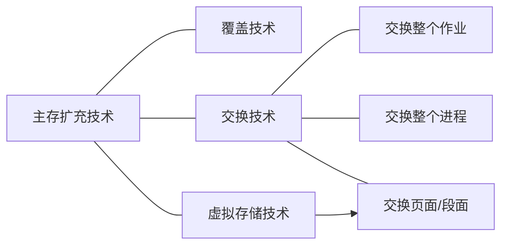

### 主存扩充技术实质

目的：将小的实存储器（实存）扩充为大的虚存储器（虚存）

实质：将磁盘空间虚拟成内存使用

结果：将进程的一部分装入内存，即可运行

### 局部性原理

时间局部性：最近访问过的程序代码和数据很快又被访问。

空间局部性：某存储单元被使用之后，其相邻的存储单元也很快被使用。

程序在执行过程中的一个较短时间内，所执行的指令地址或操作数地址分别局限于一定的存储区域中。

### 覆盖技术

程序运行过程中，在不同时刻把同一存储区分配给不同程序段或数据段，实现**存储区共享**的一种内存分配技术。

> 覆盖技术通常与**单一连续区分配、固定多分区分配和动态分区分配**等存储管理技术配合使用。

每一个用户程序被分为若干段：

非覆盖段—一部分是经常要用的基本部分，作为常驻段

可覆盖段一另一部分不经常使用，可以让它们在需要时临时装入。不同时使用的段可组为一组可覆盖段。

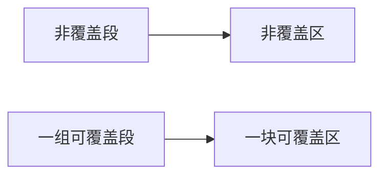

### 交换(Swap)技术

将内存中某进程暂时不用的程序和数据全部或部分）写入外存交换区中，腾出来的内存空间供其它进程使用。待需要时或内存有空闲空间时，再将它从外存交换区装入内存

#### 交换技术实现要点

磁盘上设置“磁盘交换区”

> 磁盘交换区是一个数据的暂存处。系统可根据内存的“拥挤”程度将信息调往交换区或者从交换区调入

#### 文件区和交换区的区别

操作系统管理下磁盘空间被划分为：文件区和交换区。

!>**存储方式不同：**文件区信息以文件形式存放，为了提高空间利用率，一般采取**离散存储**方式；而交换区信息按字符流方式存放，多采用**连续存储**方式

!>**访问速度不同：**文件区存储空间特别大，为了提高检索效率一般通过建立目录对文件实现访问，也就是**间接地址访问**；而交换区空间较小，可按外存地址**直接访问**，因此访问速度快。

!>**存储时间不同：**文件区适合于较长久的数据存储；而交换区作为临时数据的存放处，只存放短期的数据。

#### 交换技术的应用

交换整个作业——用于单道系统（单道模拟多道）

交换整个进程——用于连续分区存储管理（进程挂起、激活，中级调度）

交换页面/段面——用于分页、分段存储管理（此即为虚拟存储技术）

### 虚拟存储技术

一个进程运行时，可不必将其全部装载到内存中只须把当前运行的部分程序和可能访问的数据块装入内存即可。

随着进程运行的不断推进，其余部分程序和数据可随时装入。

这样做可实现小内存运行大程序的设想

> 采用虚拟存储技术以后，从逻辑上说，系统拥有一个容量很大的存储器，这就是人们常说的虚拟存储器。
>
> 虚拟存储器的特性：
>
> - 离散性
> - 多次性
> - 对换性
> - 虚拟性

#### 虚拟存储实现技术

基于分页的虚拟存储令$\iff$页面换入换出

基于分段的虚拟存储$\iff$段面换入换出

基于段页的虚拟存储$\iff$页面换入换出

## 请求分页存储管理

### 基本原理要点

- 内存分大小相等的帧（Frame）
- 进程按照帧的大小被分成若干页（Page）
- 进程仅装入部分页面，即开始执行
- 在执行过程中访问的页若已在内存，进行动态的地址重定位，执行指令（同基本分页存储管理）
- 在执行过程中访问的页未装入内存时，产生缺页中断，进程阻塞，等待从磁盘动态装入页面
- 缺页装入以后，进程转入就绪，可以参与调度继续执行
- 内存无空闲可用帧时，暂时不用的页面可换出到交换区
- 通过页面的换入换出，实现小内存运行大进程

### 数据结构

- 位示图
  - 系统设置一张位示图，记录内存划分为多少个帧，帧用一个0/1记录该帧占用还是空闲。

- 页表
  - 为一个进程设置一张页表，记录该进程分了多少页、每一页是否已装入内存、内/外存地址、访问权限等的相关管理信息。
  - 与基本分页存储管理的页表相比：扩充页表的内容，增加驻留标志位和页面辅存的地址等信息。

### 地址重定位机制

当一个进程调度时，系统将其页表首址装入CPU中的页表控制寄存器。运行中用相对地址的高端部分作为页号去检索页表，看该页是否已在内存。

如果访问的页不在内存（发生缺页中断），在缺页中断处理过程中，装入缺页，继续地址重定位

### 缺页中断与缺页中断处理过程

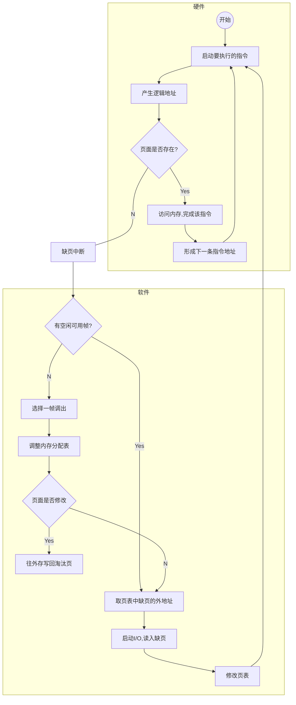

#### 缺页中断的断点

缺页中断是指令执行**过程中**产生的中断，而（一般的中断）在一条指令执行完成后产生的。

#### 缺页中断的断点压入

当CPU执行指令希望访问一个不在内存的页面时，将生缺页中断，系统开始运行中断处理程序。

此时指令计数器（PC）的值尚未来得及增加就被压入堆栈，因此**压入的断点必然是本次被中断的指令地址，而非下一条指令的地址**。

#### 缺页中断处理过程

1. 保留进程上下文
2. 判断内存是否有空闲可用帧？
   - 若有，则获取一个帧号No，转(4)启动I/O过程。
   - 若无，继续(3)。
3. 腾出一个空闲帧，即：
   1. 调用置换算法，选择一个淘汰页PTj。
   2. PTj(S)=0;//驻留位置0
   3. No=PTj(F);//取该页帧号
   4. 若该页曾修改过，则：
      1. 请求外存交换区上一个空闲块B
      2. PTj(D)=B; //记录外存地址
      3. 启动I/O管理程序，将该页写到外存上。
4. 按页表中提供的缺页外存位置，启动I/O，将缺页装入空闲帧No中。
5. 修改页表中该页的驻留位和内存地址。PTi(S)=1; PTi(F)=No。
6. 结束

### 页面分配算法与分配策略

#### 页面分配相关讨论

- 实践证明，如果一个进程在内存中分配的帧数比较少，尽管有局部性原理，缺页率仍然相对较高——分配帧数太少不合适
- 给特定进程分配的内存空间超过一定的大小后，由于局部性原理，该进程的缺页率没有明显的变化
- 分配给一个进程的帧数越多，在任何时候驻留在内存中的进程数就越少，从而降低了操作系统至少找到一个就绪进程的可能性，降低了CPU的利用率——分配帧数太多不合适

#### 给特定进程分配合理的内存帧数

目前流行的支持多字节指令的计算机系统中，一条指令需要对源操作数和目的操作数进行处理（通常是二地址指令），那么一个进程的运行空间最好不小于6个页面。

> 请求分页系统中的页面分配应当以**减少缺页率**为目标。
>
> **需考虑因素：**指令格式、寻址方式、程序长度、页面走向程序的工作集尺寸、多道并发度等。

#### 常用页面分配算法

- 平均分配法：系统的可用空间平均分配给所有进程，让它们都占有相等数量的帧。

>这样分配对短作业来说是很有利的。
>而对于一些较大的进程，缺页率必然居高不下

- 优先权分配法：考虑进程的优先运行权，给高优先的进程分配较多的帧，使它的缺页率相对少一些。

> 这里，我们可把优先权理解为高响应比、高优先级、最短剩余时间优先等。

- 比例分配法：这种分配方法比较公平，小进程分配小空间，大进程分配大空间

> 当可用空间为M个帧，系统当前的进程数为n，每个进程的页面数量为$s_i$，那么按比例分配法，应当分配给进程$i$的页数$p_i$为：
> $$
> p_i={s_i\over \displaystyle\sum_{j=1}^n S_j}×M
> $$

#### 页面分配策略

- 固定分配策略：为一个进程在内存中分配固定数目的页框用于执行时使用。

- 可变分配策略：允许分配给一个进程的帧及帧的数目在该进程的生命周期中不断地发生变化

> 缺页率高，可增加分配的帧；
>
> 缺页率很低，可适当减少分配的帧。

### 页面置换算法概述与OPT

> **页面置换：**是指在内存空间没有空闲可用帧而又要装入新页时，必须按某种算法将内存中的某页置换为一个新页
>
> 换出的：从内存换到外存（磁盘交换区或文件区）
>
> 换入的：从外存（磁盘交换区或文件区）换到内存

页面置换策略

- 局部置换策略：仅在产生这次缺页的进程的驻留页中选择并置换

- 全局置换策略：把内存中所有未被锁定的页都作为置换的候选页，不管它们属于哪一个进程。

  #### 页面分配策略+页面置换策略

|              |                           局部置换                           |                           全局置换                           |
| :----------: | :----------------------------------------------------------: | :----------------------------------------------------------: |
| **固定分配** | - 分配给一个进程的页框数是固定的 - 从分配给该进程的页框中选择被置换的页 |                           无此方案                           |
| **可变分配** | - 分配给一个进程的页框数可以变化 - 从分配给该进程页框中选择被置换的页 | 从内存中所有可用页框中选择被置换的页，这导致进程驻留集大小不断变化 |

#### 页面置换要点

策略前提：固定分配+局部置换

发生背景：发生缺页中断+内存无空闲可用帧

完成功能：从进程自己的驻留页中选择一页作为淘汰对象换岀，然后换入所缺页

选择策略：页面置换算法

#### 常用的页面置换算法

##### OPT-最佳置换

!>该算法**选择以后不再使用的、或者要隔最长时间才能使用的页面**予以淘汰。OPT算法尽量避免刚调出去又要立即调入，是一种理想化了的页面置换算法。

例：可用页框（帧）数量为3，引用串如下：7 0 1 2 0 3 0 4 2 3 0 3

|   引用串    |  7   |  0   |  1   |       2        |  0   |       3        |  0   |       4        |  2   |  3   |       0        |  3   |
| :---------: | :--: | :--: | :--: | :------------: | :--: | :------------: | :--: | :------------: | :--: | :--: | :------------: | :--: |
|     帧1     |  7   |  7   |  7   | $\color{red}2$ |  2   |       2        |  2   |       2        |  2   |  2   |       2        |  2   |
|     帧2     |      |  0   |  0   |       0        |  0   |       0        |  0   | $\color{red}4$ |  4   |  4   | $\color{red}0$ |  0   |
|     帧3     |      |      |  1   |       1        |  1   | $\color{red}3$ |  3   |       3        |  3   |  3   |       3        |  3   |
| 缺页F/置换R |  F   |  F   |  F   |       R        |  _   |       R        |  _   |       R        |  _   |  _   |       R        |  _   |

$$
缺页率=7/12
$$

存在的问题：实际系统无法预知将来页面的访问情况

- OPT算法在实际系统中不易实现
- OPT算法**用于衡量实际页面置换算法的性能**

##### FIFO-先入先出

!> 系统选择驻留在内存中时间最长的页面**（最早装入的页面）**作为被淘汰的对象。这种算法的出发点是局部性原理，但是没考虑“先装入内存者有可能是主程序常驻模块”。

例：可用页框（帧）数量为3，引用串如下：7 0 1 2 0 3 0 4 2 3 0 3

|   引用串    |  7   |  0   |  1   |       2        |  0   |       3        |       0        |       4        |       2        |       3        |       0        |  3   |
| :---------: | :--: | :--: | :--: | :------------: | :--: | :------------: | :------------: | :------------: | :------------: | :------------: | :------------: | :--: |
|     帧1     |  7   |  7   |  7   | $\color{red}2$ |  2   |       2        |       2        | $\color{red}4$ |       4        |       4        | $\color{red}0$ |  0   |
|     帧2     |      |  0   |  0   |       0        |  0   | $\color{red}3$ |       3        |       3        | $\color{red}2$ |       2        |       2        |  2   |
|     帧3     |      |      |  1   |       1        |  1   |       1        | $\color{red}0$ |       0        |       0        | $\color{red}3$ |       3        |  3   |
| 缺页F/置换R |  F   |  F   |  F   |       R        |  _   |       R        |       R        |       R        |       R        |       R        |       R        |  _   |

$$
缺页率=10/12
$$

问题：最先装入的不一定是以后不用的。

- 例如C程序中的main函数部分，在整个程序的生命周期中使用频率都很高。

- FIFO算法容易理解和实现，性能并不总是很好

##### LRU-最近最久未使用

!> 系统选择内存中**当前距上次使用最远的页**予以淘汰。根据程序局部性原理，在较长时间里未被使用的页面，可能不会马上使用到。

实现时通常使用栈来组织各个驻留页，通过调整、维护栈来记录各驻留页被访问的先后顺序。

|              引用串               |       7        |       0        |       1        |  2   |        0        |        3        |        0        |  4   |  2   |  3   |  0   |  3   |
| :-------------------------------: | :------------: | :------------: | :------------: | :--: | :-------------: | :-------------: | :-------------: | :--: | :--: | :--: | :--: | :--: |
|    帧1 (栈顶-刚刚访问的页)    | $\color{red}7$ |       0        |       1        |  2   | $\color{blue}0$ |        3        | $\color{blue}0$ |  4   |  3   |  3   |  0   |  3   |
|                帧2                |                | $\color{red}7$ |       0        |  1   |        2        | $\color{blue}0$ |        3        |  0   |  2   |  2   |  3   |  0   |
| 帧3 (栈底-最近最久未访问的页) |                |                | $\color{red}7$ |  0   |        1        |        2        |        2        |  3   |  4   |  4   |  2   |  2   |
|            缺页F/置换R            |       F        |       F        |       F        |  R   |        _        |        R        |        _        |  R   |  R   |  R   |  R   |  _   |

$$
缺页率=9/12
$$

分析：

- 优点：缺页中断率接近OPT
- 缺点：几乎每一次页面访问都要调整栈，系统开销大

 

##### CLOCK

!> 这是一个建立在循环检测基础上的**LRU近似算法**，试图以较小的开销获得接近LRU的性能。该算法中**将驻留页组织成一个循环队**，并设一个循环移动指针。

实施步骤：

- 初始时，该指针指向循环队的头部。
- 指针顺序搜索各页面，若页面访问位为1，则将之改为0；
- 找到的第一个访问位为0的页面，淘汰；新换入的页面访问位置为1

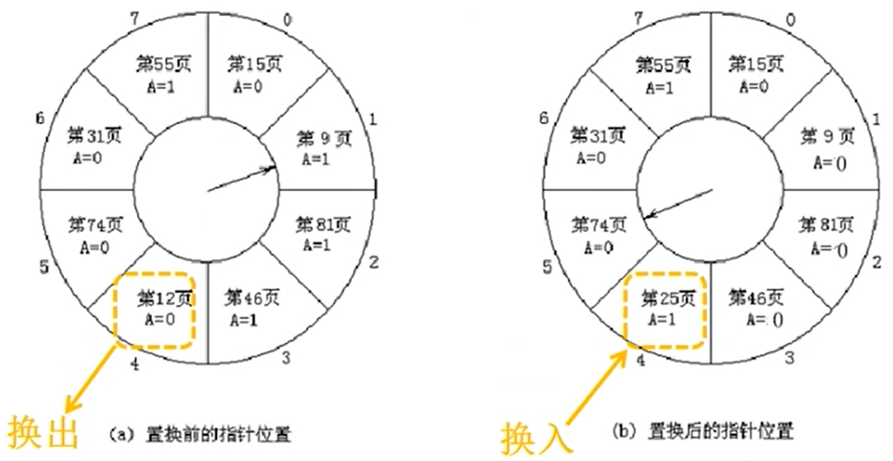

应用分析：

- CLOCK是近似的LRU，理论上的缺页中断率肯定高于LRU，但实际系统应用起来系统开销少，效果要好于LRU。

问题：驻留页有被修改过的，也有未被修改过的，这两种页面被换出时的操作开销大为不同

 

##### 改进的CLOCK

> 一个提高Clock算法效率的方法是：除了访问位A之外，为每个帧增设一个关联的
> “修改位”，记作M。
>
> 如果M=1表示该帧中的页面被修改了，淘汰它意味着必须将之写到外存。
>
> 如果M=0表示该帧中的页面没被修改，淘汰它意味着什么都不用做。

驻留页的四类页面：

- 0类页面-A=0，M=0：该帧中所存的页面最近没有访问，也没有修改。
- 1类页面-A=0，M=1：最近没有访问，但修改了。

处理过程：

1. 从指针当前位置开始，循环扫描候选帧，遇到的第1个A=0且M=0的帧，将该帧中的页面置换后返回。
2. 若循环一周没有找到可置换的帧，则继续循环扫描第二周，遇到的第1个A=0且M=1的帧，将该帧中的页面置换后返回在这个过程中，每跳过一个帧就将它的访问位A设置为0。
3. 若第二圈仍没有找到可置换的帧，则循环扫描第三圈，操作同第一圈。
4. 若第三圈仍没有找到可置换的帧，则循环扫描第四圈，操作同第二圈，必将能够找到一个可置换的帧

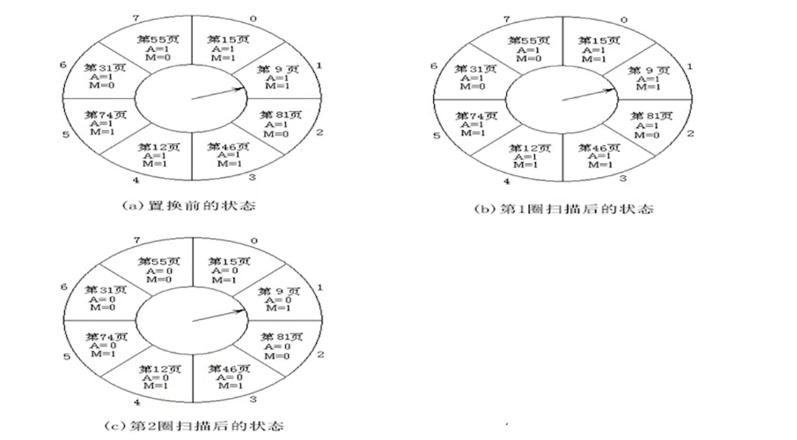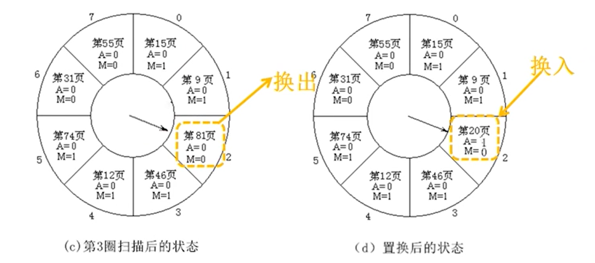

几种算法的性能比较

- 置换算法的选择，将直接影响到内存的利用率和系统效率。

- 对于上述四种算法，计算机学者Baer曾于己于1980年做过一个实验，选取的页面尺寸为256个字，分别实验了6、8、10、12、14帧的情况
- 当分配的帧数较多时，四种算法的区别不太明显；而当分配的比较少时，它们的区别就相当显著了。

#### 关于页面调入的进一步讨论

##### Q1：页面什么时候调入？

> 在页面动态装入过程中有两个页面调入策略
>
> - “随用随调”策略
>
>   发生缺页中断时，缺哪页便调入哪页。
>
> - “预调页”策略
>
>   使用第1页，发生缺页中断，在调入第1页时连同第2、
>   3…页一起调入。

“预调页”策略的优点：

- 一次读多个连续的页面，可以减少磁头移动的时间，对系统效率提高有很大好处。
- 当发现缺页已在内存时，当前进程不必让出控制权，仅仅将缺页转移到用户区，修改页表后就可继续运行

##### Q2：缺页从哪儿调入？

- 从**磁盘交换区**中调入缺页
- 从**磁盘文件区**中调入缺页
- 从**磁盘缓冲区**中调入缺页

##### Q3：缺页调入需要多长时间？

1. 从磁盘交换区中调入缺页
   - 调入时间主要是读磁盘扇区的时间，由磁盘寻道时间、盘片旋转延迟时间和数据传送时间3部分组成（设备管理部分详细涉及）。
   - 通常，调入时间约为数百μs至数十ms
2. 从磁盘文件区中调入缺页
   - 对文件区的访问需要检索文件目录，找到文件的外存地址后再读磁盘扇区（文件管理部分详细涉及）
   - 其调入时间将数倍于从磁盘交换区中调入缺页的耗时，几十甚至几百毫秒。
3. 从磁盘缓冲区中调入缺页
   - 系统允许采用“提前读”的访问策略时，用户程序运行中产生的缺页有可能已经驻留在内存的磁盘缓冲区内。
   - 从该缓冲区内调入缺页的时间大体为数百ns。

##### 基本分页存储管理中的有效访存时间

在基本分页存储管理中，所有页面已在内存

设$t_1$为访问一次快存的时间，$t_2$为访问一次内存的时间，$p_{命中}$是访问快表命中率

则有效访存时间是：
$$
t=(1-p_{命中})×(t_1+2t_2)+p_{命中}×(t_1+t_2)
$$

##### 请求分页管理中不缺页时的有效访存时间

在请求分页存储管理中，不发生缺页时的这个访存时间t称为一个内存周期为ma

$t_1$为访问一次快存的时间，$t_2$为访问一次内存的时间，$p_{命中}$是访问快表命中率

$ma=t\\=(1-p_{命中})×(t_1+2t_2)+p_{命中}×(t_1+t_2)$

##### 请求分页综合有效访存时间T的估算

假定系统的一个内存周期为ma，调入缺页的时间为la，缺页率为$p_{缺页}$

那么：
$
T=(1-p_{缺页})×ma+p_{缺页}×(la+ma)\\
=ma-p_{缺页}×ma+p_{缺页}×1a+p_{缺页}×ma\\
=ma+p_{缺页}×la
$

##### 实例

> 已知一个采用了LRU置换算法的请求分页存储管理系统中，页面尺寸为4KB，内存访问速度为100(ns)次，快表访问速度为20(ns)/次，缺页中断处理时间为25(ms)次。今有一个长度为30KB的进程P进入系统，分配给P的存储块有3块，进程的所有页面都是在该进程运行中动态装入。若访问快表的命中率为20%，对应于下述页面访问序列：7,0,1,2,0,3,0，
> 4,2,3,0,3,2,1,2,0,1,7,0,1
>
> 请估算有效访存时间为多少？

### 驻留集、工作集与抖动的预防

#### 驻留集

> 进程已装入内存的页面的集合——与系统采用的页面装入和页面置换算法有关

- 驻留集尺寸
  - 进程驻留在内存中的页面数量——与系统采用的页面分配策略有关

- 驻留集尺寸对缺页率的影响
  - 如果将缺页率控制在上界与下界（比如0.1%~1%）之间，那么缺页率达到0.5%时的驻留集尺寸W将是比较适宜的。

#### 工作集

> 进程工作集指“在某一段时间间隔内，进程运行所需访问的页面的集合”。
>
> 一个进程的工作集$W(t,τ)$表示在时间$t-τ$到$t$之间进程引用的一串页面；工作集的尺寸记作$w(t,τ)$，指的是$W(t,τ)$中的页面数。
>
> 在进程执行期间可以容易地确定该进程对存储空间的需求，也就是它的工作集尺寸
>
> 操作系统可以用这种方法决定给谁分配更多的帧，以及哪个进程应当让出一些帧。
>
> 工作集可用于指导驻留集大小

- 工作集策略
  - 监视每个进程的工作集
  - 周期性地从一个进程的驻留集中移去那些不在它的工作集中的页
  - 只有当一个进程的工作集在内存中时，才可以执行
- 工作集策略的优点
  - 通过工作集调整驻留集，可降低缺页率
  - 通过工作集尺寸调整驻留集尺寸，可提高内存利用率
  - 优先调度工作集包含于驻留集的进程，提高CPU利用率
- 工作集策略的缺点
  - 根据过去预测将来的不准确性
  - 为每个进程真实地测量工作集是不实际的
  - τ的最优值是未知的，并且它在任何情况下都会变化

#### 抖动

>抖动(Thrashing)又称颠簸，指刚被调出去的页需要马上被调回，刚调回不久又要被调岀。频繁调入调出，使系统的大部分时间都花费在内存和外存之间的来回折腾上。
>
>抖动主要表现为磁盘I/O极度繁忙，而处理机大量时间空闲， CPU有效利用率降低

- 抖动产生的原因：归根到底是内存驻留的进程太多
- 抖动的预防措施
  - 在处理机调度中引入工作集策略
  - 采用局部置换策略防止抖动扩散
  - 挂起部分进程
  - L=S准则

> 这里是产生缺页的平均时间，S是系统处理缺页的平均时间。
>
> 理论证明，当LS是处理机的利用率最高。在实际系统中很难实现。

## 请求分段式存储管理

### 基本原理

> 进程按照逻辑结构分段。每一段装入内存一块连续存储区，各段离散存储
>
> 每个进程装入部分段面，就可以开始运行。
>
> 运行过程中，发生缺段，进程阻塞，通过缺段中断动态调入所缺段，进程转入就绪可参与调度继续执行。

### 地址重定位

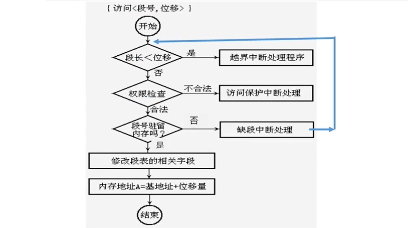

### 数据结构

- MAT表、空闲分区表——记录内存分区使用情况

- 段表(ST, Segment Table)
  - 为了实现段的动态管理，为每个进程设置一个段表ST，并在ST中设立一些“控制位”记录该段的控制信息
  - 段表结构：

| 段号 | 内存基址 | 外存地址 | 长度 | 访问权限 | 驻留位 | 访问位 | 修改位 | 增补位 |
| :--: | :------: | :------: | :--: | :------: | :----: | :----: | :----: | :----: |
|  #   |    B     |    D     |  L   |  R/W/E   |   S    |   A    |   M    |   C    |

### 缺段中断机制

与缺页中断类似，缺段中断也是**指令执行过程中产生**的中断，进程执行一条指令产生缺段中断时，压入堆栈的断点是当前指令的地址。当缺段被装入内存后，该段变成了“实段”。进程再次恢复运行时，CPU将重新执行这条指令。

### 缺段中断处理程序

当第$i\#$段是一个缺段，则缺段中断处理过程为

1. 阻塞进程。
2. Length←STi（长度）。
3. 检索“内存分配表”，若存在一个独立的内存块长度≥Length，则：
   1. 将该内存块分配给进程
   2. 首址记入B0；转（6）
4. 若内存可用空间总和<Length，则：
   1. 调用某种置换算法，选择一个内存中的段。
   2. 若该段被修改过，则，将它写回外存。
   3. 修改“内存分配表”、段表等数据结构。
   4. 转（3）

5. 内存各进程浮动，拼接出一个足够大的内存空间；将该内存块分配给进程；首址B0。
6. 从外存读入缺段，存入B0处
7. $STi(B)←B0；STi(S)←1$。
8. 修改内存分配表。
9. 唤醒进程。
10. 结束

## 请求段页式存储管理

### 基本原理

> 请求分段加请求分页。把段划分为若干个页面进行离散存储。
>
> 系统将一个段的当前页面调入内存其余的仍驻留在外存上，随时需要随时通过缺页中断装入。

- 硬件支持

  - 处理机中设有段表控制寄存器参与地址映射，存放的内容是段表起始地址和段表长度。在地址结构方面，页面长度和分段长度由系统对控制寄存器的安排来决定。

- 软件支持
  - 在请求段页式管理系统中，缺页置换算法是必须的，而且与纯粹请求分页管理机制中采用的算法相同。

### 地址重定位

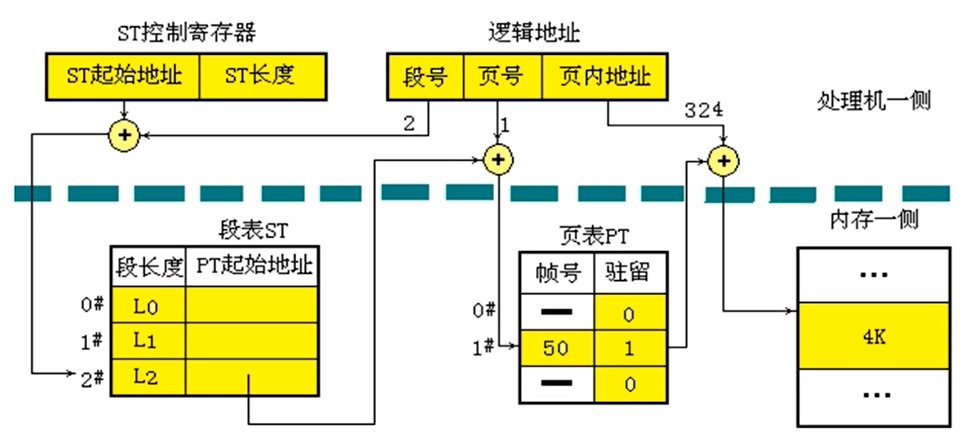

- 优点：请求段页式管理具有虚拟存储器的功能，并保持了页式管理的优点：既体现段的独立性，又纳入了页的离散分配，使系统更加灵活。

- 缺点：增加了硬件的成本，系统复杂性提高，而且段表和页表的存储与检索问题突出，对处理机的运行速度影响较大

## 与地址有关的计算专题

> 逻辑地址（相对地址）——用户地址空间
>
> 物理地址（绝对地址）——实际内存单元地址
>
> 虚地址——虚拟存储空间的逻辑地址
>
> 实地址——实际内存单元地址
>
> 逻辑地址$=^{地址重定位}\implies$物理地址
>
> 虚地址$=^{装入并地址重定位}\implies$实地址

- 例1.分页地址合成计算

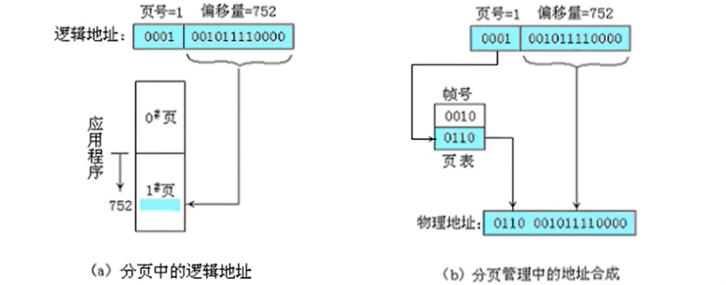

- 例2.分段地址合成计算

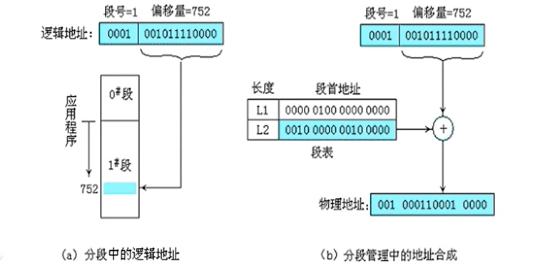

- 例3.段页式地址合成计算

> 系统32位地址空间。其中，段地址占11位，段内偏移地址占21位。在段内偏移地址中，页地址占11位，页内偏移部分占10位。
>
> 二进制地址：0000000010 | 000000001 | 1101000100
>
> 对应十进制地址为：<2,1,836>。
>
> 当2#段的1#页的帧地址中存放的是11111001100（十进制的1996），则物理地址将是00000000000111110011001101000100

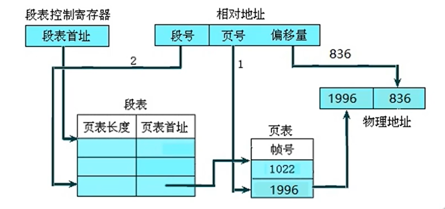

- 例4.填空

> 分页存储管理系统中用户程序的逻辑地址是（一）维地址；
>
> 分段存储管理系统中用户程序的逻辑地址是（二）维地址。

- 例5.逻辑地址到物理地址的转换

> 说明：页大小为1024B，页表如图所示，将逻辑地址1011、2148、5012转换为相应物理地址。

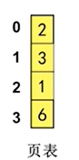

过程：

1011/1024=0$_{(页号)}$…1011$_{(页内偏移)}$，2$_{(页号对应帧)}$×1024$_{(页大小)}$+1011$_{(页内偏移等同帧内偏移)}$=3059

2148/1024=2…100，1×1024+100=1124

5012/1024=4…916，页号4不存在

答案：3059、1124、逻辑地址非法 

- 例6.逻辑地址到物理地址转换例

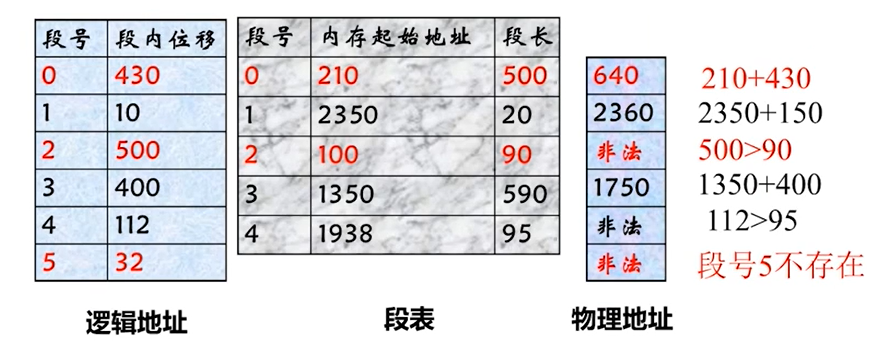

- 