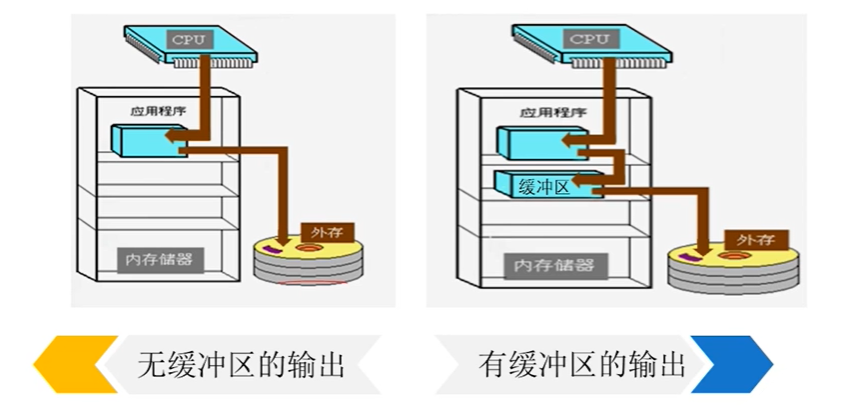

# 设备管理

## 概述

> 管理对象--“外部设备”
>
> 在计算机系统中，用来担负数据输入输出的部件称作**外部设备**（Peripheral），简称“外设”，它们是计算机与外部世界进行信息勾通的桥梁
>
> 外部设备包括键盘、鼠标、打印机、卡片机磁带机、磁盘机等以及有关的支持设备。

- I/O设备
  - 人可读
  - 机器可读
  - 通信

- 外存储设备
  - 数据速率
  - 应用
  - 控制的复杂性
  - 传送单位
  - 数据表示
  - 错误条件
- 设备管理模块是操作系统中最庞大最复杂的一个模块

- 设备管理目标
  - 方便用户使用
  - 提高设备利用率
  - 通过管理调度提高I/O效率
  - 通过软件方法扩充设备功能
- 设备管理功能
  - 设备分配、回收
  - 设备无关性（设备独立性）
  - 缓冲区的设置和管理
  - 设备的驱动与调度
  - 设备的虚拟扩充
- 逻辑I/O层的功能
  - 负责设备的分配和回收。通过设置和维护数据结构，对设备数据进行登记和管理。
  - 负责对用户的访问需求（如read或write）进行合法性检查。若此次访问不合法时，将拒绝访问
  - 负责随时接收下层的处理结果，整理后反馈给用户。处理结果中包含成功或失败信息。

- 物理I/O层的功能
  - 管理内存中的设备缓冲区，负责缓冲区的分配和回收。
  - 实现数据的装入与提取，比如从上层软件送来的一行数据填入缓冲区或者从缓冲区取出一行数据送给用户。同时，要实现诸多用户对缓冲区访问的并发控制。
  - 根据用户请求生成一个具体的I/O任务块**IOB**，挂到相关设备的任务队列上，并启动下层软件。

> **lOB（ Input Output Block）**
>
> IOB是一种动态数据结构，每个IOB用于描述一项输入输出任务。
>
> 当系统收到一个I/O请求时就构造一个IOB，并按IOB的信息进行传输控制。
>
> > |        IOB         |
> > | :----------------: |
> > |      进程标识      |
> > |      内存地址      |
> > |      传输方向      |
> > |      传送数量      |
> > | 设备（及控制器）号 |
> > |      链接指针      |
>

- 设备调度与驱动层
  - 主要包括的功能有：
    - 设备调度，如磁盘I/O调度。
    - 构造通道程序。
    - 启动I/O设备完成输入输出。
    - 对于设备I/O的情况进行收集并交给上层软件

## 设备的分配

> 共享设备是允许多用户穿插访问的设备，此类设备不能分给某个用户独占。
>
> 设备分配是用户对独享设备的使用方式。用户分得台独享设备后可以自由地使用，直到使用完毕将设备释放为止。
>
> 当用户请求进行I/O操作时，不但要分配设备，还要分配有关的数据传输通路，也就是分配通道和控制器

- 系统设备表SDT（System Device Table）
  - 系统设置一张SDT，登记系统拥有的所有**设备类型**，一行登记一类设备的管理信息。

例：

| 设备类型 | 访问方式 | 设备可用量 |  DCT指针  | 驱动程序入口 |
| :------: | :------: | :--------: | :-------: | :----------: |
|   PRN    |   输出   |     2      | DCT[0052] |     ***      |
|   SCA    |   输入   |     2      | DCT[0062] |     ***      |
|   COM    | 输入输出 |     1      | DCT[0071] |     ***      |
|   DSK    | 输入输出 |     1      | DCT[0100] |     ***      |

- 设备控制表DCT（Device Control Table）
  - 系统设一张DCT，登记所有外部设备，一行登记登记一台设备的管理信息

例：

| 设备类型 | 设备标识Did | 属性 | 设备状态 |  CCT指针  | 重复次数 | 任务队列指针 |
| :------: | :---------: | :--: | :------: | :-------: | :------: | :----------: |
|   PRN    |    0051     | 独享 |   忙碌   | CCT[1000] |    3     |     ***      |
|   SCA    |    0051     | 独享 |   空闲   | CCT[1001] |    3     |     ***      |
|   COM    |    0053     | 独享 |   空闲   | CCT[1001] |    5     |     ***      |

- 逻辑设备映射表LUT
  - 分配结果记入每个进程的PCB，称作LUT

### 设备分配过程

1. 根据用户提出的逻辑设备名称，从SDT中找到相应类型的逻辑设备，并获取该类型设备的可用数量N，据此进行安全检测（银行家算法），如果检验不通过，则将进程阻塞。
2. 从SDT中取出设备控制表指针，查找DCT，找到一台可用的外部设备。将设备分配给进程。
   在该进程的PCB中建立一个设备映射表LUT，将用户的逻辑设备名称和对应的物理设备标识对应起来。

> 通过设备分配实现了**设备无关性**：
>
> 又称为设备独立性，指的是应用程序所涉及的逻辑设备与系统中具体使用的物理设备是互相无关的。

- 设备无关性的优点
  1. 设备分配的灵活性提高：进程使用**逻辑设备名**提出请求，系统可以从当前空闲的**物理设备**中任选一台分给用户。
  2. 易于实现I/O重定向：系统可以在不更改应用程序代码的前提下，让程序中LO命令所涉及的逻辑设备名映射到另外的物理设备上。

## 缓冲区的设置与管理

> 缓冲区，是位于内存中的一块临时存储区，作为内存和外部设备之间数据传送的桥梁。

- 设置缓冲区的目的
  - 改善中央处理器与外围设备之间速度不匹配的矛盾
  - 协调逻辑记录大小与物理记录大小不一致
  - 提高CPU和I/O设备的并行性
  - 引入缓冲技术后的系统，呈现以下特点：
    - 减少设备驱动次数。
    - 可以缓解I/O操作对缺页置换策略的干扰。
    - 缓解CPU与外部设备速度不匹配的矛盾，使数据处理的速度提高。
- 缓冲技术带来的
  1. 进程执行写操作输出数据时，向系统申请个缓冲区，若为顺序写请求，则不断把数据填到缓冲区，直到被装满。
  2. 此后，进程继续它的计算，系统将缓冲区内容写到IO设备上。 
  3. 在输出数据时，只有在系统还来不及腾空缓冲而进程又要写数据时，它才需要等待
  4. 大部分时间，进程的计算和输出是可以并行的

> **真题**
>
> 某文件占10个磁盘块，现要把该文件磁盘块逐个读入主存缓冲区，并送用户区进行分析。假设一个缓冲区与一个磁盘块大小相同，把个磁盘块读入缓冲区的时间为100μs，将缓冲区的数据传送到用户区的时间是50μs，CPU对一块数据进行分析的时间为50μs。在单缓冲区和双缓冲区结构下，读入并分析完该文件的时间分别是（B）
>
> A.1500μs、1000μs			B.1550μs、1100μs			C.1550μs、1550μs			D.2000μs、2000μs

...

------

> **UNIX操作系统采用的缓冲注**
>
> 缓冲池是系统提供的一种共享结构，不归某个进程所有
>
> 任何程序都可以申请缓冲池中的一个存储块，用来存放自己的缓冲数据。
>
> 缓冲块组成3个队列：
>
> 1. 空闲缓冲队列`emq`：该队列上挂有全部可用的空闲缓冲区。
> 2. 输入队列`inq`：该队列上挂有装满输入数据的缓冲区。
> 3. 输出队列`outq`：该队列上挂有装满输出数据的缓冲区。

## 磁盘读写速度分析

- 磁盘性能参数
  - 寻道时间$t_s$：将磁头臂移到指定磁道所需要的时间
    - $T_s=s+m×n$
    - **s-磁盘启动时间，m-平均跨越一道的时间，n-跨越的道数**
  - 旋转延迟时间$t_r$：将磁盘的待访问地址区域旋转到读/写磁头可访问的位置所需要的时间
    - $T_r={1\over 2r}$
    - **r-旋转速度（转/秒）**
  - 传输时间$t_t$：读或写操作的数据传输所需的时间
    - $T_t={b\over rN}$
    - **b-要传送的字节数，r-转速，N-一个磁道中的字节数**
  - 一次磁盘访问时间T是下述3部分的总和，即：$T=t_s+t_r+t_t$

## 磁盘调度算法

> $T=t_s+t_r+t_t\\=s+m×n+{1\over 2r}+{b\over rN}$

- 如何提高磁盘I/O速度？
  - 研制更高性能的设备，加快其读写速度
  - 设置高速大容量的设备缓冲区。
  - **采用好的I/O调度算法。**

> 磁盘调度程序的目标是制定一种访问策略，使磁头臂移动较少的距离就可完成磁盘访问
>
> 对于r次磁盘访问请求q1，q2，…，qr，应用某种磁盘调度算法得到一个依次满足各次请求的顺序，期间磁臂总共跨越的道数为n
>
> **定义：**$平均寻道长度={n\over r}$

- 磁盘调度算法

  - **先来先服务FCFS：**按磁盘访问请求到来的先后顺序进行服务

    - 优点：比较公平，实现简单
    - 缺点：不考虑调度效率
    - 平均寻道长度为640/8=80

​    

  - **最短寻道优先SSTF：**从当前磁头位置选择最短寻道时间的请求，即选择与当前磁头位置最近的待处理请求。

    - 优点：
      - 较FCFS提高了性能
      - 平均寻道长度29.5 VS 80
    - 缺点：
      - 有可能出现“粘着”现象
      
      - 系统比较繁忙时，可能出现“饥饿”现象
      
      - > 有一个被忽略的问题，磁臂转向也需要时间开销
    - 平均寻道长度为236/8=29.5

 

  - **扫描算法SCAN：**又称电梯调度，沿磁臂当前移动方向由近及远依次满足磁盘访问请求，至当前方向再无请求时磁臂转向，继续由近及远依次满足访问请求。
    - 需要知道磁头的当前位置和磁头当前移动方向。
    - 优点：
      - 较SSTF大大减少了磁臂转向次数
      - 尽管平均寻道长度增大，但在实际系统中效率较好
    - 缺点：系统比较繁忙时，仍可能出现“饥饿”现象
    - 平均寻道长度为299/8=37.375

  - **循环扫描算法C-SCAN：**SCAN调度的变种，在个移动方向上，随着移动不断处理请求。反向时空档返回，直到最远请求，然会转向移动时再处理请求处理请求。
    - 优点：较之SCAN减少了“饥饿”现象的出现
    - 缺点：空档返回增加了平均寻道长度
    - 平均寻道长度为322/8=40.25

- N-STEP-SCAN算法
- FSCAN算法
- ……

## 通道控制下的I/O

**I/O控制方式：**计算机系统中的O控制是与硬件的配置紧密相关的，分为以下4种方式：

- 程序查询控制方式
- 中断控制方式
- DMA控制方式
- 通道控制方式

**中断类别：**引起中断的原因很多，大体分为两大类

- 自愿性中断
  - 访管中断
  - 人为设置中断
- 非自愿性中断
  - I/O中断
  - 程序出错中断
  - 硬件故障置中断
  - 外部事件中断

**中断处理程序的处理过程：**

1. 关中断
2. 保护进程上下文

> - 注意，被中断的程序，除了PSW和PC中的信息已被硬件机制压栈，其余寄存器中尙有一部分残留数据。
> - 而中断处理程序运行时可能要用到其中一部分寄存器，因此需要将中断处理程序中涉及到的寄存器内容保存起来（通常也压入系统栈中）。

3. 设备中断处理（不同的设备有不同的设备中断处理程序）

> 在处理期间，处理机要检查相关设备控制器的状态，判断本次传输是否正常完成。
>
> 若正常完成，可将设备传送来的数据转交到用户区，并唤醒等待该数据的进程，或者将下一批要传送出去的数据传送到设备控制器中，重新启动设备。若为非正常完成，可根据发生的情况进行异常处理。

4. 恢复被中断的程序

> 首先将保存在栈中的寄存器内容弹出来，置入处理机的相关寄存器中。然后，从栈中弹出PSW和PC的值，置入处理机中。这就意味着，被中断的程序又恢复了运行

5. 开中断

### I/O过程的结束

### 通道

**通道：**I/O处理机

**通道指令：**

- 处理I/O过程的指令
- 是通道运行的程序，通常被置于内存的约定地址中。作为实通道指令施数据传送控制的依据，通道程序的编制主要依赖于SDT DCT和IOB中的信息。

## 虚拟设备

> 操作系统的设备管理模块通过软件方法扩充设备功能，获得“虚拟设备”。
>
> 包括
>
> - 将一台设备虚拟成多台设备
> - 将低速设备虚拟成快速设备
> - 将不能共享的设备虚拟成共享设备

### 一台设备虚拟成多台设备

- 打印机是一种独占设备
  - 系统为每一台打印机设置了一个打印队列；
  - 每一个进程的每一次打印请求被组织成一个IOB入队
  - 打印机独占，但打印任务队列可供多个用户或进程使用。
  - 在用户看来，好像有多台打印机在备用一样

- Spooling技术
  - Spooling是“联机外设并行访问”(Simultaneous Peripheral Operations On Line)的缩写，是**将磁盘空间虚拟成I/O设备**使用的一种技术。
  - Spooling的指导思想是，利用高速共享设备（通常是磁鼓或者磁盘将低速的独享设备模拟为高速的共享设备。这样，从逻辑上讲，计算机系统为每一个用户都配备了一台高速独享设备。
  - 是操作系统用于管理低速外部设备的一种实用技术。
  - 是将独享设备模拟成共享设备的一种技术。
  - Spooling的实现要点
    - 外存上设输入井、输出井
    - 内存设输入缓冲区、输出缓冲区
    - 系统设预输入程序和缓输出程序
    - 对于输入输出井的使用，系统设四个系统进程：
      - 收容输入、提取输入
      - 收容输出、提取输出进程

### 四个系统进程

- 收容输入
  - 该功能负责启动输入设备，将数据（或作业）从输入设备读进来，在文件管理系统的支持下，把数据存放到外存的输入井上。

- 提取输入
  - 从输入井上提取数据（或作业），送入内存的用户区中，供进程使用。

- 收容输出
  - 将用户进程需要输出的数据从其用户区取出来，送到输出井上。
- 提取输出
  - 到外存上取出输出井上的数据，送输出设备（比如打印机）上。