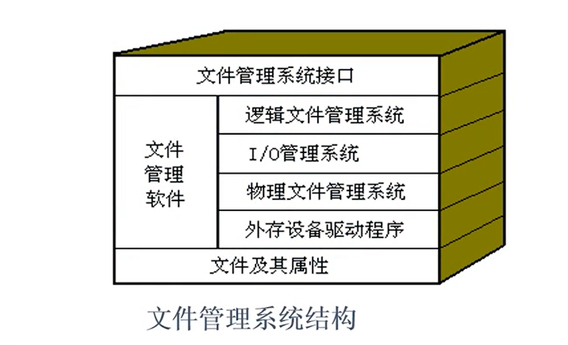
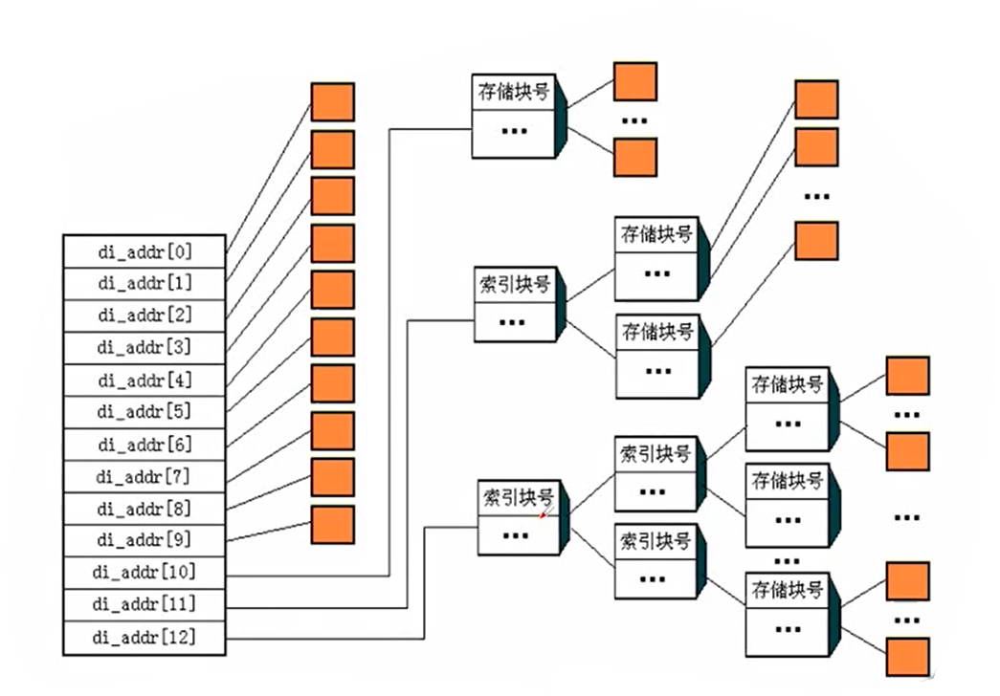

# 文件管理

## 概述

1. 用户关注的是逻辑层面的文件
   - 文件内容
   - 方便地使用
2. OS关注的是物理层面的文件
   - 怎么存储文件
   - 如何实现文件的读写
   - 如何快速存取
   - 如何提高磁盘存储空间利用率

> 在操作系统看来：
>
> - 文件是在逻辑上具有完整意义的组相关信息的集合。
> - 它可以是一组相关的字符流集合，也可以是一组相关的记录集合
> - 通常被保存在外存储器上。

### 内在形式-文件的组成和操作

- 文件组成
  - FCB（File Control Block）
  - 文件体
- 对文件要做的事情
  - 建立、描述
  - 存储、读写

- 文件管理系统FMS（File Management System）
  - FMS是操作系统的一个组成部分
  - 负责实现文件管理有关功能的管理模块
  - 管理对象是：文件、目录、文件存储空间、用户

- 文件管理系统的管理目标
  - 方便用户
  - 提高磁盘空间利用率
  - 文件操作便捷且存取效率高

- 文件管理系统的管理功能
  1. 按名存取
  2. 文件组织（逻辑文件与物理文件的转换）
  3. 存储空间管理
  4. 文件共享和保护
  5. 文件操作

- 公认一个好的FMS应具有以下特点
  1. 使用的方便性
     - 按名存取的实现，使文件的物理结构和存放的物理位置对于用户都成了透明的。
  2. 数据的安全性
     - 好的文件管理系统能提供有效的保护措施，以保证文件信息的安全。
  3. 接口的统一性
     - 用户可以使用统一的广义指令或系统调用来存取各种介质上的文件，这样做简单、直观，而且摆脱了对存储介质特性的依赖以及使用I/O指令所做的繁琐处理。
       - 操作员接口：如“文件”菜单各种命令
       - 程序员接口：如`fopen()`等文件操作系统调用

- 现代操作系统中比较著名的FMS
  - `Hpfs`：OS/2上的操作系统
  - `FAT`：最早用于MS-DOS，后用于 Windows系列及OS/2等操作系统，经过操作系统的不断改进，FAT又发展为FAT16、FAT32等。
  - `NTFS`：Windows及 Windows2000上的文件管理系统，安全性和可靠性比较好。

## 文件与目录

> 目录也是文件
>
> 目录是一种特殊的文件
>
> 目录的内容是另外一些文件的管理信息（FCB）

### 目录文件与文件目录

> - 目录是文件的一种，叫目录文件
>
> - 文件目录是目录文件中记录的一条信息
>
> - 文件目录与FCB有关
>   - 它可能是整条FCB———如DOS
>   - 也可能是FCB的一部分———如Unix、 Linux

- UNIX为什么要引入索引结点
  - 在多级目录结构中，目录也是以文件形式存放在磁盘上的；
  - 如果目录项内容较多，则目录文件要占用大量的盘块；
  - 查找文件要先查找它所在的目录；
- 目录文件太大，查找效率就会比较低；

## 文件的组织结构

- 文件有两种组织结构
  1. 文件的逻辑结构——是指呈现在用户面前的文件结构，是文件逻辑上的组织形式。
  2. 文件的物理结构——是指文件在存储介质上的存储结构，是文件在外存空间上的组织形式

| 文件的逻辑结构 | 文件的物理结构 |
| :------------: | :------------: |
|    流式结构    |    顺序结构    |
|   记录式结构   |    链式结构    |
|                |    索引结构    |

- 文件的逻辑结构--用户使用角度
  - 流式文件——是指文件内的数据是一个完整的字符流，不可以进一步细分。
    - 例如，源程序文件、可执行文件、文本文件、图片文件、声音文件等。
    - 对流式文件，用户常常以长度来指定所需存取的信息，也可以通过插入特殊符号来标识存取的界限。
  - 记录式文件——在逻辑上可看成是一组记录的集合。每个记录由彼此相关的若干个数据项组成。
    - 例如：统计表文件、数据库文件等记录式文件中的逻辑记录可依次编号，其序号称为逻辑记录号（简称记录号）。

- 文件的物理结构-操作系统存储角度
  - 连续存储结构——文件体在磁盘上占用连续的存储空间
  - 连续存储结构--文件体在磁盘上占用不连续的存储空间
    - 链接存储
      - 隐式链接存储
      - 显式链接存储
    - 索引存储

> 文件存取方式（存取≠存储）
>
> 1. 文件的顺序存取
>    - 按照文件的逻辑地址顺序存取。在记录式文件中，这种操作体现为按照记录的排列顺序来进行存取
> 2. 文件的随机存取
>    - 随机存取是指允许用户按照记录编号或者某一数据项的值随机存取任一记录。存取任一记录时间没有明显不同

### 文件的顺序存储结构

- 文件信息占用一组连续的盘块，文件在外存上顺序存放
- 文件目录中登记起始盘块和所占块数

> 顺序存储的文件称为连续文件。这种文件不仅在逻辑上是连续的，在外存上存放的空间也是连续的。

- 顺序存储结构的特点
  - 优点
    - 管理简单
    - 存取速度快
    - 既适合顺序存取，也适合随机存取
  - 缺点
    - 外存空间利用率低
    - 必须预先知道文件的长度
    - 不便于文件的扩展

## 文件的链式存储和索引存储

### 隐式链接存储结构

> 每个文件**占用不连续的盘块**，文件目录中只登记起始盘块和末盘块号，其它盘块号均由链接指针记录。

- 优点
  - 采用离散分配方式
  - 易于文件增长或收缩
  - 减少了外存空间出现外碎片的现象
- 缺点
  - 只能顺序存取
  - 指针本身需占用存储空间
  - 链接指针的可靠性是个问题

### 显式链接存储结构

> 将用于链接文件各盘块的指针“显式”地存放在外存的一张链接表当中
>
> 该表在整个磁盘仅设置一张，登记了分配给文件的所有盘块的链接关系，
>
> 故将该表称为——文件分配表FAT (File Allocation Table)

- 优点
  - 采用离散存储方式
  - 易于文件增长或收缩
  - 减少了外存空间出现外碎片的现象
  - 既可以顺序存取，又可以随机存取
- 缺点
  - FAT表占用较大的存储容量
  - FAT表使用时，占用较大内存空间
  - FAT表的读取、维护加大了系统开销

### 索引存储结构

> 为每个文件分配一个**索引块**，在索引块中登记其各逻辑块与外存物理块的对应关系，并在文件FCB中登记该文件索引块的地址

- 优点
  - 离散存储
  - 既适合顺序存取，也方便随机存取
  - 索引结构容易实现记录的增、删

- 缺点
  - 索引块实际是存储开销
  - 一个索引块能存放的盘块号有限，所以一级索引存储限制了文件的容量，需要建立二级甚至多级索引存储结构。

## 多级索引存储结构及相关计算

> 将索引表离散存储，即：将索引表本身分为若干个逻辑块，存储在若干物理盘块中，将索引表所占的各盘块号记入另一个索引表——索引表的索引表。
>
> 这种结构就称**两级索引结构**

### 索引存储结构有关计算

例如：一个盘块号用4个字节表示，盘块尺寸为4KB

那么：一个盘块可存放：$4KB/4B=1K个盘块号$

Q1：一级索引能够支持的存储容量是 $1K*4KB=4MB$

Q2：二级索引能够支持的存储容量是 $1K*1K*4KB=4GB$

Q3：三级索引能够支持的存储容量是 $1K*1K*1K*4KB=4TB$

### UNIX混合索引存储结构

> UNIX操作系统采用了**多级混和索引存储结构**
>
> 它将直接寻址、一级索引、二级索引和三级索引融为一体，规定每个文件的索引结点使用13个地址登记项。
>
> - 前10个登记项直接指出存放文件信息的盘块号，属直接寻址。
> - 第11个登记项指向一级索引块，内含若干级索引存储块
> - 第12个登记项和第13个登记项分别实现二三级索引。

若一个盘块号用4个字节表示，盘块尺寸为4KB，那么

Q1：UNⅨ允许的文件的最大长度是：

10个直接寻址 $10*4KB=40KB$

Q2：1个一级索引项能够支持的存储容量是：

$(4KB/4B)*4KB=4MB$ 

Q3：1个二级索引项能够支持的存储容量是：

$(4KB/4B)*(4KB/4B)*4KB=4GB$

Q4：1个三级索引项能够支持的存储容量是：

$1K*1K*4KB=4TB$

Q5：允许的文件的最大长度是：

$4TB+4GB+4MB+40KB$

> 不要混淆：索引节点与索引存储结构

## 文件目录的管理与查询

> 文件目录是一种数据结构，由若干目录项组成。

每个目录项对应其中一个文件的FCB，包括：

- 文件的存取控制信息
- 文件的结构信息
- 文件的管理信息

文件目录内容

- 文件存取控制信息
  - 如：用户名、文件名、文件类型、文件访问权限。
- 文件结构信息
  - 如：文件的逻辑结构、物理结构、文件位置、长度。
- 文件管理信息
  - 如：文件的建立日期、被修改的日期、保留日期和记帐信息

文件目录管理的主要目的

- 合理组织目录结构，提高对目录的检索速度
- 允许文件重名
- 实现“按名存取”
- 允许文件共享，以节约外存空间

> 树形目录结构的优点
>
> - 层次清楚便于文件分类
> - 解决了重名问题
> - 提高了文件检索的速度
> - 便于进行存取权限的控制

## 文件存储空间的管理

### 分配和回收

> 创建文件或者文件动态增长的时候，查找空闲的盘块，分配给文件
>
> 删除文件内容或者删除整个文件时，将文件所占盘块回收。

- 空闲区表/链
  - 磁盘上连续的空闲盘块组成一个“空闲区”，系统为磁盘上所有的空闲区建立张“空闲区表”，每个空闲区对应一个表项。
  - 若各空闲区使用链链接起来，称之为空闲区链”。

- 空闲块链
  - 建立一个链表，将文件存储空间中所有空闲块顺序链接在一起，链中每一结点记录个空闲块的物理块号，同时记录下一空闲块的指针，称为“空闲块链”。

> **空闲分区表和空闲块链的缺点：**
>
> 磁盘空间的管理看上去与内存空间管理类似，但是磁盘空间容量要大得多
>
> 所以上述数据结构：
>
> - 存储开销巨大
>
> - 查询、维护开销巨大

- 位示图
  - 系统划出若干字节，为每个文件存储设备建立一张位示图，位示图中的一个位（bit）对应文件存储空间的一个物理块。若该位为“1”，表示对应块被占用，若该位为“0”，表示对应物理块空闲。

> 与空闲区表链、空闲块链相比，位示图只用用1个b记录一个磁盘块的占用情况，比较节约空间，但是磁盘空间太大了，即使如此，位示图的空间开销依然很大，相应查询和维护的时间开销页很大
>
> 例如：磁盘640GB，1KB为个盘块，则磁盘共有$640GB/KB=640M$个盘块
>
> 即：位示图需要记录640M个bit, $640M bit/8=80MB$

## 文件共享与文件保护、保密

> **文件的共享：**是指允许不同的用户共同使用同一个文件
>
> **文件的保护：**是指防止文件被有意或无意地破坏。
>
> **文件的保密：**是指防止文件未经授权而被非法窃取。

### 文件共享

> **静态共享：多个用户共享同一个物理文件**
>
> 通过信息文件指针的链接实现。不同用户、不同的文件名，但其FCB中的物理地址是相同的，都指向文件存储间中相同的物理信息。
>
> **动态共享：多个进程并发地访问同一文件**
>
> 这种共享关系只有当用户进程存在时才可能存在，一旦用户进程消亡，其共享关系也就自动消失。

- 实现静态共享的方法
  - 绕弯路法
  - 基于索引结点共享法
  - 基于符号链共享法
  - 基于基本目录共享法

- 实现文件的动态共享
  - 指系统中不同的用户或同一用户的不同进程并发地访问同文件。
  - 多个进程对已打开文件的共享。
  - 这种共享关系只有当用户进程存在时才可能存在，一旦用户进程消亡，其共享关系也就自动消失。

### 文件保护

> 1. 防止系统故障造成破坏，常采用的措施
>
> - 定时转储
> - 建立副本
> - 后备系统
> - 磁盘容错技术
>   - 一级容错：写后读校验
>   - 二级容错：磁盘镜像
>   - 三级容错：磁盘双工
>
> 2. 防止人为因素造成的破坏，常采用的措施
>
> - 设置基于目录的存取权限
> - 建立基于文件的存取权限
> - 存取控制矩阵

### 文件保密

> 常用的保密措施
>
> - 设置口令
> - 隐藏文件目录
> - 加密与解密技术

