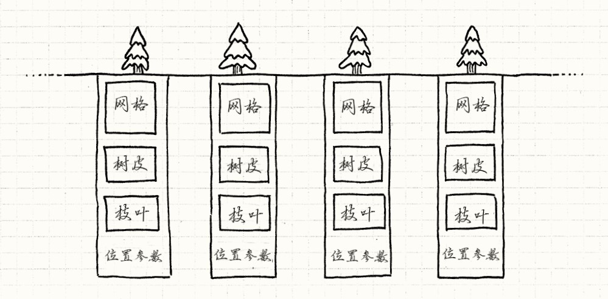
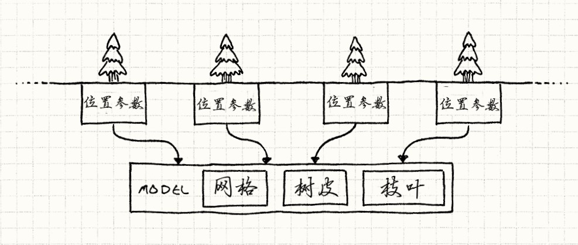

# 享元模式

> 迷雾散尽，露出了古朴庄严的森林。古老的铁杉，在头顶编成绿色穹顶。 阳光在树叶间破碎成金色顶棚。从树干间远眺，远处的森林渐渐隐去。
>
> 这是我们游戏开发者梦想的超凡场景，这样的场景通常由一个模式支撑着，它的名字低调至极：享元模式。
>
> ——摘自*《游戏编程模式》*

用几句话就能描述一片巨大的森林，但是在实时游戏中做这件事就完全是另外一件事了。 当屏幕上需要显示一整个森林时，图形程序员看到的是每秒需要送到GPU六十次的百万多边形。

我们讨论的是成千上万的树，每棵都由上千的多边形组成。 就算有足够的*内存*描述森林，渲染的过程中，CPU到GPU的部分也太过繁忙了。

每棵树都有一系列与之相关的位：

- 定义树干，树枝和树叶形状的多边形网格。
- 树皮和树叶的纹理。
- 在森林中树的位置和朝向。
- 大小和色彩之类的调节参数，让每棵树都看起来与众不同。



关键点在于，哪怕森林里有千千万万的树，它们大多数长得一模一样。 它们使用了相同的网格和纹理。 这意味着这些树的实例的大部分字段是*一样的*。

我们可以通过显式地将对象切为两部分来更加明确地模拟。 首先，将树共有的数据拿出来分离到另一个类中。游戏只需要一个这种类， 因为没有必要在内存中把相同的网格和纹理重复一千遍。 

游戏世界中每个树的实例只需有一个对这个共享`Model`的*引用*。 留在`Tree`中的是那些实例相关的数据



------

享元模式一般涉及的几种角色：

- **抽象享元角色（Flyweight）：**此角色是所有的具体享元类的基类，为这些类规定出需要实现的公共接口。那些需要外部状态的操作可以通过调用方法以参数形式传入。
- **具体享元角色（ConcreteFlyweight）：**实现抽象享元角色所规定的接口。如果有内部状态的话，可以在类内部定义。
- **享元工厂角色（FlyweightFactory）：**本角色复杂创建和管理享元角色。本角色必须保证享元对象可以被系统适当地共享，当一个客户端对象调用一个享元对象的时候，享元工厂角色检查系统中是否已经有一个符合要求的享元对象，如果已经存在，享元工厂角色就提供已存在的享元对象，如果系统中没有一个符合的享元对象的话，享元工厂角色就应当创建一个合适的享元对象。
- **客户端角色（Client）：**本角色需要存储所有享元对象的外部状态。

## 举个🌰

这个例子是：一个文本编辑器中会出现很多承载文本内容的**字面**，使用享元模式去实现这个文本编辑器的话，会把每个字面做成一个享元对象。

享元对象的*内部状态*就是这个字面，而字母在文本中的位置和字体风格等其他信息就是它的*外部状态*。

- 首先，创建抽象享元类，定义具体享元类的实现方法

```c#
    /// <summary> 抽象享元类 </summary>
    public abstract class Flyweight
    {
        public abstract void Operation(int extrinsicstate);
    }
```

- 创建具体享元类，这样我们就不用把每个字母设计成一个单独的类了，而是作为把共享的字母作为享元对象的*内部状态*

```c#
    // 具体的享元对象
    public class ConcreteFlyweight : Flyweight
    {
        // 内部状态
        private readonly string _intrinsicstate;

        // 构造函数
        public ConcreteFlyweight(string innerState)
        {
            //内部状态的获取
            this._intrinsicstate = innerState;
        }

        /// <summary> 享元类的实例方法 </summary>
        /// <param name="extrinsicstate">外部状态</param>
        public override void Operation(int extrinsicstate)
        {
            Console.WriteLine("具体实现类: 内部状态 {0}, 外在状态 {1}", _intrinsicstate, extrinsicstate);
        }
    }
```

- 建立享元工厂，负责创建和管理享元对象

```c#
    using System.Collections;

    /// <summary> 享元工厂 </summary>
    public class FlyweightFactory
    {
        // 最好使用泛型 Dictionary<string,Flyweighy>
        //public Dictionary<string, Flyweight> flyweights = new Dictionary<string, Flyweight>();
        public Hashtable Flyweights = new Hashtable();

        public FlyweightFactory()
        {
            Flyweights.Add("A", new ConcreteFlyweight("A"));
            Flyweights.Add("B", new ConcreteFlyweight("B"));
            Flyweights.Add("C", new ConcreteFlyweight("C"));
        }

        public Flyweight GetFlyweight(string key)
        {
            // 更好的实现如下
            //Flyweight flyweight = flyweights[key] as Flyweight;
            //if (flyweight == null)
            //{
            //    Console.WriteLine("驻留池中不存在字符串" + key);
            //    flyweight = new ConcreteFlyweight(key);
            //}
            //return flyweight;
            return Flyweights[key] as Flyweight;
        }
    }
```

> [!note|style:flat|label:哈希表（Hash table）|labelVisibility:visible|iconVisibility:visible]
>
> 散列表（Hash table，也叫**哈希表**），是根据关键码值(Key value)而直接进行访问的数据结构。也就是说，它通过把关键码值映射到表中一个位置来访问记录，以加快查找的速度。这个映射函数叫做散列函数，存放记录的数组叫做散列表。
>
> 给定表M，存在函数f(key)，对任意给定的关键字值key，代入函数后若能得到包含该关键字的记录在表中的地址，则称表M为哈希(Hash）表，函数f(key)为哈希(Hash) 函数。

- 客户端调用

```c#
    /// <summary> 客户端 </summary>
    class Client
    {
        static void Main(string[] args)
        {
            // 定义外部状态，例如字母的位置等信息
            int externalstate = 10;
            // 初始化享元工厂
            var factory = new FlyweightFactory();

            // 判断是否已经创建了字母A，如果已经创建就直接使用创建的对象A
            Flyweight fa = factory.GetFlyweight("A");
            if (fa != null)
            {
                // 把外部状态作为享元对象的方法调用参数
                fa.Operation(--externalstate);
            }

            // 判断是否已经创建了字母B
            Flyweight fb = factory.GetFlyweight("B");
            if (fb != null)
            {
                fb.Operation(--externalstate);
            }

            // 判断是否已经创建了字母C
            Flyweight fc = factory.GetFlyweight("C");
            if (fc != null)
            {
                fc.Operation(--externalstate);
            }

            // 判断是否已经创建了字母D
            Flyweight fd = factory.GetFlyweight("D");
            if (fd != null)
            {
                fd.Operation(--externalstate);
            }
            else
            {
                Console.WriteLine("驻留池中不存在字符串D");
                // 这时候就需要创建一个对象并放入驻留池中
                var d = new ConcreteFlyweight("D");
                factory.Flyweights.Add("D", d);
            }

            Console.Read();
        }
    }
```


运行结果：

```
具体实现类: 内部状态 A, 外在状态 9
具体实现类: 内部状态 B, 外在状态 8
具体实现类: 内部状态 C, 外在状态 7
驻留池中不存在字符串D
```

