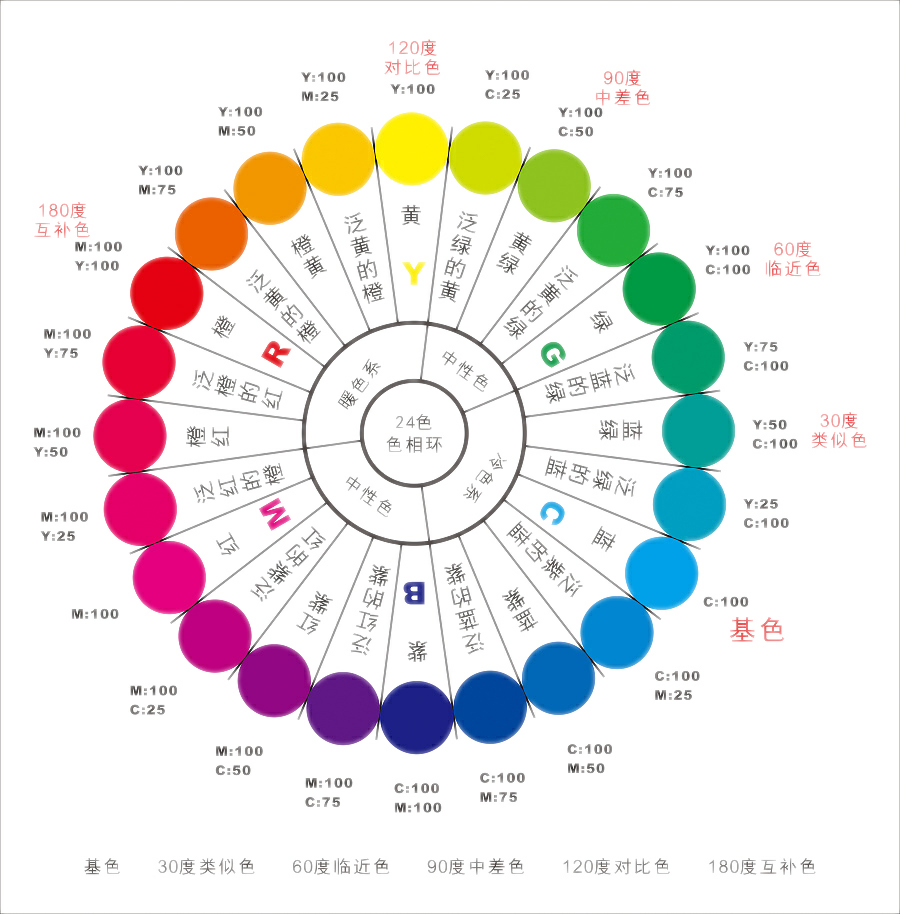
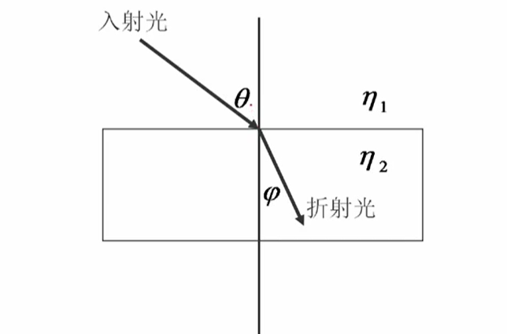
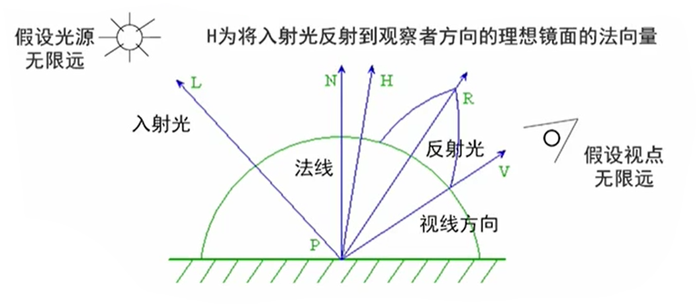
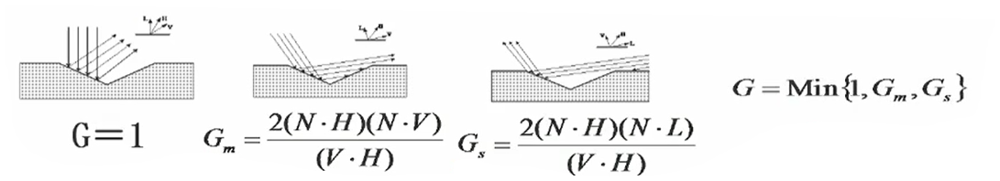
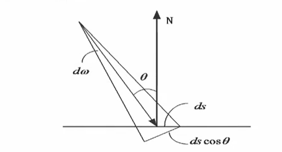
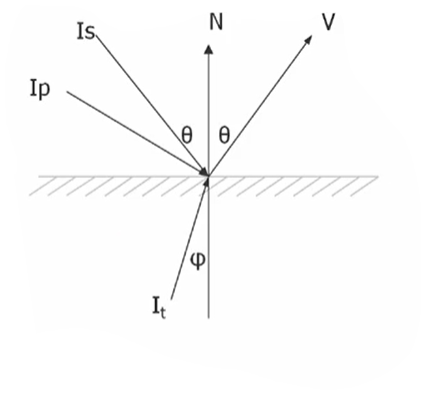
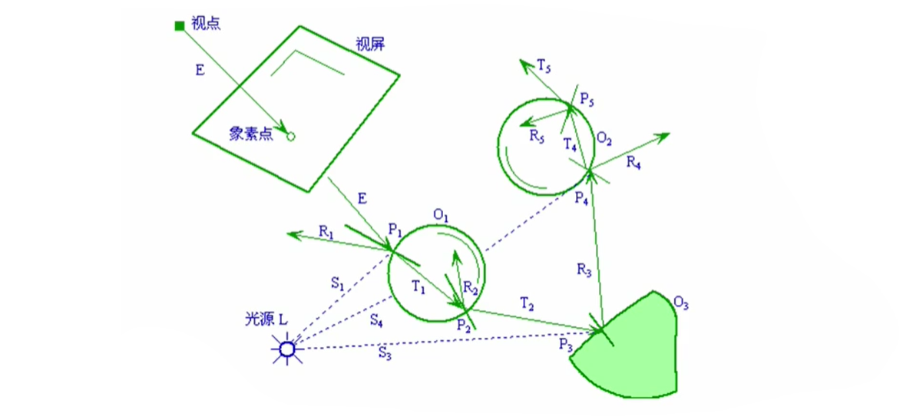
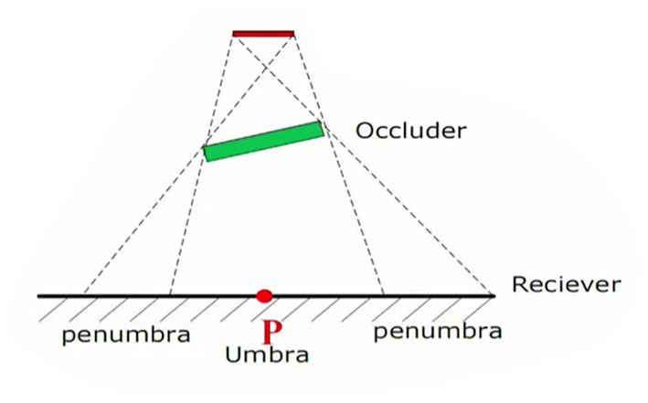

# 真实感图形学

## 概述

> 简单地说，就是希望用计算机生成像照相机拍的照片一样逼真的图形图像。
>
> 要实现这个目标，需要三部曲：
>
> 1. 建立三维场景（建模）；
> 2. 消隐解决物体深度的显示及确定物体之内的相互关系；
> 3. 在解决了消隐问题之后，在可见面上进行明暗光泽的处理，然后进行绘制（渲染）。

### 颜色模型

> **什么是颜色：**
>
> 1. 颜色是人的视觉系统对可见光的感知结果，感知到的颜色由光波的波长决定。
>
> 2. 人眼对于颜色的观察和处理是一种生理和心理现象，其机理还没有完全搞清楚。
> 3. 视觉系统能感觉的波长范围为380~780nm。
>
> **什么是颜色模型？**
>
> 1. 颜色模型（空间），是表示颜色的一种数学方法，人们用它来指定颜色和标定产生的颜色。通常用三个参数表小。
> 2. 几乎所有的颜色模型都是从RGB颜色模型导出
> 3. 目前现有颜色模型还没有一个完全符合人的视觉感知特性、颜色本身的物理特性或发光物体和光反射物体的特性。

#### 常用颜色模型

1. RGB颜色工业模型
2. 其它颜色工业模型
   - 主要用于彩色电视信号传输标准，主要有YIQ、YUV、 YCbCr彩色模型。
   - 三种彩色模型中，Y分量均代表黑白亮度分量，其余分量用于显示彩色信息。这样，只需利用Y分量进行图像显示，彩色图像就转换为灰度图像
3. 颜色视觉模型
   - 以上彩色模型是从色度学或硬件实现的角度提出的，但用色调（Hue）、饱和度（ Saturation，也称彩度）、亮度（Illumination）三要素来描述彩色空间能更好地与人的视觉特性相匹配。
     - 色调（Hue）：由物体反射光线中占优势的波长决定的，是彩色互相区分的基本特性。
     - 饱和度（ Saturation）或彩度：彩色的深浅程度，它取决于彩色中白色的含量。饱和度越高，彩色越深，白色光越少。
     - 亮度（Illumination）：光波作用于感受器所发生的效应，它取决于物体的反射系数。反射系数越大，物体亮度越大
4. 其他颜色视觉模型
   - HSV（hue, saturat ion and value彩色模型
     - A.R. Smith根据颜色的直观特性于1978年创建的，是颜色的倒六角锥体模型。
   - HSL与HSV
     - HSL采用亮度L（lightness）、HSV采用明度V（ value）作为坐标。

## 简单光照模型

> 1. 光照模型
>    - 当物体的几何形态确定之后，光照决定了整个场景的显示结果。因此，真实感图形的生成取决于如何建立个合适的光照模型（illumination model）。
> 2. 光照明模型：模拟物体表面的光照明物理现象的数学模型。
>    - 简单光照明模型只考虑光源对物体的直接光照

#### 背景物理知识

1. 光的传播规律反射定律
   - 入射角等于反射角，而且反射光线、入射光线与法向量在同一平面上。

2. 折射定律折射定律
   - 折射线在入射线与法线构成的平面上，折射角与入射角满足：

$$
{η_1\over η_2}={\sinφ \over \sinθ}
$$

3. 能量关系
   - 在光的反射和折射现象中的能量分布（满足能量守恒）

### Phong光照模型（环境光+漫反射光+镜面反射光）

- 环境光

  - 邻近各物体所产生的光的多次反射最终达到平衡时的种光。可近似认为同一环境下的环境光，其光强分布是均匀的。
  - $I_{ambient}=I_aK_a~~~~I_a-环境光强度；K_a-环境光反射系数$

- 漫反射光

  - 光照射到比较粗糙的物体表面，物体表面某点的明暗程度不随观测者的位置变化，这种等同地向各个方向散射的现象称为光的漫反射。

  - 漫反射光强近似服从Lambert定律：

    $I_{diffuse}=I_pK_d(L·N)~~~~I_p-点光源光强；K_d-物体表面漫反射率$

- 镜面反射光

  - 光照射到相当光滑的物体表面，就产生镜面反射光，其特点是在光滑表面会产生高光区域。

  - 一般用Phong提出的经验模型表达：

    $I_{spec}=I_pK_s(R·V)^n~~~~I_p-点光源光强；K_s-物体表面某点的高光亮系数；n-镜面反射指数，1^2000，反映光滑程度$

得出Phong光照模型：
$$
I=I_{ambient}+I_{diffuse}+I_{spec}\\
=I_aK_a+I_pK_d(L·N)+I_pK_s(R·V)^n
$$
结合RGB颜色模型， Phong光照明模型最终有如下的形式：
$$
\begin{cases}
I_r=I_{ar}K_{ar}+I_{pr}K_{dr}(L·N)+I_{pr}K_{sr}(R·V)^n\\
I_g=I_{ag}K_{ag}+I_{pg}K_{dg}(L·N)+I_{pg}K_{sg}(R·V)^n\\
I_b=I_{ab}K_{ab}+I_{pb}K_{db}(L·N)+I_{pb}K_{sb}(R·V)^n
\end{cases}
$$

> Phong光照明模型是真实感图形学中提出的第一个有影响的光照明模型，生成图象的真实度已经达到可以接受的程度。
>
> Phone模型用来模拟光从物体表面到观察者眼睛的反射。尽管这种方法符合一些基本的物理法则，但它更多的是基于对现象的观察，所以被看成是一种经验式的方法。
>
> 在实际的应用中，由于Phonηg光照模型是一个经验模型，因此还具有以下的一些问题：
>
> - 显示出的物体象塑料，无质感变化
> - 没有考虑物体间相互反射光
> - 镜面反射颜色与材质无关
> - 镜面反射入射角大，会产生失真现象

## 增量式光照模型

> **为什么要进行明暗处理？**
>
> - 三维物体通常用多边形（三角形）来近似模拟。
> - 由于每一个多边形的法向一致，因而多边形内部的像素的颜色都是相同的，而且在不同法向的多边形邻接处，光强突变，使具有不同光强的两个相邻区域之间的光强不连续性（马赫带效应）。
>
> **如何进行明暗处理？**
>
> - 基本思想：每一个多边形的顶点处计算出光照强度或参数，然后在各个多边形内部进行均匀插值
> - 常用方法：
>   - Gouraud明暗处理（双线性光强插值算法）
>   - Phong明暗处理（双线性法向插值算法）

### Gouraud明暗处理

1. 计算多边形顶点的平均法向量
   与某个顶点相邻的所有多边形的法向平均值近似作为该顶点的近似法向量，顶点A相邻的多边形有k个，它的法向量计算为：

$$
N_a={1\over k}(N_1+N_2+…+N_k)
$$

2. 用Phong光照模型计算顶点的光强

   Phong光照模型出现前，采用如下光照模型计算：
   $$
   I=I_aK_a+I_pK_d(L·N_a)/(r+k)
   $$

3. 插值计算离散边上个点的光强

$$
I_A=uI_1+(1-u)I_2~~~~u={AV_2\over V_1V_2}\\
I_B=vI_1+(1-u)I_3~~~~v={BV_3\over V_1V_3}
$$

4. 插值计算多边形内域中各点的光强

$$
I_p=tI_A+(1-t)I_B~~~~t={PB\over AB}
$$

> 求任一点的光强需进行两次插值计算

- 为减少计算量，采用增量计算方法

$$
新扫描线：\begin{cases}
I_{A,j+1}=I_{A,j}+ΔI_A\\
I_{B,j+1}=I_{B,j}+ΔI_B\\
ΔI_A=(I_1-I_2)/(y_1-y_2)\\
ΔI_B=(I_1-I_3)/(y_1-y_3)
\end{cases}
$$

> Gouraud明暗处理有一个最大的缺点，就是不能有镜面反射光（高光）。
>
> 双线性插值是把能量往四周均匀，平均的结果就是光斑被扩大了，本来没有光斑的地方一插值反而出现了光斑。
>
> 解决办法：Phong明暗处理

### Phong明暗处理

> 与 Gouraud明暗处理有何不同？
>
> - 双线性光强插值>>双线性法向插值
> - 以时间为代价，引入镜面反射，解决高光问题

Phong明暗处理基本步骤：

1. 计算每个多边形顶点处的平均单位法矢量，这一步骤与Gour aud明暗处理方法的第一步相同。
2. 用双线性插值方法求得多边形内部各点的法矢量。
3. 最后按光照模型确定多边形内部各点的光强。

Phong明暗处理是先算角点的法向量，再算内部点的法向量最后再用新的光照模型算内部点的颜色值。

### 两种增量式光照模型比较

|                          Phong方法                           |                         Gouraud方法                          |
| :----------------------------------------------------------: | :----------------------------------------------------------: |
| 1、产生的效果高光明显； 2、高光多位于多边形内部； 3、明暗变化缺乏层次感。 | 1、效果并不明显； 2、多边形内部无高光； 3、光强度变化均匀，与实际效果更接近。 |

- 增量式光照模型总结
  - 双线性光强插值（Gouraud模型）能有效的显示漫反射曲面，计算量小，速度快。
  - 双线性法向插值（Phong模型）可以产生正确的高光区域，但是计算量要大的多。
  - 增量式光照明模型的不足
    - 物体边缘轮廓是折线段而非光滑曲线
    - 等间距扫描线会产生不均匀效果
    - 插值结果取决于插值方向

## 局部光照模型

> 局部光照模型：仅处理光源直接照射物体表面的光照模型。
>
> 简单光照模型是一个比较粗糙的经验模型，不足之处：镜面反射项与物体表面的材质无关。
>
> 从光电学知识和物体微平面假设出发，介绍镜面反射与物体材质有关的普遍局部光照模型。

### 自然光反射

- 自然光反射率系数可用Fresnel公式计算

$$
ρ={1\over 2}\left({tg^2(θ-φ)\over tg^2(θ+φ)}+{sin^2(θ-φ)\over sin^2(θ+φ)}\right)
$$

θ是入射角，若发生反射的物体表面两侧折射率分别为和$n_1，n_2$那么φ满足这样的一个式子：$\sin φ={n_1\over n_2}\sin θ$

- 反射率与折射率有关，是波长的函数$ρ(θ,λ)$

### 光反射率

- 微观情况下，物体表面粗糙不平。
- 宏观上看，这是一个平面，法向朝上。实际上它是由许多微小平面构成的，微小平面的法向是各异的。
- 微平面是理想镜面，反射率可用Fresnel公式计算，而粗糙表面的反射率与表面的粗糙度有关。

- 实际物体反射率：$DGρ(θ,λ)$
  - D为微平面法向的分布函数
  - G为由于微平面的相互遮挡或屏蔽而使光产生的衰减因子

- Torrance和Sparrow采用Gauss分布函数模拟法向分布：
  - $D=ke^{(-a/m)^2}$
    - k为常系数
    - a为微平面的法向与平均法向的夹角，即(N·H)
    - m为微平面斜率的均方根，表示表面的粗糙程度
      - $m=\sqrt{m_1^2+m_2^2+…+m_n^2\over n}$
    - 也可采用Berkmann分布函数

### 光的衰减

- 衰减因子G在局部光照明模型中也可以反映物体表面的粗糙程度。
- 衰减因子是由于微平面的相互遮挡或屏蔽而产生的
- 微平面相互遮挡的光衰减因子G，有三种情况：

### 推导

- Cook和Torrance于1981年提出了局部光照模型。
  - $R_{bd}$表示物体对入射光的反射率系数
    $$
    R_{bd}={I_r\over E_i}
    $$

  - $I_r$—反射光的光强

  - $E_i$—单位时间内单位面积上的入射光能量

- 入射光能量$E_i$，可用入射光的光强$I_i$和单位面积向光源所张的立体角$dω$表示为：

$$
E_i=I_i\cosθ·dω=I_i(N·L)dω
$$

- 于是有反射光光强

$$
I_r=R_{bd}E_i=R_{bd}I_i(N·L)dω
$$

- 反射率系数可表示为漫反射率与镜面反射率的代数和：
  $$
  R_{bd}=K_dR_d+K_sR_s
  $$

  - $K_d+K_s=1$ 漫反射与镜面反射系数
  - 物体表面的漫反射率：$R_d=R_d(λ)$
  - 物体表面的镜面反射率：$R_s={DGρ(θ,λ)\over\pi(N·L)(N·V)}$

### 总结

- 加入环境光的计算，局部光照模型表示为：
  $$
  I_r=I_aK_a+I_i(N·L)dω(K_dR_d+K_sR_s)
  $$

  - $I_r$物体表面反射光强
  - $I_aK_a$表示环境光的影响
  - 最后一项是考虑了物体表面性质后的反射光强度量，是该局部光照模型的复杂性与普遍性所在。

- 相对于简单光照模型而言
  - 基于入射光能量导出的光辐射模型
  - 反映表面的粗糙度对反射光强的影响
  - 高光颜色与材料的物理性质有关
  - 改进入射角很大时的失真现象
  - 考虑了物体材质的影响，可以模拟磨光的金属光泽

## 光透射模型

>  简单和局部光照模型没有考虑光的透射现象
>
> 适用于场景中有透明或者半透明的物体的光照处理
>
> 早期用颜色调和法进行模拟

### Whitted光透射模型

> 1980年Whitted提出了第一个整体光照模型，并给出了一般光线跟踪算法的范例，综合考虑了光的反射、折射、透射和阴影等。被认为是计算机图形领域的一个里程碑。

在简单光照明模型的基础上，加上透射光项就得到Whitted光透射模型：
$$
I=I_a·K_a+I_p·K_d·(L·N)+I_p·K_s·(R·V)^n+I'_t·K'_t
$$
再加上镜面反射光项，就得到Whitted整体光照模型：
$$
I=I_a·K_a+I_p·K_d·(L·N)+I_p·K_s·(R·V)^n+I'_t·K'_t+I'_s·K'_s
$$

## 整体光照模型

> 简单和局部光照模型不能很好地模拟光的折射、反射和阴影等，也不能用来表示物体间的相互光照影响
>
> 整体光照模型是更精确的光照模型，主要有**光线跟踪**和**辐射度**两种方法。

### 光线跟踪（Ray tracing）

> 光线跟踪算法是真实感图形学中的主要算法之一，该算法具有原理简单、实现方便和能够生成各种逼真的视觉效果等突出的优点，综合考虑了光的反射、折射、阴影等

> 光线跟踪怎么停止？
>
> - 在算法应用的意义上，可以有以下几种终止条件。
>
>   - 该光线未碰到任何物体
>   - 该光线碰到了背景光线在经过许多次反射和折射以后，就会产生衰减
>   - 光线对于视点的光强贡献很小
>   - 光线反射或折射次数即跟踪深度大于一定值
>
> 光线跟踪的缺陷
>
> - 光线跟踪方法由于要进行大量的求交运算，且每一条射线都要和所有的物体求交，因此效率很低，需要耗费大量的计算时间。
> - 光线跟踪方法可以进行加速
>   - 提是高求交速度：针对性的几何算法、……
>   - 减成少求交次数：包围盒、空间索引、……
>   - 减少光线条数：颜色插值、自适应控制、……
>   - 采用广义光线和采用并行算法等

## 纹理映射

> 在真实感图形学中，可以用下列两种方法来定义纹理：
>
> 1. 图象纹理：将二维纹理图案映射到三维物体表面，绘制物体表面上一点时，采用相应的纹理图案中相应点的颜色值。
> 2. 函数纹理：用数学函数定义简单的二维纹理图案，如方格地毯；或用数学函数定义随机高度场，生成表面粗糙纹理即几何纹理。
>
> **纹理映射（Texture Mapping）：**通过将数字化的纹理图像覆盖或投射到物体表面，而为物体表面增加表面细节的过程。

颜色纹理坐标转换通常使用下列两种方法：

1. 在绘制一个三角形时，为每个顶点指定纹理坐标，角形内部点的纹理坐标由纹理三角形的对应点确定。

   即指定：
   $$
   (x_0,y_0,z_0)\implies(u_0,v_0)\\
   (x_1,y_1,z_1)\implies(u_1,v_1)\\
   (x_2,y_2,z_2)\implies(u_2,v_2)
   $$
   
2. 指定映射关系：
   $$
   u=a_0x+a_1y+a_2z+a_3\\
   v=b_0x+b_1y+b_2z+b_3
   $$
   

------

几何纹理使用一个称为扰动函数的数学函数进行定义

扰动函数通过对景物表面各采样点的位置作微小扰动来改变表面的微观几何形状。

设景物表面由下述参数方程定义：$Q=Q(u,v)$

则表面任一点(u,v)处的法线为：$N=N(u,v)={Q_u^(u,v)×Q_v(u,v)\over |Q_u^(u,v)×Q_v(u,v)|}$

设扰动函数为：$P(u,v)$

扰动后的表面为：$Q'=Q(u,v)+P(u,v)N$

## 阴影处理

- 本影
  - **umbra-本影区：**场景中的一个点P，如果它不被光源的任何部分所照射到，就称为在本影区里。本影就是不被任何光原所照到的区域。
- 半影
  - **Occluder-遮挡物：**阴影的生成是因为空间有遮挡物。这些遮挡物把光源挡住了，所以在 receivers上有些部分就很阴暗
  - 阴影是本影和半影的组合。求出本影和半影的并集(union)来绘出阴影

- 阴影
  - **自身阴影：**由于物体自身的遮挡而使光线照射不到它上面的某些面；
  - **投射阴影：**由于物体遮挡光线，使场景中位于它后面的物体或区域受不到光照射而形成的。

### 阴影算法

- 阴影体法(Shadow Volume)
  - 由一个点光源和一个三角形可以生成一个无限大的阴影体。落在这个阴影体中的物体，就处于阴影中。
  - 在对光线进行跟踪的过程中，如果这条射线穿过了阴影体的一个正面（朝向视点的一个面），则计数器加1.如果这条射线穿过了阴影体的一个背面（背向视点的一个面），则计数器减1.如果最终计数器的数值大于0，则说明这个像素处于阴影中，否则处于阴影之外。
- 阴影图法(Shadow Mapping)
  - 这种方法的主要思想是使用Z缓冲器算法，从投射阴影的光源位置对整个场景进行绘制。
  - 这时，对于Z缓冲器的每一个像素，它的z深度值包括了这个像素到距离光源最近点的物体的距离。一般将Z缓冲器中的整个内容称为阴影图(Shadow Map)，有时候也称为阴影深度图。
  - 为了使用阴影图，需要对场景进行次绘制，不过这次是从视点的角度来进行的。
  - 在对每个图元进行绘制的时候，将它们的位置与阴影图进行比较，如果绘制点距离光源比阴影图中的数值还要远，那么这个点就在阴影中，否则就不在阴影中。