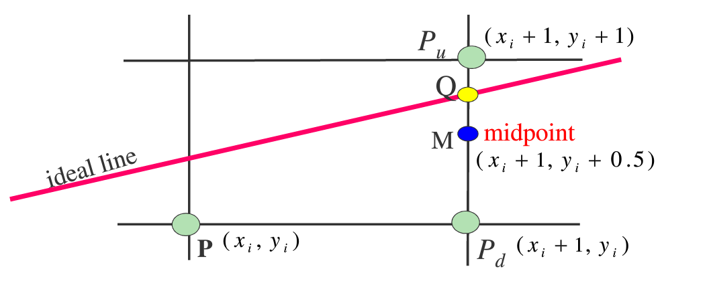

# 直线扫描转换算法

## 数值微分法（DDA）

> 引进图形学中一个很重要的思想——增量思想

$ y_i = kx_i+b $

$ y_{i+1} = kx_{i+1}+b  \\=k(x_i+1)+b \\=kx_i+b+k \\=y_i+k $

$ 得到： y_{i+1}=y_i+k $

即 当前步的y值 = 前一步的y值 + 斜率k（增量）

------


> [!note|style:flat|label:举例|labelVisibility:visible|iconVisibility:visible]
>
> 要求：DDA扫描转换连接两点$ P_0(0,0)与P_1(5,3) $的直线段。
> 
> 过程：$ k= {y_1-y_0 \over x_1-x_0}={3-0 \over 5-0}=0.6 $ **<1** 
> 
> 根据$ y_{i+1}=y_i+k $，得到下表的计算结果

|  X   |    Y    | int(y+0.5) |
| :--: | :-----: | :--------: |
|  0   |    0    |     0      |
|  1   |   0.6   |     1      |
|  2   | 0.6+0.6 |     1      |
|  3   | 1.2+0.6 |     2      |
|  4   | 1.8+0.6 |     2      |
|  5   | 2.4+0.6 |     3      |

但是此算法并不适用于$ |k| >1 $的情况，会导致光栅点太稀疏。

优化后算法
```c
void DDADrawLine::LineDDA(int x0, int y0, int x1, int y1)
{
	float x = 0.0;
	float y = 0.0;
	float m = 0.0;
	//添加增量，实现增量思想
	float dx = x1 - x0;
	float dy = y1 - y0;
	if(dx != 0)
	{
		m = dy / dx;
		if(m <= 1 && m >= -1)
		{
			y = y0;
			//斜率绝对值<1,x递增绘制像素顶点
			for(x = x0; x <= x1; x++)
			{
				glVertex2i(x, int(y + 0.5));
				y += m;
			}
		}
		if(m > 1 || m < -1)
		{
			m = 1 / m;//将斜率设为倒数
			x = x0;
			//斜率绝对值>1,y递增绘制像素顶点
			for(y = y0; y <= y1; y++)
			{
				glVertex2i(int(x + 0.5), y);
				x += m;
			}
		}
	}
	else
	{
		int x = x0;
		int y =0;
		y = (y0 <= y1) ? y0 : y1;
		int d = fabs((double)(y0 - y1));
		while(d >= 0)
		{
			glVertex2i(x, y);
			y++;
			d--;
		}
	}
}
```

<br/>

## 中点画线算法

### 核心思路

> 基本原理采用直线的一般方程：$ F(x,y) = Ax+By+C=0 $ 
> 
> **其中：**$ A=-(\Delta y);  B=(\Delta x);  C=-B(\Delta x)  $

假定：$ 0 ≤ |k| ≤ 1 $， 因此每次在x方向+1，y方向+1或不变则需要判断。



当 点Q 在 点M 上方 ，则$ P_u $离直线近，应为下一个像素点

反之则$ P_d $离直线近，应取$ P_d $为下一个像素点

------

为判断Q在M上方还是下方，把M带入理想直线方程：

- $ d_i = F(x_m,y_m) = F(x_i+1,y_i+0.5) \\= A(x_i+1)+B(y_i+0.5)+C $

  - 当$ d<0 $时，Q在M上方，应取$ P_u $;

  - 当$ d>0 $时，Q在M下方，应取$ P_d $;

  - 当$ d=0 $时，M在直线上，取$ P_u $ 或$ P_d $均可。

但此方法运算效率太低，因此需要优化。

### 算法优化
$ d_0=F(x_{m0},y_{m0}) \\=F(A(x_i+1)+B(y_i+0.5))+C $

计算出初值$ d_0=A+0.5B $

- $ d<0 $情况下，推导d的增量关系：
  - $ d_1=F(x_{m1},y_{m1}) \\=F(A(x_i+2)+B(y_i+1.5))+C \\=F(A(x_i+1)+B(y_i+0.5))+C+A+B $
  - **得到：**$ d_1=d_0+A+B $


- $ d≥0 $情况下，推导d的增量关系：
  - $ d_1=F(x_{m1},y_{m1}) \\=F(A(x_i+2)+B(y_i+1.5))+C \\=F(A(x_i+1)+B(y_i+0.5))+C+A $
  - **得到：**$ d_1=d_0+A $

<br/>

## Bresenham算法

>  Bresenham提供了一个更一般的算法。该算法不仅有好的效率，而且有更广泛的适用范围

### 核心思路
> 该算法的思想是通过各行、各列像素中心构造一组虚拟网格线，按照直线起点到终点的顺序，计算直线与各垂直网格线的交点，然后根据误差项的符号确定该列象素中与此交点最近的象素。


假设每次x+1，y的递增（减）量为0或1，它取决于实际直线与最近光栅网格点的距离d，这个距离的最大误差为0.5。

误差项d的初值$ d_0=0 $，$ d_n=d_{n-1}+k $
一旦$ d≥1 $，就把它减去1，保证d的相对性，且区间为$ [0,1) $

$$
即：
\begin{cases}
  x_{i+1}=x_i+1\\
  y_{i+1}=
  \begin{cases}
   y_i+1 &\text (d>0.5)  \\
   y_i &\text (d≤0.5)
   \end{cases}
\end{cases}
$$

------

### 算法优化
将此算法效率提升到整数加法
#### 分步改进思路
改进1：
令$ e=d-0.5 $

$$
即：
\begin{cases}
  x_{i+1}=x_i+1\\
  y_{i+1}=
  \begin{cases}
   y_i+1 &\text (e>0)  \\
   y_i &\text (e≤0)
   \end{cases}
\end{cases}
$$

e>0，y方向递增1；e<0，y方向不递增

e=0时，可任取上、下光栅点显示

- 改进后步骤
  - $ e_初 =-0.5$
  - 每走一步有$ e=e+k $
  - 若$ e>0 $，则$ e=e-1 $

------

改进2：
$$
e_初=-0.5，k={dy \over dx}
$$

由于算法中只用到误差项的符号，于是可以用$ e*2*Δx $来替换e

- 改进后步骤
  - $ e_初 =-Δx $
  - 每走一步有$ e=e+2Δy $
  - 若$ e>0 $，则$ e=e-2Δx $

------

#### 最终算法思路
> 1.输入直线的两端点$ P(x_0，y_0)和P_1(x_1，y_1)$
> 
> 2.计算初始值$ Δx、Δy、e=-Δx、x=x_0、y=y_0 $
> 
> 3.绘制点$ (x,y) $
> 
> 4.$ e $更新为$ e+2Δy $，判断$ e $的符号
> 
> - 若$ e>0 $，则$ (x,y) $更新为$ (x+1，y+1) $，同时将$ e $更新为$ e-2Δx $；
> 
> - 否则$ (x,y) $更新为 $ (x+1，y) $
> 
> 5.当直线没有画完时，重复步骤3和4，否则结束
> 

此算法不再依赖于直线的方程类型