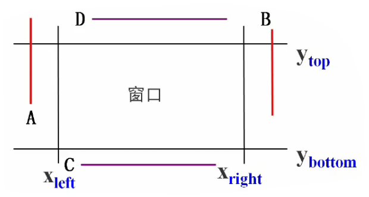

# 直线裁剪算法

> **裁剪：**
>
> 使用计算机处理图形信息时，计算机内部存储的图形往往比较大，而屏幕显示的只是图形的一部分
>
> 因此需要确定图形哪些部分落在显示区之内，哪些落在显示区之外。这个选择的过程就称为*裁剪*
>
> 最简单的裁剪方法是把各种图形扫描转换为点之后，再判断点是否在窗口内。

## 算法演变

### 1.点的裁剪

对于任意一点P（x,y），若满足下列两对不等式：

$x_{left}≤x≤x_{right}$
$y_{bottom}≤y≤y_{top}$

则点P在矩形窗口内；否则，点P在矩形窗口之外

判断图形中每个点是否在窗口内，太费时，一般不可取

### 2.直线的裁剪

要裁剪一条直线段，首先要判断：

1. 它是否完全落在裁剪窗口内？
2. 它是否完全在窗口外？
3. 如果不满足以上两个条件，则计算它与一个或多个裁剪边界的交点

常用的裁剪算法有三种，即Cohen-Sutherland、中点分割法和Liang- Barsky裁剪算法

## Cohen-Sutherland算法

又称为编码裁剪算法，算法的基本思想是对母条直线段分三种情况处理：

1. 若点p1和p完全在裁剪窗口内，则保留这条直线

2. 若点$p_1(x_1,y_1)$和$p_2(x_2,y_2)$均在窗口外，且满足下列四个条件之一：

$$
\begin{cases}
x_1<x_{left}且x_2<x_{left}\\
x_1>x_{right}且x_2>x_{right}\\
y_1<y_{bottom}且y_2<y_{bottom}\\
y_1>y_{top}且y_2>y_{top}
\end{cases}
$$

对这四种类型的直线，“简弃”之

（3）如果直线段既不满足“简取”的条件，也不满足“简弃”的条件

需要对直线段按交点进行分段，分段后判断直线是“简取”还是“简弃

每条线段的端点都赋以四位二进制码$D_3D_2D_1D_0$，编码规则如下：

- 若$x<x_{left}$,则$D_0=1$，否则$D_0=0$

- 若$x>x_{right}$ ，则$D_1=1$，否则$D_1=0$

- 若$y< y_{buttom}$，则$D_2=1$，否则$D_2=0$

- 若$y>y_{top}$，则$D_3=1$，否则$D_3=0$

窗口及其延长线所构成了9个区域。根据该编码规则：

$D_0$对应窗口左边界

$D_1$对应窗口右边界

$D_2$对应窗口下边界

$D_3$对应窗口上边界

裁剪一条线段时，先求出端点$p_1$和$p_2$的编码$code_1$和$code_2$

然后进行二进制“或”运算和“与”运算：

- 若$code_1|code_2=0$，对直线段应简取之；
- 若$code_1\&code_2≠0$，对直线段可简弃之；
- 若上述两条件均不成立，则需求出直线段与窗口边界的交点在交点处把线段一分为二。

| 运算符 |   名称   | 例子 |  运算功能  |
| :----: | :------: | :--: | :--------: |
|   ~    |   位反   |  ~b  | 求b的位反  |
|   &    |  与运算  | b&c  |  b和c位与  |
|   \|   |  或运算  | b\|c |  b和c位或  |
|   ^    | 异或运算 | b^c  | b和b位异或 |

------

举例：

首先对$P_1、P_2$进行编码
$$
或\cfrac{0001\\0100}{0101}，与\cfrac{0001\\0100}{0000}
$$

对$P_2、P_3$重复上述处理
$$
或\cfrac{0000\\0100}{0100}，与\cfrac{0000\\0100}{0000}
$$
剩下的直线段（$P_3、P_4$）再进行进一步判断， $code_1、code_2=0$，全在窗口内，简取之

------

此算法存在的问题：最坏情况下，被裁剪线段与窗口4条边计算交点，然后所得的裁剪结果却可能是全部舍弃

## 中点分割算法

和上面讲到的Cohen- Sutherland算法一样，首先对直线段的端点进行编码。

把线段和窗口的关系分成三种情况：

1. 完全在窗口内

2. 完全在窗口外

3. 和窗口有交点

中点分割算法的核心思想是通过**二分逼近**来确定直线段与窗口的交点。

注意：

1. 若中点不在窗口内，则把中点和离窗口边界最远点构成的线段丢掉，以线段上的另一点和该中点再构成线段求其中点

2. 如中点在窗口内，则又以中点和最远点构成线段，并求其中点，直到中点与窗口边界的坐标值在规定的误差范围内相等

## Liang-Barsky裁剪算法

### 核心思路

> 直线参数方程的标准形式为：
> 
> $\begin{cases}x=x_0+tcosα\\y=y_0+tsinα\end{cases}(t为参数)$

1. 用参数方程表示一条直线

$\begin{cases}x=x_1+u·(x_2-x_1)=x_1+Δx·u\\
y=y_1+u·(y_2-y_1)=y_1+Δy·u\end{cases}(0≤u＜1)$

2. 把被裁剪的直线段看成是一条有方向的线段，把窗口的四条边分成两类：**入边**和**出边**。裁剪结果的线段起点是直线和两条入边的交点以及始端点三个点里最前面的一个点，即参数u最大的那个点；

裁剪线段的终点是和两条出边的交点以及端点最后面的一个点，取参数$u$最小的那个点。

值得注意的是，当$u$从$-∞$到$+∞$遍历直线时，首先对裁剪窗口的两条边界直线（下边和左边）从外面向里面移动，再对裁剪窗口两条边界直线（上边和右边）从里面向外面移动。

如果用$u_1$，$u_2$分别表示线段（$u_1≤u_2$）可见部分的开始和结束

$u_1= max(0, u_r, u_b)$
$u_2= min(1,u_t,u_r)$

### 计算过程

由参数方程可知：$\begin{cases}x_{left}≤x_1+u·△x≤x_{right}\\y_{bottom}≤y_1+u·Δy≤y_{top}\end{cases}$

$\begin{cases}u·(-Δx)≤x_1-x_{left}\\
u·Δx≤x_{right}-x_{1}\\
u·(-Δy)≤y_1-y_{bottom}\\
u·Δy≤y_{top}-y_{1}\end{cases}$

令：$\begin{cases}
p_1=-Δx，q_1=x_1-x_{left}\\
p_2=Δx，q_2=x_{right}-x_1\\
p_3=-Δy，q_3=y_1-y_{bottom}\\
p_4=Δy，q_4=y_{top}-y_1
\end{cases}$

于是有：$u·p_k≤q_k，k=1,2,3,4$

$p_1=-Δx，q_1=x_1-x_{left}\\
p_3=-Δy，q_3=y_1-y_{bottom}\\
入边：左边和下边$，$p_2=Δx，q_2=x_{right}-x_1\\
p_4=Δy，q_4=y_{top}-y_1\\
出边：右边和上边$

（1）分析$P=0$的情况

- 若$P_1=P_2=0$

- 若$P_3=P_4=0$

可知，任何平行于窗口某边界的直线，其$p_k=0$

- 如果还满足$q<0$

则线段完全在边界外，应舍弃该线段

（2）当$p≠0$时

当$p_k<0$时，线段从裁剪边界延长线的外部延伸到内部，是入边交点

当$p_k>0$时，线段从裁剪边界延长线的内部延伸到外部，是出边交点

线段和窗口边界一共有四个交点，根据$p$的符号，就知道哪两个是入交点，哪两个是出交点

当$p_k<0$时：对应入边交点

当$p_k>0$时：对应出边交点

共四个u值，再加上$u=0、u=1$两个端点值，总共六个值

把$p<0$的两个$u$值和0比较找最大，把$p>0$的两个u值和1比较找最小，

这样就得到两个端点的参数值

$u_k={q_k \over p_k}(p_k≠0，k=1,2,3,4)$

$u$是窗口边界及其延长线的交点的对应参数值

分别计算$u_{max}$和$u_{min}$

$\begin{cases}u_{max}=max(0,u_k|_{p_k<0},u_k|_{p_k<0})\\\\
u_{min}=min(u_k|_{p_k>0},u_k|_{p_k>0},1)\end{cases}$

注意：$p_k<0$，代表入边；$p_k>0$代表出边

若$u_{max}>u_{min}$，则直线段在窗口外，删除该直线

若$u_{max}≤u_{min}$，将$u_{max}$和$u_{min}$**代回直线参数方程**，即求出直线与窗口的两实交点坐标。

注意：因为对于实交点$0≤u≤1$，因此$u_{max}$不能小于0，$u_{min}$不能大于1

### 算法步骤

1. 输入直线段的两端点坐标$(x_1,y_1)、(x_2，y_2)$，以及窗口的四条边界坐标$：wxl、wxr、wyb和wyt$

2. 若$ΔX=0$，则 $p_1=p_2=0$，此时**进一步判断**是否满足$q_1<0$或$q_2<0$
  - 若满足，则该直线段不在窗口内，算法转（7）结束。
  - 否则满足$q1≥0且q2≥0$，则进一步计算$u_{max}$和$u_{min}$：

$$
\begin{cases}
u_{max}=max(0,u_k|_{p_k<0})\\
u_{min}=min(1,u_k|_{p_k>0})
\end{cases}
$$

其中，$u_k={q_k \over p_k}(p_k≠0,k=3,4)$。算法转(5)

3. 若$Δy=0$，则$p_3=p_4=0$，此时**进一步判断**是否满足$q_3<0$或$q_4<0$，
  - 若满足，则该直线段不在窗口内，算法转（7）结束。
  - 否则，满足$q_3≥0$且$q_4≥0$，则进一步计算$u_{max}$和$u_{min}$：

$$
\begin{cases}
u_{max}=max(0,u_k|_{p_k<0})\\
u_{min}=min(1,u_k|_{p_k>0})
\end{cases}
$$

其中，$u_k={q_k \over p_k}(p_k≠0,k=3,4)$。算法转(5)

4. 若上述两条均不满足，则有$p_k≠0(k=1,2,3,4)$，此时计算$u_{max}$和$u_{min}$
$$
\begin{cases}
u_{max}=max(0,u_k|_{p_k<0},u_k|_{p_k<0})\\
u_{min}=min(1,u_k|_{p_k>0},u_k|_{p_k>0})
\end{cases}
$$

其中，$u_k={q_k \over p_k}(p_k≠0,k-3,4)$

5. 求得$u_{max}$和$u_{min}$后，进行判断：
  - 若$u_{max}>u_{min}$，则直线段在窗口外，算法转（7）。
  - 若$u_{max}≤u_{min}$，利用直线的参数方程：

$$
\begin{cases}
x=x_1+u·(x_2-x_1)\\
y=y_1+u·(y_2-y_1)
\end{cases}
$$

6. 利用直线的扫描转换算法绘制在窗口内的直线段。

7. 结束

### 算法举例

令：$\begin{cases}
p_1=-Δx，q_1=x_1-x_{left}\\
p_2=Δx，q_2=x_{right}-x_1\\
p_3=-Δy，q_3=y_1-y_{bottom}\\
p_4=Δy，q_4=y_{top}-y_1
\end{cases}$

- 对于直线AB，有：$\begin{cases}
  p_1=0，q_1=10\\
  p_2=0，q_2=-2\\
  p_3=-4，q_3=4\\
  p_4=4，q_4=2
  \end{cases}$，由于$q_2<0$，判断AB完全在右边界之右

- 对于直线CD，有：$\begin{cases}
  p_1=0，q_1=2\\
  p_2=0，q_2=6\\
  p_3=-3，q_3=5\\
  p_4=3，q_4=1
  \end{cases}$，由于$p_1、p_2=0$，$q_1、q_2>0$，采取进一步判断

$$
u_3={q_3 \over p_3}=-{5 \over 3},u_4={q_4 \over p_4}={1\over 3}
$$
$$
∴\begin{cases}
u_{max}=max(0,u_k|_{p_k<0})=max(0,-{5 \over 3})=0\\
u_{min}=min(1,u_k|_{p_k>0})=min(1,{1 \over 3})={1 \over 3}
\end{cases}
$$
此时$u_{max}≤u_{min}$，分别代入直线的参数方程：
$$
\begin{cases}
x=x_1+u·(x_2-x_1)\\
y=y_1+u·(y_2-y_1)
\end{cases}
$$
得到裁减后直线的两个端点是$(3,7)$和$(3,8)$。

- 对于直线EF，有：$\begin{cases}
  p_1=-2，q_1=5\\
  p_2=2，q_2=3\\
  p_3=-3，q_3=4\\
  p_4=3，q_4=2
  \end{cases}$，由于$p_{1,2,3,4}≠0$，$q_{1,2,3,4}>0$，采取进一步判断

$$
u_1={q_1 \over p_1}=-{5 \over 2},u_2={q_2 \over p_2}={3\over 2}\\
u_3={q_3 \over p_3}=-{4 \over 3},u_4={q_4 \over p_4}={2\over 3}
$$
$$
∴\begin{cases}
u_{max}=max(0,u_k|_{p_k<0},u_k|_{p_k<0})=max(0,-{5 \over 2},-{4 \over 3})=0\\
u_{min}=min(1,u_k|_{p_k>0},u_k|_{p_k>0})=min(1,{3 \over 2},{2 \over 3})={2 \over 3}
\end{cases}，此时u_{max}<u_{min}
$$

分别代入直线的参数方程：
$$
\begin{cases}
x=x_1+u·(x_2-x_1)\\
y=y_1+u·(y_2-y_1)
\end{cases}
$$
得到裁减后直线的两个端点是$(6,6)$和$(8,9)$。