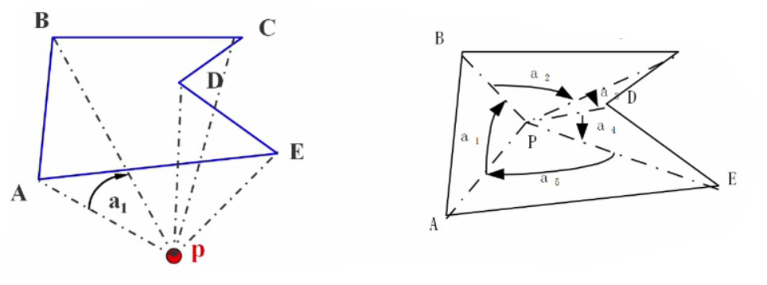
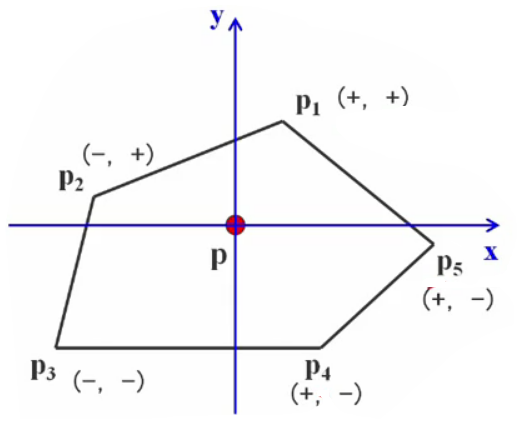
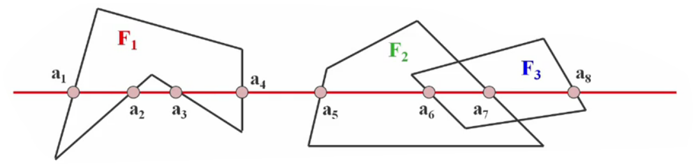
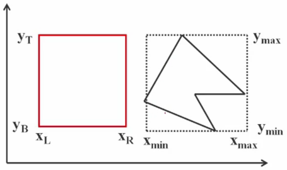
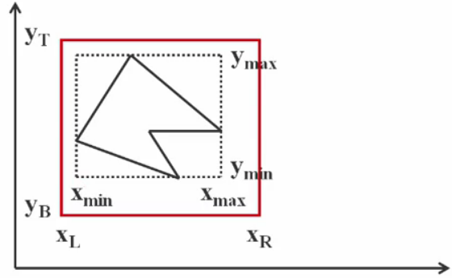

# 消隐算法

## 什么是消隐

> 当我们观察空间任何一个不透明的物体时，只能看到该物体朝冋我们的那些表面，其余的表面由于被物体所遮挡我们看不到
>
> 如果把可见和不可见的线都画出来，对视觉会造成多义性
>
> 要消除二义性，就必须**在绘制时消除被遮挡的不可见的线或面**，习惯上称作消除隐藏线和隐藏面，简称为**消隐**

## 消隐的分类

### 按消隐对象分类

> 线消隐消隐对象是物体上的边，消除的是物体上不可见的边
> 
> 面消隐消隐对象是物体上的面，消除的是物体上不可见的面，通常做真实感图形消隐时用面消隐

### 按消隐空间分类

## 物体空间的消隐算法

> 此类算法通常用于线框图的消隐

以场景中的**物体**为处理单元。
假设场景中有$k$个物体，将其中一个物体与其余$k-1$个物体逐一比较仅显示它可见表面以达到消隐的目的

在物体空间里典型的消隐算法有两个：*Roberts算法*和*光线投射法*

#### Roberts算法
- 基本步骤
   - 逐个的独立考虑每个物体自身，找出为其自身所遮挡的边和面（自消隐）；
   - 将每一物体上留下的边再与其它物体逐个的进行比较，以确定是完全可见还是部分或全部遮挡（两两物体消隐）；
  - 确定由于物体之间的相互贯穿等原因，是否要形成新的显示边等，从而使被显示各物体更接近现实

#### 光线投射
求光线与场景的交点，该光线就是所谓的视线（如视点与像素连成的线）
一条视线与场景中的物体可能有许多交点，求出这些交点后需要排序，在前面的才能被看到。人的眼睛可以一目了然，但计算机做需要大量的运算

------

## 图像空间的消隐算法

> 这类算法是消隐算法的主流

以屏幕窗口内的**每个像素**为处理单元。

确定在每一个像素处，场景中的$k$个物体哪一个距离观察点最近，从而用它的颜色来显示该像素

### Z缓冲区（Z-Buffer）算法

Z缓冲器算法也叫深度缓冲器算法，属于图像空间消隐算法

该算法有**帧缓冲器**和**深度缓冲器**。

对应两个数组：

| intensity(x,y)<br/>属性数组（帧缓冲器） | depth(x,y)<br/>深度数组（z-buffer） |
| :-------------------------------------: | :---------------------------------: |
|  存储图像空间 每个可见像素的光强或颜色  |  存放图像空间 每个可见像素的z坐标   |

> **算法思想：**
>
> 先将Z缓冲器中各单元的初始值置为最小值。
>
> 当要改变某个像素的颜色值时，首先检查当前多边形的深度值是否大于该像素原来的深度值（保存在该像素所对应的Z缓冲器的单元中）
>
> 如果大于原来的z值，说明当前多边形更靠近观察点，用它的颜色替换像素原来的颜色

伪代码：

```
Z-Buffer算法()
{
	帧缓存全置为背景色
	深度缓存全置为最小z值
	for(每一个多边形)
	{
		扫描转换该多边形
		for(该多边形所覆盖的每个像素(x,y))
		{
			计算该多边形在该像素的深度值Z(x,y));
        	if(z(x,y)大于z缓存在(x,y)的值）
			{
				把z(x,y)存入z缓存中(x,y)处
				把多边形在(x,y)处的颜色值存入帧缓存的(x,y)处
			}	
		}
	}
}
```

- Z-Buffer算法的优点
  - z- Buffer算法比较简单，也很直观
  - 在像素级上以近物取代远物。与物体在屏幕上的出现顺序是无关紧要的，有利于硬件实现

- Z-Buffer算法的缺点
  - 占用空间大
  - 没有利用图形的相关性与连续性，这是Z-Buffer算法的严重缺陷

### 改进算法

> 一般认为，Z-Buffer算法需要开一个与图象大小相等的缓存数组zb，实际上，可以改进算法，只用一个深度缓存变量zb

**关键问题：**判断像素点$(i,j)$是否在$p_k$的投影多边形之内，不是一件容易的事。

节省了空间但牺牲了时间。计算机的很多问题就是在时间和空间上找平衡。

#### 点与多边形的包含性检测
##### 射线法

由被测点P处向$y=-∞$方向作射线交点个数是奇数，则被测点在多边形内部交点个数是偶数，表示在多边形外部。

若射线正好经过多边形的顶点，则采用“左开右闭”的原则来实现

即：当射线与某条边的顶点相交时，若边在射线的左侧，则交点有效，计数；若边在射线的右侧，则交点无效，不计数

- 用射线法来判断一个点是否在多边形内的**弊端**：
  - 计算量大
  - 不稳定

##### 弧长法

以p点为圆心，作单位圆，把边投影到单位圆上，对应一段段弧长，规定逆时针为正，顺时针为负，计算弧长代数和：



- 代数和为0，点在多边形外部

- 代数和为2π，点在多边形内部

- 代数和为π，点在多边形边上


##### 以顶点符号为基础的弧长累加方法

p是被测点，按照弧长法，p点的代数和为$2\pi$



不计算角度，做一个规定来取代原来的弧长计算：

| $p_1$符号 | $p_n$符号 |     弧长变化     | 象限变化 |
| :-------: | :-------: | :--------------: | :------: |
|   (+,+)   |   (+,+)   |        0         |   ①➡①    |
|   (+,+)   |   (-,+)   |  $\pi \over 2$   |   ①➡②    |
|   (+,+)   |   (-,-)   |      $±\pi$      |   ①➡③    |
|   (+,+)   |   (+,-)   | $-{\pi \over 2}$ |   ①➡④    |
|     …     |     …     |        …         |    …     |

这样当要计算代数和的时候，就不要去投影了，只要根据点所在的象限一下子就判断出多少度，这样几乎没有什么计算量，只有一些简单的判断，效率非常高

### 区间扫描线算法

该算法放弃Z-Buffer的思想，是一个新的算法，这个算法被认为是消隐算法中最快的之一



扫描线的交点把这条扫描线分成了若干个区间，每个区间上必然是同样一种颜色

对于有重合的区间，如$a_6a_7$这个区间，要么显示F2的颜色，要么显示F3的颜色，不会出现颜色的跳跃

如果把扫描线和多边形的这些交点都求出来，对每个区间，只要判断一个像素的要画什么颜色，那么整个区间的颜色都解决了，这就是区间扫描线算法的主要思想

- 如何确定小区间的颜色？
  1. 小区间上没有任何多边形，如$[a_4，a_5]$，用背景色显示
  2. 小区间只有一个多边形，如$[a_1，a_2]$，显示该多边形的颜色
  3. 小区间上存在两个或两个以上的多边，比如$[a_6，a_7]$，必须通过深度测试判断哪个多边形可见

> 这个算法存在几个问题：
> 1. 真的去求交点？——可以利用增量算法简化求交
> 2. 每段区间上要求z值最大的面，这就存在一个问题。如何知道在这个区间上有哪些多边形是和这个区间相关的？

### 区域子分割(Warnock)消隐算法

> Warnock算法是图像空间中非常经典的一个算法
>
> Warnock算法的重要性不在于它的效率比别的算法高，而在于采用了**分而治之**的思想，利用了堆栈的数据结构
>
> 把物体投影到全屏幕窗口上，然后**递归分割**窗口，直到窗口内目标足够简单，可以显示为止

#### 这些情况下，画面足够简单，可以立即显示

1. 窗口中仅包含一个多边形
2. 窗口与一个多边形相交，且窗口内无其它多边形
3. 窗口为一个多边形所包围
4. 窗口与一个多边形相分离

##### 如何判别一个多边形和窗口是分离的？  



当满足下列条件时，多边形和窗冂分离：

$$
x_{min}>x_R \space {\color{red}or}\space x_{max}<x_L \space {\color{red}or}\space y_{min}>y_T \space {\color{red}or}\space y_{max}<y_B
$$
##### 如何判别一个多边形在窗口内？



当满足下列条件时，多边形被窗口包含：

$$
x_{min}≥ x_L \space {\color{red}\&}\space x_{max}≤x_R \space {\color{red}\&}\space y_{min}≥y_B \space {\color{red}\&}\space y_{max}≤y_T
$$

多边形与窗口相交的判别：可以采用直线方程作为判别函数来判定一个多边形是否与窗口相交

------

> **窗口有多个多边形投影面，如何显示？**
> 算法步骤：
>
>  1. 如果窗口内没有物体则按背景色显示
>  2. 若窗口内只有一个面，则把该面显示出来
>  3. 否则，窗口内含有两个以上的面，则把窗口**等分成四个子窗口**。对每个小窗口再做上述同样的处理。这样反复地进行下去
>
>  *把四个子窗口压在一个堆栈里（后进先出）*
>
> 
>
> **如果到某个时刻，窗口仅有像素那么大，而窗内仍有两个以上的面，如何处理？**
> 这时不必再分割，只要取窗口内最近的可见面的颜色或所有可见面的平均颜色，作为该像素的值
