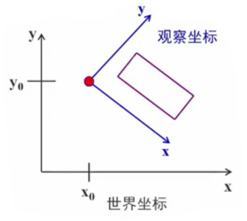
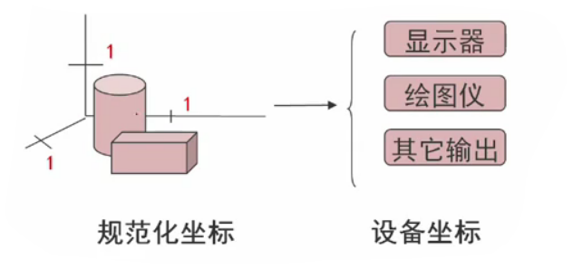

# 二维图形变换

## 向量

### 向量的线性组合

有两种特殊的线性组合在计算机图形学中很重要

#### 仿射组合
如果线性组合的**系数**$a_1,a_2,…a_m$的和等于1，那么它就是仿射组合

$$
a_1+a_2+…+a_m=1
$$

#### 凸组合
凸组合在数学中具有重要的位置，在图形学中也有很多应用。

凸组合是对仿射组合加以更多的限制得来的

$$
a_1+a_2+…+a_m=1(i=1,2,…,m,且a_i≥0)
$$

### 向量的度量和单位向量
1. 对n维向量：$w=(w_1,w_2,…,w_n)$，它的长度（大小）为：

$$
|w|=\sqrt{w_1^2+w_2^2+…+w_n^2}
$$

2. 有时经常需要缩放向量，使它的长度为1，这一过程叫恃量的归一化。

   归一化的结果叫**单位向量**：

$$
\hat{a}={a\over |a|}
$$

### 向量运算

#### 向量的点积

$$
\overleftharpoon{a}=(a_1,a_2),\overleftharpoon{b}=(b_1,b_2),则\overleftharpoon{a}·\overleftharpoon{b}=a_1b_1+a_2b_2
$$

也就是说，计算点积时，只需将两个向量相应的分量相乘，然后将结果相加即可：
$$ {v}
d=\overleftharpoon{v}·\overleftharpoon{w}=\displaystyle\sum_{i=1}^n{v_iw_i}
$$
点积最重要的应用就是计算两个向量的夹角，或着两条直线的夹角
$$
\overleftharpoon{b}·\overleftharpoon{c}=|\overleftharpoon{b}||\overleftharpoon{c}|\cos\theta(\theta为夹角)
$$
$$
\cos\theta={\overleftharpoon{b}·\overleftharpoon{c}\over |\overleftharpoon{b}||\overleftharpoon{c}|}=\hat{\overleftharpoon{b}}·\hat{\overleftharpoon{c}}
$$

由于两个向量的点积和它们之间夹角的余弦成正比，可以得出以下关于两个非零向量夹角与点积的关系：
$$
\begin{cases}
\overleftharpoon{b}·\overleftharpoon{c}>0,\theta<90°\\
\overleftharpoon{b}·\overleftharpoon{c}=0,\theta=90°\\
\overleftharpoon{b}·\overleftharpoon{c}<0,\theta>90°
\end{cases}
$$

> [!note|style:flat|label:拓展|labelVisibility:visible|iconVisibility:visible]
>
> **余弦定理和新闻的分类**
>
> 谷歌、百度的新闻是自动分类和整理的。所谓新闻的分类无非是要把相似的新闻放到一类中
>
> 如何设计一个算法来算出任意两篇新闻的相似性？
>
> 用一个向量来描述一篇新闻当夹角的余弦接近于1时，两条新闻相似，从而可以归成一类；
>
> 夹角的余弦越小，两条新闻越不相关

#### 向量的叉积

两个向量的仅积是另一个三维向量。叉积只对三维向量有意义。

它有许多有用的属性，但最常用的一个是它与原来的两个向量都正交。
$$
\overleftharpoon{a}=(a_x,a_y,a_z),\overleftharpoon{b}=(b_x,b_y,b_z)
$$
$$
\overleftharpoon{a}×\overleftharpoon{b}=
\begin{vmatrix}
i & j & k\\
a_x & a_y & a_z\\
b_x & b_y & b_z
\end{vmatrix}
$$

- \overleftharpoon{a}×\overleftharpoon{b}和\overleftharpoon{a}、\overleftharpoon{b}两个向量都正交

- \overleftharpoon{a}×\overleftharpoon{b}的长度等于由a和b决定的平行四边形面积：
$$
\overleftharpoon{a}×\overleftharpoon{b}= |\overleftharpoon{a}||\overleftharpoon{b}|\sin(\theta)
$$

## 图形坐标系

### 坐标系的基本概念

> 坐标系是建立图形与数之间对应联系的参考系

#### 坐标系的分类

- 从维度上看，可分为一维、二维、三维坐标系
- 从坐标轴之间的空间关系来看，可分为直角坐标系、极坐标系、圆柱坐标系、球坐标系等
- 在计算机图形学中，从物体（场景）的建模，到在不同显示设备上显示、处理图形时同样使用一系列的坐标系

显然，希望将程序中用于描述对象几何信息的数值，和那些用于表示对象中大小和位置的数值区分开来

前者通常被看作一个建模(modeling)的任务，后者是一个观察(viewing)的任务

图形显示的过程就是*几何（对象）模型在不同坐标系之间的映射变换*

### 计算机图形学中坐标系的分类

1. 世界坐标系

   程序员可以用最适合他们手中问题的坐标系来描述对象，并且可以自动的缩放和平移图形，使得其能正确地在屏幕窗口中显示

   世界坐标系是一个公共坐标系，是现实中物体或场景的统一参照系。计算机图形系统中涉及的其它坐标系都是参照它进行定义的

2. 建模坐标系

   又称为**局部坐标系**。每个物体（对象）有它自己的局部中心和坐标系

   建模坐标系*独立于世界坐标系*来定义物体的几何特性

3. 观察坐标系

   观察坐标系主要用于从观察者的角度对整个世界坐标系内的对象进行重新定位和描述

   依据观察窗口的方向和形状在世界坐标系中定义的坐标系称为观察坐标系。观察坐标系用于指定图形的输出范围

二维观察变换的一般方法是在世界坐标系中指定一个观察坐标系统，以该系统为参考通过选定方向和位置来制定矩形剪裁窗口

4. 设备坐标系

   适合特定输出设备输出对象的坐标系。

   比如屏幕坐标系在多数情况下，对于每一个具体的显示设备，都有一个单独的坐标系统

5. 规范化坐标系

   规范化坐标系独立于设备，能容易地转变为设备坐标系，是一个中间坐标系。

   为使图形软件能在不同的设备之间移植，采用规范化坐标，坐标轴取值范围是0-1

## 图形变换

### 图形变换的用途

图形变换和观察是计算机图形学的基础内容之一，也是图形显示过程中不可缺少的一个环节

一个简单的图形，通过各种变换（如：**比例、旋转、镜象、错切、平移**等）可以形成一个丰富多彩的图形或图案

### 图形变换的基本原理

- 仿射变换（Affine Transformation 或 Affine Map）是一种二维坐标到二维坐标之间的线性变换
  - “平直性”。即：直线经过变换之后依然是直线
  - “平行性”。即：平行线依然是平行线，且直线上点的位置顺序不变
  - 满足下列式子
$$
\begin{cases}
x'=ax+by+m\\
y'=cx+dy+n
\end{cases}
$$

称为二维仿射变换(Affine transformation)，其中坐标x’和y都是原始坐标x和y的线性函数参数a,b,c,d,m和n是函数的系数

### 齐次坐标

在二维平面内，我们是用一对坐标值$(x,y)$来表示一个点在平面内的确切位置，或着说是用一个向量$(x,y)$来标定一个点的位置

假如变换前的点坐标为$(x,y)$，变换后的点坐标为$(x*,y*)$

这个变换过程可以写成如下矩阵形式：
$$
[x*,y*]=[x,y]·M
$$
$$
\begin{cases}
x*=a_1x+b_1y+c_1\\
y*=a_2x+b_2y+c_2
\end{cases}
$$
$$
[x*,y*]=
\begin{bmatrix}x & y & 1\end{bmatrix}
\begin{bmatrix}
a_1 & a_2\\
b_1 & b_2\\
c_1 & c_2
\end{bmatrix}
$$

上两式是完全等价的。对于向量(x1,y1)，可以在几何意义上理解为是*在第三维为常数的平面上*的一个二维向量。

这种用三维向量表示二维向量，或者一般而言，用一个$n+1$维的向量表示一个n维向量的方法称为**齐次坐标表示法**

------

如n维向量$(p_1,p_2,…,p_n)$表示为$(hp_1,hp_2,…,hp_n,h)$，其中h称为哑坐标。

普通坐标与齐次坐标的关系为“一对多”：$普通坐标×h \rightarrow 齐次坐标$

当$h=1$时，产生的齐次坐标称为“**规格化坐标**”，因为前n个坐标就是普通坐标系下的n维坐标

### 基本几何变换

#### 平移变换

平移是指将p点沿直线路径从一个坐标位置移到另一个坐标位置的重定位过程

即新的坐标分别在x方向和y方向增加了一个增量和，使得：
$$
\begin{cases}
x*=x+T_x\\
y*=y+T_y
\end{cases}
$$
$T_x,T_y$称为平移矢量
$$
\begin{bmatrix}x* & y* & 1\end{bmatrix}=
\begin{bmatrix}x & y & 1\end{bmatrix}
\begin{bmatrix}
1 & 0 & 0\\
0 & 1 & 0\\
T_x & T_y & 1
\end{bmatrix}=
\begin{bmatrix}x+T_x & y+T_y & 1\end{bmatrix}
$$

平移是一种不产生变形而移动物体的**刚体变换**，即物体上的每个点移动相同数量的坐标

#### 比例变换

比例变换是指对p点相对于坐标原点沿×方向放缩$S_x$倍，沿y方向放缩$S_y$倍。其中$S_x$和$S_y$称为比例系数
$$
\begin{cases}
x*=x·S_x\\
y*=y·S_y
\end{cases}
$$
比例变换的齐次坐标计算形式如下：
$$
\begin{bmatrix}x* & y* & 1\end{bmatrix}=
\begin{bmatrix}x & y & 1\end{bmatrix}
\begin{bmatrix}
S_x & 0 & 0\\
0 & S_y & 0\\
0 & 0 & 1
\end{bmatrix}=
\begin{bmatrix}S_x·x & S_y·y & 1\end{bmatrix}
$$

缩放系数$S_x$和$S_y$可赋予任何正整数。值小于1缩小物体的尺寸，值大于1则放大物体，都指定为1，物体尺寸就不会改变

当$S_x=S_y$时，变换成为整体比例变换，用以下矩阵进行计算：
$$
\begin{bmatrix}x* & y* & 1\end{bmatrix}=
\begin{bmatrix}x & y & 1\end{bmatrix}
\begin{bmatrix}
1 & 0 & 0\\
0 & 1 & 0\\
0 & 0 & S
\end{bmatrix}=
\begin{bmatrix}x & y & S\end{bmatrix}=
\begin{bmatrix}x\over S & y\over S & 1\end{bmatrix}
$$
整体比例变换时，若S<0，图形整体缩小；若S>1，图形整体放大；若0<S<1，发生关于原点的对称等比变换

#### 对称变换

对称变换也称为反射变换或镜像变换，变换后的图形是原图形关于某一轴线或原点的镜像。

##### 举例

1. 关于x轴对称
点P经过关于X轴的对称变换后形成点P，则$x*=x$且$y*=-y$，
写成齐次坐标的计算形式为：
$$
\begin{bmatrix}x* & y* & 1\end{bmatrix}=
\begin{bmatrix}x & y & 1\end{bmatrix}
\begin{bmatrix}
1 & 0 & 0\\
0 & -1 & 0\\
0 & 0 & 1
\end{bmatrix}=
\begin{bmatrix}x & -y & S\end{bmatrix}
$$

#### 旋转变换

二维旋转是指将P点绕坐标原点转动某个角度θ（逆时针为正，顺时针为负）得到新的点P的重定位过程

首先确定当基准点为坐标原点时，点位置P旋转的变换方程

> 在极坐标系中点的原始坐标为：$\begin{cases}x=r\cos\alpha\\y=r\sin\alpha\end{cases}$
>

应用标准三角特性，利用角度α和θ将转换后的坐标表示为：
$$
\begin{cases}
x*=r\cos(\alpha+\theta)=r\cos\alpha\cos\theta-r\sin\alpha\sin\theta\\
y*=r\sin(\alpha+\theta)=r\cos\alpha\sin\theta+r\sin\alpha\cos\theta
\end{cases}
$$
将$\begin{cases}x=r\cos\alpha\\y=r\sin\alpha\end{cases}$代入，就得到相对于原点在位置$(x,y)$处的点旋转θ角的变换方程：
$$
\begin{cases}
x*=r\cos(\alpha+\theta)=x\cos\theta-y\sin\theta\\
y*=r\sin(\alpha+\theta)=x\sin\theta+y\cos\theta
\end{cases}
$$

 

因此二维图形绕原点**逆时针**旋转θ角的齐次坐标计算形式可写为：
$$
\begin{bmatrix}x* & y* & 1\end{bmatrix}=
\begin{bmatrix}x & y & 1\end{bmatrix}
\begin{bmatrix}
\cos\theta & \sin\theta & 0\\
-\sin\theta & \cos\theta & 0\\
0 & 0 & 1
\end{bmatrix}\\=
\begin{bmatrix}x·\cos\theta-y·\sin\theta & x·\sin\theta·\cos\theta & 1\end{bmatrix}
$$

因此二维图形绕原点**顺时针**旋转θ角的齐次坐标计算形式可写为：
$$
\begin{bmatrix}x* & y* & 1\end{bmatrix}=
\begin{bmatrix}x & y & 1\end{bmatrix}
\begin{bmatrix}
\cos(-\theta) & \sin(-\theta) & 0\\
-\sin(-\theta) & \cos(-\theta) & 0\\
0 & 0 & 1
\end{bmatrix}
$$

#### 错切变换

在图形学的应用中，有时需要产生弹性物体的变形处理，这就要用到错切变换

x值或y值越小，错切量越小；x值或y值越大，错切量越大

其变换矩阵为：
$$
\begin{bmatrix}x* & y* & 1\end{bmatrix}=
\begin{bmatrix}x & y & 1\end{bmatrix}
\begin{bmatrix}
1 & b & 0\\
c & 1 & 0\\
0 & 0 & 1
\end{bmatrix}=
\begin{bmatrix}x+cy & bx+y & 1\end{bmatrix}
$$
例：沿x方向错切

当b=0时，有：$\begin{cases}x*=x+cy\\y*=y\end{cases}$

### 复合变换

复合变换是指图形作一次以上的几何变换，变换结果是**每次的变换矩阵相乘**

在进行复合变换时，需要注意的是矩阵相乘的顺序

由于矩阵乘法不满足交换率，因此通常$T_1T_2≠T_2T_1$，即矩阵相乘的顺序不可交换

### 坐标系之间的变换

图形变换经常需要从一个坐标系变换到另一个坐标系

> 为了将$p(x_p,y_p)$点从$x0y$坐标系变换到$x’0’y’$坐标系
>
> 需建立变换使$x’0'y’$坐标系与$x0y$坐标系重合

### 相对任意参考点的二维几何变换

比例、旋转变换等均与参考点相关。

如要对某个参考点$(x_f,y_f)$作二维几何变换，其变换过程如下：

1. 将固定点移至坐标原点，此时进行平移变换
2. 针对原点进行二维几何变换
3. 进行反平移，将固定点又移回到原来的位置

### 总结

对于一个变换矩阵$T=\begin{bmatrix}
a & b & p\\
c & d & q\\
l & m & s
\end{bmatrix}$，可划分为四个部分

其中：

$T_1=\begin{bmatrix}
a & b\\
c & d
\end{bmatrix}$，影响图形的比例、旋转、对称、错切等变换

$T_2=\begin{bmatrix}l & m\end{bmatrix}$，影响图形的平移变换

$T_3=\begin{bmatrix}p\\q\end{bmatrix}$，影响图形的投影变换，在二维图像显示中一般为$\begin{bmatrix}0\\0\end{bmatrix}$

$T_4=\begin{bmatrix}s\end{bmatrix}$，影响图形整体的比例变换

------

几何变换均可表示成：$P*=P·T$的形式，其中，$P$为变换前二维图形的规范化齐次坐标，$P*$为变换后的规范化齐次坐标，T为变换矩阵。

- 点的变换，通过变换矩阵$\begin{bmatrix}x* & y* & 1\end{bmatrix}=\begin{bmatrix}x & y & 1\end{bmatrix}·T$
- 直线的变换，直线的变换可以通过对直线**两端点进行变换**，从而改变直线的位置和方向，$\begin{bmatrix}x_1* & y_1* & 1\\x_2* & y_2* & 1\end{bmatrix}=\begin{bmatrix}x_1 & y_1 & 1\\x_2 & y_2 & 1\end{bmatrix}·T$
- 多边形的变换，多边形变换是将变换矩阵作用到**每个顶点**的坐标位置，并按新的顶点坐标值和当前属性设置来生成新的多边形，$p=\begin{bmatrix}x_1 & y_1 & 1\\x_2 & y_2 & 1\\x_3 & y_3 & 1\\… & … & …\\x_n & y_n & 1\end{bmatrix}$

