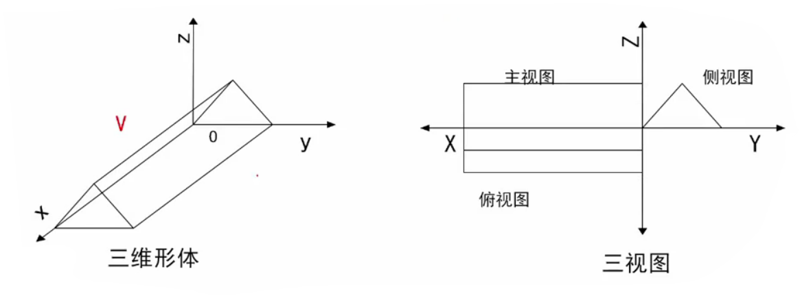
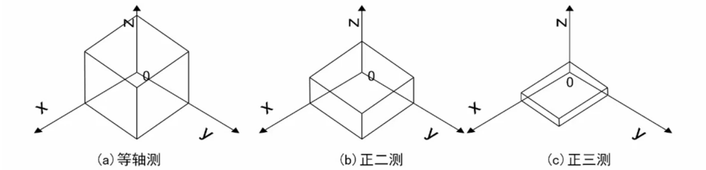

# 三维图形变换

## 三维物体基本几何变换

> 三维物体的几何变换是在二维方法基础上增加了对z坐标的考虑而得到的
>
> 与二维变换类似，引入齐次坐标表示
>
> 即：三维空间中某点的变换可以表示成点的齐次坐标与四阶的三维变换矩阵相乘

$$
p'=\begin{bmatrix}x' & y' & z' & 1\end{bmatrix}=p·T_{3D}\\
=\begin{bmatrix}x & y & z & 1\end{bmatrix}·
\begin{bmatrix}
a & b & c & p\\
d & e & f & q\\
g & h & i & r\\
l & m & n & s
\end{bmatrix}
$$

根据$T_{3D}$在变换中所起的具体作用，进一步可将$T_{3D}$分成四个矩阵。

即：
$$
T_{3D}=\begin{bmatrix}
a & b & c & p\\
d & e & f & q\\
g & h & i & r\\
l & m & n & s
\end{bmatrix}
$$

其中：
$$
T_1=\begin{bmatrix}
a & b & c \\
d & e & f \\
g & h & i \\
\end{bmatrix},对点进行比例、对称、旋转、错切变换
$$
$$
T_2=\begin{bmatrix}l & m & n \end{bmatrix},对点进行平移变换
$$
$$
T_3=\begin{bmatrix}p\\q\\r\\\end{bmatrix},作用是进行透视投影变换
$$
$$
T_4=\begin{bmatrix}s\end{bmatrix},作用是产生整体比例变换
$$

## 平移变换

> 若三维物体沿x,y,z方向上移动一个位置，而物体的大小与形状均不变，则称为平移变换

点P的平移变换矩阵表示如下：
$$
\begin{bmatrix}x' & y' & z' & 1\end{bmatrix}
=\begin{bmatrix}x & y & z & 1\end{bmatrix}·T_t\\
=\begin{bmatrix}x & y & z & 1\end{bmatrix}·
\begin{bmatrix}
1 & 0 & 0 & 0\\
0 & 1 & 0 & 0\\
0 & 0 & 1 & 0\\
T_x & T_y & T_z & 1
\end{bmatrix}\\
=\begin{bmatrix}x+T_x & y+T_y & z+T_z & 1\end{bmatrix}
$$

## 比例变换

> 比例变换分局部比例变换和整体比例变换

### 局部比例变换

局部比例变换由T_{2D}中**主对角线元素**决定，其它元素均为零。

当对$x,y,z$方向分别进行比例变换时，其变换的矩阵表示为：
$$
\begin{bmatrix}x' & y' & z' & 1\end{bmatrix}
=\begin{bmatrix}x & y & z & 1\end{bmatrix}·T_s\\
=\begin{bmatrix}x & y & z & 1\end{bmatrix}·
\begin{bmatrix}
a & 0 & 0 & 0\\
0 & e & 0 & 0\\
0 & 0 & i & 0\\
0 & 0 & 0 & 1
\end{bmatrix}\\
=\begin{bmatrix}ax & ey & iz & 1\end{bmatrix}
$$

### 整体比例变换
整体比例变换，可用以下矩阵表示：
$$
\begin{bmatrix}x' & y' & z' & 1\end{bmatrix}
=\begin{bmatrix}x & y & z & 1\end{bmatrix}·T_s\\
=\begin{bmatrix}x & y & z & 1\end{bmatrix}·
\begin{bmatrix}
1 & 0 & 0 & 0\\
0 & 1 & 0 & 0\\
0 & 0 & 1 & 0\\
0 & 0 & 0 & s
\end{bmatrix}\\
=\begin{bmatrix}x & y & z & s\end{bmatrix}
=\begin{bmatrix}{x\over s} & {y\over s} & {z\over s} & 1\end{bmatrix}
$$

### 旋转变换
三维立体的旋转变换，是指给定的三维立体绕三维空间**某个指定的坐标轴**旋转θ角度

旋转后，立体的空间位置将发生变化，但形状不变。

!> θ角的正负按右手规则确定，右手大姆指指向旋转轴的正向，其余四个手指指向旋转角的正向

#### 绕z轴旋转
三维空间立体绕z轴正向旋转时，立体上各顶点的**x,y坐标改变，而z坐标不变**。

而x,y坐标可由二维点绕原点旋转公式得到，因此可得：
$$
\begin{cases}
x*=x\cos\theta-y\sin\theta\\
y*=xsin\theta+y\cos\theta
\end{cases}
$$
$$
\begin{bmatrix}x' & y' & z' & 1\end{bmatrix}
=\begin{bmatrix}x & y & z & 1\end{bmatrix}·T_{R_z}\\
=\begin{bmatrix}x & y & z & 1\end{bmatrix}·
\begin{bmatrix}
\cos\theta & \sin\theta & 0 & 0\\
-\sin\theta & \cos\theta & 0 & 0\\
0 & 0 & 1 & 0\\
0 & 0 & 0 & 1
\end{bmatrix}\\
=\begin{bmatrix}x·\cos-y·\sin\theta & x·\sin\theta+y·\cos\theta & z & 1\end{bmatrix}
$$

#### 绕x轴旋转

同理，三维点p绕x轴正向旋转θ角的矩阵计算形式为：
$$
\begin{bmatrix}x' & y' & z' & 1\end{bmatrix}
=\begin{bmatrix}x & y & z & 1\end{bmatrix}·T_{R_x}\\
=\begin{bmatrix}x & y & z & 1\end{bmatrix}·
\begin{bmatrix}
1 & 0 & 0 & 0\\
0 & \cos\theta & \sin\theta & 0\\
0 & \sin\theta & \cos\theta & 0\\
0 & 0 & 0 & 1
\end{bmatrix}\\
=\begin{bmatrix}x & y·\cos\theta-z·\sin\theta & y·\sin\theta+z·\cos\theta & 1\end{bmatrix}
$$

#### 绕y轴旋转

三维点p绕y轴正向旋转θ角的矩阵计算形式为：
$$
\begin{bmatrix}x' & y' & z' & 1\end{bmatrix}
=\begin{bmatrix}x & y & z & 1\end{bmatrix}·T_{R_y}\\
=\begin{bmatrix}x & y & z & 1\end{bmatrix}·
\begin{bmatrix}
\cos\theta & 0 & -\sin\theta & 0\\
0 & 1 & 0 & 0\\
\sin\theta & 0 & \cos\theta & 0\\
0 & 0 & 0 & 1
\end{bmatrix}\\
=\begin{bmatrix}x·\sin\theta+x·\cos\theta & y & z·\cos\theta-x·\sin\theta & 1\end{bmatrix}
$$

#### 绕任意轴旋转

> 求绕任意直线旋转矩阵的原则：
>
> 1. 任意变换的问题——基本几何变换的问题
> 2. 绕任意直线旋转的问题——绕坐标轴旋转的问题

## 对称变换

对称变换有关于坐标平面、坐标轴等的对称变换。

### 关于坐标平面的对称

- 关于xoy平面进行对称变换

$$
T_{F_{xy}}=\begin{bmatrix}
1 & 0 & 0 & 0\\
0 & 1 & 0 & 0\\
0 & 0 & -1 & 0\\
0 & 0 & 0 & 1
\end{bmatrix}\\
\begin{bmatrix}x' & y' & z' & 1\end{bmatrix}
=\begin{bmatrix}x & y & z & 1\end{bmatrix}·
\begin{bmatrix}
1 & 0 & 0 & 0\\
0 & 1 & 0 & 0\\
0 & 0 & -1 & 0\\
0 & 0 & 0 & 1
\end{bmatrix}\\
=\begin{bmatrix}x & y & -z & 1\end{bmatrix}
$$

- 关于yoz平面进行对称变换

$$
T_{F_{yz}}=\begin{bmatrix}
-1 & 0 & 0 & 0\\
0 & 1 & 0 & 0\\
0 & 0 & 1 & 0\\
0 & 0 & 0 & 1
\end{bmatrix}\\
\begin{bmatrix}x' & y' & z' & 1\end{bmatrix}
=\begin{bmatrix}x & y & z & 1\end{bmatrix}·
\begin{bmatrix}
-1 & 0 & 0 & 0\\
0 & 1 & 0 & 0\\
0 & 0 & 1 & 0\\
0 & 0 & 0 & 1
\end{bmatrix}\\
=\begin{bmatrix}-x & y & z & 1\end{bmatrix}
$$

- 关于zox平面进行对称变换

$$
T_{F_{zx}}=\begin{bmatrix}
1 & 0 & 0 & 0\\
0 & -1 & 0 & 0\\
0 & 0 & 1 & 0\\
0 & 0 & 0 & 1
\end{bmatrix}\\
\begin{bmatrix}x' & y' & z' & 1\end{bmatrix}
=\begin{bmatrix}x & y & z & 1\end{bmatrix}·
\begin{bmatrix}
1 & 0 & 0 & 0\\
0 & -1 & 0 & 0\\
0 & 0 & 1 & 0\\
0 & 0 & 0 & 1
\end{bmatrix}\\
=\begin{bmatrix}x & -y & z & 1\end{bmatrix}
$$

### 关于坐标轴对称
- 关于x轴进行对称变换

$$
T_{F_x}=\begin{bmatrix}
1 & 0 & 0 & 0\\
0 & -1 & 0 & 0\\
0 & 0 & -1 & 0\\
0 & 0 & 0 & 1
\end{bmatrix}\\
\begin{bmatrix}x' & y' & z' & 1\end{bmatrix}
=\begin{bmatrix}x & y & z & 1\end{bmatrix}·
\begin{bmatrix}
1 & 0 & 0 & 0\\
0 & -1 & 0 & 0\\
0 & 0 & -1 & 0\\
0 & 0 & 0 & 1
\end{bmatrix}\\
=\begin{bmatrix}x & -y & -z & 1\end{bmatrix}
$$

- 关于y轴进行对称变换

$$
T_{F_y}=\begin{bmatrix}
-1 & 0 & 0 & 0\\
0 & 1 & 0 & 0\\
0 & 0 & -1 & 0\\
0 & 0 & 0 & 1
\end{bmatrix}\\
\begin{bmatrix}x' & y' & z' & 1\end{bmatrix}
=\begin{bmatrix}x & y & z & 1\end{bmatrix}·
\begin{bmatrix}
-1 & 0 & 0 & 0\\
0 & 1 & 0 & 0\\
0 & 0 & -1 & 0\\
0 & 0 & 0 & 1
\end{bmatrix}\\
=\begin{bmatrix}-x & y & -z & 1\end{bmatrix}
$$

- 关于z轴进行对称变换

$$
T_{F_z}=\begin{bmatrix}
-1 & 0 & 0 & 0\\
0 & -1 & 0 & 0\\
0 & 0 & 1 & 0\\
0 & 0 & 0 & 1
\end{bmatrix}\\
\begin{bmatrix}x' & y' & z' & 1\end{bmatrix}
=\begin{bmatrix}x & y & z & 1\end{bmatrix}·
\begin{bmatrix}
-1 & 0 & 0 & 0\\
0 & -1 & 0 & 0\\
0 & 0 & 1 & 0\\
0 & 0 & 0 & 1
\end{bmatrix}\\
=\begin{bmatrix}-x & -y & z & 1\end{bmatrix}
$$

## 投影变换
> 用于在二维平面上显示三维物体

平面几何投影的投影变换，就是把三维物体投射到投影面上得到二维平面图形

需要记住的一点是，计算机绘图是产生三维物体的二维图像。但在屏幕上绘制图形的时候，必须在三维坐标系下来考虑画法

在创建一个三维图形时，不要考虑二维平面图像

$$
投影法\begin{cases}
	透视(中心)投影法—建筑透视投影法\begin{cases}
		一点透视\\
		二点透视\\
		三点透视
	\end{cases}\\
	
	平行投影法\begin{cases}
		正投影法—工程图样\begin{cases}
			三视图\begin{cases}
				正视图\\
				侧视图\\
				俯视图
			\end{cases}\\
			正轴测
		\end{cases}\\
		
		斜投影法\begin{cases}
			斜等测\\
			斜二侧
		\end{cases}
	\end{cases}
\end{cases}
$$

两种投影法的本质区别在于，透视投影的投影中心到投影面之间的距离是有限的；而另一个的距离是无限的

### 透视(中心)投影法

在投影中心相对投影面 确定的情况下，空间的一个点在投影面上只存在唯一一个投影

透视投影特点：

- 物体的投影视图 由计算投影线与观察平面之交点而得

- 透视投影生成真实感视图但不保持相关比例

### 平行投影

如果把透视投影的中心移至无穷远处，则各投影线成为相互平行的直线，这种投影法称为平行投影法。

>平行投影特点：
>
>- 平行投影保持物体的有关比例不变
>
>- 变物体的各个面的精确视图由平行投影而得
>
>- 没有给出三维物体外表的真实性表示

**正投影**根据投影面与坐标轴的夹角可分为两类：三视图和正轴侧图

> 当投影面与某一坐标轴垂直时，得到的投影为三视图，这时投影方向与这个坐标轴的方向一致；
>
> 否则，得到的投影为正轴侧图

#### 正投影-三视图

> 通常所说的三视图包括主视图、侧视图和俯视图三种，投影面分别与x轴、y轴和z轴垂直
>
> **特点：**物体的一个坐标面平行于投影面，其投影能反映形体的实际尺寸工程制图中常用三视图来测量形体间的距离、角度以及相互位置关系
>
> **不足：**一组三视图上只有物体一个面的投影，所以三视图难以形象地表示出形体的三维性质，只有将主、侧、俯三个视图放在一起，才能综合出物体的空间形状

**计算步骤：**

1. 确定三维物体上各点的位置坐标
2. 引入齐次坐标，求出所作变换相应的变换矩
3. 将所作变换用矩阵表示，通过运算求得三维物体上各点经变换后的点坐标值
4. 由变换后得到的二维点绘出三维物体投影后的三视图

------

##### 主视图

由投影变换前后三维物体上点到主视图上点的关系

投影变换的变换矩阵应为：
$$
T_v=T_{xOz}=\begin{bmatrix}
1 & 0 & 0 & 0\\
0 & 0 & 0 & 0\\
0 & 0 & 1 & 0\\
0 & 0 & 0 & 1
\end{bmatrix}
$$
通常称$T_v$为**主视图**的投影变换矩阵。

于是，由三维物体到主视图的投影变换矩阵表示为：
$$
\begin{bmatrix}x' & y' & z' & 1\end{bmatrix}
=\begin{bmatrix}x & y & z & 1\end{bmatrix}·T_v
=\begin{bmatrix}x & 0 & z & 1\end{bmatrix}
$$
 

##### 俯视图

将三维物体x0y面（又称H面）作垂直投影得到俯视图

其投影变换矩阵应为：
$$
T_H=T_{xOy}=\begin{bmatrix}
1 & 0 & 0 & 0\\
0 & 1 & 0 & 0\\
0 & 0 & 0 & 0\\
0 & 0 & 0 & 1
\end{bmatrix}
$$

$$
\begin{bmatrix}x' & y' & z' & 1\end{bmatrix}
=\begin{bmatrix}x & y & z & 1\end{bmatrix}·T_H
=\begin{bmatrix}x & y & 0 & 1\end{bmatrix}
$$

为了使俯视图与主视图都画在一个平面内，就要使H面绕x轴顺时针转90°

即应有一个旋转变换，其变换矩阵为：
$$
T_{R_x}=\begin{bmatrix}
1 & 0 & 0 & 0\\
0 & \cos(-90°) & \sin(-90°) & 0\\
0 & -\sin(-90°) & \cos(-90°) & 0\\
0 & 0 & 0 & 1
\end{bmatrix}
=\begin{bmatrix}
1 & 0 & 0 & 0\\
0 & 0 & -1 & 0\\
0 & 1 & 0 & 0\\
0 & 0 & 0 & 1
\end{bmatrix}
$$

为了使主视图和俯视图有一定的间距，还要使H面沿z方向**平移**一段距离$-z_0$，

其变换矩阵为：
$$
T_{t_z}=\begin{bmatrix}
1 & 0 & 0 & 0\\
0 & 1 & 0 & 0\\
0 & 0 & 1 & 0\\
0 & 0 & -z_0 & 1
\end{bmatrix}
$$
于是，俯视图的投影变换矩阵：
$$
T_H=T_{xOy}·T_{R_x}·T_{t_z}
=\begin{bmatrix}
1 & 0 & 0 & 0\\
0 & 1 & 0 & 0\\
0 & 0 & 0 & 0\\
0 & 0 & 0 & 1
\end{bmatrix}
·\begin{bmatrix}
1 & 0 & 0 & 0\\
0 & 0 & -1 & 0\\
0 & 1 & 0 & 0\\
0 & 0 & 0 & 1
\end{bmatrix}
·\begin{bmatrix}
1 & 0 & 0 & 0\\
0 & 1 & 0 & 0\\
0 & 0 & 1 & 0\\
0 & 0 & -z_0 & 1
\end{bmatrix}\\
=\begin{bmatrix}
1 & 0 & 0 & 0\\
0 & 0 & -1 & 0\\
0 & 0 & 0 & 0\\
0 & 0 & -z_0 & 1
\end{bmatrix}
$$

$$
\begin{bmatrix}x' & y' & z' & 1\end{bmatrix}
=\begin{bmatrix}x & y & z & 1\end{bmatrix}·T_H
=\begin{bmatrix}x & 0 & -(y+z_0) & 1\end{bmatrix}
$$

 

##### 侧视图

将三维物体yOz面（又称W面）作垂直投影得到侧视图

其投影变换矩阵应为：
$$
T_W=T_{yOz}=\begin{bmatrix}
0 & 0 & 0 & 0\\
0 & 1 & 0 & 0\\
0 & 0 & 0 & 0\\
0 & 0 & 0 & 1
\end{bmatrix}
$$

为了使侧视图与主视图也在一个平面内，就要使W面绕轴正转90°

其旋转变换换矩阵为：
$$
T_{R_z}=\begin{bmatrix}
\cos90°  & \sin90° & 0 & 0\\
-\sin90°  & \cos90° & 0 & 0\\
0 & 0 & 1 & 0\\
0 & 0 & 0 & 1
\end{bmatrix}
=\begin{bmatrix}
1 & 0 & 0 & 0\\
-1 & 0 & 0 & 0\\
0 & 0 & 1 & 0\\
0 & 0 & 0 & 1
\end{bmatrix}
$$
为使主视图和侧视图有一定的间距，还要使W面沿负x方向平移一段距离$-x_0$

该平移变换矩阵为：
$$
T_{t_x}=\begin{bmatrix}
1 & 0 & 0 & 0\\
0 & 1 & 0 & 0\\
0 & 0 & 1 & 0\\
-x_0 & 0 & 0 & 1
\end{bmatrix}
$$
于是，侧视图的投影变换矩阵为：
$$
T_W=T_{yOz}·T_{R_z}·T_{t_x}
=\begin{bmatrix}
1 & 0 & 0 & 0\\
0 & 1 & 0 & 0\\
0 & 0 & 1 & 0\\
0 & 0 & 0 & 1
\end{bmatrix}
·\begin{bmatrix}
0 & 1 & 0 & 0\\
-1 & 0 & 0 & 0\\
0 & 0 & 1 & 0\\
0 & 0 & 0 & 1
\end{bmatrix}
·\begin{bmatrix}
1 & 0 & 0 & 0\\
0 & 1 & 0 & 0\\
0 & 0 & 1 & 0\\
-x_0 & 0 & 0 & 1
\end{bmatrix}\\
=\begin{bmatrix}
1 & 0 & 0 & 0\\
-1 & 0 & 0 & 0\\
0 & 0 & 1 & 0\\
-x_0 & 0 & 0 & 1
\end{bmatrix}
$$

$$
\begin{bmatrix}x' & y' & z' & 1\end{bmatrix}
=\begin{bmatrix}x & y & z & 1\end{bmatrix}·T_W
=\begin{bmatrix}-(y+x_0) & 0 & z & 1\end{bmatrix}
$$

##### 总结

> [!note|style:callout|label:三视图投影矩阵|labelVisibility:visible|iconVisibility:visible]
>
> 主视图：$\begin{bmatrix}x' & y' & z' & 1\end{bmatrix}
> =\begin{bmatrix}x & y & z & 1\end{bmatrix}·T_v
> =\begin{bmatrix}x & 0 & z & 1\end{bmatrix}$
>
> 俯视图：$\begin{bmatrix}x' & y' & z' & 1\end{bmatrix}
> =\begin{bmatrix}x & y & z & 1\end{bmatrix}·T_H
> =\begin{bmatrix}x & 0 & -(y+z_0) & 1\end{bmatrix}$
>
> 侧视图：$\begin{bmatrix}x' & y' & z' & 1\end{bmatrix}
> =\begin{bmatrix}x & y & z & 1\end{bmatrix}·T_W
> =\begin{bmatrix}-(y+x_0) & 0 & z & 1\end{bmatrix}$
>
> 三个视图中的y均为0，表明三个视图均落在xOz面上

#### 正投影-正轴测图

正轴测有等轴测、正二测和正三测三种：

- 当投影面与三个坐标轴之间的夹角**都相等**时 为等轴测
- 当投影面与**两个**坐标轴之间的夹角相等时 为正二测
- 当投影面与三个坐标轴之间的夹角**都不相等**时 为正三测

空间物体的正轴测图是以V面为轴测投影面，先将物体绕Z轴转γ角，接着绕X轴转-α角，最后向V面投影。

其变换矩阵为：

$T_正=T_Z·T_X·T_V\\
=\begin{bmatrix}
\cosγ & \sinγ & 0 & 0\\
-\sinγ & \cosγ & 0 & 0\\
0 & 0 & 1 & 0\\
0 & 0 & 0 & 1
\end{bmatrix}·
\begin{bmatrix}
1 & 0 & 0 & 0\\
0 & \cosγ & -\sinγ & 0\\
0 & \sinγ & \cosγ & 0\\
0 & 0 & 0 & 1
\end{bmatrix}·
\begin{bmatrix}
1 & 0 & 0 & 0\\
0 & 0 & 0 & 0\\
0 & 0 & 1 & 0\\
0 & 0 & 0 & 1
\end{bmatrix}\\
=\begin{bmatrix}
\cosγ & 0 & -\sinγ\sinα & 0\\
-\sinγ & 0 & -\cosγ\sinα & 0\\
0 & 0 & \cosα & 0\\
0 & 0 & 0 & 1
\end{bmatrix}$

$即：\begin{cases}
x*=x\cosγ-y\sinγ\\
y*=0\\
z*=-x\sinγ\sinα-y\cosγ\sinα+z\cosα
\end{cases}$

##### 正等轴测图

根据画法几何学，作正等轴测投影时，$γ=45°，α=-35.26°$

将Y、α代入上式，其变换矩阵为：
$$
T_{正等轴测}=
\begin{bmatrix}
0.7071 & 0 & -0.4082 & 0\\
-0.7071 & 0 & -0.4082 & 0\\
0 & 0 & 0.8165 & 0\\
0 & 0 & 0 & 1
\end{bmatrix}
$$

##### 正二测图

做正二测图时，$γ=20.7°，α=19.47°$

其变换矩阵为：
$$
T_{正二等}=
\begin{bmatrix}
0.9354 & 0 & -0.1178 & 0\\
-0.7071 & 0 & -0.3118 & 0\\
0 & 0 & 0.9428 & 0\\
0 & 0 & 0 & 1
\end{bmatrix}
$$

### 透视投影

> 透视投影（ Perspective Projection）是为了获得接近真实三维物体的视觉效果，而在二维的纸或者画布平面上绘图或者渲染的一种方法，能逼真地反映形体的空间形象，也称为透视图。
>
> 透视投影是3D渲染的基本概念，也是3D程序设计的基础。

$$
T_{3D}=
\begin{bmatrix}
a & b & c & p\\
d & e & f & q\\
g & h & i & r\\
l & m & n & s
\end{bmatrix}，
其中\begin{bmatrix}p\\q\\r\end{bmatrix}为透视投影效果
$$

#### 一点透视

1. 假设$q≠0，p=r=0$。然后对点$(x,y,z)$进行变换：

$$
\begin{bmatrix}x & y & z & 1\end{bmatrix}·
\begin{bmatrix}
1 & 0 & 0 & 0\\
0 & 1 & 0 & q\\
0 & 0 & 1 & 0\\
0 & 0 & 0 & 1
\end{bmatrix}
=\begin{bmatrix}x & y & z & \color{red}qy+1\end{bmatrix}\\
=\begin{bmatrix}x\over{qy+1} & y\over{qy+1} & z\over{qy+1} & 1\end{bmatrix}
=\begin{bmatrix}x' & y' & z' & 1\end{bmatrix}
$$

当$y=0$时，得：$\begin{cases}x'=x\\y'=0\\z'=z\end{cases}$，说明处于y=0平面内的点，经过变换以后没有发生变化

当$y→∞$时，得：$\begin{cases}x'=0\\y'={1\over q}\\z'=z\end{cases}$，说明当$y→∞$时，所有点的变换结果都集中到了y轴上的$1\over q$处

即所有平行于y轴的直线将延伸相交于点$(0,{1\over q}，0)$

该点称为灭点，而像这样形成个灭点的透视变换，称为一点透视

 

根据同样的道理，当$p≠0$，$q=r=0$时，则将在x轴上的$1\over q$处产生一个灭点，其坐标值为$({1\over q},0,0)$。

这种情况下，所有平行于x轴的直线将延伸交于该点
$$
\begin{bmatrix}x & y & z & 1\end{bmatrix}·
\begin{bmatrix}
1 & 0 & 0 & p\\
0 & 1 & 0 & 0\\
0 & 0 & 1 & 0\\
0 & 0 & 0 & 1
\end{bmatrix}
=\begin{bmatrix}x & y & z & \color{red}px+1\end{bmatrix}\\
=\begin{bmatrix}x\over{px+1} & y\over{px+1} & z\over{px+1} & 1\end{bmatrix}
=\begin{bmatrix}x' & y' & z' & 1\end{bmatrix}
$$
当$r≠0，q=p=0$时，则将在z轴上的$1\over r$处产生一个灭点，其坐标值为$(0,0,{1\over r})$。在这种情况下，所有平行于z轴的直线将延伸交于该点。

#### 多点透视

根据一点透视的原理予以推广，如果$p,q,r$三个元素中有两个为非零元素时，将会生成两个灭点，因此得到两点透视。

如当$p≠0，r≠0$时，结果为：
$$
\begin{bmatrix}x & y & z & 1\end{bmatrix}·
\begin{bmatrix}
1 & 0 & 0 & p\\
0 & 1 & 0 & 0\\
0 & 0 & 1 & r\\
0 & 0 & 0 & 1
\end{bmatrix}
=\begin{bmatrix}x & y & z & \color{red}px+rz+1\end{bmatrix}\\
$$
经过齐次化处理后结果为：
$$
\begin{cases}
x'={x\over (px+rz+1)}\\
y'={y\over (px+rz+1)}\\
z'={z\over (px+rz+1)}
\end{cases}
$$
从以上结果可以看到：

当$x→∞$时，一个灭点在x轴上的$1\over p$处

当$z→∞$时，一个灭点在z轴上的$1\over r$处

同理，当p,q,r三个元素全为非零时，结果将会产生三个灭点，从而形成**三点透视**。产生的三个灭点分别在x轴上的$1\over p$处、y轴上的$1\over q$处和z轴上的$1\over r$处

#### 实例

1. 一点透视

   一点透视只有一个灭点。进行透视投影，要很好地考虑图面布局，以避免三维物体的平面或直线积聚成直线或点而影响直观性。

   具体地说，就是要考虑下列几点：

   1. 三维形体与画面（投影面）的相对位置
   2. 视距，即视点（投影中心）与画面的距离
   3. 视点的高度

假定视点（投影中心）在z轴上（z=-d处），投影面在$xOy$面上，则一点透视的骤如下：

1. 将三维物体平移到适当位置|、m、n
2. 进行透视变换
3. 最后，为了绘制的方便，向$xOy$平面作在投影变换，将结果变换到$xOy$平面上。

$$
T_{p1}=\begin{bmatrix}
1 & 0 & 0 & 0\\
0 & 1 & 0 & 0\\
0 & 0 & 1 & 0\\
l & m & n & 1
\end{bmatrix}·
\begin{bmatrix}
1 & 0 & 0 & 0\\
0 & 1 & 0 & 0\\
0 & 0 & 1 & 1\over d\\
0 & 0 & 0 & 1
\end{bmatrix}·
\begin{bmatrix}
1 & 0 & 0 & 0\\
0 & 1 & 0 & 0\\
0 & 0 & \color{red}0 & 0\\
0 & 0 & 0 & 1
\end{bmatrix}
$$

得到三维物体中任一点$(x,y,z)$**一点透视变换矩阵**形式：
$$
T_{p1}=\begin{bmatrix}
1 & 0 & 0 & 0\\
0 & 1 & 0 & 0\\
0 & 0 & 1 & 1\over d\\
l & m & 0 & {n\over d}+1
\end{bmatrix}
$$

$$
\begin{bmatrix}x' & y' & z' & 1\end{bmatrix}
=\begin{bmatrix}x & y & z & 1\end{bmatrix}·
\begin{bmatrix}
1 & 0 & 0 & 0\\
0 & 1 & 0 & 0\\
0 & 0 & 0 & 1\over d\\
l & m & 0 & {n\over d}+1
\end{bmatrix}\\
=\begin{bmatrix}
{x+l}\over {{(n+z)\over d}+1} & {y+m}\over {{(n+z)\over d}+1} & 0 & 1
\end{bmatrix}
$$

------

2. 二点透视
   1. 将物体平移到适当位置$l、m、n$
   2. 将物体绕y轴旋转θ角
   3. 进行透视变换
   4. 最后向$xOy$面做正投影，即得二点透视图

$$
T_{p2}=
\begin{bmatrix}
1 & 0 & 0 & 0\\
0 & 1 & 0 & 0\\
0 & 0 & 1 & 0\\
l & m & n & 1
\end{bmatrix}·
\begin{bmatrix}
\cos\theta & 0 & -\sin\theta & 0\\
0 & 1 & 0 & 0\\
\sin\theta & 0 & \cos\theta & 0\\
0 & 0 & 0 & 1
\end{bmatrix}·
\begin{bmatrix}
1 & 0 & 0 & p\\
0 & 1 & 0 & 0\\
0 & 0 & 1 & r\\
0 & 0 & 0 & 1
\end{bmatrix}·
\begin{bmatrix}
1 & 0 & 0 & 0\\
0 & 1 & 0 & 0\\
0 & 0 & \color{red}0 & 0\\
0 & 0 & 0 & 1
\end{bmatrix}\\
=\begin{bmatrix}
\cos\theta & 0 & 0 & p·cos\theta-r\sin\theta\\
0 & 1 & 0 & 0\\
\sin\theta & 0 & 0 & p·\sin\theta+r·\cos\theta\\
l·\cos\theta+n·\sin\theta & m & 0 & p(l·\cos\theta+n·\sin\theta+r(n·\cos\theta-l·\sin\theta)+1)
\end{bmatrix}
$$

------

3. 三点透视
   1. 将物体平移到适当位置
   2. 将物体绕y轴旋转θ角
   3. 再绕x轴旋转α角
   4. 进行透视变换
   5. 最后向$xOy$面做正投影，即得三点透视图