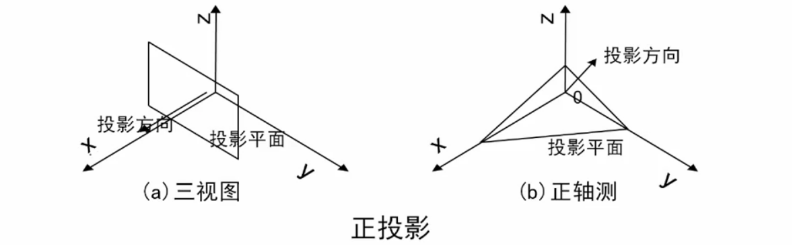

# 三维图形变换

## 三维物体基本几何变换

> 三维物体的几何变换是在二维方法基础上增加了对z坐标的考虑而得到的
>
> 与二维变换类似，引入齐次坐标表示
>
> 即：三维空间中某点的变换可以表示成点的齐次坐标与四阶的三维变换矩阵相乘

$$
p'=\begin{bmatrix}x' & y' & z' & 1\end{bmatrix}=p·T_{3D}\\
=\begin{bmatrix}x & y & z & 1\end{bmatrix}·
\begin{bmatrix}
a & b & c & p\\
d & e & f & q\\
g & h & i & r\\
l & m & n & s
\end{bmatrix}
$$

根据$T_{3D}$在变换中所起的具体作用，进一步可将$T_{3D}$分成四个矩阵。

即：
$$
T_{3D}=\begin{bmatrix}
a & b & c & p\\
d & e & f & q\\
g & h & i & r\\
l & m & n & s
\end{bmatrix}
$$

其中：
$$
T_1=\begin{bmatrix}
a & b & c \\
d & e & f \\
g & h & i \\
\end{bmatrix},对点进行比例、对称、旋转、错切变换\\
T_2=\begin{bmatrix}l & m & n \end{bmatrix},对点进行平移变换\\
T_3=\begin{bmatrix}p\\q\\r\\\end{bmatrix},作用是进行透视投影变换\\
T_4=\begin{bmatrix}s\end{bmatrix},作用是产生整体比例变换
$$

## 平移变换

> 若三维物体沿x,y,z方向上移动一个位置，而物体的大小与形状均不变，则称为平移变换

点P的平移变换矩阵表示如下：
$$
\begin{bmatrix}x' & y' & z' & 1\end{bmatrix}
=\begin{bmatrix}x & y & z & 1\end{bmatrix}·T_t\\
=\begin{bmatrix}x & y & z & 1\end{bmatrix}·
\begin{bmatrix}
1 & 0 & 0 & 0\\
0 & 1 & 0 & 0\\
0 & 0 & 1 & 0\\
T_x & T_y & T_z & 1
\end{bmatrix}\\
=\begin{bmatrix}x+T_x & y+T_y & z+T_z & 1\end{bmatrix}
$$

## 比例变换

> 比例变换分局部比例变换和整体比例变换

### 局部比例变换

局部比例变换由T_{2D}中**主对角线元素**决定，其它元素均为零。

当对$x,y,z$方向分别进行比例变换时，其变换的矩阵表示为：
$$
\begin{bmatrix}x' & y' & z' & 1\end{bmatrix}
=\begin{bmatrix}x & y & z & 1\end{bmatrix}·T_s\\
=\begin{bmatrix}x & y & z & 1\end{bmatrix}·
\begin{bmatrix}
a & 0 & 0 & 0\\
0 & e & 0 & 0\\
0 & 0 & i & 0\\
0 & 0 & 0 & 1
\end{bmatrix}\\
=\begin{bmatrix}ax & ey & iz & 1\end{bmatrix}
$$

### 整体比例变换
整体比例变换，可用以下矩阵表示：
$$
\begin{bmatrix}x' & y' & z' & 1\end{bmatrix}
=\begin{bmatrix}x & y & z & 1\end{bmatrix}·T_s\\
=\begin{bmatrix}x & y & z & 1\end{bmatrix}·
\begin{bmatrix}
1 & 0 & 0 & 0\\
0 & 1 & 0 & 0\\
0 & 0 & 1 & 0\\
0 & 0 & 0 & s
\end{bmatrix}\\
=\begin{bmatrix}x & y & z & s\end{bmatrix}
=\begin{bmatrix}{x\over s} & {y\over s} & {z\over s} & 1\end{bmatrix}
$$

### 旋转变换
三维立体的旋转变换，是指给定的三维立体绕三维空间**某个指定的坐标轴**旋转θ角度

旋转后，立体的空间位置将发生变化，但形状不变。

!> θ角的正负按右手规则确定，右手大姆指指向旋转轴的正向，其余四个手指指向旋转角的正向

#### 绕z轴旋转

三维空间立体绕z轴正向旋转时，立体上各顶点的**x,y坐标改变，而z坐标不变**。

而x,y坐标可由二维点绕原点旋转公式得到，因此可得：
$$
\begin{cases}
x*=x\cos\theta-y\sin\theta\\
y*=xsin\theta+y\cos\theta
\end{cases}
$$
$$
\begin{bmatrix}x' & y' & z' & 1\end{bmatrix}
=\begin{bmatrix}x & y & z & 1\end{bmatrix}·T_{R_z}\\
=\begin{bmatrix}x & y & z & 1\end{bmatrix}·
\begin{bmatrix}
\cos\theta & \sin\theta & 0 & 0\\
-\sin\theta & \cos\theta & 0 & 0\\
0 & 0 & 1 & 0\\
0 & 0 & 0 & 1
\end{bmatrix}\\
=\begin{bmatrix}x·\cos-y·\sin\theta & x·\sin\theta+y·\cos\theta & z & 1\end{bmatrix}
$$

#### 绕x轴旋转

同理，三维点p绕x轴正向旋转θ角的矩阵计算形式为：
$$
\begin{bmatrix}x' & y' & z' & 1\end{bmatrix}
=\begin{bmatrix}x & y & z & 1\end{bmatrix}·T_{R_x}\\
=\begin{bmatrix}x & y & z & 1\end{bmatrix}·
\begin{bmatrix}
1 & 0 & 0 & 0\\
0 & \cos\theta & \sin\theta & 0\\
0 & \sin\theta & \cos\theta & 0\\
0 & 0 & 0 & 1
\end{bmatrix}\\
=\begin{bmatrix}x & y·\cos\theta-z·\sin\theta & y·\sin\theta+z·\cos\theta & 1\end{bmatrix}
$$

#### 绕y轴旋转

三维点p绕y轴正向旋转θ角的矩阵计算形式为：
$$
\begin{bmatrix}x' & y' & z' & 1\end{bmatrix}
=\begin{bmatrix}x & y & z & 1\end{bmatrix}·T_{R_y}\\
=\begin{bmatrix}x & y & z & 1\end{bmatrix}·
\begin{bmatrix}
\cos\theta & 0 & -\sin\theta & 0\\
0 & 1 & 0 & 0\\
\sin\theta & 0 & \cos\theta & 0\\
0 & 0 & 0 & 1
\end{bmatrix}\\
=\begin{bmatrix}x·\sin\theta+x·\cos\theta & y & z·\cos\theta-x·\sin\theta & 1\end{bmatrix}
$$

#### 绕任意轴旋转

> 求绕任意直线旋转矩阵的原则：
>
> 1. 任意变换的问题——基本几何变换的问题
> 2. 绕任意直线旋转的问题——绕坐标轴旋转的问题

## 对称变换

对称变换有关于坐标平面、坐标轴等的对称变换。

### 关于坐标平面的对称

- 关于xoy平面进行对称变换

$$
T_{F_{xy}}\begin{bmatrix}
1 & 0 & 0 & 0\\
0 & 1 & 0 & 0\\
0 & 0 & -1 & 0\\
0 & 0 & 0 & 1
\end{bmatrix}\\
\begin{bmatrix}x' & y' & z' & 1\end{bmatrix}
=\begin{bmatrix}x & y & z & 1\end{bmatrix}·
\begin{bmatrix}
1 & 0 & 0 & 0\\
0 & 1 & 0 & 0\\
0 & 0 & -1 & 0\\
0 & 0 & 0 & 1
\end{bmatrix}\\
=\begin{bmatrix}x & y & -z & 1\end{bmatrix}
$$

- 关于yoz平面进行对称变换

$$
T_{F_{yz}}\begin{bmatrix}
-1 & 0 & 0 & 0\\
0 & 1 & 0 & 0\\
0 & 0 & 1 & 0\\
0 & 0 & 0 & 1
\end{bmatrix}\\
\begin{bmatrix}x' & y' & z' & 1\end{bmatrix}
=\begin{bmatrix}x & y & z & 1\end{bmatrix}·
\begin{bmatrix}
-1 & 0 & 0 & 0\\
0 & 1 & 0 & 0\\
0 & 0 & 1 & 0\\
0 & 0 & 0 & 1
\end{bmatrix}\\
=\begin{bmatrix}-x & y & z & 1\end{bmatrix}
$$

- 关于zox平面进行对称变换

$$
T_{F_{zx}}\begin{bmatrix}
1 & 0 & 0 & 0\\
0 & -1 & 0 & 0\\
0 & 0 & 1 & 0\\
0 & 0 & 0 & 1
\end{bmatrix}\\
\begin{bmatrix}x' & y' & z' & 1\end{bmatrix}
=\begin{bmatrix}x & y & z & 1\end{bmatrix}·
\begin{bmatrix}
1 & 0 & 0 & 0\\
0 & -1 & 0 & 0\\
0 & 0 & 1 & 0\\
0 & 0 & 0 & 1
\end{bmatrix}\\
=\begin{bmatrix}x & -y & z & 1\end{bmatrix}
$$

### 关于坐标轴对称
- 关于x轴进行对称变换

$$
T_{F_x}\begin{bmatrix}
1 & 0 & 0 & 0\\
0 & -1 & 0 & 0\\
0 & 0 & -1 & 0\\
0 & 0 & 0 & 1
\end{bmatrix}\\
\begin{bmatrix}x' & y' & z' & 1\end{bmatrix}
=\begin{bmatrix}x & y & z & 1\end{bmatrix}·
\begin{bmatrix}
1 & 0 & 0 & 0\\
0 & -1 & 0 & 0\\
0 & 0 & -1 & 0\\
0 & 0 & 0 & 1
\end{bmatrix}\\
=\begin{bmatrix}x & -y & -z & 1\end{bmatrix}
$$

- 关于y轴进行对称变换

$$
T_{F_y}\begin{bmatrix}
-1 & 0 & 0 & 0\\
0 & 1 & 0 & 0\\
0 & 0 & -1 & 0\\
0 & 0 & 0 & 1
\end{bmatrix}\\
\begin{bmatrix}x' & y' & z' & 1\end{bmatrix}
=\begin{bmatrix}x & y & z & 1\end{bmatrix}·
\begin{bmatrix}
-1 & 0 & 0 & 0\\
0 & 1 & 0 & 0\\
0 & 0 & -1 & 0\\
0 & 0 & 0 & 1
\end{bmatrix}\\
=\begin{bmatrix}-x & y & -z & 1\end{bmatrix}
$$

- 关于z轴进行对称变换

$$
T_{F_z}\begin{bmatrix}
-1 & 0 & 0 & 0\\
0 & -1 & 0 & 0\\
0 & 0 & 1 & 0\\
0 & 0 & 0 & 1
\end{bmatrix}\\
\begin{bmatrix}x' & y' & z' & 1\end{bmatrix}
=\begin{bmatrix}x & y & z & 1\end{bmatrix}·
\begin{bmatrix}
-1 & 0 & 0 & 0\\
0 & -1 & 0 & 0\\
0 & 0 & 1 & 0\\
0 & 0 & 0 & 1
\end{bmatrix}\\
=\begin{bmatrix}-x & -y & z & 1\end{bmatrix}
$$

## 投影变换
> 用于在二维平面上显示三维物体

### 平面几何投影
投影变换就是把三维物体投射到投影面上得到二维平面图形

需要记住的一点是，计算机绘图是产生三维物体的二维图像。但在屏幕上绘制图形的时候，必须在三维坐标系下来考虑画法

在创建一个三维图形时，不要考虑二维平面图像

$$
投影法\begin{cases}
	透视(中心)投影法—建筑透视投影法\begin{cases}
		一点透视\\
		二点透视\\
		三点透视
	\end{cases}\\
	
	平行投影法\begin{cases}
		正投影法—工程图样\begin{cases}
			三视图\begin{cases}
				正视图\\
				侧视图\\
				俯视图
			\end{cases}\\
			正轴测
		\end{cases}\\
		
		斜投影法\begin{cases}
			斜等测\\
			斜二侧
		\end{cases}
	\end{cases}
\end{cases}
$$

两种投影法的本质区别在于，透视投影的投影中心到投影面之间的距离是有限的；而另一个的距离是无限的

#### 透视(中心)投影法

在投影中心相对投影面 确定的情况下，空间的一个点在投影面上只存在唯一一个投影

透视投影特点：

- 物体的投影视图 由计算投影线与观察平面之交点而得

- 透视投影生成真实感视图但不保持相关比例

#### 平行投影

如果把透视投影的中心移至无穷远处，则各投影线成为相互平行的直线，这种投影法称为平行投影法。

平行投影特点：

- 平行投影保持物体的有关比例不

- 变物体的各个面的精确视图由平行投影而得

- 没有给出三维物体外表的真实性表示