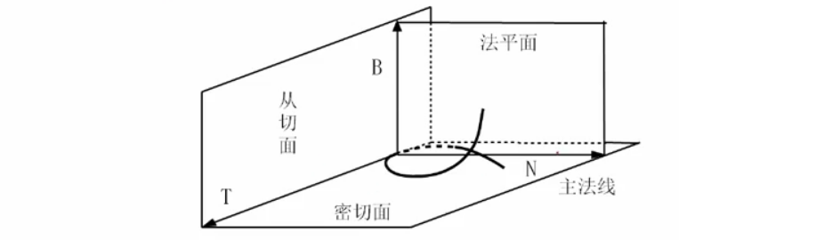
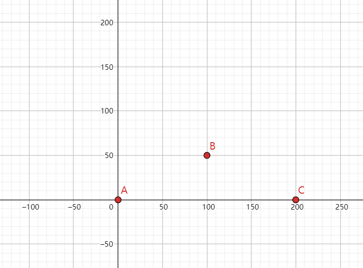
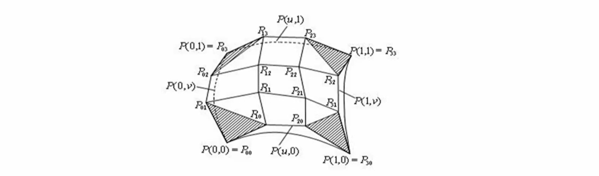
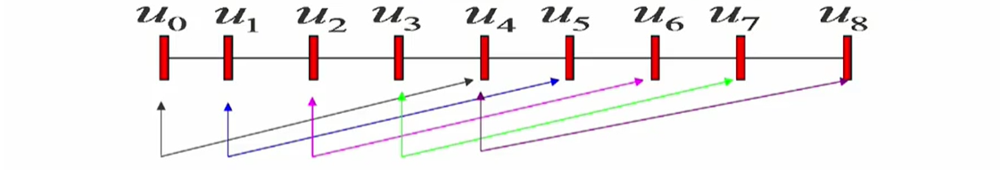

# 曲线曲面

## 曲线曲面基础

### 显示、隐式和参数表示

曲线和曲面的表示方程**有参数表示**和**非参数表示**之分，非参数表示又分为**显式表示**和**隐式表示**

> 对于一个平面曲线，显式表示一般形式是：$y=f(x)$
>
> 在此方程中，一个x值与一个y值对应，所以显式方程不能表示封闭或多值曲线
>
> 如果一个平面曲线方程，表示成$f(x,y)=0$的形式，称之为**隐式表示**。
>
> 隐式表示的优点是易于判断一个点是否在曲线上

显式或隐式表示存在的问题：

- 与坐标轴相关
- 用隐函数表示不直观，作图不方便
- 用显函数表示存在多值性
- 会出现斜率为无穷大的情形

### 参数方程

为了克服以上问题，曲线曲面方程通常表示成参数的形式

假定用t表示参数，平面曲线上任一点P可表示为：
$$
p(t)=[x(t),y(t)]
$$
空间曲线上任意三维点P可表示为：
$$
p(t)=[x(t),y(t),z(t)]
$$
它等价于笛卡儿分量表示：
$$
p(t)=x(t)i+y(t)j+z(t)k
$$
这样，给定一个t值，就得到**曲线上一点**的坐标。

------

假设曲线段对应的参数区间为$[a,b]$，即$a≤t≤b$。

为方便期间，可以将区间$[a,b]$规范化成$[0,1]$，参数变换为：
$$
t'={t-a\over b-a}
$$
参数**曲线**一般可写成：
$$
p=p(t),t∈[0,1]
$$
 

类似地，可把**曲面**表示成为双参数u和v的矢量函数
$$
p(u,v)=p(x(u,v),y(u,v),z(u,v)),\space(u,v)∈[0,1]×[0,1]
$$
 

最简单的参数曲线是**直线段**，端点为P1、P2的直线段参数方程可表示为：
$$
p(t)=p_1+(p_2-p_1)t,t∈[0,1]
$$

### 位置矢量

曲线上任一点的位置矢量可表示为：
$$
P(t)=[x(t),y(t),z(t)]
$$

### 切矢量

选择弧长s作为参数，当Δt→0时，弦长Δs→0，但方向不能趋向于0
$$
T={dP\over ds}=\lim_{Δs→0}{ΔP\over Δs}
$$
根据弧长微分公式有：
$$
(ds)^2=(dx)^2+(dy)^2+(dz)^2
$$
引入参数t，可改写为：
$$
({ds\over dt})^2=({dx\over dt})^2+({dy\over dt})^2+({dz\over dt})^2=|P'(t)|^2
$$

$$
T={dP\over ds}={dP\over dt}·{dt\over ds}={P'(t)\over |P'(t)|}
$$

即T是单位切矢量

### 曲率

切向量求导，求导以后还是一个向量，称为曲率，其几何意义是曲线的单位切向量对弧长的转动率，即刻画这一点的曲线的弯曲程度
$$
k=|T'|=\lim_{Δs→0}|{ΔT\over Δs}|=\lim_{Δs→0}|{T(s+Δs)-T(s)\over Δs}|=\lim_{Δs→0}|{Δθ\over Δs}|
$$
曲率越大，表示曲线的弯曲程度越大

曲率k的倒数$ρ={1\over k}$称为曲率半径。

曲率半径越大，圆弧越平缓；曲率半径越小，圆弧越陡。

### 法矢量

法矢量是与切矢量垂直的向量

N、B构成的平面称为法平面，N、T构成的平面称为密切平面，B、T构成的平面称为从切平面

T（切矢量）、N（主法矢量）和B（副法矢量）构成了曲线上的活动坐标架
$$
B=T×N
$$

### 挠率

空间曲线不但要弯曲，而且还要扭曲，即要离开它的密切平面。

为了能刻画这一扭曲程度，等价于去研究密切平面的法矢量（即曲线的副法矢量）关于弧长的变化率。

挠率$τ$的绝对值等于副法线方向（或密切平面）对于弧长的转动率
$$
|τ|=\lim_{Δs}|{Δθ\over Δs}|
$$

### 插值

自由曲线和自由曲面一般通过少数分散的点生成，这些点叫做“型值点”、“样本点”或“控制点”

给定一组有序的数据点$P_i(i=0,1,2，…n)$，要求构造一条曲线顺序通过这些数据点，称为对这些数据点进行插值(interpolation)，所构造的曲线称为插值曲线

1. 线性插值：假设给定函数$f(x)$在两个不同点x和x2的值，用一个线形函数：$y=ax+b$，近似代替，称为的线性插值函数
2. 抛物线插值：已知三个点的坐标，要求构造一个抛物线函数

### 拟合

构造一条曲线，使之在某种意义下最接近给定的数据点（但未必通过这些点），所构造的曲线为拟合曲线

> 在计算数学中，逼近通常指用一些性质较好的函数近似表示一些性质不好的函数。
>
> 在计算机图形学中，逼近继承了这方面的含义，因此插值和拟合都可以视为逼近

对于逼近样条，连接控制点序列的折线通常被显示出来，以提醒设计者控制点的次序

般将连接有一定次序控制点的直线序列称为控制多边形或特征多边形

### 光顺

指曲线的拐点不能太多（有一、二阶导数等）

对平面曲线而言，相对光顺的条件是

1. 具有二阶几何连续性（$G^2$）

2. 不存在多余拐点和奇异点

3. 曲率变化较小

## 曲线连续性

当许多参数曲线段首尾相连构成一条曲线时，如何保证各曲线段在连接处具有合乎要求的连续性是一个重要问题。

假定参数曲线段$p_i$以参数形式进行描述：
$$
p_i=p_i(t),t∈[t_{i0},t_{i1}]
$$
这里讨论参数曲线两种意义上的连续性：即**参数连续性**和**几何连续性**

### 参数连续性

- 0阶参数连续性

  记作$C^0$连续性，是指曲线的几何位置连接，即第一个曲线段在$t_{i1}$处的x,y,z值与第二个曲线段在$t_{(i+1)0}$处的x,y,z值相等

$$
p_i(t_{i1})=p_{(i+1)}(t_{(i+1)0})
$$

- 1阶参数连续性

  记作$C^1$连续性，指代表两个相邻曲线段的方程在相交点处有相同的一阶导数（切线）：

$$
p_i(t_{i1})=p_{(i+1)}(t_{(i+1)0})\\
且p'_i(t_{i1})=p'_{(i+1)}(t_{(i+1)0})
$$

一阶连续性对数字化绘画及一些设计应用已经足够

- 2阶参数连续性

  记作$C^2$连续性，指两个相邻曲线段的方程在相交点处具有相同的一阶和二阶导数。

  类似地，还可定义高阶参数连续性

对于$C^2$连续性，交点处的切向量变化率相等，即切线从一个曲线段平滑地变化到另一个曲线段

二阶连续性对电影中的动画途径和很多精密CAD需求有用

------

经典的参数连续性在图形学里是不适合的，因为太苛刻，所以引进了几何连续性的概念

汽车曲面的设计美观要求很高，但有时候车身的一条曲线并不是参数连连续的，但人眼看上去已经是很光滑的了，因此需要一种更弱的连续性

### 几何连续性

曲线段相连的另一个连续性条件是几何连续性。

与参数连续性不同的是，它只需曲线段在相交处的参数导数**成比例**即可

- 0阶几何连续性

  记作$G^0$连续性。与0阶参数连续性的定义相同，满足：

$$
p_i(t_{i1})=p_{(i+1)}(t_{(i+1)0})
$$

- 1阶几何连续性

  记作$G^1$连续性。若要求在结合处达到$G^1$连续就是说两条曲线在结合处在满足$G^0$连续的条件下，并有公共的切矢

$$
Q'(0)=αP'(1)\space(α>0)
$$

- 2阶几何连续性

  记作$G^2$连续性。就是说两条曲线在结合处在满足$G^1$连续的条件下，并有公共的曲率

!>**一阶导数相等和有公共切向量这两个概念差别是什么？**导数相等是大小方向都相等，而公共切矢意味着方向相同但大小不等。所谓参数连续意味着导数相等，导数相等意味着两个切向量，不但方向相等而且长度也相等。*条件减弱了*

## 参数化

> 过三点P、P1和P2构造参数表示的插值多项式是唯一的还是有多个呢？
>
> 插值多项式可以有无数条，这是因为对应地参数t在[0,1]中可以有无数种取法

$$
t_0=0,t_1={1\over 2},t_2=1
$$
$$
t_0=0,t_1={1\over 3},t_2=1
$$
$$
参数方程:\begin{cases}
x(t)=a_1t^2+a_2t+a_3\\
y(t)=b_1t^2+b_2t+b_3
\end{cases}
$$
插值问题实际上就是解方程组的问题。但如果参数取的不一样的话，结果是不一样的

每个参数值称为节点(knot)。对于一条插值曲线，$p_0、 p_1、p_2$这些点称为型值点

对于一条插值曲线，型值点$p_0,p_1,…,p_n$。与其参数域$t∈[t_0，t_1]$内的节点之间有一种对应关系。对于一组有序的型值点，所确定一种参数分割，称之这组型值点的参数化

------

**例：**现在给定3个点$p_0、p_1、p_2$，坐标是$(0,0)、(100,50)、(200,0)$，求一条2次的多项式曲线来插值这三个点。

假设第一个点参数$t=0$，第二个点参数取$t={1\over 2}$，第三个点的参数取$t=1$。

即$t_1=0,t_2={1\over 2},t_3=1$，带入参数方程$\begin{cases}x(t)=a_1t^2+a_2t+a_3\\y(t)=b_1t^2+b_2t+b_3\end{cases}$

得到：$\begin{cases}0=x(0)=a_3\\0=y(0)=b_3\end{cases}\\
\begin{cases}100=x({1\over 2})={a_1\over 4}+{a_2\over 2}+a_3\\50=y({1\over 2})={b_1\over 4}+{b_2\over 2}+b_3\end{cases}\\
\begin{cases}200=x(1)=a_1+a_2+a_3\\0=y(1)=b_1+b_2+b_3\end{cases}$

6个方程6个未知数，插值问题的本质是方程的个数和未知数的个数是一致的

!>**为何取参数$t_1=0,t_2={1\over 2},t_3=1$？**因为要使参数更接近/符合点的分布。参数化的本质就是找一组恰当的参数t来匹配这一组不同的型值点。给定一组不同的型值点，就要给出不同的参数化，即不同的t值，这样才使得这条曲线美观、合理。

> **参数化常用方法：**
>
> 1. 均匀参数化
>
>    节点在参数轴上呈等距分布。如$0、{1\over 10}、{2\over 10}…$
>
> 2. 累加弦长参数化（根据长度的比例关系来确定t）
>
>    $\begin{cases}t_0=0\\t_i=t_{i-1}+|ΔP_{i-1}|,i=1,2,…,n\end{cases};ΔP_i=P_{i+1}-P_i$
>    
>    这种参数法如实反映了型值点按弦长的分布情况，能够克服型值点按弦长分布不均匀的情况下采用均匀参数化所岀现的问题
>    
> 3. 向心参数化法
>
>    $\begin{cases}t_0=0\\t_i=t_{i-1}+|ΔP_{i-1}|^{1\over 2},i=1,2,…,n\end{cases};ΔP_i=P_{i+1}-P_i$
>
>    向心参数化法假设在一段曲线弧上的向心力与曲线切矢从该弧段始端至末端的转角成正比，加上一些简化假设，得到向心参数化法。此法尤其适用于非均匀型值点分布

## 参数曲线的代数和几何形式

以**三次参数曲线**为例，讨论参数曲线的代数和几何形式

1. 代数形式
$$
\begin{cases}
x(t)=a_{3x}t^3+a_{2x}t^2+a_{1x}t+a_{0x}\\
y(t)=b_{3y}t^3+b_{2y}t^2+b_{1y}t+b_{0y}\\
z(t)=c_{3z}t^3+c_{2z}t^2+c_{1z}t+c_{0z}\\
\end{cases},t∈[0,1]
$$

上述代数式写成矢量式是：
$$
P(t)=a_3t^3+a_2t^2+a_1t+a_0,t∈[0,1]
$$

!> **注意：**$a_3，a_2，a_1，a$是参数曲线的系数，但记住不是常数而是向量。$a_3$对应刚才的$a_{3x}$、$a_{3y}$、$a_{3z}$。改变系数曲线如何变化是不清楚的，这是代数形式的缺点

2. 几何形式

几何形式是利用一条曲线端点的几何性质来刻画一条曲线。所谓端点的几何性质，就是指曲线的端点位置、切向量、各阶导数等端点的信息。

将$P(0)$、$P(1)$、$P'(0)$和$P'(1)$简记为：$P_0、P_1、P'_0、P'_1$
$$
P(t)=a_3t^3+a_2t^2+a_1t+a_0,t∈[0,1]
$$
得到：$\begin{cases}P_0=a+0\\P_1=a_3+a_2+a_1+a_0\\P'_0=a_1\\P'_1=3a_3+2a_2+a_1\end{cases}\implies
\begin{cases}a_0=P_0\\a_1=P'_0\\a_2=-3P_0-3P_1-2P'_0-P'_0\\a_3=2P_0-2P_1+P'_0+P'_1\end{cases}$

再代入$P(t)=a_3t^3+a_2t^2+a_1t+a_0$

得：$P(t)=(2t^3-3t^2+1)p_0+(-2t^3+3t^2)p_1+(t^3-2t^2-t)p'_0+(t^3-t^2)p'_1$

对上式化简，令：
$$
F(0)=2t^3-3t^2+1，F(1)=-2t^3+3t^2\\
G(0)=t^3-2t^2-t，G(1)=t^3-t^2
$$
简化后得：
$$
{\color{red}*}P(t)=F_0P_0+F_1P_1+G_0P'_0+G_1P'_1,t∈[0,1]
$$
上式是三次**Hermite曲线**（三次哈密特曲线）的几何形式，几何系数是$P_0、P_1、P'_0、P'_1$；$F(0)、F(1)、G(O)、G(1)$称为调和函数（或混合函数）

## Bezier曲线与曲面

> 想法基点是在进行汽车外形设计时，先用折线段勾画出汽车的外形大致轮廓，然后用光滑的参数曲线去逼近这个折线多边形
>
> 这个折线多边形被称为**特征多边形**。
>
> 逼近该特征多边形的曲线被称为Bezier曲线。

### 定义

针对Bezier曲线，给定空间n+1个点的位置矢量$P_i$

贝塞尔把参数n次曲线表示为：
$$
p(t)=\displaystyle\sum_{i=0}^na_if_{i,n}(t)，0≤t≤1
$$
其中系数矢量$a_i(i=0,1,…n)$顺序首尾相接，从$a_0$的末端到$a_n$的末端所形成的折线称为控制多边形或贝塞尔多边形
$$
f_{i,n}(t)=\begin{cases}
1,i=0\\
{(-t)^i\over(i-1)!}{{d^{i-1}\over dt^{i-1}}({(1-t)^{n-1}-1\over t})}
\end{cases}称为贝塞尔基函数
$$
上式可以简化成**伯恩斯坦基函数**：
$$
B_{i,n}(t)={n!\over i!(n-i)!}t^i(1-t)^{n-i}=C_n^it^i(1-t)^{n-i},(i=0,1,…,n)
$$

$C_n^it^i(1-t)^{n-i}$正是牛顿二项式定理

### 一次Bezier曲线

当n=1时，有两个控制点$p_0$和$p_1$，Bezier多项式是一次多项式：
$$
p(t)=\displaystyle\sum_{i=0}^1a_if_{i,1}(t)
=P_0B_{0,1}(t)+P_1B_{1,1}(t)
$$

$$
\begin{cases}
B_{0,1}(t)={1!\over 0!(1-0)!}t^0(1-t)^{1-0}=1-t\\
B_{1,1}(t)={1!\over 1!(1-1)!}t^1(1-t)^{1-1}=t
\end{cases}
$$

因此：
$$
p(t)=\displaystyle\sum_{i=0}^1a_if_{i,1}(t)
=P_0B_{0,1}(t)+P_1B_{1,1}(t)\\
=(1-t)P_0+tP_1
$$
这恰好是连接起点$P_0$和终点$P_1$的直线段

### 二次Bezier曲线

当n=2时，有3个控制点$p_0、p_1和p_2$，Bezier多项式是二次多项式：
$$
p(t)=\displaystyle\sum_{i=0}^2a_if_{i,2}(t)
=P_0B_{0,2}(t)+P_1B_{1,2}(t)+P_2B_{2,2}(t)
$$

$$
\begin{cases}
B_{0,2}(t)={2!\over 0!(2-0)!}t^0(1-t)^{2-0}=(1-t)^2\\
B_{1,2}(t)={2!\over 1!(2-1)!}t^1(1-t)^{2-1}=2t(1-t)\\
B_{2,2}(t)={2!\over 2!(2-2)!}t^2(1-t)^{2-2}=t^2
\end{cases}
$$

因此：
$$
p(t)=\displaystyle\sum_{i=0}^2a_if_{i,2}(t)
=P_0B_{0,2}(t)+P_1B_{1,2}(t)+P_2B_{2,2}(t)\\
=(1-t)^2P_0+2t(1-t)P_1+t^2P_2\\
=(P_2-2P_1+P_0)t^2+2(P_1-P_0)t+P_0
$$
二次Bezier曲线为抛物线，其矩阵形式为：
$$
p(t)=\begin{bmatrix}
t^2 & t & 1
\end{bmatrix}·
\begin{bmatrix}
1 & -2 & 1\\
-2 & 2 & 0\\
1 & 0 & 0
\end{bmatrix}·
\begin{bmatrix}
P_0\\P_1\\P_2
\end{bmatrix},t∈[0,1]
$$

### 三次Bezier曲线

三次Bezier曲线由4个控制点生成，这时n=3，有4个控制点$p_0、p_1、p_2$和$p_3$，Bezier多项式是三次多项式：
$$
p(t)=\displaystyle\sum_{i=0}^3a_if_{i,3}(t)
=P_0B_{0,3}(t)+P_1B_{1,3}(t)+P_2B_{2,3}(t)+P_3B_{3,3}(t)
$$

$$
\begin{cases}
B_{0,3}(t)={3!\over 0!(3-0)!}t^0(1-t)^{3-0}=(1-t)^3\\
B_{1,3}(t)={3!\over 1!(3-1)!}t^1(1-t)^{3-1}=3t(1-t)^2\\
B_{2,3}(t)={3!\over 2!(3-2)!}t^2(1-t)^{3-2}=3t^2(1-t)\\
B_{3,3}(t)={3!\over 3!(3-3)!}t^3(1-t)^{3-3}=t^3
\end{cases}，为三次Bezier曲线的基函数
$$

因此：
$$
p(t)=\displaystyle\sum_{i=0}^3a_if_{i,3}(t)
=(1-t^3)P_0+3t(1-t)^2P_1+3t^2(1-t)P_2+t^3P_3
$$
这四条基函数曲线均是三次曲线，任何三次Bezier曲线都是这四条曲线的线形组合

把 Bezier三次曲线多项式写成矩阵形式：
$$
p(t)=\begin{bmatrix}
t^3 & t^2 & t & 1
\end{bmatrix}·
\begin{bmatrix}
-1 & 3 & -3 & 1\\
3 & -6 & 3 & 0\\
-3 & 3 & 0 & 0\\
1 & 0 & 0 & 0
\end{bmatrix}·
\begin{bmatrix}
P_0\\P_1\\P_2\\P_3
\end{bmatrix},t∈[0,1]\\
=T·M_{be}·G_{be}\\
$$
其中，$M_{be}$是三次Bezier曲线系数矩阵，为常数；$G_{be}$是4个控制点位置矢量

!> Bezier曲线不可能对曲线形状进行局部控制，如果改变任一控制点位置，整个曲线会受到影响

### Bernstein基函数的性质

1. 正性（非负性）
2. 权性
   - 基函数有n+1项，n+1个基函数的和加起来正好等1
3. 端点性质
4. 对称性
   - 可以证明，假如保持n次 Bezier曲线控制多边形的顶点位置不变，而把次序颠倒过来，则此时曲线仍不变，只不过曲线的走向相反而已
5. 递推性
   - 即n次的Bernstein基函数可由两个n-1次的 Bernstein基函数线性组合而成。
6. 导函数
   - $B'_{i,n}(t)=n[B_{{i-1},{n-1}}(t)-B_{i,{n-1}}(t)],i=0,1,…,n$
7. 最大值
   - $B_{i,n}(t)$在$t={i\over n}$处达到最大值
8. 积分
   - $\int^1_0B_{i,n}(t)dt={1\over n+1}$
9. 降阶公式
   - $B_{i,n}(u)=(1-u)B_{i,{n-l}}(u)+uB_{{i-l},{n-l}}(u)$
   - 一个n次Bernstein基函数能表示成两个n-1次基函数的线性和
10. 升阶公式

### Bezier曲线的性质

1. 端点性质
   - 顶点$p_0$和$p_n$分别位于实际曲线段的起点和终点上
2. 一阶导数
   - Bezier曲线的起点和终点处的切线方向和特征多边形的第一条边及最后一条边的走向一致
3. 几何不变性
   - 指某些几何特性不随坐标变换而变化的特性。Bezier曲线的形状仅与控制多边形各顶点的相对位置有关，而与坐标系的的选择无关
4. 变差缩减性
   - 若Bezier曲线的特征多边形是一个平面图形，则平面内任意直线与p(t)的交点个数不多于该直线与其特征多边形的交点个数，这一性质叫变差缩减性质

### Bezier曲线的生成

1. 根据定义直接生成Bezier曲线

   - 首先给出$C^i_n$的递归计算式：$C^i_n={n!\over i!(n-i)!}={n-i+1\over i}C^{i-1}_n,n≥i$

   - 将$p(t)=\displaystyle\sum^n_{i=0}P_iB_{i,n}(t)$表示成分量坐标形式
     $$
     \begin{cases}
     x(t)=\displaystyle\sum^n_{i=0}x_iB_{i,n}(t)\\
     y(t)=\displaystyle\sum^n_{i=0}y_iB_{i,n}(t)\\
     z(t)=\displaystyle\sum^n_{i=0}z_iB_{i,n}(t)
     \end{cases},t∈[0,1]
     $$
     根据以上的公式可以直接写出绘制Bezier曲线的程序

2. Bezier曲线的递推(de Castel jau)算法

   - 根据Bezier曲线的定义确定的参数方程绘制Bezier曲线，因其计算量过大，不太适合在工程上使用

   - Bezier曲线上的任一个点P(t)，都是**其它相邻线段的同等比例(t)点处的连线**，再取同等比例(t)的点再连线，一直取到**最后那条线段的同等比例(t)处**，该点就是Beizer曲线上的点P(t)

   - 由(n+1)个控制点$P_i(i=0,1,…,n)$定义的n次Bezier曲线$P_0^n$。n可被定义为分别由前、后n个控制点定义的两条(n-1)次Bezier曲线$P_0^{n-1}$与$P_1^{n-1}$的线性组合

   - 由此得到Bezier曲线的递推计算公式：
     $$
     P_i^k=\begin{cases}
     P_i~~~~~~~~~~~~~~~~~~~~~~~~~~~~~~~~~~~~~~~k=0\\
     (1-t)P_i^{k-1}+tP_{i+1}^{k-1}~~~~~~~~k=1,2,…,n~~/~~i=0,1,…,n-k
     \end{cases}
     $$
     

### Bezier曲线的拼接

> 几何设计中，一条Bezier曲线往往难以描述复杂的曲线形状。这是由于增加特征多边形的顶点数，会引起Bezier曲线次数的提高，而高次多项式又会带来计算上的困难
>
> 采用分段设计,然后将各段曲线相互连接起来,    并在接合处保持一定的连续条件

给定两条Bezier曲线P(t)和Q(t)，相应控制点为$P(i=0,1,…,n)$和$Q(i=0,1...,m)$

- 要使它们达到$G^0$连续,则：$P_n=Q_0$
- 要使它们达到$G^1$连续,只要保证$P_{n-1},P_n=Q,Q_1$三点共线就行了

Bezier曲线的起点和终点处的切线方向 和特征多边形的第一条边及最后一条边的走向一致

### Bezier曲线的升阶与降阶

1. Bezier曲线的升阶

> 假设有一个二次多项式：
> $$
> a_0+a_1t+a_2t^2=0
> $$
> 能否找一个三次多项式近似逼近这个二次多项式，或精确地转成一个三次多项式？
> $$
> a_0+a_1t+a_2t^2+0*t^3=0
> $$
> 所谓升阶就是**保证曲线的形状和方向保持不变**，但是要**增加顶点个数**
>
> 但是，伯恩斯坦基函数不是简单的$t^2、t^3$，2次Bezier基函数是$B_{i,2}$，3次是$B_{i,3}$，如何从$B_{i,2}$转化成$B_{i,3}$的形式?

所谓升阶是指**保持Bezier曲线的形状与方向不变，增加定义它的控制顶点数**，即提高该Bezier曲线的次数。

- 增加一个顶点后,仍定义同一条曲线的新控制顶点为$P_0^*,P_1^*,…,P_{n+1}^*$，则有：

$$
\displaystyle\sum^n_{i=0}C^i_nP_it^i(1-t)^{n-i}
=\displaystyle\sum^n_{i=0}C^i_{n+1}P^*_it^i(1-t)^{n-i}
$$

- 新的多边形更加靠近曲线。在80年代初，有人证明如果直升阶升下去的话，控制多边形收敛这条曲线

2. Bezier曲线的降阶

>降阶是升阶的逆过程
>
>假设有一个三次多项式：
>$$
>a_0+a_1t+a_2t^2+a_3t^3
>$$
>能否找一个二次多项式近似逼近这个三次多项式，或精确地转成一个二次多项式？
>$$
>a_0+a_1t+a_2t^2+a_3t^3=b_0+b_1t+b_2t^2
>$$
>如果$a_3$不等于0，想找一个二次多项式精确等于它是不可能的。如果一定要降下来，那只能近似逼近
>
>如果把$a_3t^3$扔掉，也不是不可以，但误差太大。必须想办法找到一个二次多项式，尽量逼近这个三次多项式

假定$P_i$是由$P_i^*$升阶得到，则由升阶公式有：
$$
P_i={n-i\over n}P^*_i+{i\over n}P^*_{i-1}
$$
从这个方程可以导出两个递推公式：
$$
\begin{cases}
P^*_i={nP_i-iP^*_{i-1}\over n-i}~~~~~i=0,1,…,n-1\\
P^*_{i-1}={nP_i-(n-i)P^*_i\over i}~~~~~i=n,n-1,…,1
\end{cases}
$$
可以综合利用上面两个式子进行降解，但仍然不精确

#### Bezier曲线曲面升降阶的重要性

1. 它是CAD系统之间**数据传递与交换**的需要
2. 它是系统中分段（片）线性逼近的需要。通过逐次降阶，把曲面化为直线平面，便于求交和曲面绘制
3. 它是外形信息压缩的需要。降阶处理以后可以减少存储的信息量

### Bezier曲面

基于Bezier曲线的讨论，可以给出 Bezier曲面的定义和性质， Bezier曲线的一些算法也可以很容易扩展到Bezier曲面的情况

#### Bezier曲面的定义

设$p_{i,j}(0,1,…,n;j=0,1,…,m)$为$(n+1)×(m+1)$个空间点

则$m×n$的Bezier曲面定义为：
$$
P(u,v)=\displaystyle\sum^m_{i=0}\displaystyle\sum^n_{j=0}P_{ij}B_{i,m}(u)B_{j,n}(v)~~~~~u,v∈[0,1]
$$
其**伯恩斯坦基函数**为：
$$
B_{i,m}(u)=C^i_mu^i(1-u)^{m-i}\\
B_{i,n}(v)=C^j_nv^j(1-v)^{n-j}
$$
Bezier曲面的矩阵表示式是：
$$
P(u,v)=\begin{bmatrix}
B_{0,n}(u) & B_{1,n}(u) & … & B_{m,n}(u)
\end{bmatrix}
\begin{bmatrix}
P_{00} & P_{01} & … & P_{0m}\\
P_{10} & P_{11} & … & P_{1m}\\
… & … … & …\\
P_{n0} & P_{n1} & … & P_{nm}
\end{bmatrix}
\begin{bmatrix}
B_{0,m}(v)\\B_{1,m}(v)\\…\\B_{n,m}(v)
\end{bmatrix}
$$
上式的曲面称为$mxn$次的，在一般应用中，$n、m$不大于4

#### Bezier曲面的性质

Bezier曲线的很多性质可推广到 Bezier曲面

1. Bezier曲面特征网格的四个角点正好是 Bezier曲面的四个角点，即：

$$
\begin{cases}
P(0,0)=P_{00}\\
P(1,0)=P_{m0}\\
P(0,1)=P_{0n}\\
P(1,1)=P_{mn}
\end{cases}
$$

2. Bezier曲面特征网格最外一圈顶点定义Bezier曲面的四条边界

3. 几何不变性
4. 对称性
5. 凸包性

#### Bezier曲面片的拼接

设两张$m×n$次Bezier曲面片：
$$
\begin{cases}
P(u,v)=\displaystyle\sum^m_{i=0}\displaystyle\sum^n_{j=0}P_{ij}B_{i,m}(u)B_{j,n}(v)\\
Q(u,v)=\displaystyle\sum^m_{i=0}\displaystyle\sum^n_{j=0}Q_{ij}B_{i,m}(u)B_{j,n}(v)
\end{cases}~~~~~u,v∈[0,1]
$$
分别由控制顶点$P_{ij}$和$Q_{ij}$定义。

- 如果要求两曲面片达到$G^0$连续，则它们有公共的边界，即：$P(1,v)=Q(0,v)$

  于是有：$P_{ni}=Q_{0i}~~~(i=0,1,…,m)$

- 如果又要求沿该公共边界达到G连续，则两曲面片在该边界上有公共的切平面，因此曲面的法向应当是跨界连续的，即：

$$
Q_u(0,v)×Q_v(0,v)=α(v)P_u(1,v)×P_v(1,v)
$$

### 递推(de Castel jau)算法（曲面的求值）

Bezier曲线的递推(de Castel jau)算法，可以推广到Bezier曲面的情形
$$
P_{ij}(i=0,1,…,m;j=0,1,…,n)\\
P(u,v)=\displaystyle\sum^{m-k}_{i=0}\displaystyle\sum^{n-l}_{j=0}P^{k,l}_{i,j}B_{i,m}(u)B_{j,n}(v)=…=P^{m,n}_{00}~~~~~u,v∈[0,1]
$$
一条曲线可以表示成两条低一次曲线的组合，一张曲面可以表示成低一次的四张曲面的线性组合

其中：
$$
P^{k,l}_{i,j}=\begin{cases}
P_{ij}~~~~~~~~~~~~~~~~~~~~~~~~~~~~~~~~~~~~~~~(k=l=0)\\
(1-u)P^{k-1,0}_{ij}+uP^{k-1,0}_{i+1,j}~~~(k=1,2,…,m;l=0)\\
(1-v)P^{m,l-1}_{0,j}+vP^{m,l-1}_{0,j+1}~~~(k=m;l=1,2,…,n)
\end{cases}~~~~~(1)
$$
或
$$
P^{k,l}_{ij}=\begin{cases}
P_{ij}~~~~~~~~~~~~~~~~~~~~~~~~~~~~~~~~~~~~~~~(k=l=0)\\
(1-v)P^{0,l-1}_{ij}+vP^{0,l-1}_{i,j+1}~~~~~(k=0;l=1,2,…,n)\\
(1-u)P^{k-1,n}_{i0}+uP^{k-1,n}_{i+1,0}~~~(k=1,2,…,m;l=n)
\end{cases}~~~~~(2)
$$

- 当按（1）式方案执行时，先以u参数值对控制网格u向的n+1个多边形执行曲线 de Castel jau算法，m级递推后，得到沿v向由n+1个顶点$P^{m0}_{0j}$构成的多边形。再以v参数值对它执行曲线的 de Castel jau算法n级递推以后，得到一个$P^{mn}_{00}$即所求曲面上的点。

## B样条

> Bezier曲线有几点不足：
>
> 1. 一旦确定了特征多边形的顶点数（n+1个），也就决定了曲线的阶次（n次）
> 2. Bezier曲线或曲面的拼接比较复杂
> 3. Bezier曲线或曲面不能作局部修改

B样条的特点

- 整条曲线用一个完整的表达形式，但内在的量是一段一段的，比如一堆的3次曲线拼接，两条之间满足2次连续

- 这样既克服了波动现象，曲线又是低次的。既有统一的表达式，又有统一的算法

如何进行分段？

- 现在有n+1个点，每两点之间构造一条多项式，n+1个点有n个小区间
- 每个小区间构造一条三次多项式，变成了n段的三次多项式拼接在一起，段与段之间要两次连续，这就是三次样条
- 如有5个点，构造一个多项式，应该是个四次多项式。现在采用样条方式构造四段曲线，每一段都是三次的，且段与段之问间要$C^2$连续

### B样条的递推定义和性质

B样条曲线的数学表达式为：
$$
P(u)=\displaystyle\sum^n_{i=0}{P_iB_{i,k}(u)}~~~~u∈[u_{k-1},u_{n+1}]
$$
$P(i=0,1,…,n)$是控制多边形的顶点

$B_{i,k}(u)$称为k阶（k-1次）B样条基函数，k是刻画次数。其中k可以是2到控制点个数n+1之间的任意整数

对Bezier曲线来说，阶数和次数是一样的；但对于B样条，阶数是次数+1

B样条基函数是一个称为节点矢量的非递减的参数u的序列所决定的k阶分段多项式，这个序列称为节点向量

#### de boor-Cox递推定义

B样条基函数可以有各种各样的定义方式，但是公认的最容易理解的是de boor-Cox递推定义

它的原理是，只要是k阶（k-1次）的B样条基函数，构造一种递推的公式，由0次构造1次，1次构造2次，2次构造3次……依次类推
$$
\begin{cases}
	B_{i,1}(u)=\begin{cases}
		1~~u_i<u<u_{i+1}\\
		0~~Otherwise
	\end{cases}\\
	B_{i,k}(u)={u-u_i\over u_{i+k-1}-u_i} B_{i,k-1}(u)+{u_{i+k}-u\over u_{i+k}-u_{i+1}}B_{i+1,k+1}(u)
\end{cases}
~~约定{0\over 0}=0
$$

> 该递推公式表明：若确定第$i$个$k$阶B样条$B_{i,k}(u)$，需要用到$u_i,u_{i+1},…,u_{i+k}$共k+1个节点，称区间$[u_i，u_{i+k}]$为$B_{i,k}(u)$的支承区间

#### K阶B样条对应节点向量数

$$
de~boor-Cox递推公式\begin{cases}
	B_{i,1}(u)=\begin{cases}
		1~~u_i<u<u_{i+1}\\
		0~~Otherwise
	\end{cases}\\
	B_{i,k}(u)={u-u_i\over u_{i+k-1}-u_i} B_{i,k-1}(u)+{u_{i+k}-u\over u_{i+k}-u_{i+1}}B_{i+1,k+1}(u)
\end{cases}
~~约定{0\over 0}=0
$$

对于$B_{i,1}$（1阶0次基函数）来说，涉及$u_i$到$u_{i+1}$一个区间，即一阶的多项式涉及一个区间两个节点

$B_{i,2}$是由$B_{i,1}$和$B_{i+1,1}$，因此$B_{i,2}$涉及2个区间，3个节点。

$B_{i,3}$涉及3个区间，4个节点……$B_{i,k}$涉及k个区间，k+1个节点

#### B样条函数定义区间

$$
P(u)=\displaystyle\sum^n_{i=0}{P_iB_{i,k}(u)}~~~~u∈[u_{k-1},u_{n+1}]
$$

以k=4，n=4为例，节点矢量为
$$
U=\{u_0,u_1,u_2,u_3,u_4,u_5,u_6,u_7,u_8\}
$$

上图区间是$u_3$到$u_5$（从$u_{k-1}$到$u_{n+1}$），B样条基函数**严重依赖于节点向量的分布**

上面的曲线被分成两段：$u_3u_4,u_4u_5$。如有5个顶点$P_0、P_1、P_2、P_3、P_4$，B样条一段段过渡过去

哪些基函数是在$u_3u_4$区间里有定义？正好是$P_0P_1P_2P_3$

$P_1P_2P_3P_4$在$u_4u_5$区间里有定义，两端之间有三个顶点是一样这样就保证了两段拼接的效果非常好

#### B样条基函数的主要性质

1. 局部支承性

$$
B_{i,1}(u)\begin{cases}
		≥0~~u∈[u_i,u_{i+1}]\\
		=0~~Otherwise
	\end{cases};而 Bezier在整个区间非0
$$

反过来，对每一个区间$(u_i,u_{i+k})$，至多只有k个基函数在其上非零

2. 权性

$$
\displaystyle\sum^n_{i=0}{P_iB_{i,k}(u)}≡1~~~~u∈[u_{k-1},u_{n+1}]
$$

3. 连续性

   $B_{i,k}(u)$在r重节点处的连续阶不低于$k-1-r$

4. 分段参数多项式

$B_{i,k}(u)$在每个长度非零的区间$[u_i,u_{i+1})$上都是次数不高于k-1的多项式，它在整个参数轴上是分段多项式

#### B样条函数的主要性质

1. 局部性

k阶B样条曲线上的一点至多与k个控制顶点有关，与其它控制顶点无关

移动曲线的第$i$个控制顶点$P_i$，至多影响到定义在区间上那部分曲线的形状，对曲线其余部分不发生影响

2. 变差缩减性

设平面内n+1个控制顶点构成B样条曲线P(t)的特征多边形。在该平面内的任意一条直线与P(t)的交点个数不多于该直线和特征多边形的交点个数

3. 几何不变性

B样条曲线的形状和位置与坐标系的选择无关

4. 凸包性

B样条曲线落在$P_i$构成的凸包之中。其凸包区域小于或等于同一组控制顶点定义的Bezier曲线凸包区域。

凸包就是包含右边这6个顶点的最小凸多边形。凸多边形是把多边形的每条边延长，其它边都在它的同一侧。

该性质导致顺序k+1个顶点重合时，由这些顶点定义的k次B样条曲线段退化到这一个重合点.

#### B样条曲线类型的划分

1. 均匀B样条曲线(uniform B-spline curve)

当节点沿参数轴均匀等距分布，即$u_{i+1}-u_i=常数>0$时，表示均匀B样条函数

均匀B样条的基函数呈周期性。即给定n和k，所有的基凼数有相同形状。每个后续基函数仅仅是前面基函数在新位置上的重复：
$$
B_{i,1}(u)=B_{i+1,1}(u+Δu)=B_{i+2,1}(u+2Δu)
$$
其中，Δu是相邻节点值的间距

 

※下面以均匀二次（三阶）B样条曲线为例来说明均匀周期性B样条函数的计算：

假定有四个控制点，取参数值n=3，k=3，则n+k=6，$u=(0,1,2,3,4,5,6)$

根据de boor-Cox递推公式：
$$
\begin{cases}
	B_{i,1}(u)=\begin{cases}
		1~~u_i<u<u_{i+1}\\
		0~~Otherwise
	\end{cases}\\
	B_{i,k}(u)={u-u_i\over u_{i+k-1}-u_i} B_{i,k-1}(u)+{u_{i+k}-u\over u_{i+k}-u_{i+1}}B_{i+1,k+1}(u)
\end{cases}\\
$$
$B_{0,1}(u)=\begin{cases}
	1~~~0≤u<1\\
	0~~~其它
\end{cases}$

$B_{0,2}(u)=uB_{0,1}(u)+(2-u)B_{1,1}(u)\\
=uB_{0,1}(u)+(2-u)B_{1,1}(u)\\
=\begin{cases}
	u~~~0≤u<1\\
	2-u~~~1≤u<2
\end{cases}$

$B_{0,3}(u)={u\over 2}B_{0,2}(u)+{(3-u)\over 2}B_{1,2}(u-1)\\
=\begin{cases}
	{1\over 2}u^2~~~~~~~~~~~~~~~~~~~~~~~~~~~~~~~~~~~~~~~~~~~~~~0≤u<1\\
	{1\over 2}u(2-u)+{1\over 2}(u-1)(3-u)~~~1≤u<2\\
	{1\over 2}(3-u)^2~~~~~~~~~~~~~~~~~~~~~~~~~~~~~~~~~~~~2≤u<3
\end{cases}$

$B_{1,3}(u)=\begin{cases}
	{1\over 2}(u-1)^2~~~~~~~~~~~~~~~~~~~~~~~~~~~~~~~~~~~~~~~~~~~~~~1≤u<2\\
	{1\over 2}(u-1)(3-u)+{1\over 2}(u-2)(4-u)~~~1≤u<3\\
	{1\over 2}(4-u)^2~~~~~~~~~~~~~~~~~~~~~~~~~~~~~~~~~~~~~~~~~~~~~~3≤u<4
\end{cases}$

#### 准均匀B样条曲线(Quasi-uniform B-spline curve)

> 与均匀B样条曲线的差别在于两端节点具有重复，这样的节点矢量定义了准均匀的B样条基函数
>
> 均匀B样条曲线没有保留 Bezier曲线端点的几何性质，采用准均匀的B样条曲线解决了这个问题

均匀：$u=(0,1,2,3,4,5,6)$

准均匀：$u=(0,0,0,1,2,3,4,5,5,5)$

### 分段Bezier曲线（Piecewise Bezier Curve）

> 节点矢量中两端节点具有重复度k，所有内节点重复度为k-1，这样的节点矢量定义了分段的 Bernstein基
>
> B样条曲线用分段Bezier曲线表示后，各曲线段就具有了相对的独立性\
>
> 另外， Bezier曲线一整套简单有效的算法都可以原封不动地采用
>
> 缺点：增加了定义曲线的数据，控制顶点数及节点数

### 非均匀B样条曲线（non- uniform B- spline curve）

> 当节点沿参数轴的分布不等距，即$u_{i+1}-u_i≠常数$时，表示非均匀B样条函数

### B样条曲面

> 给定参数轴u和v的节点矢量
> $$
> U=[u_0,u_1,…,u_{m+p}]\\
> V=[v_0,v_1,…,v_{n+q}]
> $$
> $p×q$阶B样条曲面定义如下：
> $$
> P(u,v)=\displaystyle\sum^m_{i=0}\displaystyle\sum^n_{j=0}{P_{i,j}N_{i,p}(u)N_{j,q}(v)}~~~~u∈[u_{k-1},u_{n+1}]
> $$
> $P_{i,j}$构成一张控制网格，称为B样条曲面的特征网格
>
> $N_{i,p}(u)$和$N_{j,q}(v)$是B样条基，分别由节点矢量U和V按de Boor-Cox递推公式决定

## NURBS曲线（面）

> NURBS曲线（面）的提出
>
> Bezier曲线（面）$\implies$B样条曲线（面）
>
> B样条方法在表示与设计自由型曲线、曲面形状时显示了强大的威力，然而在表示与设计初等曲线、曲面时时却遇到了麻烦。B样条曲线（面）和 Bezier曲线（面）不能精确表示出抛物线以外的二次曲线（面），如圆弧、圆。
>
> 而在工程应用特别是在工业设计当中，都用到图纸。而表示图纸的元素就是直线、圆弧和一些标注信息
>
> **NURBS(Non-Uniform Rational B-Splines)**：非均匀有理B样条方法，主要是为了找到与描述自由型曲线曲面的B样条方法既相统一，又能精确表示二次曲线曲面（圆弧、抛物线、椭圆等）的数学方法
>
> NURBS一种最一般最有代表性的表示方法。既为标准解析形状（即前面提到的初等曲线曲面），又为自由型曲线曲面的精确表示与设计提供了一个公共的数学形式，广泛应用在各种3D造型系统中，如3DMAX，Maya等

### NURBS曲线的定义

NURBS（Non-Uniform Rational B-Splines）非均匀有理B样条的缩写

有理（Rational）函数是两个多项式之比。

因此，有理B样条可描述为：
$$
P(u)={\displaystyle\sum^n_{i=0}ω_iP_iB_{i,k}(u)\over \displaystyle\sum^n_{i=0}ω_iB_{i,k}(u)}=\displaystyle\sum^n_{i=0}P_iR_{i,k}(u)~~~~~~~~~~R_{i,k}(u)={ω_iB_{i,k}(u)\over \displaystyle\sum^n_{j=0}ω_jB_{j,k}(u)}
$$
$ω_i$：是控制顶点的权因子。其大小决定曲线偏离控制顶点的距离。值越大，曲线越靠近控制顶点$P_i$。

### NURBS曲线的性质

NURBS曲线与B样条曲线具有类似的几何性质：

1. 局部性质
2. 变差减小性质
3. 凸包性
4. 在仿射与透射变换下的不变性
5. 在曲线定义域内有与有理基函数同样的可微性

### NURBS曲面的定义

$$
P(u)={\displaystyle\sum^m_{i=0}\displaystyle\sum^n_{j=0}ω_{ij}P_{ij}B_{i,p}(u)N_{j,q}(v)\over \displaystyle\sum^m_{i=0}\displaystyle\sum^n_{j=0}ω_iB_{i,p}(u)N_{j,q}(v)}
=\displaystyle\sum^m_{i=0}\displaystyle\sum^n_{j=0}P_{ij}R_{i,p;j,q}(u,v)
~~~~u,v∈[0,1]\\
基函数：R_{i,p;j,q}(u,v)={ω_{ij}N_{i,p}(u)N_{j,p}(v)\over \displaystyle\sum^m_{r=0}\displaystyle\sum^n_{s=0}ω_{rs}N_{r,p}(u)N_{s,q}(v)}
$$

