# 平台设计规范

## 移动端
### 1.界面设计规范
#### IOS
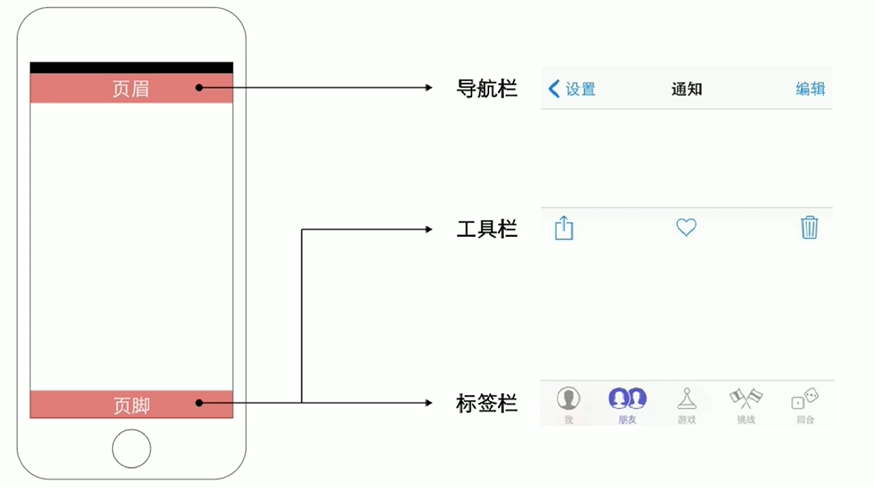
- 导航栏：
> 用于实现在应用不同信息层级结构间的导航，有时候也可用于管理当前屏幕内容

- 工具栏：
> 用于放置操作当前屏幕中各对象的控件

- 标签栏：
> 标签栏让用户在不同的任务、界面和模式中进行切换

#### Android
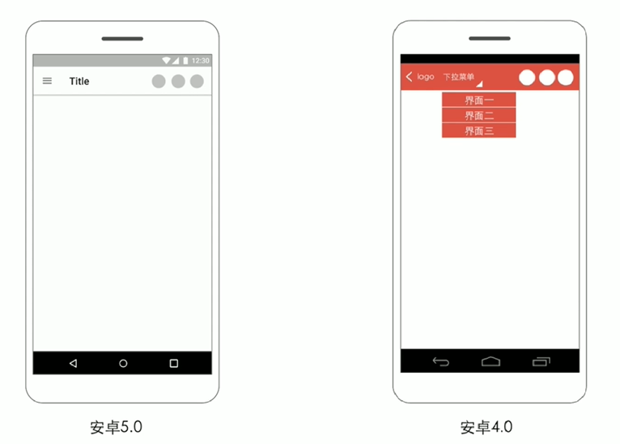

- 应用栏（APP Bar）
> 应用栏在以前的安卓版本中被叫做操作栏
>
> 是用来显示应用的标识，应用导航，内容搜索以及其他操作

### 2.导航设计模式

#### 标签式导航
- 特点
  - 适用于多个重要功能的罗列
  - 入口扁平化
  - 导航控件占据面积大，能够轻松进行点击操作，进行功能间快速切换

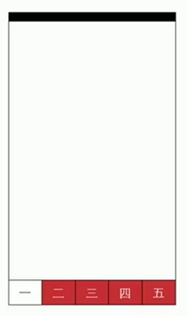

#### 分段式导航
- 特点
  - 由分段式控件所控制的一种导航模式
  - 尺寸较小，能轻松地融入界面，不占用空间
  - 设计师还能在其两侧放置其他的UI组件

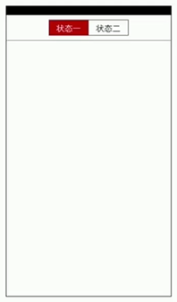

> [!note|style:flat|label:注意|labelVisibility:visible|iconVisibility:visible]
> 它只是iOS的标准控件，一般不在Android端使用
>
> 不适合作为一级导航，往往作为二级导航与标签导航嵌套使用

#### 舵式导航
- 特点
  - 标签式导航的变体
  - 适用于多个重要功能中存在一个特别重要的功能

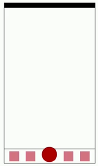

#### 抽屉式导航
- 特点
  - 隐藏不重要功能，让用户更专注核心功能
  - 能够大大减少主界面中的导航控件数量
  - 被折叠的功能使用率较低

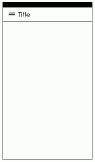

#### 下拉菜单式导航
- 特点
  - 盛行于Android4.0，现在使用的不多，但可以和滚动式菜单相结合
  - 收起时：体积小巧，节省空间
  - 展开时：能显示丰富的导航条目
  - 往往没有关闭按钮

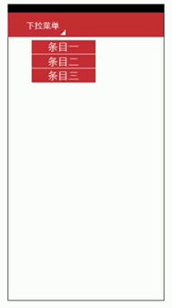

### 3.列表设计模式
#### 垂直列表
> 简单清晰、易于理解、冷静高效、快速定位
>
> 适合二级导航，或功能层级比较浅，且功能间切换不频繁的主导航

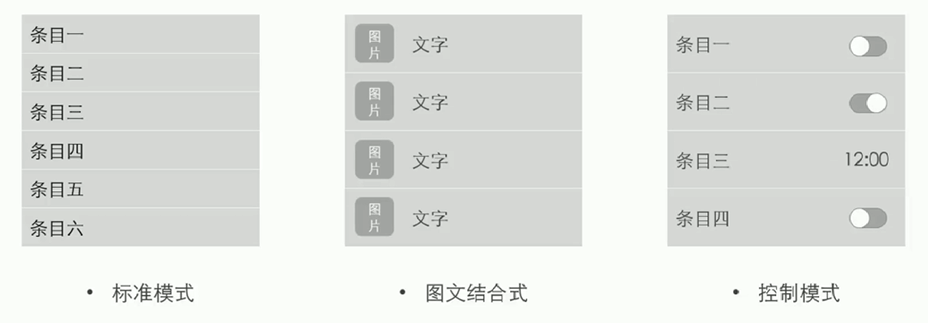

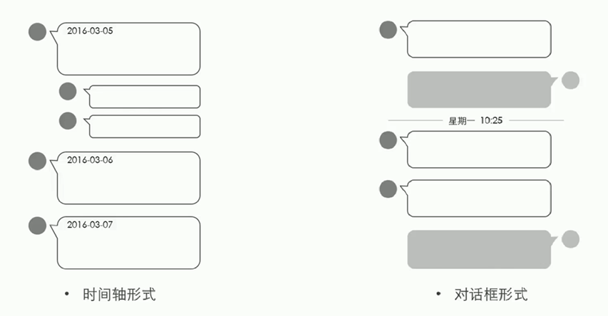

> [!note|style:flat|label:注意|labelVisibility:visible|iconVisibility:visible]
> 大都为左对齐
> 
> 需要调整条目详细程度与页面展示条目数量之间的平衡

#### 轮播面板
> 隐藏内容、充分利用空间。
>
> 体验感强，适合一些功能选项较少，且不频繁跳转的产品，或者是浏览体验式的产品。

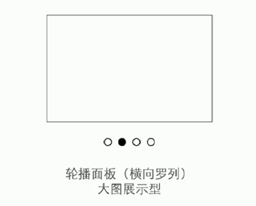

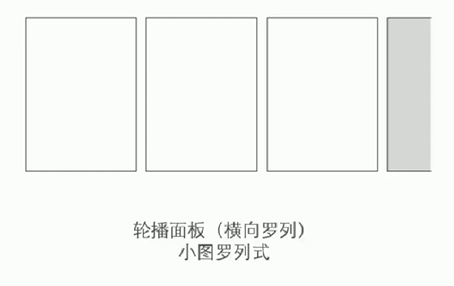

> [!tip|style:flat|label:近期文章|labelVisibility:visible|iconVisibility:visible]
> 这类样式通常需要指示器，来提示用户屏幕外面还有着内容

#### 网格列表
> 能同时显示大量图片、提升界面魅力
>
> 功能扁平化，能充分利用界面
>
> 适合作为二级导航，在有限空间内罗列大量功能
> 
> 注重于显示图片，和较少的文字显示

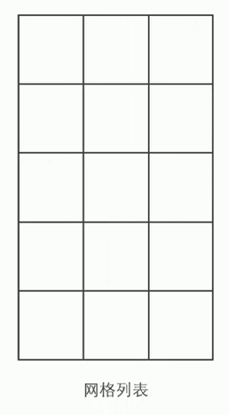

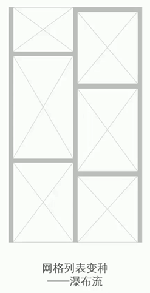

 

## Web端

### 1.网页布局

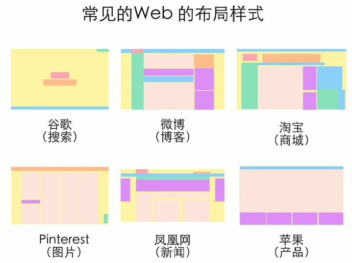

### 2.页面设计
- 页面中的设计元素
  - LOGO
  - 导航栏
  - 用户登录或信息
  - 网站推广内容
  - 广告
  - 其他信息

### 3.自适应设计

