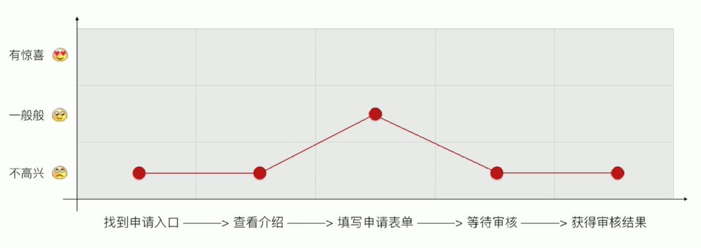
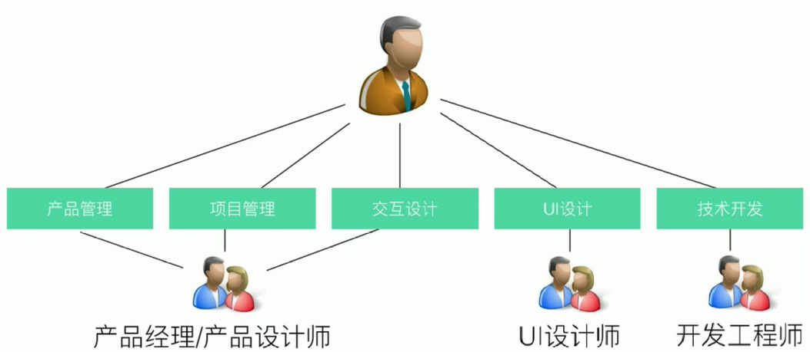
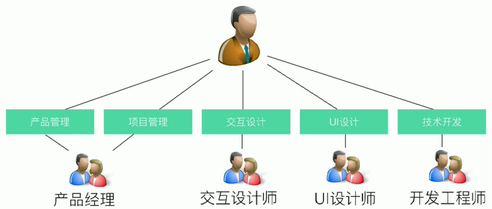
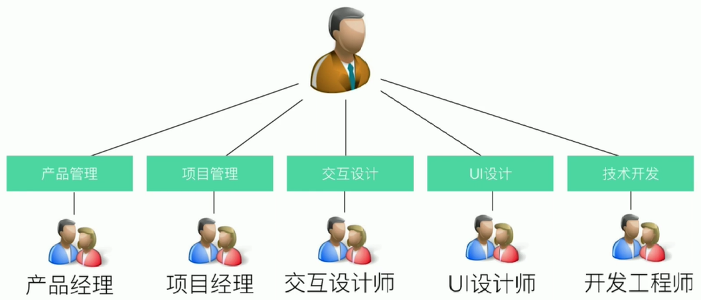
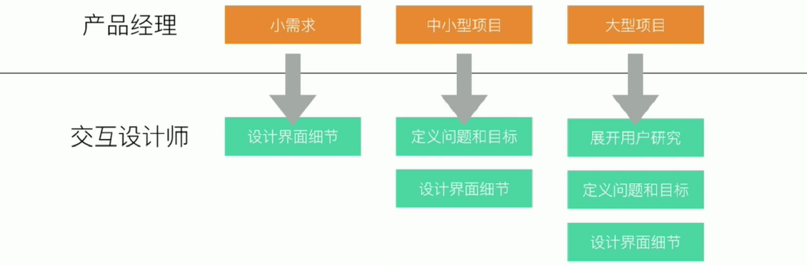

# 需求设计分析与方案选择

> 设计师没有细致地沟通业务需求，一直改方案，但没有观点；
>
> 没有仔细地分析用户需求，只是简单地进行页面排版；
>
> 没有对用户体验路径进行仔细分析，缺乏一个好的方式引导用户使用。
>
> 这些都是设计方案不能让人满意的原因

## 设计产品需要思考的问题
- 为什么要做这个功能？（业务目的）
- 品期望得到怎样的成果？（业务目标）
- 谁来使用这个功能？（目标用户）
- 他们为什么要使用这个功能？（用户需求）
- 如何让他们都来使用这个功能？（将业务目标转化为用户行为）

## $\color{red}*$完整的交互设计循环过程
- Plan：分析业务需求和用户需求，明确设计策略。
  - 分析业务需求（业务目的、业务目标）
  - 分析用户需求（目标用户、用户体验目标）
  - 分解关键因素（用户的动机、担忧、障碍）
  - 归纳设计需求，明确设计策略
- Do：根据设计策略，设计完整的解决方案细节。
- Check：走查、验证并修复问题，跟踪用户反馈。
- Action：总结经验修订目标，开始下一个Plan

 

## 分析业务需求
### 了解目的&目标
简而言之，目的是达到了某个目标之后想要做的事情，也就是实现目标的真正动机。

> **业务需求=业务目的+业务目标**
> 
> 提供用户注册功能是一个业务需求，提高注册转化率是它的业务**目标**。
> 
> 当我们提高了注册转化率，就能获得更多的注册用户数，从而实现有效进行用户管理的**目的**。

**互联网常见的目标（提升/降低）：**

|                  产品类                  |            市场类            |              品牌类              |            营收类             |
| :--------------------------------------: | :--------------------------: | :------------------------------: | :---------------------------: |
| PV、UV、用户数、转化率、留存率、活跃度等 | 传播量、市场份额、各种排名等 | 服务认知、品牌认知、品牌忠诚度等 | 销售量、销售额、利润率、ROI等 |

- 目标应该符合**SMART原则**
  - Specific - 具体
  - Measurable - 可衡量
  - Attainable - 可实现
  - Relevant - 有关联
  - Time-based - 有时限

------

### 分析用户需求

**明确目标用户**，目标用户是群体，而不是个体

> **用户需求=目标用户（特征、经验）+用户场景+用户行为+体验目标**
>
> 最终得到衡量指标

举例：

|       用户需求        | 目标用户 （特征、经验） |   用户场景   |   用户行为   |       体验目标       |          衡量指标           |
| :-------------------: | :-------------------------: | :----------: | :----------: | :------------------: | :-------------------------: |
| 申请在云课堂 开课 | 某PPT讲师 熟练使用电脑  | 通过电脑申请 | 点击申请按钮 | 快速完成在线表单填写 | 表单的填写效率 （提高） |

------

### 分解关键因素

将业务视角转换为用户视角

|                      业务视角                       |                           用户视角                           |                用户视角                 |
| :-------------------------------------------------: | :----------------------------------------------------------: | :-------------------------------------: |
| 有更多的专业人士和机构到云课堂开课 （业务目标） | 用户基于何种**动机**来开课， 在申请开课前有哪些**担忧**？ （用户意愿分析） | 用户在使用过程中， 会遇到哪些**障碍**？ |

------

**举例：**

| 业务需求                         | 业务目标                                | 衡量指标                | 关键因素分解                                                 | 对应的解决方案                                               |
| -------------------------------- | --------------------------------------- | :---------------------- | :----------------------------------------------------------- | :----------------------------------------------------------- |
|                                  |                                         |                         | 动机： - 能赚到钱 - 教会别人，扩大自己的专业影响力； | - 提供成功案例                                               |
| 做一个课程提供方入驻申请介绍页面 | 有更多的专业人士、 机构到云课堂开课 | 通过电脑申请 (提高) | 担忧： - 申请免费吗？ - 赚不到钱 - 平台没有足够大的用户群体 - 需要提供太多的信息 - 平台没有知名度 - 平台技术不稳定 - 审核时间太长 - 是否适合我 - 平台功能不强大 - 是否支持我的运营类目 - 将来如问收款 | - 告诉用户免费申请 - 提供成功案例 - 增加平台用户数量显示 - 告诉用户只需要1分钟就能完成表单提交 - 告诉用户云课堂是在线教育NO1 - 提供7x24技术支持 - 告诉用户24小时内会快速审核 - 说明什么样的人可以来申请 - 告诉用户有牛逼的欤学管理功能 - 告诉用户接受不同领域的课程 - 告诉用户使用“网易支付”收款安全又放心 |

| 用户需求         | 用户体验目标         | 衡量指标                  | 关键因素分解                                                 | 对应的解决方案                                               |
| :--------------- | :------------------- | :------------------------ | :----------------------------------------------------------- | :----------------------------------------------------------- |
| 申请在云课堂开课 | 快速完成在线表单填写 | 表单的填写效率 (提高) | **障碍：** - 需要提供太多信息 - 网络不稳定 - 没有相关的证件 | - 减少非必要的信息输入 - 现在申请还送XXX - 提高网络稳定性 - 支持多种证明文件 |

------

### 明确设计策略

归纳好设计需求，去掉重复的解决方案，得到下表。

| 关键因素分析                                                 | 对应的解决方案                                               |
| ------------------------------------------------------------ | ------------------------------------------------------------ |
| **动机：** - 能赚到钱； - 教会别人，扩大自己的专业影响力； | - 提供成功案例                                               |
| **担忧：** - 申请免费吗？ - 赚不到钱； - 平台没有足够大的用户群体； - 需要提供太多的信息 - 平台没有知名度； - 平台技术不稳定； - 审核时间太长； - ·是否适合我； - 平台功能不强大 - 是否支持我的运营类目； - 将来如何收款； | - 告诉用户免费申请； - 提供成功案例； - 增加平台用户数量显示； - 告诉用户只需要1分钟就能完成表单提交； - 告诉用户云课堂是在线教育NO1； - 提供7×24技术支持； - 告诉用户24小时内会快速审核； - 说明什么样的人可以来申请； - 告诉用户有牛的教学管理功能； - 告诉用户接受不同领域的课程； - 告诉用户使用“网易支付收款安全又放心； |
| **障碍：** - 需要提供太多的信息； - 网络不稳定； - 没有相关的证件； | - 减少非必要的信息输入； - 现在申请还送XXX提高网络稳定性； - 支持多种证明文件； |

根据结果可以得出设计师能需要提供的交互方式

------

### 用户体验路径分析

- 画出用户体验路径和情感坐标
- 整理各个接触点的问题和惊喜
- 判断各个接触点的情感高低
- 连接情感曲线

------

### 选择合适的解决方案
#### 1. 互联网产品团队的分工
- 初创型：同一角色担当产品管理+项目管理+交互设计

- 中大型：交互设计角色开始独立

- 细分型：项目管理角色开始独立

- 不同的需求，提供不同程度的专业支持

- 产品经理的主要工作
  - 评估产品机会
  - 制定产品目标和策略
  - 规划产品的发展路线图
  - 定义产品需求和业务目标
  - 监督需求的实现
  - 关注市场反馈并作出及时调整
  - 维护不同团队的沟通

——目的是让产品实现长期的用户满意，保持市场竟争优势，把产品的商业价值发挥到最大。

- 交互设计师的主要工作
  - 分析业务目标和用户体验目标
  - 分解阻碍用户达成体验目标的关键因素
  - 制定设计目标和策略
  - 设计信息架构、用户操作流程、导航和UI细节
  - 输岀相关设计规格文档，建立并维护设计规范
  - 跟踪视觉设计、技术开发的实现情况
  - 优化产品可用性，持续改善用户体验

——目的是让产品和用户之间建立有机关系，有效实现用户目标和产品目标。

------

#### 2. 交互设计方案的评价维度
- 有用性：能同时满足业务目标和用户体验目标
- 可用性：用户易于理解、学习，使用无障碍
- 吸引力：打动人的细节，或者超越期望的设计

> **尼尔森十大可用性原则**
> 1. 可视性原则：系统状态有反馈，等待时间要合适。
> 2. 环境贴切原则：使用用户语言而不是开发者语言，贴近生活实际而不是学术概念
> 3. 撤销重做原则：操作失误可回退。
> 4. 一致性原则：同一事物和同类操作的表示用语要各处保持一致。
> 5. 防错原则：关键操作有确认提示，及早消除误操作。
> 6. 易取原则：识别胜于回忆，提供必要的信息提示（可视&易取），减少记忆负担
> 7. 灵活高效原则：为新手和专家设计定制化的操作方式，快捷操作可调整
> 8. 易读性原则：减少无关信息，体现简洁美感
> 9. 容错原则：给用户明确的错误信息，并协助用户方便的从错误中恢复工作。
> 10. 人性化帮助原则：无需文档就能流畅应用当然更好，一般地文档很必要，而且也提供便利的检索功能，面向用户任务描述，列出具体实现步骤，并且不要太冗长

------

#### 3. 交互设计方案的决策方式与过程
- 决策方式
  - 使团队保持清晰的、一致的目标，并坚持不妥协
  - 允许妥协无伤大雅的细节，避免钻牛角尖，或过度设计
  - 保持开放心态，倾听各方意见但是你要自己做决定

- 决策过程
  - 内部Review：指设计师的作品先在设讲团队进行审核，吸收专业方面的建议
  - 外部评审：通常作为一个会议的形式存在，交互设计师在完成了设计且和产品经理确认需求满足情况之后，输出相关的设计文档，召集大家进行讲解

------

#### 4. 如何推销你的设计方案
1. 将思考过程可视化：将需求分析的结果可视化（如做成表格）展示出来。
2. 自己人效应：变交互设计师要和产品经理起去梳理需求，而不是一味地抱怨需求不完整。如果因为需求不完整而拒绝了产品经理，这绝对是个错误的合作方式。交互设计师应该主动参与产品构思，井且和产品经理一起分析需求归纳目标。
3. 准备一份PPT。
4. 讲一个动听的故事：可以以用户的某一种场景作为开端，讲述它是如何接御这个产品，以及是如何一步一步使用这个功能的，这个比起照着交互稿一页一页地念会更加有用。
5. 掌握必要的演讲技巧与表达能力。
