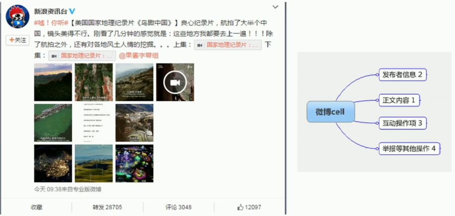

# 信息架构设计

## 认识信息架构设计

### 什么是产品的信息架构？

> 信息架构设计是对信息进行结构、组织方式以及归类的设计好**让使用者与用户容易使用与理解**的一项艺术与科学。

### 为何产品需要合理的信息架构？

> 让用户一眼就明白你的产品能做什么，大概怎么用。
>
> 用户都能在需要的时候容易地找到某个功能。
>
> 以至于**带给用户更好的体验，使产品获得更高的留存率**

### 信息架构为何需要设计？

> 信息架构不是功能的简单堆叠，所以，需要**更有逻辑性**的方法

 

## 前期准备工作

### 了解用户，场景，习惯

通过对**Persona(用户角色模型)、用户场景**的了解与分析，得出用户的使用习惯。

- 尊重用户习惯：
   - 用户通常用你的产品做什么？
   - 用户用这类产品最关心什么？
   - 用户有哪些思维定式？
   - 用户用什么类似的产品？

创新：从自己本身的用户习惯出发

### 了解业务需求

从产品经理那了解业务需求：不突出业务无关内容

从运营&市场了解业务需求：让信息架构有更大的兼容性，能让产品产生更多可能性

### 调研竞品的信息架构

> 知己知彼，百战不殆
>
> 找3-5个同品类竞品，分析他们的信息架构，构造思维导图
>
> 自己的产品过去的版本同样也是竞品

- 分析共性与差异

| 共性（要遵循的用户习惯） | 差异（设计机会点） |
| :----------------------: | :----------------: |
|       消息&联系人        | 音乐产品里看的内容 |
|         发现音乐         |   购物网站的首页   |
|          购物车          |  打车应用的侧边栏  |

### 卡片分类法

了解竞品后，还要进一步了解用户的**心智模型**

> **心智模型：**基于用户的经历或学习，认为事情应该如何发展
>
> **卡片分类法：**让用户对功能卡片进行分类，组织，并给相关功能的集合重新定义名称的一种自下而上的**整理方法**

- **卡片分类法的大致步骤：**
  - 介绍卡片
  - 用户归类卡片
  - 让用户取名
  - 继续归类
  - 简单访谈
  - 拍照存档

- **需要以下这些东西**

  - 目标用户功能/信息卡片（便利贴）
  - 2支笔（一定要写的出字）
  - 空白的卡片（便利贴）
  - 笔记本（记录用户发言）

- **功能/信息卡片怎么提取？**

  - 它是功能或界面的名字，比如：联系人名片，对话窗口，拨号呼叫。

  - 根据你的调研诉求，来决定卡片的颗粒度。

  - 功能/信息卡片不能出现包含关系。

  - 卡片总数不要超过30张，那会让用户无从下手。

- **如何更好地引导用户**

  - 介绍卡片：是否理解每一张卡片的含义，如果不理解可以询问
  - 用户归类卡片：为什么把这些卡片放在一类？
  - 让用户取名字：这类卡片取个名字，可以叫什么？/根据你刚刚的归类原因，是不是可以叫XXX？
  - 继续归类：这一类的卡片数量较多，是否可以进一步细分？/现在已经分了N类，是否还有哪几类能再放在一起？
  - 简单访谈：在分类过程中是否有什么纠结的地方？
  - 拍照存档：是否确定这是最后的结果？

最后通过此方法产出一份思维导图

 

## 如何产出产品信息架构设计

### 利用思维导图和Axure整合信息

- 为自己的产品做一张信息架构树状图
  - 对每一层进行分级

> 重要性分级≠排序

  - 使用Axure，利用站点地图体现信息架构

### 寻找层和度的平衡

- 层=信息架构树的深度
- 度=某一节点子节点的广度
- 层过深=进入某一叶功能时需要非常多层级，操作困难。一般情况不超过5
- 度过多=在某一层级（页面）有太多的内容，用户认知成本增加，容易找不到想找的内容。

### 验证核心使用流程

在信息架构层面确保**核心使用流程的通畅**

1. 尽量保证根据树结构进行层级自上而下前进
2. 不连通层级间的跳跃，尽量发生在最后一层级

### 考虑信息架构和交互构图的关系

> 不要在信息架构构图层面，为了"不一样"而不一样

#### 移动端

- 利用重要性分级
  - Tabs导航：第一重要级中多项
  - 抽屉式导航：第一重要级中只有一项
  - 复合式导航

#### web端

- 利用不同结构，体现重要级

- 利用布局，体现逻辑关系

### 为讨论做好准备

> 你的过程就是你的底气

通过足够的过程来支撑你设计理念，讲清楚为什么要这么设计，增加讨论资本。

 

## 如何评判产品信息架构设计

### 用户测试

- 用户是否在你不介绍具体产品的情况下，通过短时间的使用，说出产品可以用来做什么。

- 让用户进行核心流程任务，检查完成任务是否顺利。

- 给用户一个找寻一个相对层级较深的功能的任务，检测用户是否能通过信息架构名称找到功能。

### 撰写产品说明书

通过撰写一份使用说明书，让用户阅读，过一段时间考察用户的记忆程度

 

## 信息架构推广：用信息架构思路设计页面

### 为何在单一页面设计时需要考虑信息架构问题

- 确定页面所需要呈现的信息

- 绘制信息架构树状图

- 重要性分级

- 绘制页面

### 明确一个页面中的元素逻辑性与重要级

### 绘制单一页面

逻辑相关的内容使用统一的形式，位置，并让区块联通

利用大小，位置，色彩体现重要级