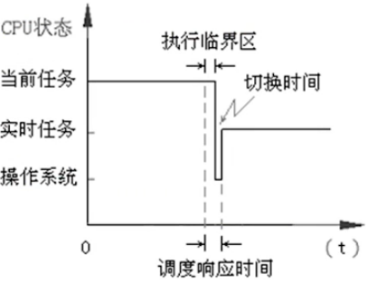

# 进程管理与调度
## 分清作业、进程与程序的区别
> **作业：**用户提交给系统的一个计算任务。
> 
> 批作业=程序+数据+作业控制说明书
> 
> 交互作业=程序+数据+交互命令
> 
> 作业是用于人机之间交互的一个概念。
> 
> **程序：**完成一件事情的代码序列。
> 
> **进程：**是一个程序的一次动态执行过程。
> 
> 程序是静态的；进程是动态的。
> 
> 程序只包含代码：进程包括要运行的代码、代码要处理的数据、运行过程中的状态参数等。

<br/>

## 进程与进程管理模块

### 进程的特征
1. 动态特征：生命周期
2. 并发特征：在一个时间段内都处在宏观的运行状态
3. 独立特征：独立占有资源、独立参与CPU调度
4. 异步特征：运行推进速度不可预知
5. 结构特征：PCB（进程控制块）+进程体

------

### 进程控制块PCB


- 进程控制块PCB的数据内容包括：
  - 进程标识：系统识别进程的标志
  - 外部标识（也称作进程的外部名）：是进程的创建者提供的进程名字，通常由字符串组成
  - 内部标识（也称作进程的内部名，简记为Pid）：是系统为进程命名的一个代码，通常是一个整型数
    
  - 进程调度信息：系统调度选择进程的依据
    - 进程优先数，描述进程紧迫性的信息
    - 进程状态信息，描述进程当前处于何种状态
    - 其它调度信息。
    
    > 如：进程在系统中等待的时间、已在CPU上运行的时间、剩余的运行时间有等。
    
  - 处理机信息（进程上下文）
    - 通用寄存器的内容：包括数据寄存器、段寄存器等
    - 程序状态字PSW（ Program Status Word）的值
    - 程序计数器PC（ Program Count）的值
    - 进程的堆栈指针等

    > 进程被中断时，该进程的CPU现场信息可以保存在它自己的PCB内，以便该进程重新获得CPU时可以从此处恢复现场信息，继续运行。

  - 进程控制信息：系统对进程实施控制的依据
    - 程序代码和数据集所在的内存地址
    - 资源清单，记载进程请求资源和已经占有资源的情况
    - 同步与通信信息
    - 外存地址
    - 家族信息
    - 链接指针

------

### 进程的状态转换
#### 两状态进程模型


- 进程的三种基本状态
  - 运行状态(Running)：进程获得CPU并投入运行的一种状态

  > 在单CPU系统中，每个瞬间最多只能有一个进程在运行。

  - 就绪状态(Ready)：进程尚未获得CPU使用权的一种状态

  > 进程已经拥有除CPU外其它全部所需资源
  >
  > 
  >
  > “万事俱备、只欠东风”
  
  - 阻塞状态(Blocked)：进程因某种要求得不到满足，只好等待，称之为运行“受阻”
  
  > 处于阻塞状态的进程是无权获得CPU的。

------

#### 三状态进程模型


------

#### 两种扩展的挂起状态
- 挂起阻塞(S-Blocked)状态
- 挂起就绪(S-Ready)状态

> 挂起某些暂时不能运行的进程，目的是腾出内存装入更多进程，使CPU忙碌起来。


### 进程的创建与撤销
> [!note|style:flat|label:概念引入|labelVisibility:visible|iconVisibility:visible]
> **原语：**机器指令构成的一种实现特定功能的小程序，它的运行具有不可分割性。
> - 特点：
>   - 贴近底层
>   - 运行过程具有原子性（不可中断）
>   - 系统小程序
>   - 最重要的
>
> **进程控制用的原语：**实现进程管理和状态切换
>
> 如：进程创建原语、进程撤销原语、阻塞原语、唤醒原语、进程挂起原语、进程激活原语、进程调度原语等。

#### 进程创建原语
何时调用创建原语：

- 批作业调度。
- 交互作业提交。
- 系统提供服务。
- 用户程序创建子进程。

#### 进程撤销原语
何时调用撤销原语：

- 进程自行终止。
- 用户或父进程的原因使进程终止。
- 运行超时而终止。
- 运行出错而终止。

------

#### 进程阻塞原语`Block()`

何时调用阻塞原语：
- 当正在运行的进程需要等待某一事件而发生运行受阻时，它通过中断请求系统服务。
- 系统按照进程的需求进行适当处理后，启动“进程阻塞原语”将该进程阻塞起来。

引起进程阻塞（运行受阻）的原因：
- 等待I/O请求
- 资源得不到满足
- 进程同步约束
- 服务进程无事可做


```c
j:GetInternalname();
Remove(runQueue,j); //从运行队列上摘下PCBj
PCBj(进程上下文):=CPU现场信息； 
PCBj(状态):="Blocked";
Insert(BlockQueue, j); //将PCB插入阻塞队列上
Scheduler(); //运行调度程序
//结束
```
#### 唤醒原语`Wake_up()`

何时调用唤醒原语：当系统发生某一个事件时，正在等待该事件的进程需要立即被唤醒，由“阻塞”状态转为“就绪”状态。

流程：
- 将当前进程的上下文保存到系统栈中。
- 从阻塞队列上查找等待该事件的进程PCB将PCB从阻塞队列上摘下来。
- 将其状态置为“就绪”，将PCB挂入就绪队列。
- 弹出系统栈中的进程上下文，置入CPU，让被中断的进程恢复运行。
- 结束。

------

#### 挂起原语 `Suspend()`

何时调用挂起原语：

- 当前内存空间紧缺，
- 部分进程优先运行应用户的要求，将用户进程挂起
- 应父进程要求，将其子进程挂起

流程：

- 找到被挂起进程的PCB，获得其内存地址将内存空间归还给存储管理模块。
- 进程状态阻塞转为“挂起阻塞”，或者就绪转为为“挂起就绪”，将PCB从原队列转入相应队列。
- 申请外存交换区空间，换出进程，地址写入PCB。
- 结束。

#### 激活原语`Active()`

何时调用激活原语：

- 有进程运行完毕，当前内存空间并不紧张
- 应用户要求，将其进程激活
- 应父进程的要求，将其子进程激活
- 或者进程自身设定的挂起周期已完成

流程：

- 扫描“挂起就绪队列”找到被激活进程的PCB。
- 将PCB从所在队列上摘下来。
- 按PCB登记的空间需求，申请内存，加载到内存中。
- 归还外存交换区空间将进程状态置为“就绪”，插入就绪队列。
- 结束。

<br/>

## 进程调度方式

> 从处于就绪状态的进程中，按照某种调度策略，选择个进程切换给CPU，使其状态从就绪转为运行，即为进程调度。

### 非抢占式调度
当前进程主动放弃处理机控制权，可能的情况有：
- 进程运行完毕退出；
- 运行受阻
- 运行出错，非正常终止
- 遇到不可挽回的故障

### 抢占式调度
也称作剥夺式调度，一般用于有实时需求的系统
- 主要指在系统正常运转期间，如果某种事件出现，系统将迫使正在运行的进程停下来，将CPU控制权交给其它进程。
- 其思想源自对高紧迫度作业的响应。

<br/>

## 进程调度算法
> **批处理作业调度算法回顾：**
> 
> FCFS（ First come first serve）算法，先进入就绪队列的进程先调度
> 
> SPF（ Shortest process first）算法，最短进程优先调度。
> 
> HPF（ Highest Priority First）算法，最高优先级调度。
> 
> HRF（ Highest Response First）算法，最高响应比优先调度。

### 时间片轮转RR（ Round robin）算法
>应用于**分时系统**，目标是提高响应及时性
>
>**基本思想：**将CPU的处理时间划分成一个个的时间片，就绪队列中的进程轮流运行一个时间片。当时间片结束时，就强迫进程让出CPU，该进程进入就绪队列，等待下一次调度，同时，进程调度又去选择就绪队列中的一个进程，分配给它一个时间片，以投入运行。
>
>进程失去CPU不是自愿的，而是被系统剥夺的
>

- 轮转算法的启动时机
  - 一个时间片运行结束；
  - 当前进程运行结束；
  - 或者正在运行的进程因运行受阻主动放弃了CPU控制权。

- 时间片的选取/确定通常有下面几个原则：
  - 进程的道数较多时，q就选得小一些；反之可选得大些。
  - 系统要求的响应时间比较苛刻的时候，q就选得小一些；反之，可选得大些

### 多队列调度算法
>设置多个就绪队；
>
>就绪队优先级不同，优先级高的队列优先调度；
>
>优先级高的队列为空时，再调度低优先级队列。
>

### 多级队列反馈调度算法
> 多就绪队列组织形式
> 
> 设置n个队列$Q_1，Q_2，……，Q_n$
> 
> 记$Q_i$的优先级为P，有$P1>P2……>P$
> 
> 记$Q_i$的时间片为$q_i$，有$q_1>q_2<……<q_n$
> 
> 新建进程进入$Q_1$队。
>
> 只有$Q_i$为空时，才调度$Q_{i+1}$中的进程。
> 
> 进程p在$Q_i$中被调度执行，若时间片q；已到但尚未结束，则进程p转为就绪状态进入$Q_{i+1}$队；进程p在$Q_n$中被调度执行，若时间片已到但尚未结束，则进程转为就绪状态仍入$Q_n$队。

- 这样的管理方式带来的结果：
  - 终端型用户满意：终端型作业都是交互型的，比较短，进入第1队列后优先调度，一般只要一个小时间片就可完成。
  - 短的批处理作业用户满意：短的批处理作业开始时首先进入第1个队列，能及时被响应。若轮转一周不能完成的话，通常只需在第2乃至第3队列上各执行一个时间片就可能完成，作业的周转时间仍比较短。
  - 长的批处理作业用户满意：个长的批处理作业进入系统后，将依此在第1，2，…，n-1队列中各运行一个时间片，最后进入第n队列进行轮转运行，一般不必担心“受冷落”现象发生。一旦进入后面的就绪队，获得的时间片比较长，系统调度开销比较少

<br/>

## 实时任务调度

> 实时任务是一类对时间要求较为严格的进程支持这类任务运行的系统称为实时处理系统。
>
> 硬实时系统：有严格的时间控制
>
> 软实时系统：有时间需求，但没有严格的deadline，尽快完成即可

### 非周期实时任务的分类及其调度方法

- 紧迫型实时任务调度

> 紧迫性强的任务多见于一些专用的、响应时间要求特别苛刻的数据采集和控制系统中，所要求的响应时间很短，一般是微秒量级的。

解决的方法是采用**立即抢占的最高优先级(HPF)调度算法**。

> 进程调度每次将处理机分配给具有最高优先级的就绪进程。
>
> 最高优先级算法可与不同的CPU方式结合形成可抢占式最高优先级算法和不可抢占式最高优先级算法



- 普通型的实时任务调度

> 目前，大多数自动控制系统对响应时间的要求都不是太高，一般是毫秒量级的。由于它允许的响应时间长度与时钟中断的周期基本吻合。

采用“基于时钟中断抢占的高优先级调度”算法。


- 宽松型的实时任务调度

  - 非抢占的HPF调度算法
  
  
  
  
  
  - RR算法


- 特殊的—周期性实时任务

> 信号检测和过程控制系统中呈现周期性运行规律的任务。

周期任务A第次运行前的剩余时间$F_A(i)$是


$$
F_A(i)=i·T_A-T_{sA}-t
$$

$T_A$为任务A的周期长度；$T_{sA}$为任务A的每次执行时间长度； $t$为系统的当前时间。

周期性任务可采用**SRT（最小剩余时间）调度算法**

<br/>

## 线程的引入

> 线程是现代操作系统引入的一种执行实体
>
> **线程称“轻型进程”**，是进程的组成部分
>
> 进程是资源占有单位，线程只是CPU调度单位

一个进程运行过程中可创建多个线程，线程共享所属进程的资源，自己只有TCB和很少的栈区

线程分**内核级线程KLT**和**应用级线程ULT**


### 进程与线程的区别

> 进程是个独立的实体单位：
>
> - 独立占有资源：进程拥有对资源的控制权或所有权。
> - 独立参与调度/执行：进程是一个可被操作系统调度和分派的单位。
>
> 线程仅是分派（调度运行）的单位：
>
> - 线程不是单独占有资源的单位。
> - 线程共享其所属进程的资源。

<br/>

## 处理机的调度层次

调度的主要目标—一选择哪个实体进入内存、选择哪个实体占用CPU。

调度的主要层次

- 作业调度

- 中级调度

- 进程调度

- 线程调度

### 典型的三级调度

作业从进入系统成为后备作业开始，直到运行结束退出系统为止，需经历不同级别的调度。

> 高级调度：又称作业调度、长程调度。从处于后备状态的作业中选择一道或者几道，装入内存。
>
> 中级调度：又称中程调度。优先从处于挂起就绪状态的进程中选择一个或者几个，将之激活。
>
> 低级调度：又称进程调度、短程调度。从处于就绪状态的进程中选择一个，切换给CPU执行。
> 

根据不同系统的情况：
- 有的系统三级调度都有
- 有的系统有高级调度和低级调度
- 有的系统有中级调度和低级调度
- 有的系统只有低级调度
- 有的系统加了一级**线程调度**

### 线程调度
> 线程称“轻型进程”，是进程的组成部分
> 
> 进程是资源占有单位，线程是CPU调度单位
> 
> 线程共享所属进程的资源
> 
> 线程分为用户级线程和内核级线程，调度方式不同
> 

#### 用户级线程的调度
- 操作系统进行进程调度
- 用户进程自己进行线程调度
- 内核级线程：操作系统直接进行线程调度

### 线程调度与子进程调度的区别
图示以用户级线程调度为例


采用线程调度：CPU切换时开销较少