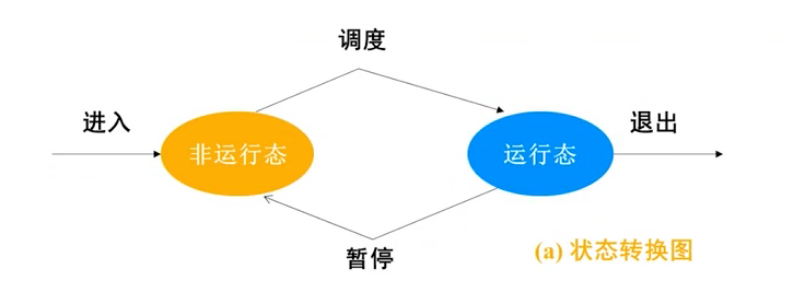
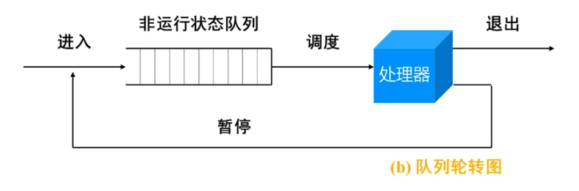
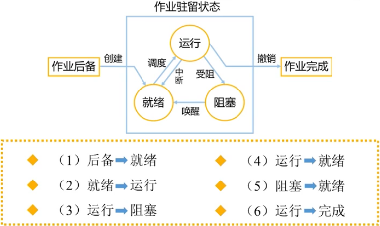
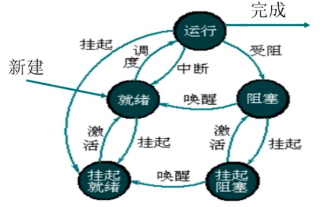

# 进程管理
## 分清作业、进程与程序的区别
> **作业：**用户提交给系统的一个计算任务。
> 
> 批作业=程序+数据+作业控制说明书
> 
> 交互作业=程序+数据+交互命令
> 
> 作业是用于人机之间交互的一个概念。
> 
> **程序：**完成一件事情的代码序列。
> 
> **进程：**是一个程序的一次动态执行过程。
> 
> 程序是静态的；进程是动态的。
> 
> 程序只包含代码：进程包括要运行的代码、代码要处理的数据、运行过程中的状态参数等。
> 

## 进程与进程管理模块

### 进程的特征
1. 动态特征：生命周期
2. 并发特征：在一个时间段内都处在宏观的运行状态
3. 独立特征：独立占有资源、独立参与CPU调度
4. 异步特征：运行推进速度不可预知
5. 结构特征：PCB（进程控制块）+进程体

------

### 进程控制块PCB
<div style="float:right;">
	
</div>

- 进程控制块PCB的数据内容包括：
  - 进程标识：系统识别进程的标志。
    - 外部标识（也称作进程的外部名）：是进程的创建者提供的进程名字，通常由字符串组成。
    - 内部标识（也称作进程的内部名，简记为Pid）：是系统为进程命名的一个代码，通常是一个整型数。
    
  - 进程调度信息：系统调度选择进程的依据。
    - 进程优先数，描述进程紧迫性的信息。
    - 进程状态信息，描述进程当前处于何种状态。
    - 其它调度信息。
    
    > 如：进程在系统中等待的时间、已在CPU上运行的时间、剩余的运行时间有等。
    
  - 处理机信息（进程上下文）
    - 通用寄存器的内容：包括数据寄存器、段寄存器等。
    - 程序状态字PSW（ Program Status Word）的值。
    - 程序计数器PC（ Program Count）的值。
    - 进程的堆栈指针等。

    > 进程被中断时，该进程的CPU现场信息可以保存在它自己的PCB内，以便该进程重新获得CPU时可以从此处恢复现场信息，继续运行。

  - 进程控制信息：系统对进程实施控制的依据
  
    - 程序代码和数据集所在的内存地址
    - 资源清单，记载进程请求资源和已经占有资源的情况。
    - 同步与通信信息。
    - 外存地址。
    - 家族信息。
    - 链接指针。

------

### 进程的状态转换
#### 两状态进程模型



- 进程的三种基本状态
  - 运行状态(Running)：进程获得CPU并投入运行的一种状态。

  > 在单CPU系统中，每个瞬间最多只能有一个进程在运行。

  - 就绪状态(Ready)：进程尚未获得CPU使用权的一种状态。

  > 进程已经拥有除CPU外其它全部所需资源，
  > 
  > “万事俱备、只欠东风”。
  
  - 阻塞状态(Blocked)：进程因某种要求得不到满足，只好等待，称之为运行“受阻”。
  
  > 处于阻塞状态的进程是无权获得CPU的。

------

#### 三状态进程模型



------

#### 两种扩展的挂起状态
- 挂起阻塞(S-Blocked)状态
- 挂起就绪(S-Ready)状态

> 挂起某些暂时不能运行的进程，目的是腾出内存装入更多进程，使CPU忙碌起来。



### 进程的创建与撤销
> [!note|style:flat|label:概念引入|labelVisibility:visible|iconVisibility:visible]
> **原语：**机器指令构成的一种实现特定功能的小程序，它的运行具有不可分割性。
> - 特点：
>   - 贴近底层
>   - 运行过程具有原子性（不可中断）
>   - 系统小程序
>   - 最重要的
>
> **进程控制用的原语：**实现进程管理和状态切换
>
> 如：进程创建原语、进程撤销原语、阻塞原语、唤醒原语、进程挂起原语、进程激活原语、进程调度原语等。

#### 进程创建原语
何时调用创建原语：

- 批作业调度。
- 交互作业提交。
- 系统提供服务。
- 用户程序创建子进程。

#### 进程撤销原语
何时调用撤销原语：

- 进程自行终止。
- 用户或父进程的原因使进程终止。
- 运行超时而终止。
- 运行出错而终止。

------

#### 进程阻塞原语`Block()`

何时调用阻塞原语：
- 当正在运行的进程需要等待某一事件而发生运行受阻时，它通过中断请求系统服务。
- 系统按照进程的需求进行适当处理后，启动“进程阻塞原语”将该进程阻塞起来。

引起进程阻塞（运行受阻）的原因：
- 等待I/O请求
- 资源得不到满足
- 进程同步约束
- 服务进程无事可做


```c
j:GetInternalname();
Remove(runQueue,j); //从运行队列上摘下PCBj
PCBj(进程上下文):=CPU现场信息； 
PCBj(状态):="Blocked";
Insert(BlockQueue, j); //将PCB插入阻塞队列上
Scheduler(); //运行调度程序
//结束
```
#### 唤醒原语`Wake_up()`

何时调用唤醒原语：当系统发生某一个事件时，正在等待该事件的进程需要立即被唤醒，由“阻塞”状态转为“就绪”状态。

流程：
- 将当前进程的上下文保存到系统栈中。
- 从阻塞队列上查找等待该事件的进程PCB将PCB从阻塞队列上摘下来。
- 将其状态置为“就绪”，将PCB挂入就绪队列。
- 弹出系统栈中的进程上下文，置入CPU，让被中断的进程恢复运行。
- 结束。

------

#### 挂起原语 `Suspend()`

何时调用挂起原语：

- 当前内存空间紧缺，
- 部分进程优先运行应用户的要求，将用户进程挂起
- 应父进程要求，将其子进程挂起

流程：

- 找到被挂起进程的PCB，获得其内存地址将内存空间归还给存储管理模块。
- 进程状态阻塞转为“挂起阻塞”，或者就绪转为为“挂起就绪”，将PCB从原队列转入相应队列。
- 申请外存交换区空间，换出进程，地址写入PCB。
- 结束。

#### 激活原语`Active()`

何时调用激活原语：

- 有进程运行完毕，当前内存空间并不紧张
- 应用户要求，将其进程激活
- 应父进程的要求，将其子进程激活
- 或者进程自身设定的挂起周期已完成

流程：

- 扫描“挂起就绪队列”找到被激活进程的PCB。
- 将PCB从所在队列上摘下来。
- 按PCB登记的空间需求，申请内存，加载到内存中。
- 归还外存交换区空间将进程状态置为“就绪”，插入就绪队列。
- 结束。

## 进程调度

> 从处于就绪状态的进程中，按照某种调度策略，选择个进程切换给CPU，使其状态从就绪转为运行，即为进程调度。

### 非抢占式调度
当前进程主动放弃处理机控制权，可能的情况有：
- 进程运行完毕退出；
- 运行受阻
- 运行出错，非正常终止
- 遇到不可挽回的故障

### 抢占式调度
也称作剥夺式调度，一般用于有实时需求的系统
- 主要指在系统正常运转期间，如果某种事件出现，系统将迫使正在运行的进程停下来，将CPU控制权交给其它进程。
- 其思想源自对高紧迫度作业的响应。
