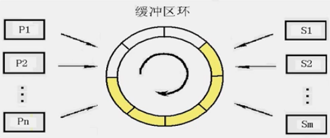
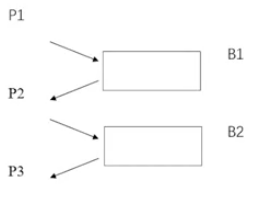
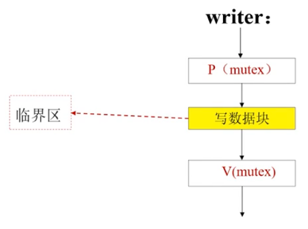
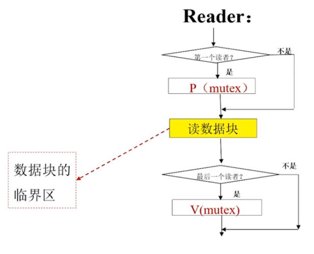
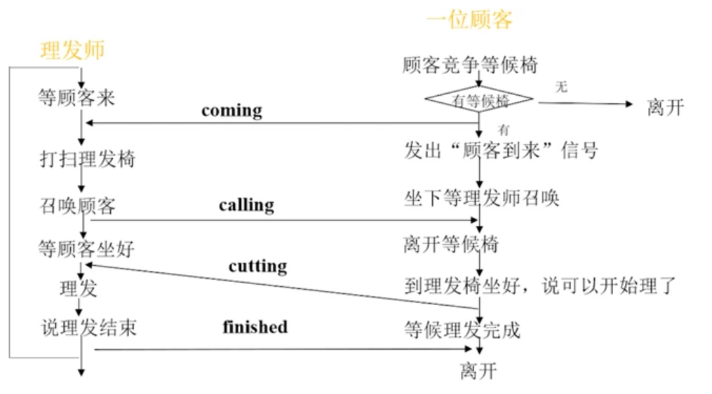

# 进程的并发控制

## 互斥、同步与并发的区别

### 互斥

> 只要不同时使用即可，谁先用谁后用没有约束——此之谓“互斥”
>
> 互斥体现进程间**竞争关系**

### 同步

> 不但不能同时用，谁先用谁后用也有严格约束——此之谓“同步”
>
> 同步—体现进程间协作关系

<br/>

## 并发(Concurrency)
### 并发的基本概念
- 单处理器多道程序设计系统中，多个进程交替执行
- 多个并发进程在一个时间段内都处于运行状态
- 共享系统资源
- 每个进程都“走走停停”
- 并发带来异步性

### 并发带来的问题

- 并发进程的相对执行速度是不可预测的，取决于其他进程的活动、操作系统处理中断的方式以及操作系统的调度策略。
- 有可能发生各种与时间有关的错误。

### 与并发相关的关键术语

- 临界资源(Critical resources)
  - 也叫**互斥资源**
  - 一种**一次只能为一个进程服务**的共享资源
  - 如“存款额”、 Buffer块
- 临界区(Critical Section)
  - 进程体中使用临界资源的代码段
  - 使用同一临界资源的不同的代码段叫做相关临界区
  - 当一个进程已经在临界区中运行时，也就是已经在使用临界资源了，其它进程不能进入相关临界区
- 互斥(Mutual Exclusion)
  - 当一个进程在临界区访问临界资源时，其他进程不能进入相关临界区访问该资源
  - 临界资源一个时刻只允许一个进程使用
  - 进程使用该临界资源的顺序没有约束
  - 体现竞争关系
- 同步(Synchronization)
  - 不但不能同时使用临界资源，还得有严格的使用的先后顺序
  - 体现协作关系
- 死锁(Dead lock)
  - 两个或两个以上的进程，因其中的每个进程都在等待其他进程做完某些事情而不能继续执行，所有进程都阻塞等待，而且永远阻塞等待
- 活锁(Live lock)
  - 两个或两个以上进程为了响应其他进程中的变化而持续改变自己的状态，但不做有用的工作
- 饥饿(Starvation)
  - 一个可运行的进程被调度程序无限期地忽略，不能被调度执行的情形。
- 原子操作(Primitive)
  - 保证指令序列要么作为一个组来执行，要么都不执行

------

操作系统在管理和控制资源分配与使用方面，应当保证进程对临界资源的访问满足以下3点：

1. 互斥访问要求。
2. 不致于产生“死锁”
3. 不能有“饥饿”进程

<br/>

## 解决进程同步和互斥的方法
> **互斥管理准则：**
>
> 空闲让进、忙则等待、有限等待、让权等待

### 软件方法

软件方法解决互斥问题失败的原因：

1. 临界区前后所加代码越多，执行过程随时被打断的情况越多
2. 所加代码中的turn、Fag[1]、Flag[2]本身也是临界资源
3. 没有考虑让权等待

### 硬件方法

### 信号量机制

>**基本原理：**
>
>- 两个或多个进程通过简单的信号进行合作。
>
>- 任何复杂的合作需求都可以通过适当的信号结构得到满足。
>
>实现要素：
>
>- 信号量（Semaphore类型，内含一个阻塞队列）
>- P操作原语（wait）
>- V操作原语（signal）

一个记录型信号量包含两个分量：

信号量的值、信号量的等待队列指针

| P(s)                                                         | V(s)                                                         |
| ------------------------------------------------------------ | ------------------------------------------------------------ |
| s.value = s.value -1;<br/>if s.value < 0<br/>then block(s.L); | s.value = s.value +1;<br/>if s.value <= 0<br/>then wakeup(s.L); |

> 用于进临界区之前检查资源
>
> 当临界资源被其他进程占用时，就将自己阻塞
>
> 具有“阻塞”功能

|                         解决互斥问题                         |                         解决同步问题                         |
| :----------------------------------------------------------: | :----------------------------------------------------------: |
| 一种CR设一个信号量<br/>信号量的初值设置为系统初始状态CR的可用量<br/>P操作用于临界区前，相当于进入CS之前申请CR<br/>V操作用于临界区后，相当于出临界区后释放CR<br/>P、V操作必须成对匹配 | 一种同步信号设一个信号量<br/>信号量的初值设置为系统初始状态下信号的有无<br/>P操作用于临界区前，相当于检査同步信号<br/>V操作用于临界区后，相当于发出同步信号<br/>P、V操作不成对匹配 |

互斥、同步解决方法的异同分析：
- 信号量的设置
- 信号量的初值
- P操作的含义
- V操作的含义
- P、V操作是否匹配

记录型信号量机制解决问题的步骤：
- 分析问题中的进程、资源；分析进程间关系；
- 分别设置互斥、同步信号量；
- 写出并发进程体，找出相关CS(临界区)；
- 分别加PV操作并分析结果。

### 管程机制


## 生产者-消费者问题

> **经典生产者消费者问题：**
>
> 系统里有若干个合作的进程互斥使用由$r（r>0）$个缓冲块组成的缓冲块环，其中n（n>0）个生产者进程，$m（m>0）$个消费者进程。
> 任何一个生产者进程都可以将自己的产品存入环内的一个缓冲块中；任何一个消费者可以将环内的一个产品取出。生产者源源不断生产并存入产品：消费者周而复始地从环内取出产品并消费掉。
>
> **假定使用的约束条件是：**
>
> 当环中有空闲缓冲块时，允许任一生产者进程把它的产品存入。
> 当环中无空闲缓冲块时，则试图将产品存入缓冲区环的任何生产者进程必须阻塞等待。
> 当环中尚有未取出的产品时，允许任一个消费者进程把其中的一个产品取出。
> 当环中没有未取出的产品时，试图从该环内取出产品的任何消费者进程必须阻塞等待。



环上设有存入指针和读取指针，都按顺时针方向移动。

*当同步问题的临界区和互斥问题的临界区重合时，应该做到**同步在外、互斥在内**：消费者先判断buffer环是否可取，在可取的情况下再竞争buffer环的使用权；消费完后先释放buffer环，再向生产者发出可放入信号。

### 例1

> 三个进程：输入、计算、输出
>
> 进程关系分析：P1与P2同步，P2与P3同步



> $B_1$可放入——Sin1，初值1
>
> $B_1$可取——Sout1，初值0
>
> $B_2$可放入——Sin2，初值1
>
> $B_2$可取——Sout2，初值0
>
> **进程体$P_1$：**
>
> 准备初始数据——发出同步信号P(Sin1)——将初始数据放入$B_1$——发出同步信号V(Sout1)
>
> **进程体$P_2$：**
>
> 发出同步信号P(Sout1)——从$B_1$中取出初始数据——发出同步信号V(Sin)——计算——发出同步信号P(Sin2)——将结果放入$B_2$——发出同步信号V(Sout2)
>
> **进程体$P_3$：**
>
> 发出同步信号P(Sout2)——从$B_2$中取出结果——发出同步信号V(Sin2)——输出


### 例2

> 三组进程`Producer`、`ConsumerOdd`、`ConsumerEven`**互斥使用**一个包含N个单元的缓冲区。生产组每次用`produce()`生成一个正整数，并用`put()`送入缓冲区某一空单元中；奇数消费组每次用`geode()`从该缓冲区中**取出一个奇数**，并用`counted()`统计奇数个数；偶数消费组每次用`geteven()`从该缓冲区中**取出一个偶数**，并用`counteven()`统计偶数个数。
>
> 请用信号量机制实现这三组进程的同步与互斥活动，要求用伪代码描述，并说明所定义信号量的含义。
>
> （研究生入学统考真题）

分析：

1. 题目中显然有三组进程，这三组进程互斥使用一个`buffer`环，关键在于实现互斥；根据互斥原则，*有几种互斥资源，就设几个互斥信号*。这里的互斥资源就是*包含N个单元的缓冲区*，因此互斥信号量设置一个即可。
2. 初值按照该缓冲区里边缓冲块的个数N来设置
3. 题目中存在1组生产者，2组消费者，因此存在同步关系

```pascal
Parbegin
	Process producer_i(i=1,2,…)
		Begin Repeat
			Produce(x):
			P(	);
			Put(x);
			If(x是奇数) Then V();
			Else V(	);
		Until false;
	End;
	
	Process Consumerodd_j(j=1,2,…)
    	Begin Repeat
    		P(	);
    		Getodd();
    		V(	);
    		V(	);
			Countodd();
		Until false;
	End;
	
	Process ConsumerEven_k(k=1,2,…)
		Begin Repeat
			P(	);
			P(	);
			Geteven();
			V(	);
			Counteven()
		Until false; 
	End;
Parend
```
### 总结
- 记录型信号量机制解决问题之步骤总结
  - 分析问题中的进程、资源
  - 分析进程间关系
  - 分别设置互斥、同步信号量
  - 写出并发进程体，找出相关CS
  - 分别加PV操作并分析

## 读者-写者问题

> **问题描述：**有一个数据块被多个用户共享，其中一部分用户是读者，另一部分是写者。
>
> **规定：**读者对数据块是只读的，而且允许多个读者同时读；写者对数据块是只写的，当一个写者正在向数据块写信息的时候，不允许其他用户使用，无论读还是写。

### 分析

1. 谁是进程：读者、写者——两组进程
2. 谁是资源：数据块——临界资源

进程之间的关系：

- 写者

  - 写者跟任何一个其它的进程都互斥

    为数据块设互斥信号量`mutex`



- 读者
  - 读者与读者不互斥
  - 读者组跟写者互斥
  - 第一个来的读者申请资源
  - 最后一个走的读者释放资源



加一个读者计数的变量`counter`，成为读者们互斥的资源，为counter设置一个互斥信号量`Rmutex`

### 总结

- `mutex`是为数据块设置的互斥信号量，用于：
  - 写者跟任何一个其它的进程都互斥
  - 读者组与写者互斥

- `Rmutex`是为`counter`设置的互斥信号量，用于：
  - 读者间互斥使用`counter`

```pascal
var mutex,Rmutex:semaphore:=1,1;
var counter:integer:=0;
Parbegin
	Writer_i();
	Reader_j();
Parend
```

## 理发师问题

> **问题描述：**
>
> 有一位理发师，一把理发椅和n把供等候理发的顾客坐的等候椅。如果没有顾客，理发师便在理发椅子上睡觉；当一个顾客到来时，唤醒理发师进行理发。如果理发师正在理发时又有新顾客到来，有空椅子可坐，他就坐下来等，如果没有空椅子，就立即离开。
>
> **规定：**要求为理发师和顾客各编一段并发程序描述他们的行为，解决其中的同步互斥问题。

### 分析

1. 进程——理发师、顾客
2. 资源——理发椅、等候椅
3. 围绕理发椅——理发师与顾客：同步
4. 围绕等候椅——顾客与顾客：互斥

- 设置同步信号量



- 设置同步信号量
  - 考虑设一变量`chairs`，记录等候椅剩余数量。顾客来了检查`chairs`，若为0，则离开（结束进程）；若 $chairs>0，chairs=chairs-1$，坐下等
  - 变量`chairs`是临界资源，顾客进程之间互斥使用`chair`
    - 为`chairs`设一互斥信号量`mutex`初值为1

### 总结

- 需要设计两个进程体：顾客进程`Customer()`、理发师进程`Barber()`
- 定义四个同步信号量`coming`、`calling`、`cutting`和`finished`实现理发师与顾客之间的同步
- 定义信号量`mutex`实现顾客间对`chairs`的互斥

## 哲学家就餐问题

>  **问题描述：**
>
> 5位哲学家围桌而坐，每人面前盘面，两人中间各放一根筷子哲学家生活方式单调：思考一饥饿一用餐-再思考
>
> 已知每个人必须左右手各拿到根筷子才可以开始进餐。

### 分析

1. 进程——5个哲学家
2. 资源
   - 桌子——可同时共享
   - 面条——独占，不需共享
   - 椅子——独占，不需共享
   - 筷子——互斥共享（临界资源）
3. 围绕理发椅——理发师与顾客：同步
4. 围绕等候椅——顾客与顾客：互斥

```pascal
Var mutex[0..4]:semaphore:=1,1,1,1,1;//5个互斥信号量对应5根筷子
//第i位哲学家的行为过程可描述为下面的形式
Process Philosopher_i()  i=0,1,2,3,4
Begin
	While(true)
		Begin
		Thinking();
		P(mutex[i]);//请求左筷子
		P(mutex{i+1 mod 5);//请求右筷子
		Eating();//用餐过程
		V(mutex[i]);∥释放左筷子
		V(mutex[i+1 mod 5]);∥释放右筷子
		End
End
```


### 算法存在的问题

> 若5位哲学家恰好都饿了，一起去拿筷子，恰好都先拿起了自己左边的那根筷子。
>
> 每位哲学家都拿不到右边的筷子，而阻塞等待，而且永远等待下去，这就叫“死锁”。

让哲学家互斥使用筷子，但不发生死锁

- 解决方法1：限制最多4个人同时吃面。
  - 实现方法：加一个临界资源——吃面名额
- 解决方法2：将椅子统一编号，让奇数号椅子上的哲学家饥饿时先拿左筷子，偶数号椅子上的先拿右筷子。
- 解决方法3：哲学家饥饿要吃面时，要么两根筷子起拿，要么一根也不拿。
  - 需要设计一种新的信号量机制——信号量集机制
    - 用一个P操作，可以同时申请到两个或多个临界资源
    - 用一个V操作，可以释放两个或多个临界资源

## 管程机制解决生产者-消费者问题

### 管程(Monitor)

> 管程是由局部数据结构、多个处理过程和一套初始化代码组成的模块
>
> 这是一种具有面向对象程序设计思想的同步机制。
>
> 它提供了与信号量机制相同的功能。

- 管程特征
  - 管程内的数据结构只能被管程内的过程访问，任何外部访问都是不允许的
  - 进程可通过调用管程的一个过程进入管程
  - 任何时间只允许一个进程进入管程，其他要求进入管程的进程统统被阻塞到等待管程的队列上
- 管程机制的要素
  - 条件变量c(Condition类型)：关联一个阻塞队列
  - P(c)：当遇到同步约束，将执行P(c)操作的进程阻塞在条件变量c关联的阻塞队列上。
  - V(c)：从条件变量c关联的阻塞队列上唤醒一个进程，让它恢复运行。若队列上没有进程在等待，就什么也不做。

### 管程设计与应用示例

- 设计一个管程：解决生产者-消费者问题
  - 定义为一个数组`buffer`：表示用于传递产品的缓冲区环。
  - 定义局部变量`in`,`out`：表示在缓冲区环中生产者放的位置、消费者取的位置。
  - 定义变量`counter`：记录缓冲区环中产品的数量。

- 设计条件变量

  - 定义`full`：生产者的条件变量。

    当一个试图存放产品的生产者发现缓冲区环已满时，执行`P(full)`将之阻塞到`full`关联队列上。

  - 定义`empty`：消费者的条件变量。
    当一个试图取产品的消费者发现缓冲区环已空时，将执行`P(empty)`将该消费者阻塞到 `empty`的关联队列上

- 设计管程的过程

  - `PUT()`：实现产品的存入。

    > Porcedure PUT(item:char)

  - `GET()`：实现产品的取出。

    > Porcedure Get(item:char)


## 死锁的发生与描述

### 死锁的危害

- 陷入死锁圈的进程无限期阻塞等待
- 陷入死锁圈的资源被浪费
- 更多进程卷入死锁
- 其至系统死机

### 分析

- 产生死锁的原因
  - 动态资源分配策略
  - 资源可用数量少于需求数量
  - 进程并发过程的偶然因素
  - 因有偶然性，所以无法给出死锁产生的充分条件

- 死锁产生的4个必要条件

  1. 互斥条件：进程请求的资源属于临界资源，每一瞬间只能由一个进程使用，其它申请该资源的进程等待。

  2. 不可剥夺条件：进程获得某资源后，便一直占有它，直到用完为止才可以释放，其它进程不可以剥夺。

  3. 请求和保持条件：允许一个进程在保持已有资源不放弃的情况下，进一步请求新资源，被阻塞时也不会释放已占有的资源。

  4. 环路等待条件：组进程{$P_1,…,P_n$}的占有资源情况与请求资源情况构成了一个环型链，比如$P_1$等待$P_2$的资源，$P_2$等待$P_3$的资源，$P_n$等待P1的资源。

### 死锁的解决方法
- 事前处理：针对性采取措施，让死锁没有机会发生
- 事后处理：及时检测、及时解除