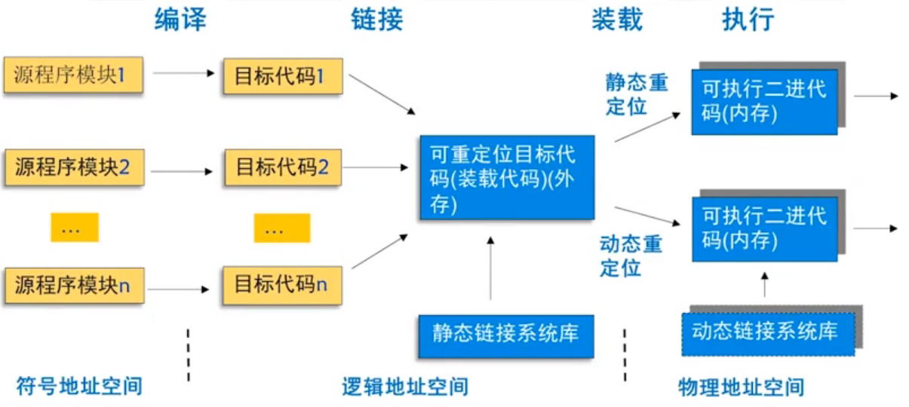

# 存储管理

## 概述

- 存储管理的管理目标
  - 内存的合理分配使用
  - 提高内存利用率
  - 程序、数据在内存中顺利读写
  - 小内存运行大程序

- 内存管理主要功能

   1. 内存的分配和回收
      - 合理分配 及时回收
      - 实现技术：数据结构 主存分配算法 主存分配算法

   2. 地址重定位（地址转换）
      - 实现目标：将逻辑地址转换成物理地址
        - 物理地址 存储单元的实际物理单元地址。
        - 逻辑地址 用户空间中使用的相对地址。

      - 静态重定位
        - 地址转换工作在进程执行前一次完成。
        - 无须硬件支持，易于实现，但不允许程序在执行过程中移动。
      - 动态重定位
         - 地址转换推迟到最后的可能时刻，即进程执行时才成
         - 允许程序在主存中移动，便于主存共存，主存利用率高。

    3. 地址共享和保护：多道程序环境中，多个用户作业均使用内存空间，为提高内存利用率，应该对内存空间实现共享。

    > **共享：**
    >
    > - 共享内存储器资源，让多个进程同时进入内存区域，共享同一个存储器；
    >
    > - 共享内存储器的某些区域，即允许两个或多个进程访问内存中的同一段程序或数据。
    >
    >  **地址保护：**
    >  - 用户进程不能访问或修改系统区
    >  - 用户进程不能访间或修改其他进程的用户区

    4. 地址扩充
       - 内存容量是有限的，当内存资源不能满足用户作业需求时，就需要对内存进行扩充
       - 内存扩充不是硬件上的扩充，而是用存储管理软件来实现
         - 覆盖技术
         - 对换技术
         - 虚拟存储技术

### 存储管理方法

#### 连续存储管理

- 单一连续区方式

> 内存用户区的全部空间只存放一个进程。

- 多分区方式

> - 内存被分为多个分区，每个分区存放一个进程。
>    - 固定多分区
>    - 动态多分区

#### 非连续存储管理

- 分页方式
  - 内存被划分为多个等长的存储块，每个进程占用其中的若干块，整个内存允许有多个进程同时驻留。

- 多段方式
  - 对分段结构的应用程序，按照段长度分别为之分配内存空间。

- 段页方式
  - 在分段式管理的基础上加上分页式管理可形成段页式管理。

## 地址重定位（地址转换）

实现目标：将逻辑地址转换成物理地址

物理地址：存储单元的实际物理单元地址

逻辑地址：用户空间中使用的一种地址

### 程序的编译、链接、装载和执行

## 数据结构与主存分配算法

### 常用的数据结构

#### 主存分配表MAT(Memory Allocation Table)

- 分区号：每个分区都有一个编号，用以区别不同分区。
- 起始地址：分区的起始地址，即首地址。
- 长度：分区的总长，一般以KB为单位。
- 占用标志：记录分区的使用状态。若占用标志为0，表明该分区为空闲，可以进行分配。

例表：

| 分区号 | 起始地址 | 长度 | 占用标志 |
| :----: | :------: | :--: | :------: |
|   0    |   4KB    | 6KB  |   未分   |
|   1    |   10KB   | 2KB  |   已分   |
|   2    |   12KB   | 15KB |   已分   |
|   3    |   27KB   | 34KB |   未分   |
|   …    |    …     |  …   |    …     |

此表若很长，则需要很大的时间开销

#### 空闲区表/链

> 是MAT表的一类子表
>
> 记录内存**空闲区状况**的数据结构

有空闲区链中各空闲区可按地址顺序来排列，也可按尺寸大小来组织。

- 当系统进行内存时，进行的处理是：
  - 通过空闲区链，快速搜索内存的空闲区
  - 从中找出最合适的分区分配出去
  - 将该结点从链上删除

- 当需要某块被释放的区域时，系统处理过程为
  - 按其地址或者大小在链中找到合适的位置
  - 插入一个新结点
  - 若存在相邻的空闲区，则需要的话可将相邻空闲区合并

### 主存分配算法
!> **首次适应算法(First_Fit)：**首次适应算法也称为最早适应算法。系统将内存分区按地址递增顺序登记到内存分配表（或其它数据结构）中。每次进行内存分配时，系统根据进程申请空间的大小，从头到尾顺序扫描内存分配表（或空闲分区表），从中找到的第1块能够满足要求的空闲区，就立即分配出去

!>  **循环首次适应算法(Circle_First_Fit)：**该算法的思想是，每次存储分配总是从上次分配的位置开始，向尾部查找。查到的第1块可满足用户需求的空闲空间，分配给用户。当查到MAT（或空闲链表）的尾部仍然没有合适的，转到头部继续。

!> **最佳适应算法(Best_Fit)：**在内存分配时，从空闲区表中找到一块满足进程需求白最小空闲区分配给它。这种做法减少了将大空闲区进行多次分割造成的空间浪费。但容易形成一些很小的碎片无法使用，同样不能提高内存利用率。另外，每次分配时，都要对整个内存区进行从头到尾的搜索，系统开销较大。

!> **最坏适应算法(Worst_Fit)：**在进行内存分配时，从空闲区表中找到一个满足长度求的最大空闲区进行分配。这种算法部分地缓解了由外碎片引起的浪费，适合于中小作业的运行，但对大作业的运行是不利的。与最佳适应算法一样，每次分配需要搜索一遍内存，效率会受到定影响。

## 连续分区存储管理

> 单分区存储管理、固定多分区存储管理、动态多分区存储管理（可变分区），都属于连续分区存储管理。

### 单分区存储管理

基本原理：把内存的用户区视为一个独立的连续存储区，任何时刻只将它分配给一个作业使用。

这种存储管理非常简单，适用于单用户单任务系统（如，MS-DOS操作系统的早期版本）。

缺点：

- CPU的利用率不高、外设利用率较低：因为任何时刻最多只有一个程序独占内存，无论在该程序执行过程中，还是CPU等待IO时都不能让其他用户使用。
- 内存空间浪费严重：进入系统运行的作业所要求的存储空间较小时，剩余较大的空白区未被利用，只能白白浪费。

### 固定多分区存储管理

> 基本原理：将内存用户区划分成多个大小相等或不等的固定分区，每一个分区可以装入一个进程。这样，内存中可同时容纳若干个进程。
>
> MAT表可以用静态数组实现

固定分区方案可能出现的问题：

- 分区大小可以相等，也可以不等

- 每个分区的越始地址和长度是固定的

- 大的进程无法装入

- 小进程装入大分区出现**内碎片**

> 内碎片：指的是进程获得的空间大于需求的空间时，多出来的空闲区。
>
> 内碎片的产生降低了内存的有效利用率
>
> **如何减少内碎片现象：**
>
> - 采用Best_Fit算法
> - 采用静态重定位
> - 地址保护：采用合适的寄存器

固定分区方案的缺陷：

- 分区的数目在系统生成阶段已经确定，限制了系统中活动进程的数目
- 分区大小在系统生成阶段事先设置，大作业有可能无法装入，小作业不能有效地利用分区空间。
- “内碎片”现象降低了内存有效利用率。

### 动态多分区存储管理

> 基本原理：系统不预先划分固定分区，而是在装入进程时，根据进程的实际需求量划分出一个分区给它使用。
>
> MAT表需要用动态数组实现

- 动态分区分配算法的描述
  1. 从头到尾扫描内存分配表，找到一个能满足需求的空闲分区$MAT_i$
  2. 若$MAT_i$（长度）=L，则：$MAT_i$（占用标志）“已分”，转（4）
  3. 若$MAT_i$（长度）>L，则：
     1. $L_0$=$MAT_i$（长度）-L
     2. $MAT_i$（长度）=L；$MAT_i$（占用标志）=“已分"
     3. 在内存分配表的下一个位置插入新行$MAT_{i+1}$
     4. $MAT_{i+1}$（起始地址）=$MAT_i$（起始地址）+L
     5. $MAT_i$（长度）=$L_0$
     6. $MAT_{i+1}$（占用标志）=“未分”
  4. 结束。

#### 动态分区分配示例

> **外碎片：**指的是在使用动态多分区管理方法时，形成的的、因为太小不容易被分配利用的小的空闲区
>
> 如何消除外碎片：**
>
> - 除了Best_Fit算法，另外三种算法都有使用价值
> - 主存分配过程中，通过程序浮动将不相邻的空闲区移为相邻的进行合并。
> - 回收过程中，相邻空闲区进行合并。