# 存储管理

## 概述

- 存储管理的管理目标
  - 内存的合理分配使用
  - 提高内存利用率
  - 程序、数据在内存中顺利读写
  - 小内存运行大程序

- 内存管理主要功能

   1. 内存的分配和回收
      - 合理分配 及时回收
      - 实现技术：数据结构 主存分配算法 主存分配算法

   2. 地址重定位（地址转换）
      - 实现目标：将逻辑地址转换成物理地址
        - 物理地址 存储单元的实际物理单元地址。
        - 逻辑地址 用户空间中使用的相对地址。

      - 静态重定位
        - 地址转换工作在进程执行前一次完成。
        - 无须硬件支持，易于实现，但不允许程序在执行过程中移动。
      - 动态重定位
         - 地址转换推迟到最后的可能时刻，即进程执行时才成
         - 允许程序在主存中移动，便于主存共存，主存利用率高。

    3. 地址共享和保护：多道程序环境中，多个用户作业均使用内存空间，为提高内存利用率，应该对内存空间实现共享。

    > **共享：**
    >
    > - 共享内存储器资源，让多个进程同时进入内存区域，共享同一个存储器；
    >
    > - 共享内存储器的某些区域，即允许两个或多个进程访问内存中的同一段程序或数据。
    >
    >  **地址保护：**
    >  - 用户进程不能访问或修改系统区
    >  - 用户进程不能访间或修改其他进程的用户区

    4. 地址扩充
       - 内存容量是有限的，当内存资源不能满足用户作业需求时，就需要对内存进行扩充
       - 内存扩充不是硬件上的扩充，而是用存储管理软件来实现
         - 覆盖技术
         - 对换技术
         - 虚拟存储技术

### 存储管理方法

#### 连续存储管理

- 单一连续区方式

> 内存用户区的全部空间只存放一个进程。

- 多分区方式

> - 内存被分为多个分区，每个分区存放一个进程。
>    - 固定多分区
>    - 动态多分区

#### 非连续存储管理

- 分页方式
  - 内存被划分为多个等长的存储块，每个进程占用其中的若干块，整个内存允许有多个进程同时驻留。

- 多段方式
  - 对分段结构的应用程序，按照段长度分别为之分配内存空间。

- 段页方式
  - 在分段式管理的基础上加上分页式管理可形成段页式管理。

## 地址重定位（地址转换）

实现目标：将逻辑地址转换成物理地址

物理地址：存储单元的实际物理单元地址

逻辑地址：用户空间中使用的一种地址

### 程序的编译、链接、装载和执行

## 数据结构与主存分配算法

### 常用的数据结构

#### 主存分配表MAT(Memory Allocation Table)

- 分区号：每个分区都有一个编号，用以区别不同分区。
- 起始地址：分区的起始地址，即首地址。
- 长度：分区的总长，一般以KB为单位。
- 占用标志：记录分区的使用状态。若占用标志为0，表明该分区为空闲，可以进行分配。

例表：

| 分区号 | 起始地址 | 长度 | 占用标志 |
| :----: | :------: | :--: | :------: |
|   0    |   4KB    | 6KB  |   未分   |
|   1    |   10KB   | 2KB  |   已分   |
|   2    |   12KB   | 15KB |   已分   |
|   3    |   27KB   | 34KB |   未分   |
|   …    |    …     |  …   |    …     |

此表若很长，则需要很大的时间开销

#### 空闲区表/链

> 是MAT表的一类子表
>
> 记录内存**空闲区状况**的数据结构

有空闲区链中各空闲区可按地址顺序来排列，也可按尺寸大小来组织。

- 当系统进行内存时，进行的处理是：
  - 通过空闲区链，快速搜索内存的空闲区
  - 从中找出最合适的分区分配出去
  - 将该结点从链上删除

- 当需要某块被释放的区域时，系统处理过程为
  - 按其地址或者大小在链中找到合适的位置
  - 插入一个新结点
  - 若存在相邻的空闲区，则需要的话可将相邻空闲区合并

### 主存分配算法
#### 首次适应算法(First_Fit)

!> 首次适应算法也称为最早适应算法。系统将内存分区按地址递增顺序登记到内存分配表（或其它数据结构）中。每次进行内存分配时，系统根据进程申请空间的大小，从头到尾顺序扫描内存分配表（或空闲分区表），从中找到的第1块能够满足要求的空闲区，就立即分配出去

#### 循环首次适应算法(Circle_First_Fit)

!>  该算法的思想是，每次存储分配总是从上次分配的位置开始，向尾部查找。查到的第1块可满足用户需求的空闲空间，分配给用户。当查到MAT（或空闲链表）的尾部仍然没有合适的，转到头部继续。

#### 最佳适应算法(Best_Fit)

!> 在内存分配时，从空闲区表中找到一块满足进程需求白最小空闲区分配给它。这种做法减少了将大空闲区进行多次分割造成的空间浪费。但容易形成一些很小的碎片无法使用，同样不能提高内存利用率。另外，每次分配时，都要对整个内存区进行从头到尾的搜索，系统开销较大。

#### 最坏适应算法(Worst_Fit)

!> 在进行内存分配时，从空闲区表中找到一个满足长度求的最大空闲区进行分配。这种算法部分地缓解了由外碎片引起的浪费，适合于中小作业的运行，但对大作业的运行是不利的。与最佳适应算法一样，每次分配需要搜索一遍内存，效率会受到定影响。

## 连续分区存储管理

> 单分区存储管理、固定多分区存储管理、动态多分区存储管理（可变分区），都属于连续分区存储管理。

### 单分区存储管理

**基本原理：**把内存的用户区视为一个独立的连续存储区，任何时刻只将它分配给一个作业使用。

这种存储管理非常简单，适用于单用户单任务系统（如，MS-DOS操作系统的早期版本）。

缺点：

- CPU的利用率不高、外设利用率较低：因为任何时刻最多只有一个程序独占内存，无论在该程序执行过程中，还是CPU等待IO时都不能让其他用户使用。
- 内存空间浪费严重：进入系统运行的作业所要求的存储空间较小时，剩余较大的空白区未被利用，只能白白浪费。

### 固定多分区存储管理

> **基本原理：**将内存用户区划分成多个大小相等或不等的固定分区，每一个分区可以装入一个进程。这样，内存中可同时容纳若干个进程。
>
> MAT表可以用静态数组实现

固定分区方案可能出现的问题：

- 分区大小可以相等，也可以不等

- 每个分区的越始地址和长度是固定的

- 大的进程无法装入

- 小进程装入大分区出现**内碎片**

> 内碎片：指的是进程获得的空间大于需求的空间时，多出来的空闲区。
>
> 内碎片的产生降低了内存的有效利用率
>
> **如何减少内碎片现象：**
>
> - 采用Best_Fit算法
> - 采用静态重定位
> - 地址保护：采用合适的寄存器

固定分区方案的缺陷：

- 分区的数目在系统生成阶段已经确定，限制了系统中活动进程的数目
- 分区大小在系统生成阶段事先设置，大作业有可能无法装入，小作业不能有效地利用分区空间。
- “内碎片”现象降低了内存有效利用率。

### 动态多分区存储管理

> **基本原理：**系统不预先划分固定分区，而是在装入进程时，根据进程的实际需求量划分出一个分区给它使用。
>
> MAT表需要用动态数组实现

- 动态分区分配算法的描述
  1. 从头到尾扫描内存分配表，找到一个能满足需求的空闲分区$MAT_i$
  2. 若$MAT_i$（长度）=L，则：$MAT_i$（占用标志）“已分”，转（4）
  3. 若$MAT_i$（长度）>L，则：
     1. $L_0$=$MAT_i$（长度）-L
     2. $MAT_i$（长度）=L；$MAT_i$（占用标志）=“已分"
     3. 在内存分配表的下一个位置插入新行$MAT_{i+1}$
     4. $MAT_{i+1}$（起始地址）=$MAT_i$（起始地址）+L
     5. $MAT_i$（长度）=$L_0$
     6. $MAT_{i+1}$（占用标志）=“未分”
  4. 结束。

#### 动态分区分配示例

> **外碎片：**指的是在使用动态多分区管理方法时，形成的的、因为太小不容易被分配利用的小的空闲区
>
> **如何消除外碎片：**
>
> - 除了Best_Fit算法，另外三种算法都有使用价值
> - 主存分配过程中，通过程序浮动将不相邻的空闲区移为相邻的进行合并。
> - 回收过程中，相邻空闲区进行合并。

## 基本分页存储管理

> **基本原理**
>
> - 内存被划分成大小固定相等的块（ Frame帧、页框、主存块），且块相对比较小。
> - 每个进程装入时被分成同样大小的页（Page），一页装入一帧
> - 整个进程被离散装入到多个不连续的帧

### 页面长度

页面的尺寸（页面长度）由计算机系统的硬件决定。

> 对于某台具体的机器来说，只能规定一种尺

 

目前流行的页面尺寸是1KB到4KB之间，但也有一些机器不在此范围内

> 比如，小型机 IBM AS400的页面尺寸为512个字节

### 记录内存使用情况的数据结构

>  位示图：整个系统一张，记录内存使用情况
>
> 0表示空闲，1表示被占用

| $_i\backslash ^j$ | 第 0 位 | 第 1 位 | 第 2 位 | 第 3 位 | 第 4 位 | 第 5 位 | 第 6 位 | 第 7 位 |
| :---------------: | :-------------: | :-------------: | :-------------: | :-------------: | :-------------: | :-------------: | :-------------: | :-------------: |
|      第0个字      |        0        |        0        |        0        |        1        |        1        |        1        |        1        |        0        |
|      第1个字      |        0        |        1        |        1        |        0        |        0        |        0        |        1        |        0        |
|      第2个字      |        1        |        0        |        0        |        1        |        1        |        0        |        1        |        1        |
|        ……         |        …        |        …        |        …        |        …        |        …        |        …        |        …        |        …        |
|      第n个字      |        0        |        0        |        0        |        0        |        0        |        0        |        0        |        0        |

设字号$i$、位号$j$、帧号$k$取值均从0开始，字长记为L

分配时，查位示图，找空闲帧：$k=i*L+j$

回收时，$i=(k/L) $//整除

$j= k\space MOD\space L$ //取余

由帧号可知位示图中字号和位号

### 页面分配算法

1. 计算请求者需要的总帧数N
2. 查位图，若找不到足够的空闲帧，编制“分配失败”报告返回
3. 索取一个空闲页表PT
4. 从位图中找出N个为0位，计算出对应的帧号，填入PT
5. 位示图中将这些位改为1
6. 将PT起始地址填入进程的PCB中
7. 结束

### 地址划分

进程装入之前，逻辑地址是**一维**的

进程装入之后，逻辑地址分为**二维**

高端地址部分：作为页号

低端地址部分：作为页内的偏移量（即页内地址）

 

例：若机器的地址码是16位，页面长度是1KB

则地址划分结果：低10位是页内地址，高6位是页号

| 6位  |   10位   |
| :--: | :------: |
| 页号 | 页内地址 |

> 这样的地址结构，允许一个进程的页面总数达$2^6=64$页

### 地址重定位

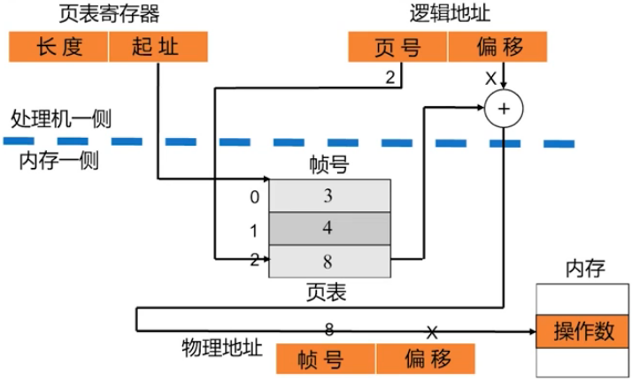

### 地址保护

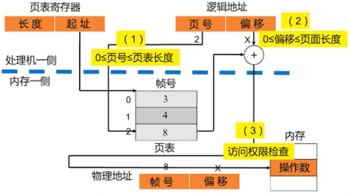

### 总结

- 离散存储，利于大进程装入
- 只有**很少的页内碎片**，提高内存利用率
- Ds：位示图、页表；动态地址重定位
- 页面共享不易实现定位页面共享不易实现

## 基本分段存储管理

> **基本原理**
>
> - 进程的程序和其相关的数据按逻辑分段
> - 段有一个最大长度限制，但不要求所有程序的所有段的长度都相等
> - 一段占用一块连续存储区
> - 各段占用不连续分区

> “段”是一个逻辑单位，是进程的一个组成部分如主程序段、子程序段、数据段等
>
> 在结构程序设计中，进程自然分段。
>
> 用户源程序使用的符号地址是二维的：<段名，变量名>
>
> 编译之后的逻辑地址是二维的：<段号，段内偏移>

### 进程按逻辑分段

> 在分段机制中，一个进程的地址空间可以包含以下不同的段：
>
> - 代码段（ Code segment）
> - 数据段（ Data segment）
> - 堆栈段（ Stack Segment）
> - 内存共享段（ Share Memory Segment）等

### 包含3个段的进程

>例如，一个进程P包括3个程序段：Main（主段）、Sub1（子段1）和Sub2（子段2）。
>
>甚至有专门的“共享段”
>
>图给出各个段之间的调用关系

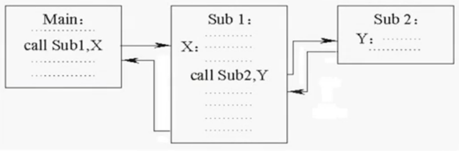

### 记录内存使用情况的数据结构

- MAT
- 空闲分区表/链

!> 这里用的MAT表与**动态多分区**中MAT表的有何异同？

| 相同点                          | 不同点                                                       |
| :------------------------------ | :----------------------------------------------------------- |
| MAT的一个表项，对应内存一个分区 | - 动态多分区中，一个分区存放一整个进程 - 分段存储中，一个分区存放进程的一个段。 一个进程离散成多个段装入多个不连续的分区 |

### 记录各个进程分段情况的数据结构

**段表ST（ Segment Table）**为每个进程设置一张段表，用来记录各个段地址映射的关系

进程分了几段，段表就有几个表项。
个表项记录一个分段在内存空间中的存储地址和长度。

段表示例：

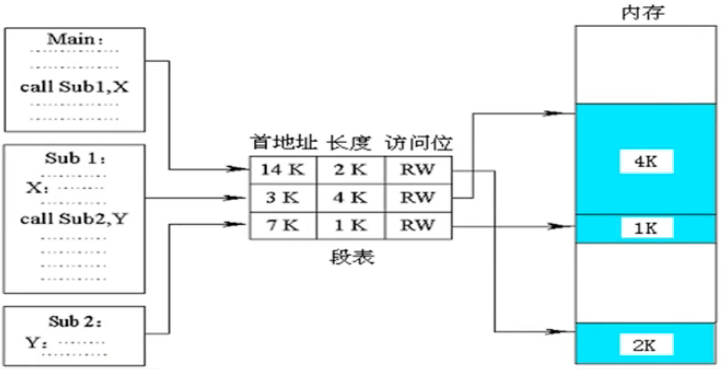

### 地址重定位

程序运行中的地址变换过程如下：

1. 提取逻辑地址中的“段号”
2. 比较段号与段表控制寄存器中的段长度。如果超出段表长度，则返回“内存定位错误”，终止进程的运行
3. 从段表控制寄存器中给出的段表首址开始，以段号为索引査找该进程对应的段表，得到欲访问段的首地址。
4. 取出欲访问段的首地址，加上逻辑地址中的偏移量得到物理地址。

### 分段保护

> 第一级保护是防止进程发生超出存储空间的访问；
>
> 第二级保护是阻止进程超出访问权限的读写。

分段保护的具体保护分为以下三个步骤

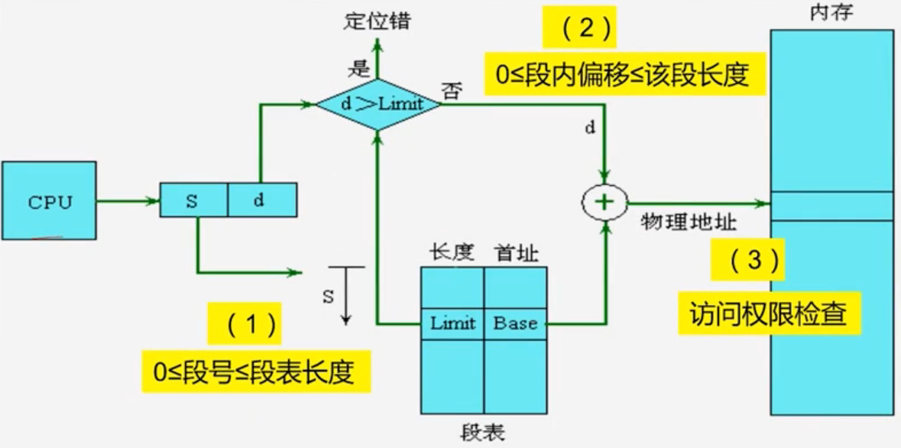

### 分段共享

- 段面共享

  > 如果多个用户进程需要共享内存中的某些代码段或数据段时可将内存中共享段的起始地址及长度，填入这些进程的段表当中，就可共享一个逻辑上完整的段信息了。

- 共享段表SST

  > 为了实现段的共享，系统设一个“共享段表”（SST, Sharing Segment Table）
  >
  > 记载各个共享段的使用情况任何一个进程调用共享段时，系统都将访问该表

### 总结

- 离散存储，一段连续装，各段不连续

- 内存仍然按分区管理，会产生**外碎片**

- DS：MAT、段表；动态地址重定位

- 分段共享非常方便

## 基本段页式存储管理

> 把分页和分段两者结合起来就是段页式存储管理。
>
> - 内存划分成大小相等的页框。
> - 用户的地址空间被程序员划分成许多段，每个段一次划分成许多固定大小的页，页的长度等于内存中的页框大小。

### 分页与分段

> **分页：**
>
> 分页存储利于大进程裝入，内存利用率高；
>
> 但是，页是物理页，页面共享不易实现。
>
> **分段：**
>
> 段是逻辑段，方便实现分段共享；
>
> 但是，外碎片的存在降低内存使用效率
>
> 且整理消除外碎片加大系统开销

### 数据结构

- 系统设一张位示图，记录内存各帧占用与否
- 系统为一个含有多分段的进程建立段表，记录各个分段对应段内页表的地址和长度
- 一个分段有一个段内页表，记录该段划分为多少页每页分配的帧号是多少

 

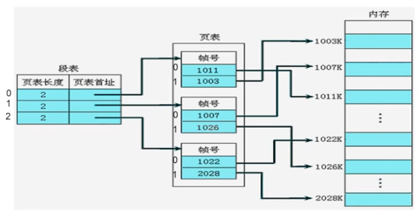

$$
段表和段内页表
$$

### 地址形式

系统的硬件支持是，在处理机内部设有**段表控制寄存器**及**地址生成逻辑**

- 程序中的逻辑地址仍然是二维地址：<段号，偏移量>
- 每段装入时分页，地址部分被当作三维地址来处理：<段号，页号，页内偏移>

### 段页式地址重定位

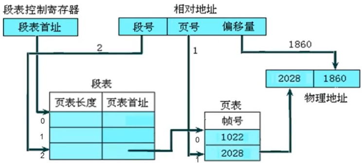

### 段页式地址保护

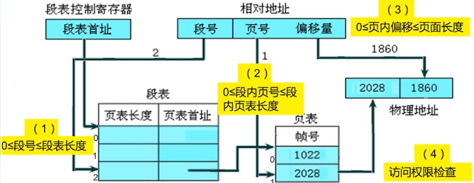

### 段页式地址字结构的计算

比如一个32位地址字，已知系统设定页面长度为4KB，段的长度为64KB

则地址划分如下：

| 段号  | 页号  | 页内地址 |
| :---: | :---: | :------: |
| 31-16 | 15-12 |   11-0   |

页面长度为4KB($2^{12}$)，因此页内地址需要12个二进制位。

段的长度为64KB，页面长度为4KB，因此一个段包含了$64÷4=16(2^4)$个页，因此页号需要4个二进制位。

于是，页内需12位，每段分16页，段内页号需4位，剩余16位为段号。

## 多级页表及相关计算

### 一级页表结构

若页面长度为4KB，每个页表项占用4B，则意味着:

帧里最多能存放4KB÷4B=1K个页表项

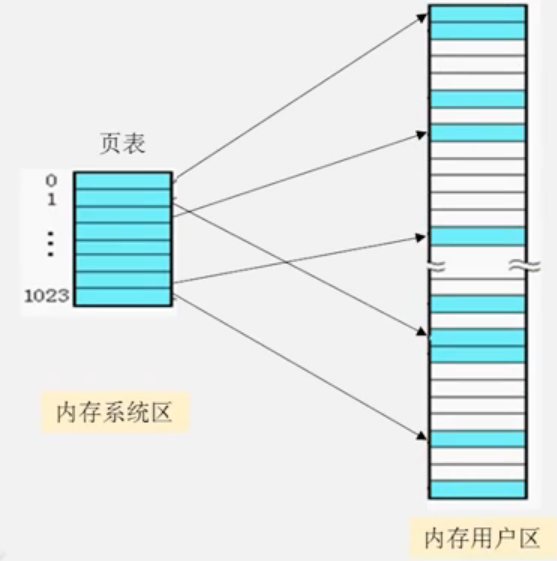

### 多级页表结构

计算：一个由32位二进制组成的地址空间，页面长度为4KB，每个页表项占用4B，则：

- 进程的页面总数可达$2^{20}=1M$个
- 整个页表最大占用4MB
  - 页号：31-16
  - 页内地址：11-0

- 一个帧只有4KB，所以4MB的页表需要离散存放需要占用4MB/4KB=1K个帧。

- 这就需要如果建立更高一级的页表，记录页表所占帧号，叫做“页表的页表”：两级页表

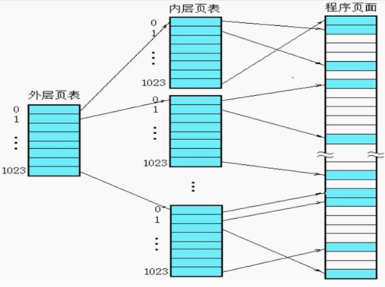

### 多级页表结构

二级页表地址形式

| 外层页号 | 内层页号 | 页内偏移 |
| :------: | :------: | :------: |
|          |          |          |

如果二级的页表也必须用多个帧来存放，那就需要建立更高一级的页表：多级页表

### 相关计算

一个由32位二进制组成的地址空间，页面长度为4KB，每个页表项占用4B，则：

1. 采用一级页表机制，所允许的进程的最大长度是（$2^{20}×4KB$）

| 页号  | 页内地址 |
| :---: | :------: |
| 31-16 |   11-0   |

 2. 采用两级级页表机制，所允许的进程的最大长度是（$2^a×2^b×2^c B$）

| 外层页号 | 内层页号 | 页内偏移 |
| :------: | :------: | :------: |
|    c     |    b     |    c     |

 

一个由32位二进制组成的地址空间，页面长度为4KB，每个页表项占用4B，请问地址字结构

1. 因页面长度为4KB，所以页内偏移占12位；
2. 余下20位对应页号，所以进程的页面总数可达1M个；
3. 整个页表占用4MB，这4MB又划分为18个页面
4. 一个页面正好可存放1K个页表项；
5. 所以，为了查找这1K个页面，两级页表结构就够了。
   即：外层页号和内层页号各占10位，偏移量占12位

### 多级页表机制的地址重定位过程

处理机中要设有**外部页表寄存器**，存放当前进程的外部页表首地址。

系统根据指令给出的逻辑地址：

- 用逻辑地址中的外层页号a查外层页表，得到内层页表首地址。
- 用逻辑地址中的内层页号b查内层页表，得到数据帧号
- 将数据帧的首地址加上偏移地址c得到物理地址。

## 与快表有关的计算

1. 在一般的分页管理系统中，处理机每次读出/写入一个数据，需要访问（2）次内存；而在分区存储管理系统中，需要访问（1）次内存。
2. 在一般的分页管理系统中，执行一条一地址指令，需要访问（2）次内存；执行一条三地址指令，需要访问（6）次内存。

解析：

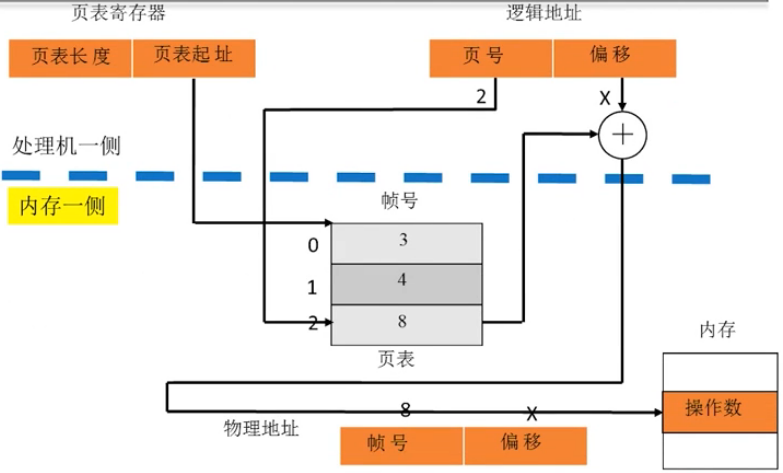
$$
分页存储管理系统
$$

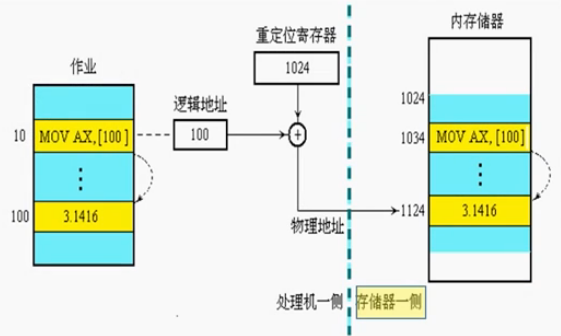
$$
分区存储管理系统
$$

### 提高地址转换速度一快表

- 存储在高速缓存
- 内容为页表中最近使用的页表项

#### 引入快表之后的地址变换过程

对于CPU给出的一个逻辑地址<页号P，偏移量W>

> 1. 硬件逻辑中，将逻辑地址中的页号P送入高速缓存，与快表中的所有页号进行比较。若找到相匹配的页号，读出该页面对应的帧号，与偏移量W合成一个物理地址。
> 2. 若在快表中没有找到，系统需要再访问内存中的页表。在页表中找到该页的帧号，与偏移量w共同合成访问内存的物理地址
> 3. 同时，系统自动更新快表。快表中总是存放那些刚刚访问过的页表项。

#### 有效访存时间的计算

$有效访存时间=地址转换时间+读写一个页面的时间$

地址转换时间：访问一次快表或者页表的时间 

读写一个页面的时间：访问一次内存的时间

- 访问一次快表的时间，即访问一次快存的时间
- 访问一次页表的时间，即访问一次内存的时间

设一次快存访问时间为t1，一次内存访问时间为t2

- 如果査询快表能找到所用的页，我们称作命中。此时的有效访存时间t为$t=t_1+t_2$
- 如果查询快表没有找到所用的页，称作没有命中此时的有效访存时间t将是：$t=t_1+2t_2$

一般地，当查询快表的命中率为p，则平均内存有效访问时间T大约为：

$T=p×(t_1+t_2)+(1-p)×(t_1+2t_2)$

 

例题：假设一个分页存储系统具有快表，已知内存访问时间是1us，快表的访问时间为01us。若快表命中率是85%，则有效存取时间为多少？

$$
T=p×(t_1+t_2)+(1-p)×(t_1+2t_2)=85\%×(0.1+1)+(1-85\%)×(0.1+2×1)
$$

#### 实际系统引入快表之后的地址变换示意图

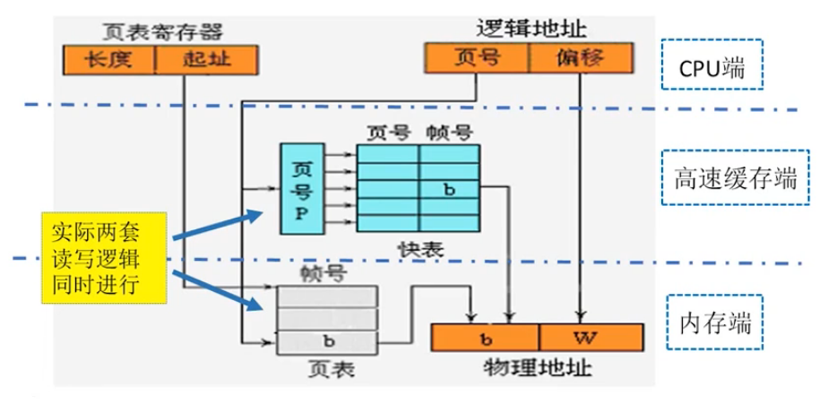