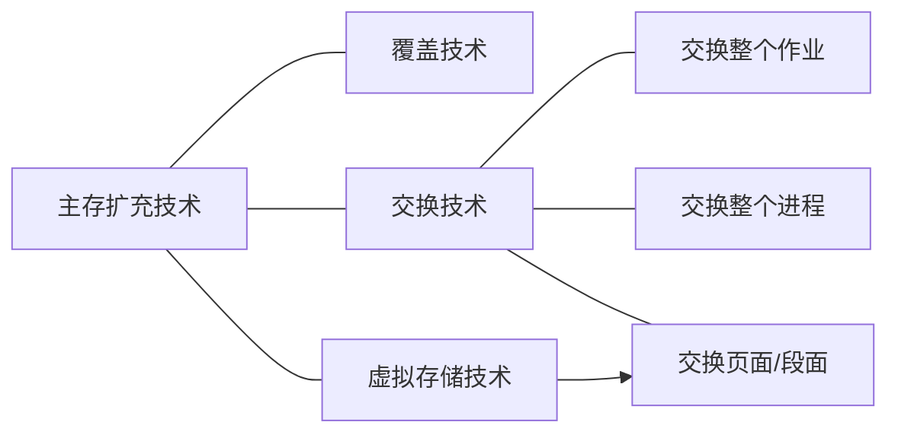
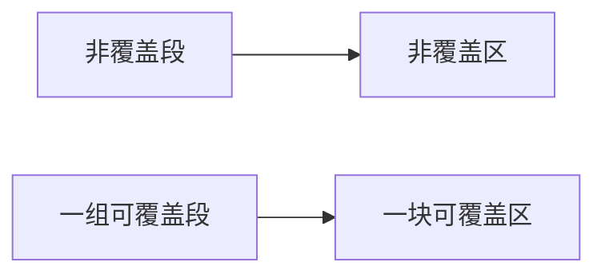
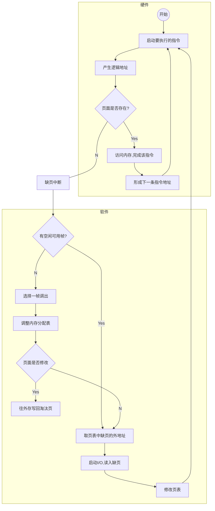

# 虚拟存储管理

## 概述

### 主存扩充技术实质

目的：将小的实存储器（实存）扩充为大的虚存储器（虚存）

实质：将磁盘空间虚拟成内存使用

结果：将进程的一部分装入内存，即可运行

### 局部性原理

时间局部性：最近访问过的程序代码和数据很快又被访问。

空间局部性：某存储单元被使用之后，其相邻的存储单元也很快被使用。

程序在执行过程中的一个较短时间内，所执行的指令地址或操作数地址分别局限于一定的存储区域中。

### 覆盖技术

程序运行过程中，在不同时刻把同一存储区分配给不同程序段或数据段，实现**存储区共享**的一种内存分配技术。

> 覆盖技术通常与**单一连续区分配、固定多分区分配和动态分区分配**等存储管理技术配合使用。

每一个用户程序被分为若干段：

非覆盖段—一部分是经常要用的基本部分，作为常驻段

可覆盖段一另一部分不经常使用，可以让它们在需要时临时装入。不同时使用的段可组为一组可覆盖段。

### 交换(Swap)技术

将内存中某进程暂时不用的程序和数据全部或部分）写入外存交换区中，腾出来的内存空间供其它进程使用。待需要时或内存有空闲空间时，再将它从外存交换区装入内存

#### 交换技术实现要点

磁盘上设置“磁盘交换区”

> 磁盘交换区是一个数据的暂存处。系统可根据内存的“拥挤”程度将信息调往交换区或者从交换区调入

#### 文件区和交换区的区别

操作系统管理下磁盘空间被划分为：文件区和交换区。

!>**存储方式不同：**文件区信息以文件形式存放，为了提高空间利用率，一般采取**离散存储**方式；而交换区信息按字符流方式存放，多采用**连续存储**方式

!>**访问速度不同：**文件区存储空间特别大，为了提高检索效率一般通过建立目录对文件实现访问，也就是**间接地址访问**；而交换区空间较小，可按外存地址**直接访问**，因此访问速度快。

!>**存储时间不同：**文件区适合于较长久的数据存储；而交换区作为临时数据的存放处，只存放短期的数据。

#### 交换技术的应用

交换整个作业——用于单道系统（单道模拟多道）

交换整个进程——用于连续分区存储管理（进程挂起、激活，中级调度）

交换页面/段面——用于分页、分段存储管理（此即为虚拟存储技术）

### 虚拟存储技术

一个进程运行时，可不必将其全部装载到内存中只须把当前运行的部分程序和可能访问的数据块装入内存即可。

随着进程运行的不断推进，其余部分程序和数据可随时装入。

这样做可实现小内存运行大程序的设想

> 采用虚拟存储技术以后，从逻辑上说，系统拥有一个容量很大的存储器，这就是人们常说的虚拟存储器。
>
> 虚拟存储器的特性：
>
> - 离散性
> - 多次性
> - 对换性
> - 虚拟性

#### 虚拟存储实现技术

基于分页的虚拟存储令$\iff$页面换入换出

基于分段的虚拟存储$\iff$段面换入换出

基于段页的虚拟存储$\iff$页面换入换出

## 请求分页存储管理

### 基本原理要点

- 内存分大小相等的帧（Frame）
- 进程按照帧的大小被分成若干页（Page）
- 进程仅装入部分页面，即开始执行
- 在执行过程中访问的页若已在内存，进行动态的地址重定位，执行指令（同基本分页存储管理）
- 在执行过程中访问的页未装入内存时，产生缺页中断，进程阻塞，等待从磁盘动态装入页面
- 缺页装入以后，进程转入就绪，可以参与调度继续执行
- 内存无空闲可用帧时，暂时不用的页面可换出到交换区
- 通过页面的换入换出，实现小内存运行大进程

### 数据结构

- 位示图
  - 系统设置一张位示图，记录内存划分为多少个帧，帧用一个0/1记录该帧占用还是空闲。

- 页表
  - 为一个进程设置一张页表，记录该进程分了多少页、每一页是否已装入内存、内/外存地址、访问权限等的相关管理信息。
  - 与基本分页存储管理的页表相比：扩充页表的内容，增加驻留标志位和页面辅存的地址等信息。

### 地址重定位机制

当一个进程调度时，系统将其页表首址装入CPU中的页表控制寄存器。运行中用相对地址的高端部分作为页号去检索页表，看该页是否已在内存。

如果访问的页不在内存（发生缺页中断），在缺页中断处理过程中，装入缺页，继续地址重定位

### 缺页中断与缺页中断处理过程

#### 缺页中断的断点

缺页中断是指令执行**过程中**产生的中断，而（一般的中断）在一条指令执行完成后产生的。

#### 缺页中断的断点压入

当CPU执行指令希望访问一个不在内存的页面时，将生缺页中断，系统开始运行中断处理程序。

此时指令计数器（PC）的值尚未来得及增加就被压入堆栈，因此**压入的断点必然是本次被中断的指令地址，而非下一条指令的地址**。

#### 缺页中断处理过程

1. 保留进程上下文
2. 判断内存是否有空闲可用帧？
   - 若有，则获取一个帧号No，转(4)启动I/O过程。
   - 若无，继续(3)。
3. 腾出一个空闲帧，即：
   1. 调用置换算法，选择一个淘汰页PTj。
   2. PTj(S)=0;//驻留位置0
   3. No=PTj(F);//取该页帧号
   4. 若该页曾修改过，则：
      1. 请求外存交换区上一个空闲块B
      2. PTj(D)=B; //记录外存地址
      3. 启动I/O管理程序，将该页写到外存上。
4. 按页表中提供的缺页外存位置，启动I/O，将缺页装入空闲帧No中。
5. 修改页表中该页的驻留位和内存地址。PTi(S)=1; PTi(F)=No。
6. 结束

### 页面分配算法与分配策略

#### 页面分配相关讨论

- 实践证明，如果一个进程在内存中分配的帧数比较少，尽管有局部性原理，缺页率仍然相对较高——分配帧数太少不合适
- 给特定进程分配的内存空间超过一定的大小后，由于局部性原理，该进程的缺页率没有明显的变化
- 分配给一个进程的帧数越多，在任何时候驻留在内存中的进程数就越少，从而降低了操作系统至少找到一个就绪进程的可能性，降低了CPU的利用率——分配帧数太多不合适

#### 给特定进程分配合理的内存帧数

目前流行的支持多字节指令的计算机系统中，一条指令需要对源操作数和目的操作数进行处理（通常是二地址指令），那么一个进程的运行空间最好不小于6个页面。

> 请求分页系统中的页面分配应当以**减少缺页率**为目标。
>
> **需考虑因素：**指令格式、寻址方式、程序长度、页面走向程序的工作集尺寸、多道并发度等。

#### 常用页面分配算法

- 平均分配法：系统的可用空间平均分配给所有进程，让它们都占有相等数量的帧。

>这样分配对短作业来说是很有利的。
>而对于一些较大的进程，缺页率必然居高不下

- 优先权分配法：考虑进程的优先运行权，给高优先的进程分配较多的帧，使它的缺页率相对少一些。

> 这里，我们可把优先权理解为高响应比、高优先级、最短剩余时间优先等。

- 比例分配法：这种分配方法比较公平，小进程分配小空间，大进程分配大空间

> 当可用空间为M个帧，系统当前的进程数为n，每个进程的页面数量为$s_i$，那么按比例分配法，应当分配给进程$i$的页数$p_i$为：
> $$
> p_i={s_i\over \displaystyle\sum_{j=1}^n S_j}×M
> $$

#### 页面分配策略

- 固定分配策略：为一个进程在内存中分配固定数目的页框用于执行时使用。

- 可变分配策略：允许分配给一个进程的帧及帧的数目在该进程的生命周期中不断地发生变化

> 缺页率高，可增加分配的帧；
>
> 缺页率很低，可适当减少分配的帧。

