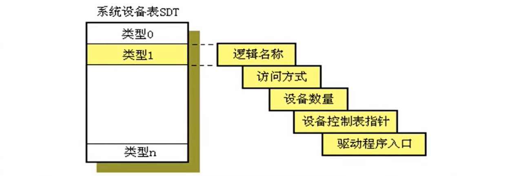

# 设备管理

## 概述

> 管理对象--“外部设备”
>
> 在计算机系统中，用来担负数据输入输出的部件称作**外部设备**（Peripheral），简称“外设”，它们是计算机与外部世界进行信息勾通的桥梁
>
> 外部设备包括键盘、鼠标、打印机、卡片机磁带机、磁盘机等以及有关的支持设备。

- I/O设备
  - 人可读
  - 机器可读
  - 通信

- 外存储设备
  - 数据速率
  - 应用
  - 控制的复杂性
  - 传送单位
  - 数据表示
  - 错误条件
- 设备管理模块是操作系统中最庞大最复杂的一个模块

- 设备管理目标
  - 方便用户使用
  - 提高设备利用率
  - 通过管理调度提高I/O效率
  - 通过软件方法扩充设备功能
- 设备管理功能
  - 设备分配、回收
  - 设备无关性（设备独立性）
  - 缓冲区的设置和管理
  - 设备的驱动与调度
  - 设备的虚拟扩充
- 逻辑I/O层的功能
  - 负责设备的分配和回收。通过设置和维护数据结构，对设备数据进行登记和管理。
  - 负责对用户的访问需求（如read或write）进行合法性检查。若此次访问不合法时，将拒绝访问
  - 负责随时接收下层的处理结果，整理后反馈给用户。处理结果中包含成功或失败信息。

- 物理I/O层的功能
  - 管理内存中的设备缓冲区，负责缓冲区的分配和回收。
  - 实现数据的装入与提取，比如从上层软件送来的一行数据填入缓冲区或者从缓冲区取出一行数据送给用户。同时，要实现诸多用户对缓冲区访问的并发控制。
  - 根据用户请求生成一个具体的I/O任务块**IOB**，挂到相关设备的任务队列上，并启动下层软件。

> **lOB（ Input Output Block）**
>
> IOB是一种动态数据结构，每个IOB用于描述一项输入输出任务。
>
> 当系统收到一个I/O请求时就构造一个IOB，并按IOB的信息进行传输控制。
>
> > |        IOB         |
> > | :----------------: |
> > |      进程标识      |
> > |      内存地址      |
> > |      传输方向      |
> > |      传送数量      |
> > | 设备（及控制器）号 |
> > |      链接指针      |
>

- 设备调度与驱动层
  - 主要包括的功能有：
    - 设备调度，如磁盘I/O调度。
    - 构造通道程序。
    - 启动I/O设备完成输入输出。
    - 对于设备I/O的情况进行收集并交给上层软件

## 设备的分配

> 共享设备是允许多用户穿插访问的设备，此类设备不能分给某个用户独占。
>
> 设备分配是用户对独享设备的使用方式。用户分得台独享设备后可以自由地使用，直到使用完毕将设备释放为止。
>
> 当用户请求进行I/O操作时，不但要分配设备，还要分配有关的数据传输通路，也就是分配通道和控制器

- 系统设备表SDT（System Device Table）
  - 系统设置一张SDT，登记系统拥有的所有**设备类型**，一行登记一类设备的管理信息。

例：

| 设备类型 | 访问方式 | 设备可用量 |  DCT指针  | 驱动程序入口 |
| :------: | :------: | :--------: | :-------: | :----------: |
|   PRN    |   输出   |     2      | DCT[0052] |     ***      |
|   SCA    |   输入   |     2      | DCT[0062] |     ***      |
|   COM    | 输入输出 |     1      | DCT[0071] |     ***      |
|   DSK    | 输入输出 |     1      | DCT[0100] |     ***      |

- 设备控制表DCT（Device Control Table）
  - 系统设一张DCT，登记所有外部设备，一行登记登记一台设备的管理信息

例：

| 设备类型 | 设备标识Did | 属性 | 设备状态 |  CCT指针  | 重复次数 | 任务队列指针 |
| :------: | :---------: | :--: | :------: | :-------: | :------: | :----------: |
|   PRN    |    0051     | 独享 |   忙碌   | CCT[1000] |    3     |     ***      |
|   SCA    |    0051     | 独享 |   空闲   | CCT[1001] |    3     |     ***      |
|   COM    |    0053     | 独享 |   空闲   | CCT[1001] |    5     |     ***      |

- 逻辑设备映射表LUT
  - 分配结果记入每个进程的PCB，称作LUT

### 设备分配过程

1. 根据用户提出的逻辑设备名称，从SDT中找到相应类型的逻辑设备，并获取该类型设备的可用数量N，据此进行安全检测（银行家算法），如果检验不通过，则将进程阻塞。
2. 从SDT中取出设备控制表指针，查找DCT，找到一台可用的外部设备。将设备分配给进程。
   在该进程的PCB中建立一个设备映射表LUT，将用户的逻辑设备名称和对应的物理设备标识对应起来。

> 通过设备分配实现了**设备无关性**：
>
> 又称为设备独立性，指的是应用程序所涉及的逻辑设备与系统中具体使用的物理设备是互相无关的。

- 设备无关性的优点
  1. 设备分配的灵活性提高：进程使用**逻辑设备名**提出请求，系统可以从当前空闲的**物理设备**中任选一台分给用户。
  2. 易于实现I/O重定向：系统可以在不更改应用程序代码的前提下，让程序中LO命令所涉及的逻辑设备名映射到另外的物理设备上。

## 缓冲区的设置与管理

> 缓冲区，是位于内存中的一块临时存储区，作为内存和外部设备之间数据传送的桥梁。

- 设置缓冲区的目的
  - 改善中央处理器与外围设备之间速度不匹配的矛盾
  - 协调逻辑记录大小与物理记录大小不一致
  - 提高CPU和I/O设备的并行性
  - 引入缓冲技术后的系统，呈现以下特点：
    - 减少设备驱动次数。
    - 可以缓解I/O操作对缺页置换策略的干扰。
    - 缓解CPU与外部设备速度不匹配的矛盾，使数据处理的速度提高。
- 缓冲技术带来的
  1. 进程执行写操作输出数据时，向系统申请个缓冲区，若为顺序写请求，则不断把数据填到缓冲区，直到被装满。
  2. 此后，进程继续它的计算，系统将缓冲区内容写到IO设备上。 
  3. 在输出数据时，只有在系统还来不及腾空缓冲而进程又要写数据时，它才需要等待
  4. 大部分时间，进程的计算和输出是可以并行的

> **真题**
>
> 某文件占10个磁盘块，现要把该文件磁盘块逐个读入主存缓冲区，并送用户区进行分析。假设一个缓冲区与一个磁盘块大小相同，把个磁盘块读入缓冲区的时间为100μs，将缓冲区的数据传送到用户区的时间是50μs，CPU对一块数据进行分析的时间为50μs。在单缓冲区和双缓冲区结构下，读入并分析完该文件的时间分别是（B）
>
> A.1500μs、1000μs			B.1550μs、1100μs			C.1550μs、1550μs			D.2000μs、2000μs

...

------

> **UNIX操作系统采用的缓冲注**
>
> 缓冲池是系统提供的一种共享结构，不归某个进程所有
>
> 任何程序都可以申请缓冲池中的一个存储块，用来存放自己的缓冲数据。
>
> 缓冲块组成3个队列：
>
> 1. 空闲缓冲队列`emq`：该队列上挂有全部可用的空闲缓冲区。
> 2. 输入队列`inq`：该队列上挂有装满输入数据的缓冲区。
> 3. 输出队列`outq`：该队列上挂有装满输出数据的缓冲区。

## 磁盘读写速度分析

- 磁盘性能参数
  - 寻道时间$t_s$：将磁头臂移到指定磁道所需要的时间
    - $T_s=s+m×n$
    - s-磁盘启动时间，m-平均跨越一道的时间，n-跨越的道数
  - 旋转延迟时间$t_r$：将磁盘的待访问地址区域旋转到读/写磁头可访问的位置所需要的时间
    - $T_r={1\over 2r}$
    - r-旋转速度（转/秒）
  - 传输时间$t_t$：读或写操作的数据传输所需的时间
    - $T_t={b\over rN}$
    - b-要传送的字节数，r-转速，N-一个磁道中的字节数
  - 一次磁盘访问时间T是下述3部分的总和，即：$T=t_s+t_r+t_t$