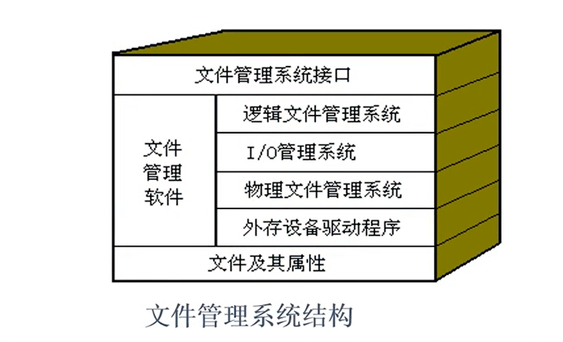
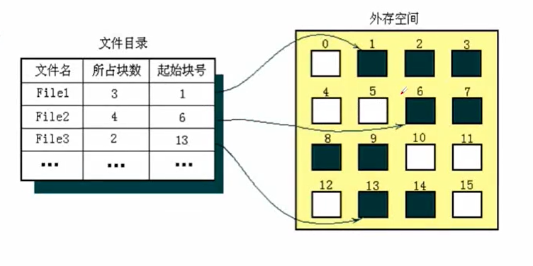

# 文件管理

## 概述

1. 用户关注的是逻辑层面的文件
   - 文件内容
   - 方便地使用
2. OS关注的是物理层面的文件
   - 怎么存储文件
   - 如何实现文件的读写
   - 如何快速存取
   - 如何提高磁盘存储空间利用率

> 在操作系统看来：
>
> - 文件是在逻辑上具有完整意义的组相关信息的集合。
> - 它可以是一组相关的字符流集合，也可以是一组相关的记录集合
> - 通常被保存在外存储器上。

### 内在形式-文件的组成和操作

- 文件组成
  - FCB（File Control Block）
  - 文件体
- 对文件要做的事情
  - 建立、描述
  - 存储、读写

- 文件管理系统FMS（File Management System）
  - FMS是操作系统的一个组成部分
  - 负责实现文件管理有关功能的管理模块
  - 管理对象是：文件、目录、文件存储空间、用户

- 文件管理系统的管理目标
  - 方便用户
  - 提高磁盘空间利用率
  - 文件操作便捷且存取效率高

- 文件管理系统的管理功能
  1. 按名存取
  2. 文件组织（逻辑文件与物理文件的转换）
  3. 存储空间管理
  4. 文件共享和保护
  5. 文件操作

- 公认一个好的FMS应具有以下特点
  1. 使用的方便性
     - 按名存取的实现，使文件的物理结构和存放的物理位置对于用户都成了透明的。
  2. 数据的安全性
     - 好的文件管理系统能提供有效的保护措施，以保证文件信息的安全。
  3. 接口的统一性
     - 用户可以使用统一的广义指令或系统调用来存取各种介质上的文件，这样做简单、直观，而且摆脱了对存储介质特性的依赖以及使用I/O指令所做的繁琐处理。
       - 操作员接口：如“文件”菜单各种命令
       - 程序员接口：如`fopen()`等文件操作系统调用

- 现代操作系统中比较著名的FMS
  - `Hpfs`：OS/2上的操作系统
  - `FAT`：最早用于MS-DOS，后用于 Windows系列及OS/2等操作系统，经过操作系统的不断改进，FAT又发展为FAT16、FAT32等。
  - `NTFS`：Windows及 Windows2000上的文件管理系统，安全性和可靠性比较好。

## 文件与目录

> 目录也是文件
>
> 目录是一种特殊的文件
>
> 目录的内容是另外一些文件的管理信息（FCB）

### 目录文件与文件目录

> - 目录是文件的一种，叫目录文件
>
> - 文件目录是目录文件中记录的一条信息
>
> - 文件目录与FCB有关
>   - 它可能是整条FCB———如DOS
>   - 也可能是FCB的一部分———如Unix、 Linux

- UNIX为什么要引入索引结点
  - 在多级目录结构中，目录也是以文件形式存放在磁盘上的；
  - 如果目录项内容较多，则目录文件要占用大量的盘块；
  - 查找文件要先查找它所在的目录；
- 目录文件太大，查找效率就会比较低；

## 文件的组织结构

- 文件有两种组织结构
  1. 文件的逻辑结构——是指呈现在用户面前的文件结构，是文件逻辑上的组织形式。
  2. 文件的物理结构——是指文件在存储介质上的存储结构，是文件在外存空间上的组织形式

| 文件的逻辑结构 | 文件的物理结构 |
| :------------: | :------------: |
|    流式结构    |    顺序结构    |
|   记录式结构   |    链式结构    |
|                |    索引结构    |

- 文件的逻辑结构--用户使用角度
  - 流式文件——是指文件内的数据是一个完整的字符流，不可以进一步细分。
    - 例如，源程序文件、可执行文件、文本文件、图片文件、声音文件等。
    - 对流式文件，用户常常以长度来指定所需存取的信息，也可以通过插入特殊符号来标识存取的界限。
  - 记录式文件——在逻辑上可看成是一组记录的集合。每个记录由彼此相关的若干个数据项组成。
    - 例如：统计表文件、数据库文件等记录式文件中的逻辑记录可依次编号，其序号称为逻辑记录号（简称记录号）。

- 文件的物理结构-操作系统存储角度
  - 连续存储结构——文件体在磁盘上占用连续的存储空间
  - 连续存储结构--文件体在磁盘上占用不连续的存储空间
    - 链接存储
      - 隐式链接存储
      - 显式链接存储
    - 索引存储

> 文件存取方式（存取≠存储）
>
> 1. 文件的顺序存取
>    - 按照文件的逻辑地址顺序存取。在记录式文件中，这种操作体现为按照记录的排列顺序来进行存取
> 2. 文件的随机存取
>    - 随机存取是指允许用户按照记录编号或者某一数据项的值随机存取任一记录。存取任一记录时间没有明显不同

### 文件的顺序存储结构

- 文件信息占用一组连续的盘块，文件在外存上顺序存放
- 文件目录中登记起始盘块和所占块数

> 顺序存储的文件称为连续文件。这种文件不仅在逻辑上是连续的，在外存上存放的空间也是连续的。

- 顺序存储结构的特点
  - 优点
    - 管理简单；
    - 存取速度快；
    - 既适合顺序存取，也适合随机存取。
  - 缺点
    - 外存空间利用率低；
    - 必须预先知道文件的长度；
    - 不便于文件的扩展。