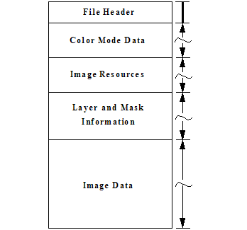

# PhotoShop文件结构

> 内容摘自[Adobe Photoshop文件格式规范](https://www.adobe.com/devnet-apps/photoshop/fileformatashtml/?tdsourcetag=s_pctim_aiomsg)

## Photoshop 文件格式

Photoshop 文件格式分为五个主要部分。Photoshop 文件格式具有许多长度标记。使用这些长度标记从一个部分移动到下一个节。长度标记通常用字节填充以舍入到最接近的 2 或 4 字节间隔。

文件头 （[文件标题部分](https://www.adobe.com/devnet-apps/photoshop/fileformatashtml/PhotoshopFileFormats.htm#50577409_19840)）

颜色模式数据（[颜色模式数据部分](https://www.adobe.com/devnet-apps/photoshop/fileformatashtml/PhotoshopFileFormats.htm#50577409_71638)）

图像资源（[图像资源部分](https://www.adobe.com/devnet-apps/photoshop/fileformatashtml/PhotoshopFileFormats.htm#50577409_69883)）

图层和蒙版信息（[图层和蒙版信息部分](https://www.adobe.com/devnet-apps/photoshop/fileformatashtml/PhotoshopFileFormats.htm#50577409_75067)）

图像数据（[图像数据部分](https://www.adobe.com/devnet-apps/photoshop/fileformatashtml/PhotoshopFileFormats.htm#50577409_89817)）

文件头具有固定长度;其他四个部分的长度是可变的。

编写这些部分之一时，应编写该节中的所有字段，因为 Photoshop 可能会尝试读取整个部分。每当写入文件和跳过字节时，都应显式为跳过的字段写入零。

读取其中一个length分隔部分时，使用长度字段决定何时应停止读取。在大多数情况下，长度字段指示以下字节数，而不是记录数。

所有表中的"长度"列中的值以字节为单位。

定义为**Unicode 字符串的所有值**都包括：

4 字节长度字段，表示字符串中的 UTF-16 代码单位数（不是字节）。

Unicode 值的字符串，每个字符两个字节，字符串末尾的两个字节 null。